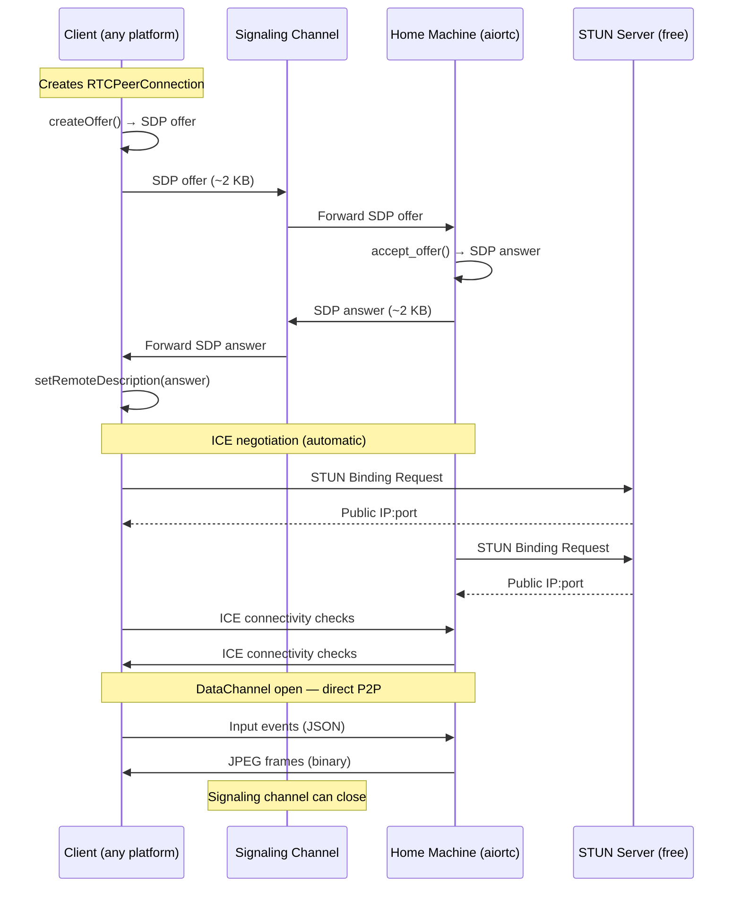
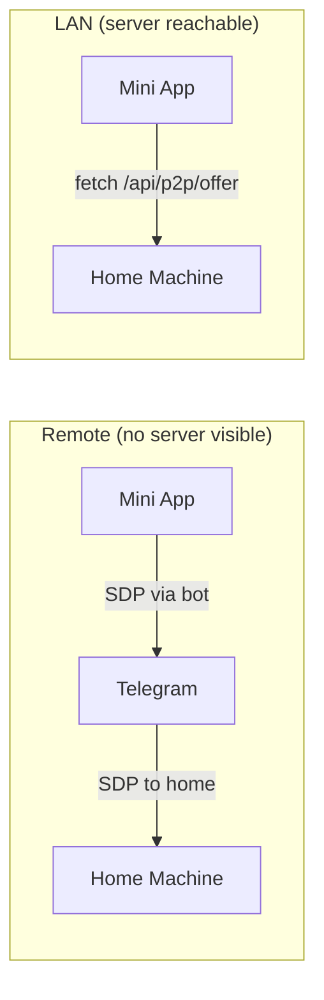

# Peer-to-Peer Connectivity

Direct P2P connections via WebRTC, with signaling through Telegram. No external server required.

## Design Principles

1. **Zero infrastructure** — No paid hosting, no public servers, no cloud subscriptions. Only free services: Telegram (signaling), GitHub Pages (static hosting), public STUN servers.
2. **Layered architecture** — Signaling, transport, and protocol are independent layers. Swap any layer without affecting the others.
3. **Multi-client** — The same server-side peer works with browsers (Mini App), native Android/iOS apps, and CLI clients.

## Three-Layer Architecture

```mermaid
flowchart TD
    subgraph Layer3["Layer 3: openhort Protocol"]
        FRAMES[JPEG Frames]
        INPUT[Input Events]
        CTRL[Control JSON]
    end
    subgraph Layer2["Layer 2: WebRTC Transport"]
        DC[DataChannel]
        ICE[ICE / STUN / NAT Traversal]
        DTLS[DTLS Encryption]
    end
    subgraph Layer1["Layer 1: Signaling"]
        TG_SIG[Telegram Bot]
        HTTP_SIG[HTTP API]
        CUSTOM_SIG[Custom Channel]
    end
    Layer3 --> Layer2
    Layer2 --> Layer1

    style Layer3 fill:#1a3a1a
    style Layer2 fill:#1a2a3a
    style Layer1 fill:#2a1a3a
```



| Layer | Purpose | Swappable? | Examples |
|-------|---------|------------|----------|
| **Signaling** | Exchange SDP offers/answers to establish connection | Yes | Telegram, HTTP fetch, WebSocket, QR code |
| **Transport** | Encrypted bidirectional data channel | No (WebRTC) | Browser `RTCPeerConnection`, `aiortc` (Python), `libwebrtc` (native) |
| **Protocol** | Application data over the channel | Yes | JPEG frames + JSON (openhort), VNC RFB, custom |

## Connection Flow



## Signaling Modes

The Mini App (`miniapp.html`) supports multiple signaling modes via the `?signal=` query parameter:

| Mode | `?signal=` | SDP flows through | Use case |
|------|-----------|-------------------|----------|
| Telegram | `telegram` | Telegram bot messages | Remote access, no server reachable |
| HTTP | `http` | `fetch('/api/p2p/offer')` | LAN, server directly reachable |



## Client Platforms

WebRTC is a universal standard. The same `aiortc` server peer works with all clients:

| Platform | WebRTC Library | Signaling | Status |
|----------|---------------|-----------|--------|
| Browser (Telegram Mini App) | Native `RTCPeerConnection` | Telegram or HTTP | Implemented |
| Browser (standalone) | Native `RTCPeerConnection` | HTTP | Implemented |
| Android (native) | `org.webrtc` (Google libwebrtc) | Telegram or HTTP | Future |
| iOS (native) | `WebRTC.framework` (Google libwebrtc) | Telegram or HTTP | Future |
| Flutter | `flutter_webrtc` | Telegram or HTTP | Future |
| React Native | `react-native-webrtc` | Telegram or HTTP | Future |
| Python CLI | `aiortc` | HTTP or direct | Future |

## Library (`hort/peer2peer/`)

Framework-agnostic — no openhort extension dependencies.

### Modules

| Module | Purpose |
|--------|---------|
| `models.py` | `StunResult`, `PeerInfo`, `PunchResult`, `NatType` |
| `stun.py` | STUN Binding Request/Response (RFC 5389), NAT type detection |
| `signal.py` | `SignalingChannel` ABC + `CallbackSignaling` for embedding |
| `punch.py` | `HolePuncher` — coordinated simultaneous UDP probing |
| `tunnel.py` | `UdpTunnel` — reliable ordered stream over punched UDP hole |
| `proto.py` | Wire protocol: PING/PONG/DATA/ACK/FIN with 7-byte header |
| `webrtc.py` | `WebRTCPeer` + `WebRTCPeerRegistry` — aiortc server-side peers |

### WebRTC Server Peer

```python
from hort.peer2peer.webrtc import WebRTCPeer

# Accept browser's SDP offer, return answer
peer = WebRTCPeer(on_message=handle_message)
answer_sdp = await peer.accept_offer(offer_sdp)
# Send answer_sdp back via signaling channel

# Wait for DataChannel to open
connected = await peer.wait_connected(timeout=30)

# Send data to browser
await peer.send(jpeg_frame_bytes)
await peer.send_json({"type": "windows", "windows": [...]})
```

### Custom Signaling Channel

Implement `SignalingChannel` for any transport:

```python
from hort.peer2peer.signal import SignalingChannel
from hort.peer2peer.models import PeerInfo

class TelegramSignaling(SignalingChannel):
    async def send_offer(self, peer_info: PeerInfo) -> None:
        await bot.send_message(chat_id, json.dumps(peer_info.to_dict()))

    async def wait_answer(self, timeout: float = 30.0) -> PeerInfo:
        msg = await wait_for_telegram_message(timeout)
        return PeerInfo.from_dict(json.loads(msg.text))

    async def close(self) -> None:
        pass
```

### NAT Types

| NAT Type | WebRTC Success | UDP Hole Punch |
|----------|---------------|----------------|
| Open (no NAT) | Always | Always |
| Full Cone | Always | Always |
| Restricted Cone | Always | Works |
| Port-Restricted Cone | Usually | Works |
| Symmetric | Often (via TURN relay) | Usually fails |

!!! note "WebRTC vs raw UDP"
    WebRTC has better NAT traversal than raw UDP hole punching because ICE tries multiple candidate types (host, srflx, relay) and the browser can use TURN as a last resort. The raw UDP library (`punch.py`, `tunnel.py`) is available for server-to-server scenarios where WebRTC isn't applicable.

### Wire Protocol (UDP tunnel)

For server-to-server connections (not browser WebRTC):

```
[type:1][sequence:4][length:2][payload:0-1200]
```

| Type | Value | Purpose |
|------|-------|---------|
| PING | 0x01 | Keepalive / hole punch probe |
| PONG | 0x02 | PING response |
| DATA | 0x03 | Application data (ACK required) |
| ACK  | 0x04 | Acknowledges received DATA |
| FIN  | 0x05 | Close tunnel |

## Extension (`hort/extensions/core/peer2peer/`)

Integrates the library into openhort as a plugin:

- **Connector commands:** `/stun` (discover NAT), `/vm` (manage test VM)
- **MCP tools:** `holepunch_stun_discover`, `holepunch_vm_*`
- **API endpoint:** `POST /api/p2p/offer` — accepts SDP, returns answer
- **UI panel:** NAT type, punch result, VM status

## Testing

```bash
# Unit tests (84 tests, 100% coverage)
poetry run pytest tests/test_peer2peer_*.py -v

# Integration tests (Playwright, headless Chromium)
poetry run pytest tests/test_p2p_playwright.py -v -m integration

# Coverage
poetry run pytest tests/test_peer2peer_*.py --cov=hort/peer2peer --cov-report=term-missing
```

The Playwright tests prove the full flow: Mini App renders → SDP offer → server answer → ICE negotiation → DataChannel opens.
