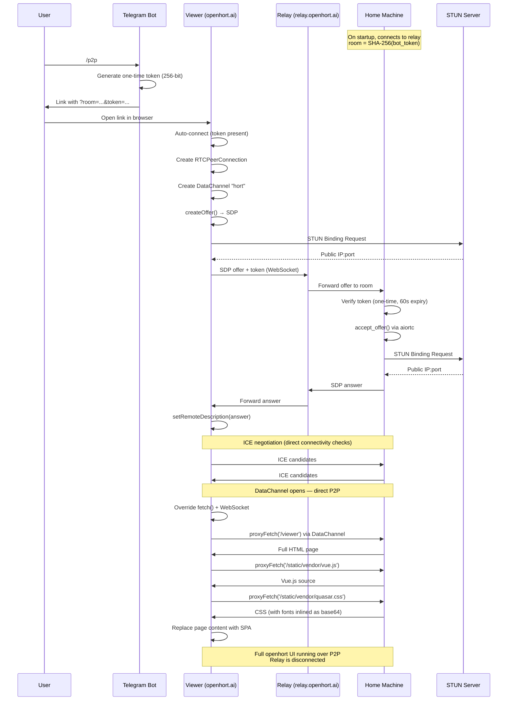
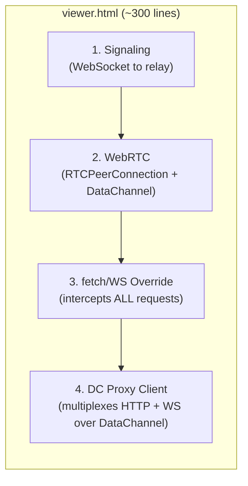
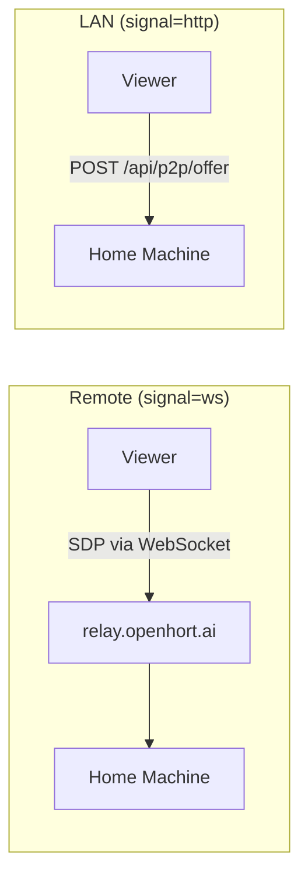
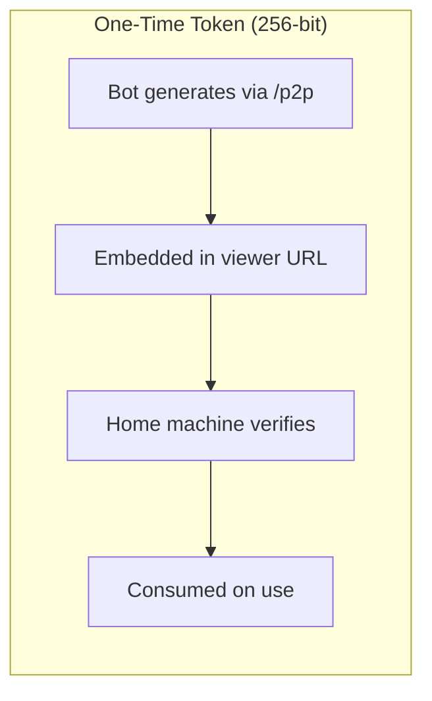
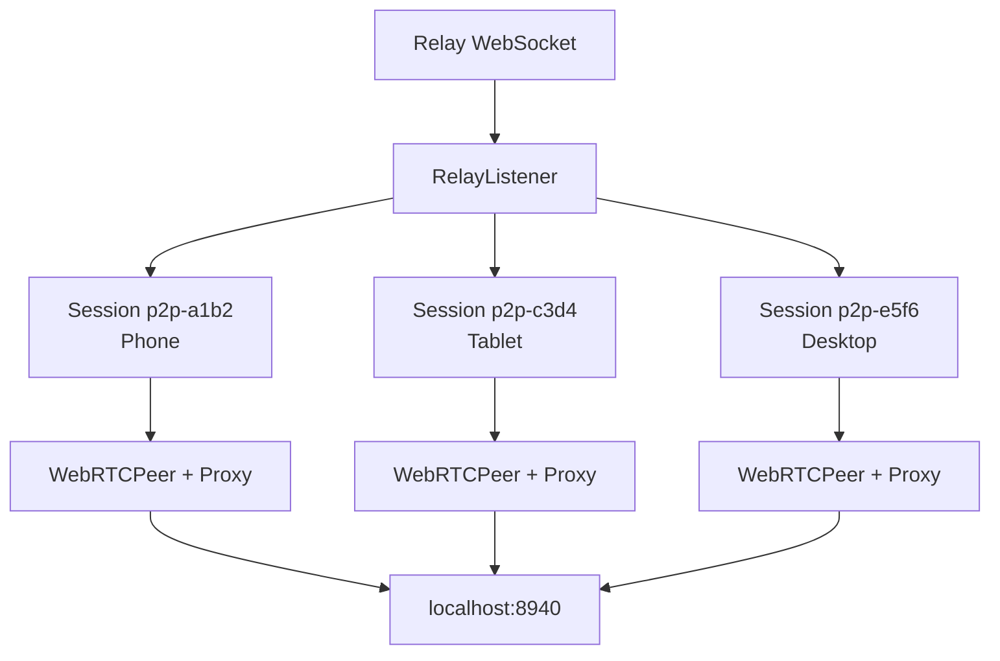

# Peer-to-Peer Connectivity

Direct P2P connections via WebRTC, with signaling through Telegram. No external server required. The full openhort SPA loads and runs over a direct WebRTC DataChannel — the user's browser never contacts the home machine via HTTP.

## Design Principles

1. **Zero infrastructure** — No paid hosting, no public servers, no cloud subscriptions. Only free services: Telegram (signaling), Cloudflare Pages (viewer hosting), Cloudflare Workers (SDP relay), public STUN servers.
2. **Layered architecture** — Signaling, transport, and protocol are independent layers. Swap any layer without affecting the others.
3. **Multi-client** — The same server-side peer works with browsers, native Android/iOS apps, and CLI clients.
4. **Viewer is a thin transparent proxy** — See [Viewer Architecture](#viewer-architecture) below. This is the most critical design constraint.

!!! danger "The viewer is a tunnel, not an app"
    The P2P viewer (`viewer.html`) contains **zero UI code**. No Vue, no Quasar, no CSS frameworks, no vendor libraries, no openhort application logic. It is purely infrastructure: WebRTC setup, `fetch()`/`WebSocket` interception, and DataChannel proxy.

    **Everything visible on screen came through the DataChannel** — HTML, JS, CSS, fonts, images, API responses, WebSocket frames. The viewer itself is invisible once connected.

    Deploy it today, use it unchanged in 5 years with a completely different UI framework. **Never** add UI code, vendor libs, or static assets to the viewer or its hosting site.

## End-to-End Architecture

```mermaid
flowchart TD
    subgraph User["User's Device (any browser)"]
        VIEWER["viewer.html<br/>(thin proxy, ~300 lines)"]
        BROWSER["Browser Engine"]
    end
    subgraph Free["Free Infrastructure"]
        CF_PAGES["Cloudflare Pages<br/>(hosts viewer.html)"]
        CF_RELAY["Cloudflare Worker<br/>(relay.openhort.ai)<br/>SDP relay, ~50 lines"]
        TG["Telegram Bot<br/>(generates auth link)"]
        STUN["Google STUN<br/>(stun.l.google.com)"]
    end
    subgraph Home["Home Machine"]
        RELAY_LISTENER["RelayListener<br/>(connects to relay)"]
        AIORTC["aiortc WebRTC Peer"]
        DC_PROXY["DataChannelProxy<br/>(HTTP + WS multiplexer)"]
        HORT["openhort Server<br/>(localhost:8940)"]
    end

    TG -->|"/p2p → auth link"| BROWSER
    BROWSER -->|"loads viewer"| CF_PAGES
    VIEWER -->|"SDP offer + token"| CF_RELAY
    CF_RELAY -->|"forwards"| RELAY_LISTENER
    RELAY_LISTENER --> AIORTC
    AIORTC -->|"SDP answer"| CF_RELAY
    CF_RELAY -->|"forwards"| VIEWER
    VIEWER <==>|"WebRTC DataChannel<br/>(direct P2P, encrypted)"| AIORTC
    AIORTC --> DC_PROXY
    DC_PROXY -->|"HTTP proxy"| HORT
    DC_PROXY -->|"WS proxy"| HORT

    style User fill:#1a3a1a
    style Free fill:#2a1a3a
    style Home fill:#1a2a3a
```



**Data flow after connection:**

| What | Path | Through relay? |
|------|------|---------------|
| SDP offer/answer (~4 KB) | Browser → Cloudflare Worker → Home | Yes (once, 3 seconds) |
| HTML, JS, CSS, fonts | Browser ← DataChannel ← Home | No (direct P2P) |
| API calls (`/api/*`) | Browser → DataChannel → Home | No (direct P2P) |
| WebSocket frames | Browser ↔ DataChannel ↔ Home | No (direct P2P) |
| JPEG screen frames | Browser ← DataChannel ← Home | No (direct P2P) |

## Connection Flow (Detailed)



## Viewer Architecture

The viewer (`hort/extensions/core/peer2peer/static/viewer.html`) is deployed to `openhort.ai/p2p/viewer.html` via Cloudflare Pages. It is a **thin transparent proxy** containing only:



**What the viewer does:**

1. Connects to the Cloudflare relay WebSocket, sends SDP offer with auth token
2. Establishes WebRTC DataChannel with the home machine
3. Overrides `window.fetch()` — all HTTP requests go through the DataChannel
4. Overrides `window.WebSocket` — all WebSocket connections go through the DataChannel
5. Fetches `/viewer` HTML from the home machine through the DataChannel
6. Parses the HTML, loads all CSS (with font URLs rewritten to base64 data URIs), loads all JS
7. Replaces the page content — the full openhort SPA is now running
8. From this point, the viewer is invisible — everything you see came from the home machine

**What the viewer does NOT contain:**

- No Vue, Quasar, xterm.js, or any UI framework
- No openhort CSS, icons, or styles
- No application logic, window management, or plugin code
- No static assets of any kind (no `/static/vendor/` directory on the hosting site)

### Why not an iframe?

We tried multiple approaches before arriving at the current design:

| Approach | Problem |
|----------|---------|
| **iframe + `document.write`** | `document.write` into an iframe doesn't execute `<script>` tags properly when they contain `</script>` sequences in the inlined code. Large inlined scripts (Vue: 400KB, Quasar: 300KB) consistently break the HTML parser. |
| **iframe + `srcdoc`** | Same `</script>` parsing issue as `document.write`. The `srcdoc` attribute treats the HTML as a string attribute value. |
| **iframe + blob URL** | Blob URLs have a different origin (`blob:...`), so `window.parent` access is blocked. The fetch/WS shim can't bridge to the parent's DataChannel. |
| **iframe + CDN static assets** | Uploading Vue/Quasar/vendor libs to openhort.ai violates the "thin proxy" principle. The viewer would need to be redeployed whenever the UI framework changes. |
| **Inlining all resources** | Fetching every JS/CSS file through the DataChannel and injecting as inline `<script>`/`<style>` tags. Works for small files but breaks when inlined JS contains `</script>` literals (which Vue and Quasar both do). |
| **Direct page replacement** | **Current approach.** Override `fetch`/`WebSocket` on the main page, fetch HTML from home, use `DOMParser` to extract CSS/JS, load CSS as `<style>` elements (with font URLs inlined as base64), execute JS via `document.createElement('script')`. No iframe, no parsing issues. |

### Font/Icon Inlining

CSS files reference fonts via `url()` which the browser resolves relative to the stylesheet's origin. Since CSS is loaded via JavaScript (not a normal `<link>` tag), the origin is `openhort.ai` — which doesn't have the font files.

**Fix:** The `inlineCssUrls()` function:
1. Parses all `url(...)` references in each CSS file
2. Fetches each font/image through the DataChannel proxy
3. Converts to base64 data URIs inline in the CSS
4. The browser renders fonts from the data URIs — no external request needed

This handles Material Icons, Phosphor Icons, xterm.js fonts, and any other `@font-face` declarations.

### Binary Response Handling

The DataChannel proxy (`dc_proxy.py`) detects binary content types (fonts, images) and base64-encodes them in the JSON response. The client-side `proxyFetch` decodes them back to `ArrayBuffer`:

```
Server: font.woff2 (binary) → base64 → JSON {"body": "AAEAAAAOAIAAAwBg...", "binary": true}
Client: JSON → atob → Uint8Array → ArrayBuffer → Response
```

Text content types (`text/*`, `application/json`, `application/javascript`) are sent as plain strings.

## Signaling Modes

| Mode | `?signal=` | SDP flows through | Use case |
|------|-----------|-------------------|----------|
| WebSocket relay | `ws` | `relay.openhort.ai` Cloudflare Worker | Remote access (default for Telegram) |
| HTTP | `http` | `POST /api/p2p/offer` on localhost | LAN, server directly reachable |



### Cloudflare Worker Relay

The relay at `relay.openhort.ai` is a Cloudflare Worker with Durable Objects (~50 lines):

- Each room is a Durable Object instance (keyed by room ID)
- Two WebSocket peers connect to the same room
- Messages are forwarded between them
- Stateless — no data stored, no logs, no user information
- Free tier: 100,000 requests/day (≈25,000 P2P connections/day)

**Critical implementation detail:** Use `this.state.getWebSockets()` (Durable Object API) to enumerate connected peers — NOT a plain JavaScript array. A plain array loses track of connections across `fetch()` calls because the Durable Object may be evicted and recreated between requests.

## Security

### Authentication



| Property | Value |
|----------|-------|
| Room ID | SHA-256 of bot token, 64 hex chars (256 bits) |
| Connection token | `secrets.token_urlsafe(32)`, 43 chars (256 bits) |
| Combined entropy | 512 bits |
| Token lifetime | 60 seconds |
| Token use | One-time (consumed on first valid use) |
| Brute force at 1B/sec | ~10^60 years to guess |

### Brute Force Protection

After 3 failed token verifications:

- Exponential backoff: 2s, 4s, 8s, 16s... up to 60s
- Applied per relay listener instance (all attempts to the same room)
- Backoff resets on successful authentication
- Invalid tokens during backoff are rejected immediately without checking

### Telegram Bot Commands

| Command | Purpose | Output |
|---------|---------|--------|
| `/p2p` | Generate authenticated P2P link for any browser | Plain URL with token |
| `/connect` | Generate link as clickable Telegram button | Inline Web App button |
| `/stun` | Check NAT type and public IP | NAT diagnostic info |

### What an attacker would need

To connect without authorization:
1. Know the room ID (SHA-256 of bot token — requires the bot token itself)
2. Have a valid one-time token (expires in 60s, consumed on use)
3. Beat the brute force backoff (exponential, up to 60s per attempt)

## DataChannel Proxy Protocol

The proxy multiplexes HTTP and WebSocket traffic over a single WebRTC DataChannel.

### HTTP Request/Response

```json
// Request (browser → home)
{"id": "r1", "type": "http", "method": "GET", "path": "/api/session", "headers": {}, "body": null}

// Response (home → browser)
{"id": "r1", "type": "http_response", "status": 200, "headers": {"content-type": "application/json"}, "body": "{...}", "binary": false}

// Binary response (fonts, images)
{"id": "r2", "type": "http_response", "status": 200, "headers": {"content-type": "font/woff2"}, "body": "AAEAAAAOAIAAAwBg...", "binary": true}
```

### WebSocket Proxy

```json
// Open (browser → home)
{"id": "w1", "type": "ws_open", "path": "/ws/control/abc123"}

// Ready (home → browser)
{"id": "w1", "type": "ws_ready"}

// Text frame (bidirectional)
{"id": "w1", "type": "ws_text", "data": "{\"type\":\"list_windows\"}"}

// Close (bidirectional)
{"id": "w1", "type": "ws_close"}
```

### Binary WebSocket Frames

Binary frames use a 4-byte WebSocket ID prefix instead of JSON:

```
[ws_id: 4 bytes, zero-padded][payload: N bytes]
```

This avoids JSON encoding overhead for high-frequency binary data (JPEG frames).

## Multiple Concurrent Connections

The `RelayListener` supports multiple simultaneous P2P sessions:



Each session has its own:
- `WebRTCPeer` (aiortc `RTCPeerConnection`)
- `DataChannelProxy` (HTTP + WS multiplexer)
- Unique session ID (`p2p-{random_hex}`)

### Cleanup

Dead sessions are cleaned up via:
1. **`on_state_change` callback** — WebRTC fires when connection state becomes `failed`/`closed`. Session is removed immediately.
2. **Periodic cleanup loop** — Every 30 seconds, scans all sessions and removes any with dead WebRTC connections.
3. **Shutdown** — `stop()` closes all active sessions.

## Deployment

### Viewer (openhort.ai)

```bash
# From the openhort repo:
bash scripts/deploy-viewer.sh
```

This copies `viewer.html` to the website repo and deploys to Cloudflare Pages. **Only the viewer HTML is deployed** — no static assets, no vendor libs.

### Relay Worker (relay.openhort.ai)

```bash
# From the www_openhort_ai repo:
cd workers/relay && CLOUDFLARE_API_TOKEN=... npx wrangler deploy
```

### Bot Menu Button

The `/connect` command generates a Telegram Web App inline button. The `/p2p` command generates a plain URL. Both include the room ID and one-time token.

The static menu button was removed — it can't include dynamic tokens and would be a security risk.

## Video Streaming (VP8/VP9)

Screen content is streamed as VP8 or VP9 encoded video — not JPEG frames. This enables hardware-decoded 30fps UHD streaming with inter-frame compression.

### Why Not MJPEG?

| | MJPEG (old) | VP8/VP9 (new) |
|---|---|---|
| Compression | Each frame standalone (~50-200 KB) | Inter-frame (~5-20 KB) |
| UHD 30fps bandwidth | ~150 MB/s | ~2-5 MB/s |
| Hardware decode | No (JS canvas) | Yes (native `<video>`) |
| Latency | ~50ms | ~30ms |
| License | N/A | **Royalty-free** (BSD) |

### Codec Choice

| Codec | License | Encoding Speed | Compression | aiortc Native |
|-------|---------|---------------|-------------|---------------|
| **VP8** | BSD, royalty-free | Fast | Good | Yes |
| **VP9** | BSD, royalty-free | Slower | Better | Via av/libvpx |
| H.264 | Patent pool (MPEG-LA) | Fast | Good | Yes (but license risk) |
| AV1 | Royalty-free | Slow | Best | No |

VP8 is the default for P2P (native aiortc support, fast encoding). VP9 is available for the WebM/MSE proxy path where encoding speed is less critical.

### Architecture

```mermaid
flowchart TD
    subgraph Server["Home Machine"]
        CAPTURE[Screen Capture<br/>PIL Image]
        TRACK[ScreenCaptureTrack<br/>aiortc VideoStreamTrack]
        WEBM[WebMEncoder<br/>VP8/VP9 in WebM]
    end
    subgraph P2P["P2P Mode (WebRTC)"]
        VP8_RTP[VP8 via RTP<br/>aiortc native encoder]
        VIDEO_TAG[Browser &lt;video&gt;<br/>hardware decode]
    end
    subgraph Proxy["Proxy Mode (WebSocket)"]
        MSE[WebM segments<br/>via WebSocket]
        MSE_VIDEO[Browser MSE<br/>SourceBuffer → &lt;video&gt;]
    end

    CAPTURE --> TRACK --> VP8_RTP --> VIDEO_TAG
    CAPTURE --> WEBM --> MSE --> MSE_VIDEO

    style P2P fill:#1a3a1a
    style Proxy fill:#1a2a3a
```



**P2P mode:** `ScreenCaptureTrack` (extends `aiortc.VideoStreamTrack`) feeds `av.VideoFrame` objects to aiortc, which encodes them as VP8 via RTP. The browser receives the stream as a native `MediaStreamTrack` and renders it in a `<video>` element with hardware decoding.

**Proxy mode:** `WebMEncoder` encodes frames as VP8 or VP9 in a WebM container. Segments are sent over the existing binary WebSocket. The browser uses Media Source Extensions (MSE) to decode and render.

### ScreenCaptureTrack

```python
from hort.peer2peer.video_track import ScreenCaptureTrack

track = ScreenCaptureTrack(fps=30, max_width=1920)
track.set_capture_function(capture_pil_fn)  # fn(window_id, max_width) -> PIL.Image
track.set_window(window_id=101)

# Add to WebRTC peer before accept_offer()
peer.add_video_track(track)
```

The track:
- Calls the capture function at the target FPS
- Converts PIL Images to `av.VideoFrame`
- Falls back to a test pattern if capture fails (purple bar on dark blue)
- Paces frames to the target FPS using monotonic clock

### WebMEncoder (proxy mode)

```python
from hort.peer2peer.video_track import WebMEncoder

encoder = WebMEncoder(codec='vp9', fps=30, width=1920, height=1080, bitrate=4_000_000)

# Get WebM header for MSE initialization
init_segment = encoder.get_init_segment()
await websocket.send_bytes(init_segment)

# Encode and send frames
for pil_image in capture_loop():
    data = encoder.encode_frame(pil_image)
    if data:
        await websocket.send_bytes(data)

encoder.close()
```

### Low-Latency Encoding Settings

Both VP8 and VP9 use aggressive real-time settings:

```python
# VP8
{"cpu-used": "8", "deadline": "realtime", "lag-in-frames": "0"}

# VP9
{"cpu-used": "8", "deadline": "realtime", "lag-in-frames": "0", "row-mt": "1"}
```

`cpu-used=8` is the fastest quality preset. `lag-in-frames=0` disables lookahead buffering. `row-mt=1` enables multi-threaded row encoding for VP9.

### Browser Integration

The viewer adds a video transceiver before creating the SDP offer:

```javascript
pc.addTransceiver('video', { direction: 'recvonly' });

pc.ontrack = (evt) => {
  if (evt.track.kind === 'video') {
    const video = document.createElement('video');
    video.srcObject = evt.streams[0];
    video.autoplay = true;
    video.playsInline = true;
    document.body.appendChild(video);
  }
};
```

The SPA can access `window._p2pVideoStream` after the P2P connection is established and use it for the stream viewer instead of JPEG-over-WebSocket.

### Future: Audio (Opus)

Opus audio can be added the same way — create an `AudioStreamTrack`, capture system audio, add to the peer:

```python
peer.add_audio_track(audio_track)  # before accept_offer()
```

Opus is royalty-free, mandatory for WebRTC, and supported in every browser.

## Library (`hort/peer2peer/`)

Framework-agnostic — no openhort extension dependencies.

| Module | Purpose |
|--------|---------|
| `models.py` | `StunResult`, `PeerInfo`, `PunchResult`, `NatType` |
| `stun.py` | STUN client (RFC 5389), NAT type detection |
| `signal.py` | `SignalingChannel` ABC + `CallbackSignaling` |
| `punch.py` | `HolePuncher` — UDP hole punching (server-to-server) |
| `tunnel.py` | `UdpTunnel` — reliable UDP stream (server-to-server) |
| `proto.py` | Wire protocol: PING/PONG/DATA/ACK/FIN |
| `webrtc.py` | `WebRTCPeer` + `WebRTCPeerRegistry` — aiortc peers |
| `dc_proxy.py` | `DataChannelProxy` — HTTP/WS multiplexer over DataChannel |
| `relay_listener.py` | `RelayListener` + `TokenStore` — relay connection + auth |
| `video_track.py` | `ScreenCaptureTrack` + `WebMEncoder` — VP8/VP9 video |
| `webm_stream.py` | `WebMStreamer` — VP8/VP9 WebM over WebSocket (proxy mode) |

## Extension (`hort/extensions/core/peer2peer/`)

| File | Purpose |
|------|---------|
| `provider.py` | Plugin: `/connect`, `/p2p`, `/stun` commands, relay startup |
| `azure_vm.py` | Azure VM provisioning (dev testing only) |
| `static/viewer.html` | The thin proxy viewer (deployed to openhort.ai) |
| `static/panel.js` | Extension settings panel |
| `extension.json` | Plugin manifest |

## API Endpoints

| Endpoint | Method | Purpose |
|----------|--------|---------|
| `/api/p2p/offer` | POST | Accept SDP offer (HTTP signaling mode) |
| `/api/p2p/connect` | POST | Generate authenticated connection URL |
| `/api/p2p/status` | GET | Active session counts |
| `/p2p` | GET | Serve viewer (local development) |

## Testing

```bash
# Unit tests (100 tests — P2P core + video, mocked — no network)
poetry run pytest tests/test_peer2peer_*.py -v

# P2P integration tests (Playwright, real WebRTC in headless Chromium)
poetry run pytest tests/test_p2p_playwright.py -v -m integration

# Video integration tests (Playwright, VP8 track + MSE verification)
poetry run pytest tests/test_p2p_video_playwright.py -v -m integration

# All integration tests
poetry run pytest tests/test_p2p_playwright.py tests/test_p2p_video_playwright.py -v -m integration

# Coverage
poetry run pytest tests/test_peer2peer_*.py --cov=hort/peer2peer --cov-report=term-missing
```

## Known Issues and Decisions

### Telegram `sendData()` closes the Mini App

`Telegram.WebApp.sendData()` sends data to the bot but **immediately closes the WebView**. This makes it unusable for SDP exchange which requires a round-trip (offer → answer). Solution: use the Cloudflare Worker relay instead of Telegram as the signaling transport. Telegram's role is limited to generating the authenticated URL.

### `document.write` breaks on large scripts

Inlining Vue.js (400KB) or Quasar (300KB) into an iframe via `document.write` fails because these scripts contain `</script>` literals in string constants. The HTML parser sees these as closing the script block, breaking the page. This affects `document.write`, `srcdoc`, and any approach that embeds scripts as HTML strings. Solution: load scripts via `document.createElement('script')` with `textContent`.

### CSS `url()` doesn't go through `fetch()`

When CSS is injected via JavaScript (`<style>` element), `url()` references for fonts and images resolve relative to the page origin (openhort.ai), not through the overridden `fetch()`. The home machine's font files aren't on openhort.ai. Solution: parse CSS, fetch all `url()` resources through the DataChannel, convert to base64 data URIs.

### Binary responses need explicit handling

The DataChannel carries JSON messages. Binary content (fonts, images) can't be sent as raw JSON strings without corruption. Solution: the server-side proxy detects binary content types and base64-encodes them. The client decodes back to `ArrayBuffer`. Text content types pass through as plain strings.

### Cloudflare Durable Object `this.peers` array

A plain JavaScript array in a Durable Object constructor loses track of WebSocket connections between `fetch()` invocations because the object may be evicted from memory. Solution: use `this.state.getWebSockets()` which returns all accepted WebSockets across all `fetch()` calls.

### No static assets on the hosting site

Previous attempts uploaded Vue, Quasar, and vendor JS/CSS to openhort.ai so the iframe could load them. This violates the thin proxy principle — the viewer would need redeployment whenever the UI changes. Solution: all assets flow through the DataChannel. The hosting site contains only `viewer.html` (and the legal pages required by German law).
