# Peer-to-Peer Connectivity

Direct P2P connections via WebRTC, with signaling through Telegram. No external server required. The full openhort SPA loads and runs over a direct WebRTC DataChannel — the user's browser never contacts the home machine via HTTP.

## Design Principles

1. **Zero infrastructure** — No paid hosting, no public servers, no cloud subscriptions. Only free services: Telegram (signaling), Cloudflare Pages (viewer hosting), Cloudflare Workers (SDP relay), public STUN servers.
2. **Layered architecture** — Signaling, transport, and protocol are independent layers. Swap any layer without affecting the others.
3. **Multi-client** — The same server-side peer works with browsers, native Android/iOS apps, and CLI clients.
4. **Viewer is a thin transparent proxy** — See [Viewer Architecture](#viewer-architecture) below. This is the most critical design constraint.

!!! danger "The viewer is a tunnel, not an app"
    The P2P viewer (`viewer.html`) contains **zero UI code**. No Vue, no Quasar, no CSS frameworks, no vendor libraries, no openhort application logic. It is purely infrastructure: WebRTC setup, `fetch()`/`WebSocket` interception, and DataChannel proxy.

    **Everything visible on screen came through the DataChannel** — HTML, JS, CSS, fonts, images, API responses, WebSocket frames. The viewer itself is invisible once connected.

    Deploy it today, use it unchanged in 5 years with a completely different UI framework. **Never** add UI code, vendor libs, or static assets to the viewer or its hosting site.

## End-to-End Architecture

```mermaid
flowchart TD
    subgraph User["User's Device (any browser)"]
        VIEWER["viewer.html<br/>(thin proxy, ~300 lines)"]
        BROWSER["Browser Engine"]
    end
    subgraph Free["Free Infrastructure"]
        CF_PAGES["Cloudflare Pages<br/>(hosts viewer.html)"]
        CF_RELAY["Cloudflare Worker<br/>(relay.openhort.ai)<br/>SDP relay, ~50 lines"]
        TG["Telegram Bot<br/>(generates auth link)"]
        STUN["Google STUN<br/>(stun.l.google.com)"]
    end
    subgraph Home["Home Machine"]
        RELAY_LISTENER["RelayListener<br/>(connects to relay)"]
        AIORTC["aiortc WebRTC Peer"]
        DC_PROXY["DataChannelProxy<br/>(HTTP + WS multiplexer)"]
        HORT["openhort Server<br/>(localhost:8940)"]
    end

    TG -->|"/p2p → auth link"| BROWSER
    BROWSER -->|"loads viewer"| CF_PAGES
    VIEWER -->|"SDP offer + token"| CF_RELAY
    CF_RELAY -->|"forwards"| RELAY_LISTENER
    RELAY_LISTENER --> AIORTC
    AIORTC -->|"SDP answer"| CF_RELAY
    CF_RELAY -->|"forwards"| VIEWER
    VIEWER <==>|"WebRTC DataChannel<br/>(direct P2P, encrypted)"| AIORTC
    AIORTC --> DC_PROXY
    DC_PROXY -->|"HTTP proxy"| HORT
    DC_PROXY -->|"WS proxy"| HORT

    style User fill:#1a3a1a
    style Free fill:#2a1a3a
    style Home fill:#1a2a3a
```

**Data flow after connection:**

| What | Path | Through relay? |
|------|------|---------------|
| SDP offer/answer (~4 KB) | Browser → Cloudflare Worker → Home | Yes (once, 3 seconds) |
| HTML, JS, CSS, fonts | Browser ← DataChannel ← Home | No (direct P2P) |
| API calls (`/api/*`) | Browser → DataChannel → Home | No (direct P2P) |
| WebSocket frames | Browser ↔ DataChannel ↔ Home | No (direct P2P) |
| JPEG screen frames | Browser ← DataChannel ← Home | No (direct P2P) |

## Connection Flow (Detailed)

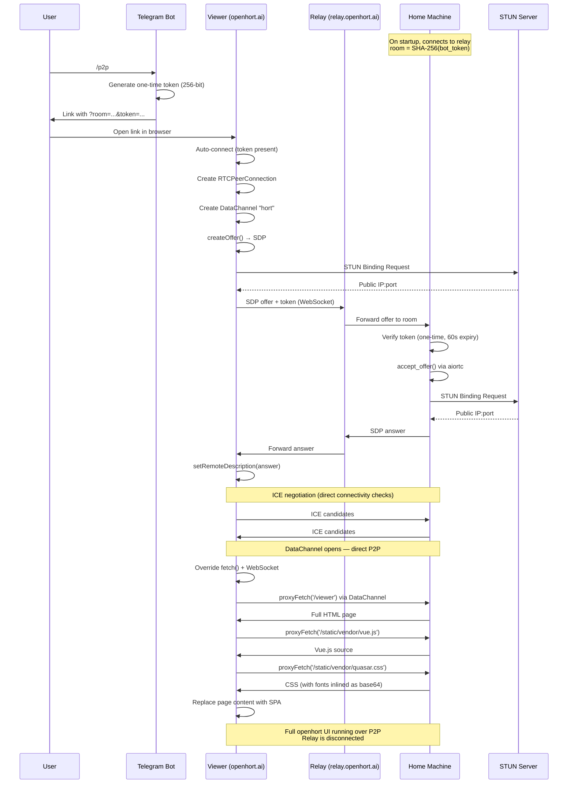

## Viewer Architecture

The viewer (`hort/extensions/core/peer2peer/static/viewer.html`) is deployed to `openhort.ai/p2p/viewer.html` via Cloudflare Pages. It is a **thin transparent proxy** containing only:

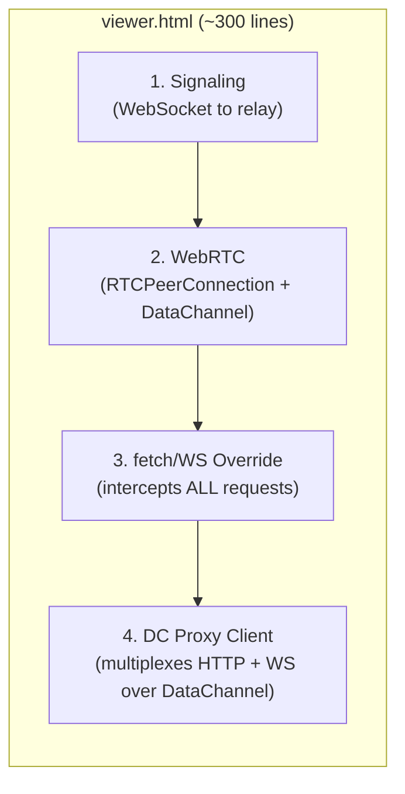

**What the viewer does:**

1. Connects to the Cloudflare relay WebSocket, sends SDP offer with auth token
2. Establishes WebRTC DataChannel with the home machine
3. Overrides `window.fetch()` — all HTTP requests go through the DataChannel
4. Overrides `window.WebSocket` — all WebSocket connections go through the DataChannel
5. Fetches `/viewer` HTML from the home machine through the DataChannel
6. Parses the HTML, loads all CSS (with font URLs rewritten to base64 data URIs), loads all JS
7. Replaces the page content — the full openhort SPA is now running
8. From this point, the viewer is invisible — everything you see came from the home machine

**What the viewer does NOT contain:**

- No Vue, Quasar, xterm.js, or any UI framework
- No openhort CSS, icons, or styles
- No application logic, window management, or plugin code
- No static assets of any kind (no `/static/vendor/` directory on the hosting site)

### Why not an iframe?

We tried multiple approaches before arriving at the current design:

| Approach | Problem |
|----------|---------|
| **iframe + `document.write`** | `document.write` into an iframe doesn't execute `<script>` tags properly when they contain `</script>` sequences in the inlined code. Large inlined scripts (Vue: 400KB, Quasar: 300KB) consistently break the HTML parser. |
| **iframe + `srcdoc`** | Same `</script>` parsing issue as `document.write`. The `srcdoc` attribute treats the HTML as a string attribute value. |
| **iframe + blob URL** | Blob URLs have a different origin (`blob:...`), so `window.parent` access is blocked. The fetch/WS shim can't bridge to the parent's DataChannel. |
| **iframe + CDN static assets** | Uploading Vue/Quasar/vendor libs to openhort.ai violates the "thin proxy" principle. The viewer would need to be redeployed whenever the UI framework changes. |
| **Inlining all resources** | Fetching every JS/CSS file through the DataChannel and injecting as inline `<script>`/`<style>` tags. Works for small files but breaks when inlined JS contains `</script>` literals (which Vue and Quasar both do). |
| **Direct page replacement** | **Current approach.** Override `fetch`/`WebSocket` on the main page, fetch HTML from home, use `DOMParser` to extract CSS/JS, load CSS as `<style>` elements (with font URLs inlined as base64), execute JS via `document.createElement('script')`. No iframe, no parsing issues. |

### Font/Icon Inlining

CSS files reference fonts via `url()` which the browser resolves relative to the stylesheet's origin. Since CSS is loaded via JavaScript (not a normal `<link>` tag), the origin is `openhort.ai` — which doesn't have the font files.

**Fix:** The `inlineCssUrls()` function:
1. Parses all `url(...)` references in each CSS file
2. Fetches each font/image through the DataChannel proxy
3. Converts to base64 data URIs inline in the CSS
4. The browser renders fonts from the data URIs — no external request needed

This handles Material Icons, Phosphor Icons, xterm.js fonts, and any other `@font-face` declarations.

### Binary Response Handling

The DataChannel proxy (`dc_proxy.py`) detects binary content types (fonts, images) and base64-encodes them in the JSON response. The client-side `proxyFetch` decodes them back to `ArrayBuffer`:

```
Server: font.woff2 (binary) → base64 → JSON {"body": "AAEAAAAOAIAAAwBg...", "binary": true}
Client: JSON → atob → Uint8Array → ArrayBuffer → Response
```

Text content types (`text/*`, `application/json`, `application/javascript`) are sent as plain strings.

## Signaling Modes

| Mode | `?signal=` | SDP flows through | Use case |
|------|-----------|-------------------|----------|
| WebSocket relay | `ws` | `relay.openhort.ai` Cloudflare Worker | Remote access (default for Telegram) |
| HTTP | `http` | `POST /api/p2p/offer` on localhost | LAN, server directly reachable |

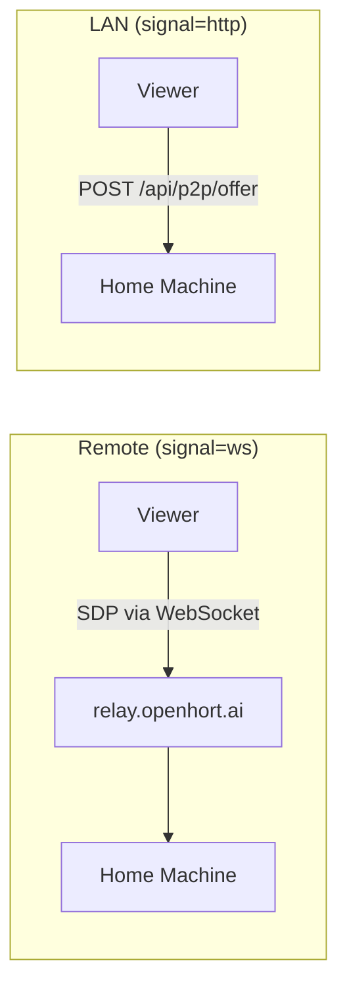

### Cloudflare Worker Relay

The relay at `relay.openhort.ai` is a Cloudflare Worker with Durable Objects (~50 lines):

- Each room is a Durable Object instance (keyed by room ID)
- Two WebSocket peers connect to the same room
- Messages are forwarded between them
- Stateless — no data stored, no logs, no user information
- Free tier: 100,000 requests/day (≈25,000 P2P connections/day)

**Critical implementation detail:** Use `this.state.getWebSockets()` (Durable Object API) to enumerate connected peers — NOT a plain JavaScript array. A plain array loses track of connections across `fetch()` calls because the Durable Object may be evicted and recreated between requests.

## Security

### Authentication

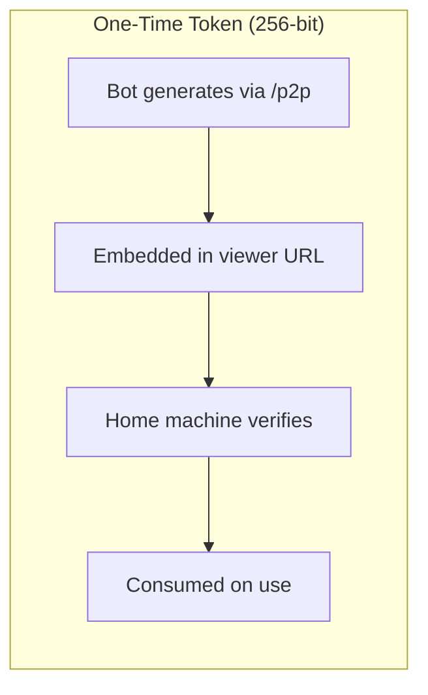

| Property | Value |
|----------|-------|
| Room ID | SHA-256 of bot token, 64 hex chars (256 bits) |
| Connection token | `secrets.token_urlsafe(32)`, 43 chars (256 bits) |
| Combined entropy | 512 bits |
| Token lifetime | 60 seconds |
| Token use | One-time (consumed on first valid use) |
| Brute force at 1B/sec | ~10^60 years to guess |

### Brute Force Protection

After 3 failed token verifications:

- Exponential backoff: 2s, 4s, 8s, 16s... up to 60s
- Applied per relay listener instance (all attempts to the same room)
- Backoff resets on successful authentication
- Invalid tokens during backoff are rejected immediately without checking

### Telegram Bot Commands

| Command | Purpose | Output |
|---------|---------|--------|
| `/p2p` | Generate authenticated P2P link for any browser | Plain URL with token |
| `/connect` | Generate link as clickable Telegram button | Inline Web App button |
| `/stun` | Check NAT type and public IP | NAT diagnostic info |

### What an attacker would need

To connect without authorization:
1. Know the room ID (SHA-256 of bot token — requires the bot token itself)
2. Have a valid one-time token (expires in 60s, consumed on use)
3. Beat the brute force backoff (exponential, up to 60s per attempt)

## Reconnect Tokens

P2P connections survive page reloads and server restarts without requiring a new Telegram `/p2p` link.

### How It Works

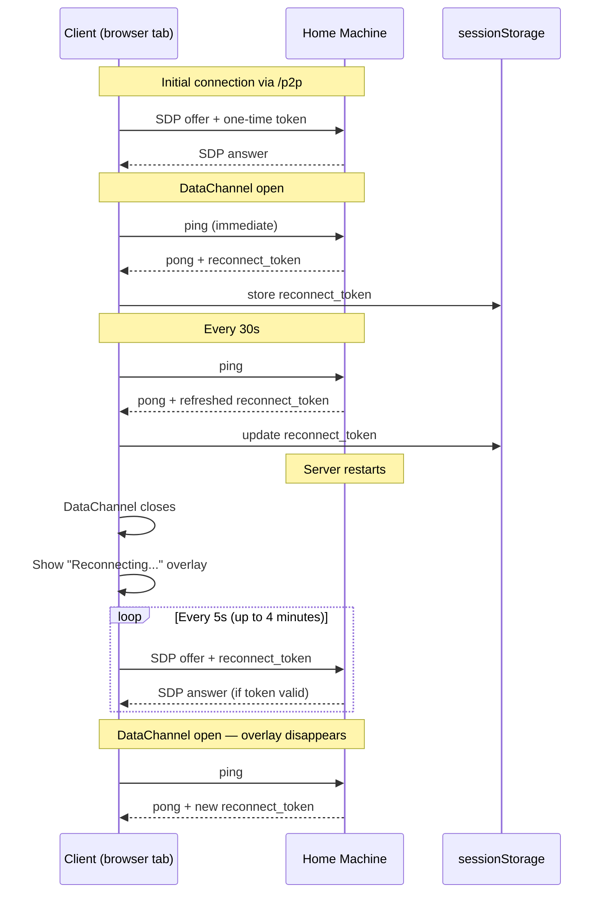

### Token Lifecycle

| Event | Action |
|-------|--------|
| DataChannel opens | First ping sent immediately |
| First pong received | Server generates reconnect token, sends in pong |
| Every 30s | Ping/pong refreshes token TTL on server |
| Page reload | `sessionStorage` has token, auto-connects with it |
| Server restart | Client retries every 5s with stored token |
| 4 minutes without refresh | Token expires, user must send `/p2p` again |
| New tab | No token (sessionStorage is per-tab) |

### Two Token Types

There are two distinct token types with different lifecycles:

| | **Connect token** (URL `?token=`) | **Reconnect token** (sessionStorage) |
|---|---|---|
| **Source** | `/p2p` Telegram command | Server pong response |
| **TTL** | **60 seconds** | **4 minutes** (refreshed every 30s) |
| **Consumed on use** | **No** — reusable until TTL expires | **No** — reusable until expired |
| **Survives page reload** | Yes (in URL) | Yes (in sessionStorage) |
| **Survives server restart** | No (server-side store lost) | No (server-side store lost) |
| **Purpose** | Initial connection from Telegram link | Reconnect after disconnect/reload/restart |
| **Storage (server)** | `TokenStore` in-memory dict | `ReconnectTokenStore` in-memory dict |
| **Storage (client)** | URL query parameter | `sessionStorage` (per-tab) |

**Flow on page reload:**
1. URL still has `?token=xxx` (connect token, may be expired)
2. sessionStorage has reconnect token (refreshed by last pong)
3. Client sends BOTH in the SDP offer
4. Server accepts whichever is valid (reconnect token checked first)

**Flow on new `/p2p` link:**
1. Fresh connect token in URL (different from last used)
2. Old reconnect token cleared from sessionStorage
3. Client connects with the fresh connect token

!!! warning "Connect token is NOT consumed"
    The connect token stays valid for its full 60-second TTL. This allows page reloads within the first 60 seconds to work without needing the reconnect token. After 60 seconds, only the reconnect token (refreshed by ping/pong) can re-establish the connection.

### Reconnect Overlay

When the DataChannel closes and a valid reconnect token exists, a full-screen overlay appears:

```
┌──────────────────────────────┐
│                              │
│            ⟳                │  ← spinning icon
│                              │
│      Reconnecting...         │
│      187s remaining          │  ← countdown to token expiry
│                              │
└──────────────────────────────┘
```

The overlay:
- Appears instantly when the connection drops
- Shows a countdown until the reconnect token expires
- Disappears automatically when reconnection succeeds
- Changes to "Session expired — send /p2p" when the token runs out
- Covers the entire page (z-index 99999) so the user knows the state

### Server-Side Store

`ReconnectTokenStore` manages tokens separately from one-time connection tokens:

```python
class ReconnectTokenStore:
    def generate(self) -> str       # New 256-bit token
    def refresh(self, token) -> bool # Extend TTL (called on every pong)
    def verify(self, token) -> bool  # Check validity (without consuming)
    def revoke(self, token) -> None  # Explicit revoke
```

The relay listener accepts both one-time tokens (`token`) and reconnect tokens (`reconnect_token`) in the SDP offer:

```json
{"type": "offer", "sdp": "...", "token": "", "reconnect_token": "abc123..."}
```

If `reconnect_token` is valid, the one-time `token` is not checked — the client can reconnect without Telegram.

### Why sessionStorage (not localStorage or IndexedDB)

| Storage | Scope | Survives reload | Survives new tab | Use case |
|---------|-------|----------------|-----------------|----------|
| **sessionStorage** | Per tab | Yes | No | Reconnect tokens — each tab is an independent session |
| localStorage | All tabs | Yes | Yes | Wrong — token from tab A shouldn't work in tab B |
| IndexedDB | All tabs | Yes | Yes | Wrong — same issue as localStorage |

Each tab has its own P2P connection with its own WebRTC peer on the server. The reconnect token maps to that specific server-side session. Using localStorage would let tab B steal tab A's session.

## Stream Frame Transport

Every frame (JPEG, WebP, VP8, VP9) flows through the same binary WebSocket with a 10-byte header. The transport is identical for all codecs and all connection types (LAN, proxy, P2P).

### Frame Wire Format

```
[stream_id: 2 bytes, big-endian]
[seq: 4 bytes, big-endian]
[timestamp_ms: 4 bytes, big-endian]
[payload: N bytes]
```

| Field | Size | Description |
|-------|------|-------------|
| `stream_id` | 2B | Which stream (0 = primary display, future: 1 = second monitor, 2 = webcam) |
| `seq` | 4B | Monotonically increasing sequence number. **Never restarts** on codec switch. |
| `timestamp_ms` | 4B | Milliseconds since stream start. Used by client for staleness detection. |
| `payload` | NB | JPEG bytes, WebP bytes, WebM init segment, or WebM Cluster |

### Full Stream Lifecycle

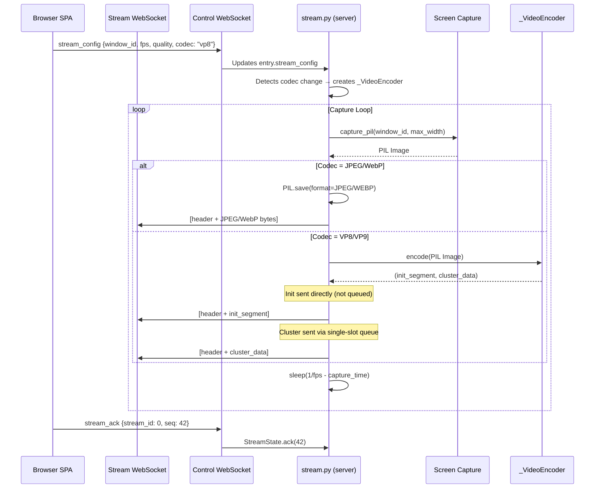

### Frame Flow Control (ACK-Based)

```mermaid
flowchart TD
    subgraph Server["Server (stream.py)"]
        CAP[Capture frame] --> CHECK{unacked > 5?<br/>OR<br/>unacked_time > 1s?}
        CHECK -->|Yes| PAUSE[Sleep 50ms<br/>check again]
        CHECK -->|No| ENCODE[Encode + send]
        ENCODE --> SEQ[seq++, pack header]
        SEQ --> QUEUE{Codec?}
        QUEUE -->|JPEG/WebP| SINGLE[Single-slot queue<br/>drop old if full]
        QUEUE -->|VP8/VP9 init| DIRECT[Send directly<br/>not queued]
        QUEUE -->|VP8/VP9 cluster| VIDEO_Q[Video queue<br/>max 4, drop oldest]
        SINGLE --> SEND[WebSocket send]
        DIRECT --> SEND
        VIDEO_Q --> SEND
        PAUSE --> CHECK
    end
    subgraph Client["Client (browser)"]
        RECV[ws.onmessage] --> PARSE[Parse 10-byte header]
        PARSE --> STALE{timestamp_ms<br/>stale > 2s?}
        STALE -->|Yes, image codec| DROP[Drop frame<br/>ACK anyway]
        STALE -->|No| DETECT{First 4 bytes?}
        DETECT -->|0xFF... JPEG/WebP| RAF[requestAnimationFrame<br/>render latest only]
        DETECT -->|0x1A45 EBML init| MSE_INIT[_initMSE<br/>create MediaSource]
        DETECT -->|0x1F43 Cluster| MSE_APPEND[appendBuffer<br/>or queue max 30]
        RAF --> ACK[Send stream_ack]
        MSE_INIT --> ACK
        MSE_APPEND --> ACK
        DROP --> ACK
    end
    SEND -.->|binary WebSocket| RECV
    ACK -.->|JSON control WS| CAP

    style Server fill:#1a2a3a
    style Client fill:#1a3a1a
```

### JPEG/WebP Frame Dropping

For image codecs, frames are independently decodable — dropping is safe and encouraged:

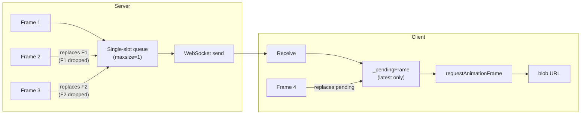

**Server drops:** single-slot queue means at most 1 frame buffered. If capture produces a new frame before the previous was sent, the old one is replaced.

**Client drops:** `_pendingFrame` holds only the latest. If multiple frames arrive between rAF ticks, only the newest renders. The `_lastRenderedSeq` check skips frames older than what's displayed.

**Timestamp drops:** If a frame's `timestamp_ms` is >2 seconds behind the client's elapsed time, it's dropped immediately (never rendered, but ACKed so the server knows).

### VP8/VP9 MSE Pipeline

For video codecs, frames are NOT independently decodable — the MSE SourceBuffer must receive them in order. Dropping causes glitches until the next keyframe.

```mermaid
flowchart TD
    subgraph Server
        INIT["Init segment<br/>(EBML + Segment + Tracks)"]
        C1[Cluster 1]
        C2[Cluster 2]
        C3[Cluster 3]
        INIT -->|"sent directly<br/>(own seq)"| WS[WebSocket]
        C1 -->|"via queue"| WS
        C2 -->|"via queue"| WS
        C3 -->|"via queue"| WS
    end
    subgraph Client["Client MSE Pipeline"]
        RX[ws.onmessage] --> DET{EBML?}
        DET -->|Yes| CREATE["_initMSE()<br/>new MediaSource<br/>new SourceBuffer"]
        DET -->|No, Cluster| BUSY{SB updating?}
        BUSY -->|No| APPEND[appendBuffer]
        BUSY -->|Yes| QUEUE["Queue (max 30)"]
        QUEUE --> UE[updateend event]
        UE --> DRAIN[appendBuffer from queue]
        DRAIN --> UE
        APPEND --> UE
        CREATE --> APPEND
    end
    subgraph LiveEdge["Live-Edge Seeker (200ms interval)"]
        CHECK_LAG{lag?}
        CHECK_LAG -->|"> 2s"| SEEK["video.currentTime = liveEdge"]
        CHECK_LAG -->|"> 0.8s"| FAST["playbackRate = 1 + lag"]
        CHECK_LAG -->|"> 0.3s"| GENTLE["playbackRate = 1.2"]
        CHECK_LAG -->|"< 0.3s"| NORMAL["playbackRate = 1.0"]
    end

    WS --> RX

    style Server fill:#1a2a3a
    style Client fill:#1a3a1a
    style LiveEdge fill:#2a1a2a
```

### Stream Stop / Cleanup

When the user navigates away from the viewer:

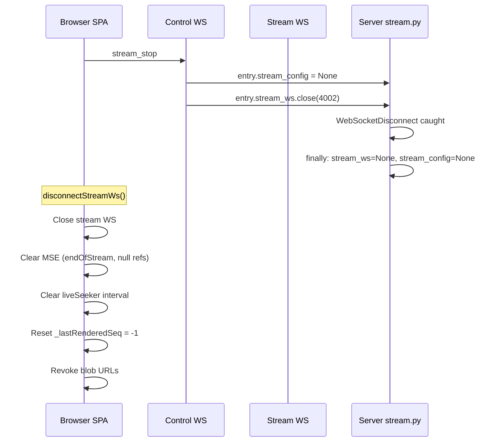

!!! warning "stream_stop via control WS is essential"
    The stream WS close message might be stuck behind buffered binary frames in the DataChannel. `stream_stop` is sent via the control channel (which is never clogged with binary data) to guarantee the server stops capturing immediately.

### Server-Side Pause / Auto-Recovery

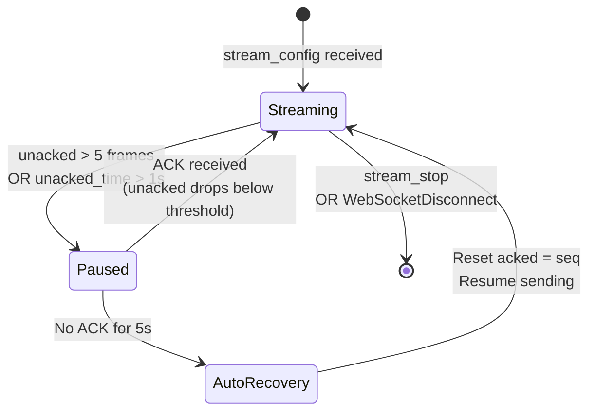

The auto-recovery prevents permanent deadlock when:
- The client tab is backgrounded (ACKs stop)
- The DataChannel dies silently
- A burst of large frames fills the SCTP buffer

After recovery, the server resumes with the latest frame — no stale data.

## DataChannel Proxy Protocol

The proxy multiplexes HTTP and WebSocket traffic over a single WebRTC DataChannel.

### HTTP Request/Response

```json
// Request (browser → home)
{"id": "r1", "type": "http", "method": "GET", "path": "/api/session", "headers": {}, "body": null}

// Response (home → browser)
{"id": "r1", "type": "http_response", "status": 200, "headers": {"content-type": "application/json"}, "body": "{...}", "binary": false}

// Binary response (fonts, images)
{"id": "r2", "type": "http_response", "status": 200, "headers": {"content-type": "font/woff2"}, "body": "AAEAAAAOAIAAAwBg...", "binary": true}
```

### WebSocket Proxy

```json
// Open (browser → home)
{"id": "w1", "type": "ws_open", "path": "/ws/control/abc123"}

// Ready (home → browser)
{"id": "w1", "type": "ws_ready"}

// Text frame (bidirectional)
{"id": "w1", "type": "ws_text", "data": "{\"type\":\"list_windows\"}"}

// Close (bidirectional)
{"id": "w1", "type": "ws_close"}
```

### Binary WebSocket Frames

Binary frames use a 4-byte WebSocket ID prefix instead of JSON:

```
[ws_id: 4 bytes, zero-padded][payload: N bytes]
```

This avoids JSON encoding overhead for high-frequency binary data (JPEG frames).

## Client-Side Asset Caching

Static assets (JS, CSS, fonts) are cached in the browser using the **Cache API**. This is critical for LTE connections — without caching, every P2P connection fetches ~2MB of Vue, Quasar, xterm.js, icons, and CSS through the DataChannel tunnel. With caching, the second connection loads in ~2 seconds instead of ~15.

### How It Works

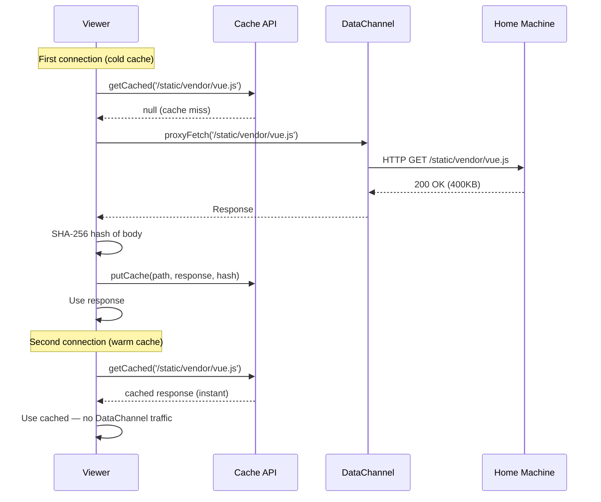

### Cache Rules

| Rule | Value | Purpose |
|------|-------|---------|
| Cache name | `openhort-p2p-v1` | Namespaced, versionable |
| Max total size | 20 MB | Prevents unbounded storage |
| Max per-file | 2 MB | Skips huge files |
| Cacheable paths | `/static/*`, `/ext/*` | Only immutable assets |
| Content hash | SHA-256 (first 16 hex chars) | Stored as `x-p2p-hash` header |
| LRU timestamp | `x-p2p-time` header | For eviction ordering |
| Priority files | `vue.global`, `quasar.umd`, `quasar.prod.css` | Never evicted |

### Cache Invalidation

On every connection, the viewer fetches `/api/hash` through the DataChannel. This returns a hash of the server's static content. If the hash differs from the stored value in `localStorage`, the entire cache is cleared:

```javascript
// Server updated → clear stale cache
const serverHash = (await fetch('/api/hash')).json().hash;
const storedHash = localStorage.getItem('p2p-server-hash');
if (storedHash && storedHash !== serverHash) {
    await caches.delete('openhort-p2p-v1');
}
localStorage.setItem('p2p-server-hash', serverHash);
```

This ensures users always get fresh assets after an openhort update, without manual cache clearing.

### LRU Eviction with Priority

When the cache exceeds 20MB, the oldest files are evicted first — but **priority files are never evicted**:

```
Eviction order:
1. Non-priority files, oldest first (panel.js, hort.css, icon fonts, ...)
2. Priority files only as absolute last resort (vue.js, quasar.js, quasar.css)
```

Priority files are identified by filename pattern (`vue.global`, `quasar.umd`, `quasar.prod.css`). These are the files without which the SPA cannot render at all.

### Does This Work via the HTTP Proxy Too?

**No — but it doesn't need to.** The Cache API caching is specific to the P2P DataChannel path because:

- **P2P mode** (`signal=ws`): Assets flow through the DataChannel tunnel — slow over LTE, caching essential.
- **HTTP proxy mode** (Azure access server): Assets are served by the proxy as normal HTTP responses with standard `Cache-Control` headers. The **browser's native HTTP cache** handles this automatically — no custom caching needed.
- **LAN mode** (`signal=http`): Assets load directly from the local server over WiFi. Fast enough that caching adds no benefit.

The custom Cache API layer only activates when `proxyFetch` is used (P2P mode). In proxy and LAN modes, the browser's built-in HTTP cache does the job.

```mermaid
flowchart TD
    subgraph P2P["P2P Mode (DataChannel)"]
        PF[proxyFetch] --> CA[Cache API]
        CA -->|miss| DC[DataChannel → Home]
        CA -->|hit| INSTANT[Instant from cache]
    end
    subgraph Proxy["HTTP Proxy Mode"]
        NF[Native fetch] --> HC[Browser HTTP Cache]
        HC -->|miss| PROXY[Azure Proxy → Home]
        HC -->|hit| CACHED[Standard cache hit]
    end
    subgraph LAN["LAN Mode"]
        LF[Native fetch] --> LOCAL[localhost:8940]
    end

    style P2P fill:#1a3a1a
    style Proxy fill:#1a2a3a
    style LAN fill:#2a1a3a
```

## Multiple Concurrent Connections

The `RelayListener` supports multiple simultaneous P2P sessions:

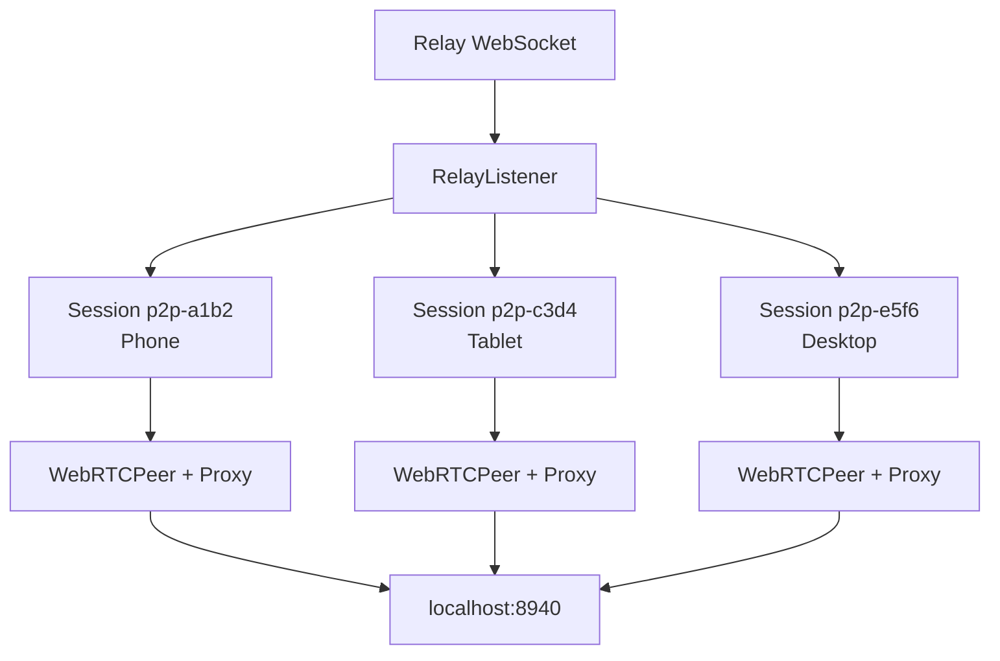

Each session has its own:
- `WebRTCPeer` (aiortc `RTCPeerConnection`)
- `DataChannelProxy` (HTTP + WS multiplexer)
- Unique session ID (`p2p-{random_hex}`)

### Cleanup

Dead sessions are cleaned up via:
1. **`on_state_change` callback** — WebRTC fires when connection state becomes `failed`/`closed`. Session is removed immediately.
2. **Periodic cleanup loop** — Every 30 seconds, scans all sessions and removes any with dead WebRTC connections.
3. **Shutdown** — `stop()` closes all active sessions.

## Deployment

### Viewer (openhort.ai)

```bash
# From the openhort repo:
bash scripts/deploy-viewer.sh
```

This copies `viewer.html` to the website repo and deploys to Cloudflare Pages. **Only the viewer HTML is deployed** — no static assets, no vendor libs.

### Relay Worker (relay.openhort.ai)

```bash
# From the www_openhort_ai repo:
cd workers/relay && CLOUDFLARE_API_TOKEN=... npx wrangler deploy
```

### Bot Menu Button

The `/connect` command generates a Telegram Web App inline button. The `/p2p` command generates a plain URL. Both include the room ID and one-time token.

The static menu button was removed — it can't include dynamic tokens and would be a security risk.

## Video Streaming (VP8/VP9 via MSE)

Real inter-frame compressed video streaming using VP8 or VP9 in WebM containers, decoded via Media Source Extensions (MSE). Works identically over LAN, proxy, and P2P.

### Available Codecs

| Codec | Type | Compression | Drop-safe | Zoom/Pan | Use case |
|-------|------|-------------|-----------|----------|----------|
| **JPEG** | Image per frame | None | Yes | Yes | Default, universal |
| **WebP** | Image per frame | ~30% smaller than JPEG | Yes | Yes | Bandwidth-constrained |
| **VP8** | Video stream (MSE) | ~10x smaller (inter-frame) | No | Via `<video>` | Smooth video, hardware decode |
| **VP9** | Video stream (MSE) | ~15x smaller (inter-frame) | No | Via `<video>` | Best compression |

### Architecture

```mermaid
flowchart TD
    subgraph Server["Home Machine (stream.py)"]
        CAPTURE[Screen Capture → PIL Image]
        JPEG_ENC[JPEG/WebP encoder<br/>PIL.save]
        VP8_ENC["_VideoEncoder<br/>libvpx VP8/VP9 → WebM clusters"]
    end
    subgraph Transport["Stream WebSocket (binary)"]
        HEADER["10-byte header<br/>[stream_id:2][seq:4][ts:4]"]
        FRAME[Frame data]
    end
    subgraph Browser["Browser (index.html)"]
        IMG["<img> renderer<br/>(JPEG/WebP)"]
        MSE["MSE SourceBuffer<br/>→ <video> element"]
        DETECT{Auto-detect<br/>EBML? Cluster?<br/>Image?}
    end

    CAPTURE --> JPEG_ENC -->|JPEG/WebP bytes| HEADER
    CAPTURE --> VP8_ENC -->|WebM init + clusters| HEADER
    HEADER --> FRAME --> DETECT
    DETECT -->|0xFF 0xD8 or other| IMG
    DETECT -->|0x1A 0x45 EBML| MSE
    DETECT -->|0x1F 0x43 Cluster| MSE

    style Server fill:#1a2a3a
    style Browser fill:#1a3a1a
```

### How VP8/VP9 Streaming Works

1. **Server** captures screen as PIL Image
2. **`_VideoEncoder`** encodes to WebM using `libvpx` / `libvpx-vp9`
3. First frame produces an **init segment** (EBML + Segment + Tracks, no frame data) sent directly
4. Each subsequent frame produces a **Cluster** (one frame per cluster) via the queue
5. **Browser** auto-detects format from first 4 bytes of payload:
   - `0x1A 0x45 0xDF 0xA3` → EBML init → `_initMSE()` creates MediaSource + SourceBuffer
   - `0x1F 0x43 0xB6 0x75` → Cluster → `appendBuffer()` to SourceBuffer
   - Anything else → JPEG/WebP image → `` blob URL

### Critical Encoder Settings

```python
# Container: WebM with per-frame flush
container = av.open(buf, mode="w", format="webm",
                    options={"live": "1", "cluster_size_limit": "0"})

# Stream: conservative rate matching actual capture speed
stream = container.add_stream(codec_lib, rate=10)

# Encoding: fastest possible
stream.options = {"cpu-used": "8", "deadline": "realtime", "lag-in-frames": "0"}

# PTS: sequential (0, 1, 2, ...) — MSE sequence mode handles timing
frame.pts = frame_counter
```

!!! danger "Critical settings — changing these breaks MSE"

    | Setting | Value | Why |
    |---------|-------|-----|
    | `cluster_size_limit` | `"0"` | Forces one frame per WebM Cluster. Without this, the muxer buffers ~11 frames before flushing → video frozen for seconds |
    | `rate` | `10` | Must be ≤ actual capture FPS. If rate > capture speed, the video plays faster than frames arrive → freeze/refill stutter. Capture at 1920px takes ~80ms (12fps), so rate=10 is safe |
    | `frame.pts` | Sequential `0,1,2,...` | NOT wall-clock. MSE `sequence` mode assigns timing from PTS. With rate=10, each PTS unit = 100ms |
    | SourceBuffer `mode` | `'sequence'` | NOT `'segments'`. `segments` mode uses container timestamps which create fragmented buffer ranges. `sequence` mode appends data sequentially |
    | `live` | `"1"` | Tells the muxer this is a live stream, not a file |

### Init Segment (MSE Initialization)

The init segment must be **MSE-compatible** — just the WebM header, NOT a complete file:

```python
def _make_init(self) -> bytes:
    # Encode one black frame to force header + tracks to be written
    container = av.open(buf, mode="w", format="webm")
    stream = container.add_stream(codec_lib, rate=10)
    # ... encode one frame, close container ...
    data = buf.getvalue()

    # Truncate BEFORE the Cluster element (0x1F43B675)
    cluster_pos = data.find(b'\x1f\x43\xb6\x75')
    data = data[:cluster_pos]

    # Patch Segment size to "unknown" (0x01FFFFFFFFFFFFFF)
    # so MSE accepts dynamically appended clusters
    seg_pos = data.find(b'\x18\x53\x80\x67')
    data[seg_pos + 4 : seg_pos + 12] = b'\x01\xff\xff\xff\xff\xff\xff\xff'

    return data
```

!!! danger "Init segment mistakes that break MSE"

    | Mistake | Symptom | Fix |
    |---------|---------|-----|
    | Init includes a Cluster (frame data) | MSE sees end-of-stream, stops accepting data | Truncate at Cluster marker `0x1F43B675` |
    | Segment size is a fixed number | MSE rejects appended clusters (size exceeded) | Patch to unknown `0x01FFFFFFFFFFFFFF` |
    | Init sent through frame queue | Dropped by single-slot queue, MSE never initializes | Send init directly via `await websocket.send_bytes()` |
    | Init and first frame share same seq | Client drops one (seq ≤ lastRenderedSeq) | Give init and frame separate seq numbers |
    | Init seq restarts at 0 on codec switch | Client drops init (0 < lastRenderedSeq from JPEG) | Keep seq counter continuous across codec switches |

### Client-Side MSE Pipeline

```javascript
// 1. Auto-detect from payload bytes (not state.codec — avoids race on switch)
const isEBML = b[0]===0x1A && b[1]===0x45;     // init segment
const isCluster = b[0]===0x1F && b[1]===0x43;   // frame data

// 2. Init → create MediaSource + SourceBuffer
_sourceBuffer = _mediaSource.addSourceBuffer('video/webm; codecs="vp8"');
_sourceBuffer.mode = 'sequence';

// 3. Frames → queue and drain via updateend
// Queue max 30 frames. On updateend, append next from queue.
// If SourceBuffer is idle, kick the drain immediately.

// 4. Live-edge seeker (every 200ms) — adaptive playbackRate
if (lag > 2.0) video.currentTime = liveEdge;      // hard seek
else if (lag > 0.8) video.playbackRate = 1 + lag;  // proportional speedup
else if (lag > 0.3) video.playbackRate = 1.2;       // gentle catchup
else video.playbackRate = 1.0;                       // normal speed
```

!!! danger "Client-side mistakes that break MSE"

    | Mistake | Symptom | Fix |
    |---------|---------|-----|
    | `SourceBuffer.remove()` in `updateend` | Locks SourceBuffer in `updating=true` permanently → all frames rejected → video freezes | NEVER call `remove()`. Let browser manage buffer memory |
    | Queue too small (2 frames) | SourceBuffer busy → frames dropped → ~1fps | Queue 30 frames, drain as fast as `updateend` fires |
    | Live-edge seeker seeks past buffer | `currentTime` > `bufferEnd` → video stuck | Only seek within the last buffered range |
    | `playbackRate` too low (1.1x) | Can't catch up if buffer grows | Use proportional speedup: `1 + lag` |
    | `sequence` mode with wall-clock PTS + rate=1000 | Each frame = 1ms → 10 frames = 10ms of video | Use rate=10 with sequential PTS (each frame = 100ms) |

### Measured Performance

Tested over P2P (WebRTC DataChannel) for 60+ seconds:

| Metric | Value |
|--------|-------|
| Lag | 0.3-0.4s (stable, no drift) |
| Buffer ranges | 1 (single continuous) |
| readyState | 4 (HAVE_ENOUGH_DATA) |
| Freezes | None |
| Resolution | 1920px |
| Frame rate | ~10fps (capture-limited) |
| playbackRate | 1.0-1.2 (adaptive) |

### Codec Switching

The user can switch between JPEG, WebP, VP8, VP9 at any time via the settings panel. The server:

1. Receives new `stream_config` with `codec` field
2. Keeps the seq counter continuous (NO new StreamState)
3. Creates a new `_VideoEncoder` for VP8/VP9
4. Sends the init segment with the next seq number
5. Client auto-detects EBML → reinitializes MSE

The client auto-detects the frame format from the first 4 bytes — no need for a `codec_change` message. JPEG/WebP frames go to ``, VP8/VP9 frames go to MSE `<video>`.

### Future: Audio (Opus)

Opus audio can be muxed into the same WebM container alongside VP8/VP9. The SourceBuffer accepts interleaved audio+video clusters. This enables sound transport over the same stream WebSocket with zero additional infrastructure.

Opus is royalty-free, mandatory for WebRTC, and supported in every browser.

## Library (`hort/peer2peer/`)

Framework-agnostic — no openhort extension dependencies.

| Module | Purpose |
|--------|---------|
| `models.py` | `StunResult`, `PeerInfo`, `PunchResult`, `NatType` |
| `stun.py` | STUN client (RFC 5389), NAT type detection |
| `signal.py` | `SignalingChannel` ABC + `CallbackSignaling` |
| `punch.py` | `HolePuncher` — UDP hole punching (server-to-server) |
| `tunnel.py` | `UdpTunnel` — reliable UDP stream (server-to-server) |
| `proto.py` | Wire protocol: PING/PONG/DATA/ACK/FIN |
| `webrtc.py` | `WebRTCPeer` + `WebRTCPeerRegistry` — aiortc peers |
| `dc_proxy.py` | `DataChannelProxy` — HTTP/WS multiplexer over DataChannel |
| `relay_listener.py` | `RelayListener` + `TokenStore` — relay connection + auth |
| `video_track.py` | `ScreenCaptureTrack` + `WebMEncoder` — VP8/VP9 video |
| `webm_stream.py` | `WebMStreamer` — VP8/VP9 WebM over WebSocket (proxy mode) |

## Extension (`hort/extensions/core/peer2peer/`)

| File | Purpose |
|------|---------|
| `provider.py` | Plugin: `/connect`, `/p2p`, `/stun` commands, relay startup |
| `azure_vm.py` | Azure VM provisioning (dev testing only) |
| `static/viewer.html` | The thin proxy viewer (deployed to openhort.ai) |
| `static/panel.js` | Extension settings panel |
| `extension.json` | Plugin manifest |

## API Endpoints

| Endpoint | Method | Purpose |
|----------|--------|---------|
| `/api/p2p/offer` | POST | Accept SDP offer (HTTP signaling mode) |
| `/api/p2p/connect` | POST | Generate authenticated connection URL |
| `/api/p2p/status` | GET | Active session counts |
| `/p2p` | GET | Serve viewer (local development) |

## Testing

```bash
# Unit tests (100 tests — P2P core + video, mocked — no network)
poetry run pytest tests/test_peer2peer_*.py -v

# P2P integration tests (Playwright, real WebRTC in headless Chromium)
poetry run pytest tests/test_p2p_playwright.py -v -m integration

# Video integration tests (Playwright, VP8 track + MSE verification)
poetry run pytest tests/test_p2p_video_playwright.py -v -m integration

# All integration tests
poetry run pytest tests/test_p2p_playwright.py tests/test_p2p_video_playwright.py -v -m integration

# Coverage
poetry run pytest tests/test_peer2peer_*.py --cov=hort/peer2peer --cov-report=term-missing
```

## Known Issues and Decisions

### Telegram `sendData()` closes the Mini App

`Telegram.WebApp.sendData()` sends data to the bot but **immediately closes the WebView**. This makes it unusable for SDP exchange which requires a round-trip (offer → answer). Solution: use the Cloudflare Worker relay instead of Telegram as the signaling transport. Telegram's role is limited to generating the authenticated URL.

### `document.write` breaks on large scripts

Inlining Vue.js (400KB) or Quasar (300KB) into an iframe via `document.write` fails because these scripts contain `</script>` literals in string constants. The HTML parser sees these as closing the script block, breaking the page. This affects `document.write`, `srcdoc`, and any approach that embeds scripts as HTML strings. Solution: load scripts via `document.createElement('script')` with `textContent`.

### CSS `url()` doesn't go through `fetch()`

When CSS is injected via JavaScript (`<style>` element), `url()` references for fonts and images resolve relative to the page origin (openhort.ai), not through the overridden `fetch()`. The home machine's font files aren't on openhort.ai. Solution: parse CSS, fetch all `url()` resources through the DataChannel, convert to base64 data URIs.

### Binary responses need explicit handling

The DataChannel carries JSON messages. Binary content (fonts, images) can't be sent as raw JSON strings without corruption. Solution: the server-side proxy detects binary content types and base64-encodes them. The client decodes back to `ArrayBuffer`. Text content types pass through as plain strings.

### Cloudflare Durable Object `this.peers` array

A plain JavaScript array in a Durable Object constructor loses track of WebSocket connections between `fetch()` invocations because the object may be evicted from memory. Solution: use `this.state.getWebSockets()` which returns all accepted WebSockets across all `fetch()` calls.

### No static assets on the hosting site

Previous attempts uploaded Vue, Quasar, and vendor JS/CSS to openhort.ai so the iframe could load them. This violates the thin proxy principle — the viewer would need redeployment whenever the UI changes. Solution: all assets flow through the DataChannel. The hosting site contains only `viewer.html` (and the legal pages required by German law).
