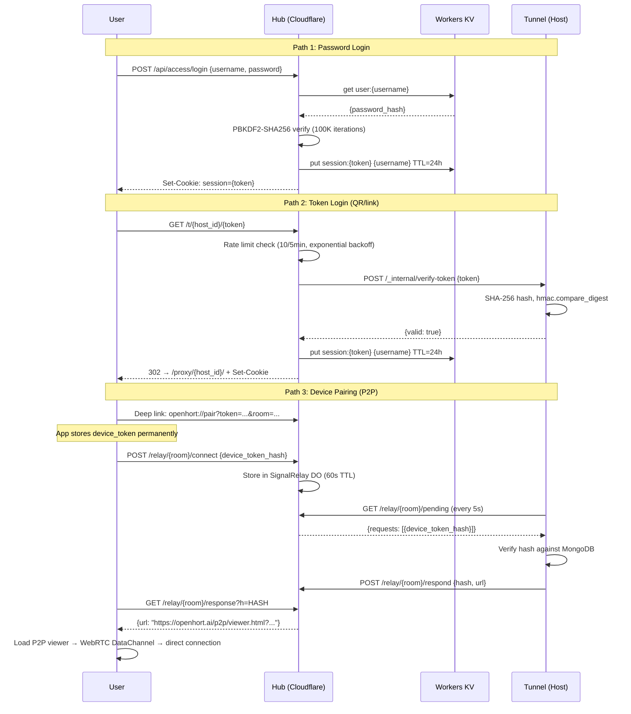

# Access Server — Remote Proxy for openhort

The access server lets you reach your openhort instances from anywhere. It acts as a relay — your machines connect to it, and you access them through a single URL.

## Architecture

```
Phone/Tablet                    Azure                         Your Machine
     │                            │                                │
     │  HTTPS                     │                                │
     ├──────────────────────────→ │  Access Server                │
     │  login + session cookie    │  (openhort-access)            │
     │                            │                                │
     │  /proxy/{host_id}/...      │         WebSocket Tunnel       │
     ├──────────────────────────→ │ ←────────────────────────────→ │  Tunnel Client
     │                            │  (persistent connection)       │  (hort.access.tunnel_client)
     │                            │                                │
     │  ← proxied response ─────→│                                │  openhort (port 8940)
     │                            │                                │
     │  /proxy/{host_id}/ws/...   │                                │
     ├──────(WebSocket)─────────→ │ ←────────(relayed)───────────→ │
     │                            │                                │
```

- **Access server** runs on Azure (or any cloud). Handles authentication, host registry, and proxying.
- **Tunnel client** runs on each machine alongside openhort. Maintains a persistent WebSocket to the access server.
- **All traffic** (HTTP + WebSocket) is relayed through the tunnel — no direct connection to the machine needed.

### Proxy Flow (HTTP)

1. Browser sends `GET /proxy/{host_id}/viewer` to the access server
2. Access server authenticates via session cookie
3. Access server wraps the request into a JSON `http_request` message and sends it through the tunnel WebSocket
4. Tunnel client receives the message, makes a local HTTP request to `http://localhost:8940/viewer`
5. Tunnel client base64-encodes the response body, chunks if needed, and sends it back
6. Access server reassembles the response, injects a `<base>` tag into HTML, strips `content-length`, and returns it to the browser

### Proxy Flow (WebSocket)

1. Browser opens `ws://access-server/proxy/{host_id}/ws/stream/{session_id}`
2. Access server verifies the session cookie on the WebSocket handshake
3. Access server sends a `ws_open` message through the tunnel
4. Tunnel client opens a local WebSocket to `ws://localhost:8940/ws/stream/{session_id}`
5. Data flows bidirectionally: browser frames become `ws_data` tunnel messages (text or base64-encoded binary), and vice versa
6. When either side disconnects, a `ws_close` message is sent through the tunnel

## Quick Start

### 1. Deploy the access server

```bash
# Set your registry (never hardcode — use env vars)
export HORT_REGISTRY=yourregistry.azurecr.io
export HORT_ADMIN_PASSWORD="YourSecurePassword123!"

# Build and push
docker buildx build --platform linux/amd64 \
    -t $HORT_REGISTRY/openhort/access-server:latest \
    -f hort/access/Dockerfile \
    --build-arg ADMIN_PASSWORD="$HORT_ADMIN_PASSWORD" \
    --push .

# Deploy to Azure (or use scripts/deploy-access.sh)
az appservice plan create --name openhort-plan --resource-group YOUR_RG --location germanywestcentral --sku B1 --is-linux
az webapp create --name openhort-access --resource-group YOUR_RG --plan openhort-plan \
    --container-image-name $HORT_REGISTRY/openhort/access-server:latest \
    --container-registry-user YOUR_ACR_USER --container-registry-password YOUR_ACR_PASS

# CRITICAL: Enable WebSockets on Azure App Service
az webapp config set --name openhort-access --resource-group YOUR_RG --web-sockets-enabled true

# Configure
az webapp config appsettings set --name openhort-access --resource-group YOUR_RG \
    --settings WEBSITES_PORT=8080 ACCESS_SESSION_SECRET="$(openssl rand -hex 32)" HORT_HTTPS=1
```

### 2. Create a user and host

```bash
# Login (via curl or the web UI)
curl -c cookies.txt -X POST https://openhort-access.azurewebsites.net/api/access/login \
    -H "Content-Type: application/json" \
    -d '{"username":"admin","password":"YourSecurePassword123!"}'

# Create a host entry
curl -b cookies.txt -X POST https://openhort-access.azurewebsites.net/api/access/hosts \
    -H "Content-Type: application/json" \
    -d '{"display_name":"My Mac"}'
# Returns: {"host_id":"abc123","connection_key":"<KEY>","display_name":"My Mac"}
```

### 3. Connect your machine

On the machine running openhort:

```bash
# Start openhort locally (if not already running)
poetry run python run.py

# Connect to the access server
python -m hort.access.tunnel_client \
    --server=https://openhort-access.azurewebsites.net \
    --key="<CONNECTION_KEY>" \
    --local=http://localhost:8940
```

### 4. Access from anywhere

Open `https://openhort-access.azurewebsites.net` in a browser. Log in, see your machines, click one to open the full openhort viewer — proxied through Azure.

## Components

### `hort/access/auth.py` — Authentication

| Feature | Implementation |
|---|---|
| Password hashing | PBKDF2-SHA256, 100K iterations, 32-byte salt |
| Password validation | Minimum 8 chars, upper + lower + digit |
| Brute-force protection | Per-IP rate limiter: 10 attempts per 5 minutes |
| Timing attack prevention | Artificial delay on ALL auth attempts (success and failure), 0.5s base with exponential backoff up to 10s |
| Connection keys | 32-byte URL-safe tokens (`secrets.token_urlsafe(32)`) |

### `hort/access/tokens.py` — Host-Side Token Management

Tokens are generated and verified **on the host**, not on the access server. The access server only relays verification requests through the tunnel to `/_internal/verify-token`.

| Feature | Implementation |
|---|---|
| Storage | `~/.hort/tokens.json` on the host machine |
| Hashing | SHA-256 — plaintext never stored, shown only once at creation |
| Verification | `hmac.compare_digest` for constant-time comparison |
| Temporary tokens | Configurable duration (default 5min, startup creates 24h), auto-cleaned on verify |
| Permanent tokens | Never expire; creating one with the same label invalidates the previous |
| Revocation | `revoke_all_temporary()` removes all non-permanent tokens |

**Token types:**

- **Temporary** — created on server startup, persisted in `~/.hort/current-temp-token`, valid 24 hours, survives restarts (reused if still valid)
- **Permanent** — created via the Cloud panel UI button, never expires, stored in `~/.hort/tokens.json` (hashed)

### `hort/access/store.py` — Storage

Two backends:

| Backend | Use case | Config |
|---|---|---|
| `FileStore` | Single instance, persistent volume | `--store /data/hort-access.json` |
| `MongoStore` | Multi-instance, dynamic users | `--store mongodb://...` |

The admin user is created at container startup by `entrypoint.sh`, not at build time. The store file lives on a persistent Docker volume at `/data/` so it survives container restarts and redeployments.

### `hort/access/server.py` — Proxy Server

**Endpoints:**

| Endpoint | Method | Auth | Description |
|---|---|---|---|
| `/` | GET | -- | Landing page (Quasar UMD login + host selector) |
| `/api/access/login` | POST | -- | Authenticate, set session cookie |
| `/api/access/logout` | POST | session | Clear session |
| `/api/access/me` | GET | session | Current user info |
| `/api/access/hosts` | GET | session | List user's hosts (with online status) |
| `/api/access/hosts` | POST | session | Create a new host, returns connection key |
| `/api/access/token/login` | GET | -- | Token-based login (QR code flow, rate-limited) |
| `/api/access/tunnel` | WS | key | Host tunnel connection (query param `?key=`) |
| `/proxy/{host_id}/{path}` | ANY | session | Proxy HTTP requests to host |
| `/proxy/{host_id}/{path}` | WS | cookie | Proxy WebSocket connections to host |
| `/cfversion` | GET | -- | Build version info from `build_info.json` |

**Tunnel protocol** (JSON over WebSocket):

```
Access Server → Host:
  {"type": "http_request", "req_id": "...", "method": "GET", "path": "/api/hash", "headers": {...}, "body": ""}
  {"type": "ws_open", "ws_id": "...", "path": "/ws/stream/..."}
  {"type": "ws_data", "ws_id": "...", "text": "..."} or {"binary": "<base64>"}
  {"type": "ws_close", "ws_id": "..."}

Host → Access Server (small responses):
  {"type": "http_response", "req_id": "...", "status": 200, "headers": {...}, "body_b64": "<base64>"}

Host → Access Server (chunked responses, >32KB base64):
  {"type": "http_response_start", "req_id": "...", "status": 200, "headers": {...}, "total_chunks": 3, "chunk_index": 0, "chunk": "<base64 part>"}
  {"type": "http_response_chunk", "req_id": "...", "chunk_index": 1, "chunk": "<base64 part>"}
  {"type": "http_response_chunk", "req_id": "...", "chunk_index": 2, "chunk": "<base64 part>"}

Host → Access Server (WebSocket relay):
  {"type": "ws_data", "ws_id": "...", "text": "..."} or {"binary": "<base64>"}

Server → Host (after WS accept):
  {"type": "welcome", "host_id": "abc123", "display_name": "My Mac"}
```

**Critical implementation detail:** The tunnel WebSocket uses a **send queue** (`asyncio.Queue`) instead of direct `ws.send_text()`. Starlette's WebSocket does not support concurrent send and receive from different coroutines — the reader and writer must be separate tasks sharing the WS through the queue.

### `hort/access/tunnel_client.py` — Host Connector

Runs on each openhort machine. Maintains a persistent WebSocket connection to the access server. Relays:
- **HTTP requests** — makes local HTTP requests via `httpx` and sends responses back
- **WebSocket connections** — opens local WebSocket connections via `websockets` and bridges data

Auto-reconnects on disconnect (5 second backoff).

**Status file:** Writes tunnel state to `/tmp/hort-tunnel.active` (format: `server_url\nhost_id`). The openhort UI reads this file via `/api/connectors` to show cloud status. The file is removed on disconnect.

**Welcome message:** After the tunnel WebSocket is accepted, the server sends `{"type": "welcome", "host_id": "...", "display_name": "..."}`. The client reads the `host_id` from this message and writes it to the status file.

**`host_id` fallback:** If the tunnel status file does not contain a `host_id`, the openhort app falls back to reading `connector.cloud.host_id` from `hort-config.yaml`.

### `hort/access/Dockerfile`

```dockerfile
FROM python:3.13-slim
# ... installs deps via poetry, copies code
# Embeds build version via build_info.json
# Uses entrypoint.sh for admin user creation
CMD ["python", "-m", "hort.access.server", "--port", "8080", "--store", "/data/hort-access.json"]
```

**`--platform=linux/amd64`** is set in `docker-compose.yml` because Azure App Service runs x86_64. Without this, building on an ARM Mac produces an incompatible image.

The admin password is passed via `HORT_ADMIN_PASSWORD` environment variable at runtime — never baked into the image.

### `hort/access/entrypoint.sh` — Container Startup

Creates the admin user at runtime (not build time) so the store file persists across redeployments via the mounted volume:

```sh
STORE="${HORT_STORE_PATH:-/data/hort-access.json}"
ADMIN_PASSWORD="${HORT_ADMIN_PASSWORD:-ChangeMe123!}"
mkdir -p "$(dirname "$STORE")"
# Only create admin user if the store doesn't exist yet
if [ ! -f "$STORE" ]; then
    python -c "
from hort.access.store import FileStore
from hort.access.auth import hash_password
s = FileStore('$STORE')
s.create_user('admin', hash_password('$ADMIN_PASSWORD'), 'Administrator')
"
fi
exec "$@"
```

### `hort/access/docker-compose.yml` — Deployment Configuration

- Versioned image tags (set via `IMAGE_TAG` env var, defaults to `latest`)
- Persistent volume `access-data` mounted at `/data/` for the store file
- Environment variables: `ACCESS_SESSION_SECRET`, `HORT_ADMIN_PASSWORD`, `HORT_HTTPS`
- Platform: `linux/amd64`
- Restart policy: `unless-stopped`
- Container port 8080, mapped to `HORT_ACCESS_PORT` (default 8400) on the host

## HTML Injection and Base Path Proxying

When the access server proxies HTML responses, it injects a `<base href="/proxy/{host_id}/">` tag into the `<head>` element. This makes all relative URLs in the page resolve through the proxy path.

**Requirements for this to work:**

- All asset paths in `index.html` must be **relative** (no leading `/`). For example: `static/vendor/vue.js` not `/static/vendor/vue.js`.
- Client-side code uses `wsUrl()` and `apiUrl()` helpers that read the `<base>` tag and prefix paths accordingly.
- The `HortExtension.basePath` property (in `hort/static/vendor/hort-ext.js`) detects the `<base>` tag and provides the proxy prefix for extension API calls.

**Content-Length bug (fixed):** Injecting the `<base>` tag increases the HTML body size, but the original `content-length` header was forwarded unchanged. This caused `RuntimeError: Response content longer than Content-Length` in Starlette. The fix: remove both `content-length` and `Content-Length` headers after any body modification.

## WebSocket Message Size Limit

**Problem:** Azure App Service's WebSocket proxy silently drops messages larger than approximately 64KB. This breaks JPEG frame streaming and large HTML page responses.

**Solution:** The tunnel client (`tunnel_client.py`) base64-encodes all response bodies. If the base64 string exceeds 32KB, it splits the response into chunks:

1. First message: `http_response_start` — contains status, headers, `total_chunks`, `chunk_index: 0`, and the first chunk
2. Subsequent messages: `http_response_chunk` — contains `chunk_index` and the chunk data
3. Server reassembly: `_finish_chunked()` on `HostTunnel` collects all chunks in order and resolves the pending future

**Body normalization in `proxy_request()`:** After reassembly, the server normalizes the body format:
- `body_b64` — base64-decoded to UTF-8 string
- `body_zb64` — zlib-decompressed, then base64-decoded to UTF-8 string
- `body` — used as-is (plain string)

## Session Cookie Configuration

The session cookie behavior is conditional on the `HORT_HTTPS` environment variable:

| Setting | `HORT_HTTPS=1` (Azure) | `HORT_HTTPS=0` (local dev) |
|---|---|---|
| `https_only` | `True` | `False` |
| `same_site` | `"none"` | `"lax"` |

- **Azure (HTTPS):** `same_site="none"` is required because the token login redirect flow involves cross-origin navigation. `https_only=True` ensures cookies are only sent over HTTPS.
- **Local dev (HTTP):** `same_site="lax"` and `https_only=False` allow cookies to work over plain HTTP.

The session secret comes from `ACCESS_SESSION_SECRET` env var, with a fallback to `secrets.token_hex(32)` (random per process, fine for single-instance but sessions won't survive restarts).

## Token Authentication Flow

Token-based authentication allows access via QR code without entering a username/password on the phone.

### QR Code Generation

The QR code URL format (short): `{server}/t/{host_id}/{token}`

Legacy format (still supported): `{server}/api/access/token/login?token={token}&host={host_id}`

The QR code is generated server-side via the `/api/qr?url=...` endpoint (uses `qrcode` library to create a PNG data URI). The `hort-qr` Vue component (in `hort/static/vendor/hort-ext.js`) wraps this with a clickable URL display.

### Login Flow

1. User scans QR code on phone — browser navigates to `{access_server}/api/access/token/login?token={token}&host={host_id}`
2. Access server applies rate limiting + artificial delay (same as password auth)
3. Access server finds the tunnel for `host_id`
4. Access server sends `POST /_internal/verify-token` through the tunnel with `{"token": "..."}`
5. Host's `/_internal/verify-token` endpoint verifies the token against its local `TokenStore`
6. If valid: access server looks up the host owner, creates a session cookie, redirects to `/proxy/{host_id}/`
7. If invalid: returns 401

### Token Lifecycle

- **Startup:** `_create_startup_tokens()` in `hort/app.py` runs on every openhort startup. It checks if `~/.hort/current-temp-token` exists and is still valid. If so, reuses it; otherwise creates a new 24-hour temporary token.
- **UI refresh:** The Cloud panel's "Refresh Token" button calls `POST /api/connectors/cloud/token` with `{"permanent": false}`, which revokes all temporary tokens and creates a new 24-hour one.
- **Permanent key:** The Cloud panel's "Create Permanent Key" / "Regenerate Key" button calls `POST /api/connectors/cloud/token` with `{"permanent": true}`. The new plaintext is shown in a QR code. Creating a new permanent key with the same label invalidates the previous one.
- **Token state:** Stored in `app.state.cloud_tokens` and returned via `/api/connectors` → `cloud.tokens`.

## Cloud Connector UI

The cloud connector panel (`hort/extensions/core/cloud_connector/static/panel.js`) is a `HortExtension` that provides:

- **Connection status:** green/red dot showing tunnel state
- **Three tabs** (when connected):
  - **Session QR** — temporary token QR code, "Refresh Token" button
  - **Permanent QR** — permanent key QR code (shown only after generation), "Create/Regenerate Key" button
  - **Settings** — server URL and connection key inputs, Enable/Disable buttons
- **Settings view** (when disconnected): shows the configuration form directly

Configuration is persisted to `hort-config.yaml` under the `connector.cloud` key via `POST /api/config/connector.cloud`.

## Docker Deployment

### `hort/access/Dockerfile`

- Base: `python:3.13-slim`
- Dependencies installed via `poetry install --only main`
- Build version embedded via `build_info.json` (set with `--build-arg BUILD_VERSION=...`)
- Exposed at `/cfversion` endpoint
- Entrypoint: `entrypoint.sh` (creates admin user if store doesn't exist)
- Default CMD: `python -m hort.access.server --port 8080 --store /data/hort-access.json`

### Host Registration Persistence

Azure App Service has an ephemeral filesystem — the `FileStore` JSON file is lost on every container restart or redeployment. The fix is to mount a persistent Docker volume at `/data/` and store the file there:

```yaml
volumes:
  - access-data:/data
```

The admin user is created by `entrypoint.sh` only if the store file doesn't already exist, so user data, host registrations, and connection keys survive redeployments.

### `scripts/deploy-access.sh`

Automated build, push, and deploy workflow:

1. Generates a version tag: `v{git_short_hash}-{timestamp}` (e.g., `vf118591-20260323142500`)
2. Logs into ACR: `az acr login --name ...`
3. Builds and pushes via `docker compose -f hort/access/docker-compose.yml build && push`
4. Deploys to Azure: `az webapp config container set --container-image-name ...`
5. Restarts the app: `az webapp stop` + `az webapp start` (with 5s sleep between)
6. Prints verification command: `curl https://{app}.azurewebsites.net/cfversion`

**Configuration via environment variables:**

| Variable | Default | Description |
|---|---|---|
| `HORT_REGISTRY` | `yourregistry.azurecr.io` | ACR hostname |
| `HORT_RG` | `your-resource-group` | Azure resource group |
| `HORT_APP_NAME` | `openhort-access` | Azure Web App name |

## Azure Deployment Checklist

| Step | Command | Notes |
|---|---|---|
| ACR login | `az acr login --name YOUR_ACR` | Required before push |
| Build for amd64 | `docker buildx build --platform linux/amd64 ...` | ARM Mac builds won't work on Azure |
| Push to ACR | Use `docker compose push` or `docker push` | |
| Create App Service plan | `az appservice plan create --sku B1 --is-linux` | B1 is cheapest (~$13/month) |
| Create Web App | `az webapp create --container-image-name ... --container-registry-user ... --container-registry-password ...` | Pass ACR credentials at creation time |
| **Enable WebSockets** | `az webapp config set --web-sockets-enabled true` | **CRITICAL — without this, tunnel WS connects but messages don't relay** |
| Set port | `az webapp config appsettings set --settings WEBSITES_PORT=8080` | Container listens on 8080 |
| Set session secret | `az webapp config appsettings set --settings ACCESS_SESSION_SECRET="$(openssl rand -hex 32)"` | Persistent across restarts |
| Set HTTPS flag | `az webapp config appsettings set --settings HORT_HTTPS=1` | Required for secure cookies |
| Set admin password | `az webapp config appsettings set --settings HORT_ADMIN_PASSWORD="..."` | Used by entrypoint.sh on first run |

### Azure-Specific Issues

| Symptom | Cause | Fix |
|---|---|---|
| `ImagePullUnauthorizedFailure` | ACR credentials not configured | Pass `--container-registry-user` and `--container-registry-password` when creating the webapp |
| Login returns 500 | Password hash iterations mismatch (old image had 600K, new code has 100K) | Rebuild the image — the admin user hash is created at runtime by entrypoint.sh |
| Tunnel connects but proxy times out | WebSockets not enabled on Azure | `az webapp config set --web-sockets-enabled true` |
| Tunnel connects but proxy times out | Local openhort server not running | Start it: `poetry run python run.py` |
| `Internal Server Error` on login | Empty `ACCESS_SESSION_SECRET` env var | The code uses `or secrets.token_hex(32)` fallback — ensure the env var is either unset or has a value |
| Image runs on Mac but not Azure | Wrong platform (ARM vs AMD64) | Use `--platform=linux/amd64` in docker-compose.yml or `docker buildx build --platform linux/amd64` |
| Large responses silently dropped | Azure WS proxy drops messages > ~64KB | Tunnel client chunks responses at 32KB — already handled |
| `RuntimeError: Response content longer than Content-Length` | `<base>` tag injection increased body size | Remove `content-length` headers after body modification — already fixed |
| ACR image path doubled (e.g., `registry.io/registry.io/...`) | `az webapp config container set` with `--container-registry-url` | Omit `--container-registry-url` — use just `--container-image-name` with full path |
| `latest` tag doesn't update on restart | Azure caches container images by tag | Use versioned tags (deploy script generates `v{hash}-{timestamp}`) |
| Repeated startup failures block site | Cold start blocking on Azure | Failures block the site for ~30s intervals; check `/cfversion` and container logs |
| Host data lost on redeploy | Ephemeral filesystem on Azure App Service | Mount persistent volume at `/data/` via `docker-compose.yml` |
| Token login cookies not set | Wrong cookie config for HTTPS | Set `HORT_HTTPS=1` to enable `https_only=True, same_site="none"` |
| Token login cookies not sent (local dev) | Cookies require HTTPS but dev uses HTTP | Keep `HORT_HTTPS=0` (default) for local dev — uses `https_only=False, same_site="lax"` |
| Icons/fonts broken through proxy (empty squares) | Binary response bodies decoded as UTF-8 | Fixed: `proxy_request()` now keeps bodies as raw bytes (`body_bytes`), only decodes for HTML injection |
| Proxy returns 502 for large pages | Azure WS drops messages > ~64KB | Fixed: tunnel client chunks responses at 32KB — `http_response_start` + `http_response_chunk` |
| Server hangs on startup with plugins | `psutil.cpu_percent(interval=0.5)` blocks event loop | Fixed: `run_on_activate=False` + scheduler start deferred 3s after startup |
| "Host not connected" after redeploy | Host store wiped, new host_id generated | Re-register host, update config, restart tunnel. TODO: permanent UUID |
| Plugin scripts 404 through proxy | Script URLs not prefixed with basePath | Fixed: `_loadScript` in `hort-plugins-ui.js` prepends `bp` to all plugin script URLs |
| manifest.json 401 through proxy | Browser prefetches manifest before session cookie is set | Fixed: `<link rel="manifest">` removed from HTML, added dynamically only when not proxied |
| Old service worker breaks proxy | SW cached from local access intercepts proxy requests | Fixed: SW only registered when `!_basePath`. Users must manually unregister old SWs |
| Only 1 spirit visible remotely | Spirit visibility in localStorage (not synced) | Fixed: stored on server at `/api/config/ui.spirits`, loaded on all browsers |

### Landing Page

The access server serves a self-contained Quasar UMD landing page from `_landing_html()` in `server.py`. After login, it fetches the host list and displays clickable cards that navigate to `/proxy/{host_id}/viewer`.

**Important:** Quasar UMD scripts must be in `<body>`, not `<head>`. Quasar needs the DOM to exist when it initializes. Placing scripts in `<head>` causes:
- `Cannot read properties of null (reading 'appendChild')`
- `Quasar is not defined`

## Security Model

```
User → (HTTPS + session cookie) → Access Server → (WS tunnel + connection key) → Host
```

- **Users** authenticate with username + password (PBKDF2 hashed, 100K iterations)
- **Hosts** authenticate with connection keys (one-time generated, stored in the host's config)
- **Token auth** — tokens are verified on the host, not the access server (the server is just a relay)
- **Sessions** use signed cookies (Starlette SessionMiddleware with HMAC)
- **Brute force** prevented by per-IP rate limiting (10 attempts / 5 min) + artificial delay on all auth attempts (success and failure alike, exponential backoff 0.5s → 10s)
- **No credentials in git** — admin password via env var, ACR credentials via env vars, session secret via app settings
- **Token hashing** — tokens stored as SHA-256 hashes in `~/.hort/tokens.json`, plaintext shown only once at creation

## Tunnel Client Integration with openhort

The tunnel client is started automatically by openhort when cloud connector is enabled:

1. **Configuration:** Stored in `hort-config.yaml` under `connector.cloud` (keys: `enabled`, `server`, `key`, `host_id`)
2. **Startup:** `_start_cloud_connector()` in `hort/app.py` runs on app startup. If cloud is enabled with server + key, it calls `_apply_cloud_config()`.
3. **Process management:** `_apply_cloud_config()` kills any existing tunnel (via PID file at `/tmp/hort-tunnel.pid`), then spawns a new `hort.access.tunnel_client` subprocess with `start_new_session=True` (detached). Stdout/stderr logged to `/tmp/hort-tunnel.log`.
4. **Token creation:** `_create_startup_tokens()` creates or reuses a 24h temporary token. Checks `~/.hort/current-temp-token` for a valid existing token before creating a new one.
5. **Status reporting:** `/api/connectors` endpoint reads `/tmp/hort-tunnel.active` to report cloud tunnel status, and `app.state.cloud_tokens` for token info.

## Local Development

```bash
# Create test user
python -m hort.access.server --setup-user admin "TestPass123" --store /tmp/test.json

# Create test host
python -m hort.access.server --setup-host admin "My Mac" --store /tmp/test.json

# Start access server locally
python -m hort.access.server --port 8400 --store /tmp/test.json

# Connect tunnel
python -m hort.access.tunnel_client --server=http://localhost:8400 --key="<KEY>" --local=http://localhost:8940
```

## Cloudflare Hub (hub.openhort.ai)

As of April 2026, the access server runs on **Cloudflare Workers** instead of Azure. The URL is `hub.openhort.ai`. This is a unified Worker that combines the proxy server and the P2P relay into a single deployment.

### Architecture

```
Phone/Tablet                 Cloudflare Edge              Your Machine
     │                            │                            │
     │  HTTPS                     │                            │
     ├──────────────────────────→ │  Worker (index.js)         │
     │  token login / session     │  ├─ HostTunnel DO          │
     │                            │  │  (per-host WebSocket)   │
     │  /proxy/{host_id}/...      │  │                         │
     ├──────────────────────────→ │  ├──────────────────────→  │ Tunnel Client
     │                            │  │  tunnel WS              │ (hort.access.tunnel_client)
     │  ← proxied response ──────│  │                         │ openhort (port 8940)
     │                            │  │                         │
     │  /relay/{room}/connect     │  ├─ SignalRelay DO         │
     ├──────────────────────────→ │  │  (P2P mailbox)          │
     │                            │  │                         │
     │                            │  └─ KV (STORE)             │
     │                            │     users, hosts, sessions │
```

### Components

| Component | Technology | Purpose |
|-----------|-----------|---------|
| **Worker** (`index.js`) | Cloudflare Worker | Routing, auth, session management |
| **HostTunnel** (`tunnel.js`) | Durable Object | Per-host WebSocket tunnel, HTTP/WS proxy |
| **SignalRelay** (`relay.js`) | Durable Object | P2P signaling, HTTP mailbox, SDP bridge |
| **STORE** | Workers KV | Users, hosts, sessions (with TTL) |

### Cost

| | Azure (previous) | Cloudflare (current) |
|---|---|---|
| Base | ~$15/mo | ~$5/mo |
| Storage | Azure Files (extra) | KV (included) |
| Scale to zero | No | Yes |
| Cold start | 10-30s | <1ms |
| Persistence | Wiped on deploy | KV survives everything |

### Critical: Stale Tunnel WebSocket in Durable Objects

!!! danger "Silent proxy failures after host restart"
    Cloudflare Durable Objects preserve hibernated WebSockets even after the remote end disconnects. When the openhort host restarts and reconnects, the DO may still hold the OLD dead WebSocket. Proxy requests sent to the dead socket silently drop — causing 500 timeouts with no error in logs.

    **Fix:** The `HostTunnel` DO explicitly closes all existing `'tunnel'`-tagged WebSockets before accepting a new tunnel connection. This ensures only one live tunnel exists per host. Browser proxy WebSockets (`'browser:*'` tags) are never affected.

    See [n8n Hosted App Internals](../internals/n8n-hosted-app.md#stale-websocket-bug-in-durable-objects) for the full debugging story.

### Deployment

```bash
cd www_openhort_ai/workers/hub
source ../.env  # CLOUDFLARE_API_TOKEN
CLOUDFLARE_API_TOKEN=$CLOUDFLARE_API_TOKEN npx wrangler deploy
```

### Configuration

Source: `www_openhort_ai/workers/hub/wrangler.toml`

The Worker binds two Durable Object classes (`HostTunnel`, `SignalRelay`) and one KV namespace (`STORE`). The custom domain `hub.openhort.ai` is configured via the Cloudflare Workers API.

### Short URLs

Token login URLs use the short format: `https://hub.openhort.ai/t/{host_id}/{token}`

This replaces the long format: `https://.../api/access/token/login?token=...&host=...`

Both formats are supported for backward compatibility.

### Relay Endpoints (P2P)

The relay is available at `/relay/{room_id}/{action}`:

| Endpoint | Purpose |
|----------|---------|
| `POST /relay/{room}/connect` | App posts connection wish |
| `GET /relay/{room}/pending` | Host polls for wishes |
| `POST /relay/{room}/respond` | Host posts P2P URL |
| `GET /relay/{room}/response?h=HASH` | App polls for response |
| `GET /relay/{room}/sdp-inbox` | Host polls for SDP offers |
| `POST /relay/{room}/sdp-send` | Host posts SDP answer |
| `WS /relay/{room}` | Viewer WebSocket for SDP exchange |

## Unified Auth Flow

All authentication paths converge on a session cookie stored in Workers KV.



## Known Issues and Historical Bugs

### Tunnel Client Missing Import

A missing `from pathlib import Path` import in `tunnel_client.py` caused a `NameError` crash loop on startup. The client would reconnect every 5 seconds but immediately fail. Fixed by adding the import.

### Content-Length Mismatch

Injecting the `<base href="...">` tag into HTML responses increased the body size, but the original `content-length` header was forwarded unchanged. Starlette raised `RuntimeError: Response content longer than Content-Length`. Fixed by removing both `content-length` and `Content-Length` headers from proxied responses after body modification.

### Quasar UMD in Head

Placing Vue and Quasar UMD scripts in `<head>` instead of `<body>` on the landing page caused null pointer errors because Quasar's UMD build tries to manipulate the DOM immediately on load. Fixed by moving all scripts to the end of `<body>`.

### WebSocket Relay Not Forwarding to Browser

The server-side tunnel reader initially only handled `http_response` messages. When browser WebSocket connections were proxied, the tunnel client correctly sent `ws_data` messages back, but the server's reader silently ignored them (no handler). The browser WS stayed open but received no data — "No windows found". Fixed by adding `ws_data` and `ws_close` handling to the tunnel reader, routing messages to registered browser WebSockets via `_ws_clients` dict.

### Token Verification Through Tunnel Returns "Invalid"

The token login endpoint (`/api/access/token/login`) parsed the response body with `json.loads(resp.get("body", "{}"))`. After switching to base64 encoding for tunnel responses, the body arrived as `body_b64` instead of `body`, so `resp.get("body")` returned `None`, defaulting to `{}`. The `valid` field was missing, causing every token to fail verification. Fixed by normalizing the body in `proxy_request()` — decoding `body_b64`/`body_zb64` to a plain `body` string before returning.

### Stale Token File From Test Suite

The test for `POST /api/connectors/cloud/token` mocked `TokenStore` but did not mock `_TEMP_TOKEN_FILE`. The mock's return value `"temp-tok-123"` was written to `~/.hort/current-temp-token`, corrupting the real token. On next server restart, `_create_startup_tokens()` tried to verify this invalid token, failed, and created a new one — but the old corrupt file remained. Fixed by mocking `_TEMP_TOKEN_FILE` with `tmp_path` in the test.

### Tunnel Reader Swallowing Exceptions

The original tunnel reader had `except (WebSocketDisconnect, Exception): pass` — silently swallowing ALL exceptions, including JSON parse errors from corrupted/truncated messages. When Azure dropped a large WS message, the reader would fail to parse the incomplete JSON, silently exit the reader loop, and the proxy request would time out after 30 seconds. Fixed by separating `WebSocketDisconnect` (expected) from other exceptions (logged as errors).

### ACR Password Special Characters

ACR passwords containing `/` and `+` characters were silently mangled by shell expansion when passed via `az webapp config container set --container-registry-password`. The password appeared to be set (shown as null/hidden in output) but Azure couldn't authenticate. Workaround: regenerate the ACR password to get one without special characters, or use managed identity (`acrUseManagedIdentityCreds`).

### Azure Image Pull After Rebuild

After pushing a new image with the same `:latest` tag, `az webapp restart` does NOT re-pull the image. Azure caches it by tag. Three approaches tried:
1. `az webapp config container set` with the same image name — didn't help
2. Unique timestamped tags (e.g., `v47e7961-20260323021743`) — **works reliably**
3. `az webapp stop` + `az webapp start` — only works with a different tag

The deploy script now always uses unique version tags.

### ARM64 vs AMD64 Image Build

`docker build` on Apple Silicon produces ARM64 images even with `FROM --platform=linux/amd64`. The `--platform` flag in the Dockerfile only selects the base image platform, not the build platform. Azure App Service requires AMD64. Fixed by:
1. Removing `--platform=linux/amd64` from the Dockerfile
2. Adding `platform: linux/amd64` to `docker-compose.yml`
3. Using `docker buildx build --platform linux/amd64 --push` for direct builds

### Optimistic Cloud Status Overwritten

When enabling the cloud connector via the UI, the status dot turned green optimistically. But the 10-second picker refresh called `fetchConnectors()` which immediately overwrote the state with the server's "not yet active" response (tunnel hadn't connected yet). Fixed with a `_cloudOptimisticUntil` timestamp that preserves the optimistic state for 3 seconds, during which `fetchConnectors()` skips updating the cloud status.

### Binary Response Corruption Through Proxy

The `proxy_request()` method in the access server decoded all response bodies as UTF-8 strings (`errors="replace"`), which replaces non-UTF8 bytes with `�` (U+FFFD). This corrupted binary files — fonts (.woff2), images, and other non-text assets. Symptoms: Phosphor icons showing as empty squares, images garbled.

**Root cause:** `base64.b64decode(resp["body_b64"]).decode("utf-8", errors="replace")` in the response normalization.

**Fix:** Keep response bodies as raw bytes (`body_bytes`) throughout the proxy chain. Only decode to string for HTML `<base>` tag injection (which explicitly checks `text/html` content-type). Binary content passes through untouched.

### Plugin Scheduler Blocking Server Startup

With 5+ plugins each running `psutil.cpu_percent(interval=0.5)` via `run_on_activate=True` during the startup event, the server would hang for 2.5+ seconds and sometimes fail to complete startup within uvicorn's timeout.

**Fix:** Two changes:
1. `run_on_activate` forced to `False` in `hort/plugins.py` — plugins never block startup
2. Scheduler start deferred by 3 seconds via `asyncio.create_task` with `asyncio.sleep(3)` — lets the server finish startup and start serving before any plugin jobs run

### Host ID Changes on Every Redeploy

The access server generates a new random `host_id` on every `create_host()` call. When the access server is redeployed (store wiped), a new registration creates a different host_id. The local QR codes/tokens become invalid because they reference the old host_id.

**Current state:** Known issue. The host_id should be a permanent UUID generated once locally and sent to the access server during registration.

**Workaround:** After redeployment, re-register the host, update `hort-config.yaml`, restart the tunnel, and refresh the temp token via the Cloud panel's "Refresh Token" button.

### Plugin activate() Not Called Without Config

The registry's `load_extension()` originally only called `activate(config)` if `config is not None`. Since `load_compatible()` passes `cfg.get(manifest.name)` which is `None` for plugins without explicit config, `activate()` was never called. Plugins that initialized instance variables in `activate()` (like `self._latest = {}`) would crash when `get_status()` tried to read them.

**Fix:** Always call `activate(config or {})` — pass empty dict if no config.

### Service Worker Caching Through Proxy

An old service worker registered during local access stays cached in the browser. When accessing through the Azure proxy, the SW intercepts all fetches and fails (`TypeError: Failed to fetch`) because it can't reach the origin. All requests get 502'd.

**Fix:** Don't register SW when proxied (`if (!_basePath)`). For existing cached SWs, users must manually unregister via DevTools → Application → Service Workers → Unregister.

### Spirit Visibility Not Syncing to Remote

The "Show in Llmings" toggle was stored in `localStorage` (browser-side only). Remote browsers had empty localStorage, so no spirits showed. Fixed by storing the visibility list on the server via `/api/config/ui.spirits`.

### Cloud Connector Green Dot vs Actual Connectivity

The cloud connector status (green dot) only checks if `/tmp/hort-tunnel.active` exists. It does not verify that the tunnel is actually working or that the host_id matches the registered one on the access server.

**Current state:** Known issue. The connector should periodically ping the access server to confirm the tunnel is alive and the host_id is valid. Until fixed, the green dot may show "connected" when the tunnel is stale or the host_id has changed.
