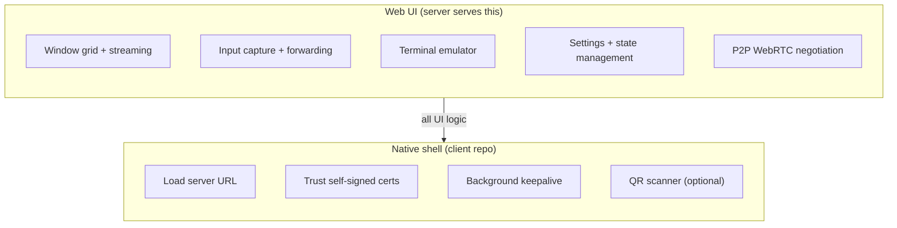

# Client Apps

Native client applications for openhort live in a separate repository: [`openhort/openhort-clients`](https://github.com/openhort/openhort-clients).

## Principles

### Thin shell, not a second UI

Clients are WebView wrappers. They load the server's Quasar/Vue 3 SPA and display it fullscreen. **No UI logic is duplicated in native code.** If a feature can be implemented in the web UI, it must be — native code only handles what the WebView cannot.

### Server and clients are decoupled

The server releases twice a week. Clients release every ~2 months. This works because:

- Clients load the UI from the server at runtime — they don't bundle it
- Server API changes are backwards-compatible (WebSocket message types are additive)
- The client's only contract with the server is: load a URL, allow WebSockets, handle self-signed certs

### One repo for all platforms

All native clients (Android, iOS, macOS, Windows) live in `openhort-clients`. They share the same release cadence, the same architecture, and the same branding assets. Separate repos would be unnecessary overhead for what are essentially config files with a WebView.

### The WebView does the heavy lifting



### PWA is the baseline

Before building native apps, consider that the web UI already supports `Add to Home Screen` as a Progressive Web App. Native apps add value only when they need:

- Self-signed certificate handling (PWA cannot bypass cert errors)
- Persistent background connections (PWA lifecycle is browser-controlled)
- App Store presence (discoverability)
- Push notifications via native channels

## Repository Layout

```
openhort-clients/
├── android/              # Kotlin + WebView
├── ios/                  # Swift + WKWebView
├── macos/                # Swift + WKWebView
├── windows/              # C# + WebView2
├── shared/               # Icons, splash screens
├── docs/                 # mkdocs-material (platform guides)
└── CLAUDE.md
```

## API Surface for Clients

The native layer only needs to interact with:

| Endpoint | When | Purpose |
|----------|------|---------|
| `GET /` | App launch | Load the SPA |
| `POST /api/session` | First connect | Create session (needs auth header) |
| `GET /api/qr` | Server discovery | QR code with server URL |

Everything else (WebSocket streaming, window management, input, terminals) happens inside the WebView — the native layer doesn't need to know about it.
