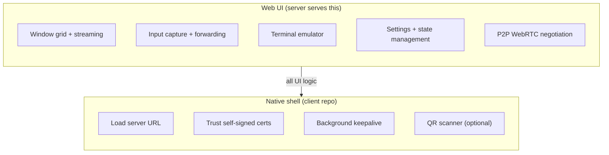
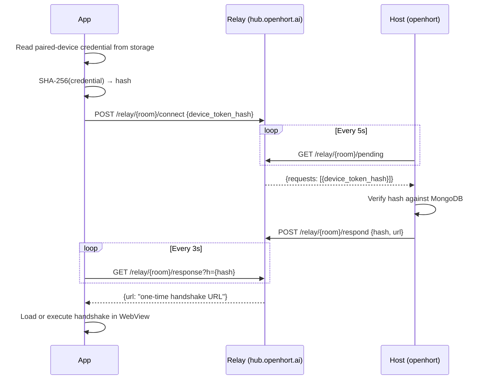

# Client Apps

Native client applications for openhort live in a separate repository: [`openhort/openhort-clients`](https://github.com/openhort/openhort-clients).

## Principles

### Shared transport stays in llming-com

OpenHort clients are consumers of the shared `llming-com` P2P/proxy transport.
Generic pairing pages, relay contracts, reconnect behavior, DataChannel proxy
framing, and the simple Cloudflare relay deployment baseline live in
`llming-com`, not in OpenHort.

OpenHort-specific client code should focus on the agent-service experience:
service discovery, isolated execution views, permissions, rendering, and native
shell integration.  If a mobile, web, or native client needs to pair, reconnect,
or create a proxy/P2P handshake, it should use the same `llming-com` credential
and endpoint contract as every other llming application.

The deployment-neutral host contract is:

```text
endpoint + admission key + same transport client
```

Switching between the managed OpenHort service and a private deployment should
only change endpoint/key configuration.

### Thin shell, not a second UI

Clients are WebView wrappers. They load the server's Quasar/Vue 3 SPA and display it fullscreen. **No UI logic is duplicated in native code.** If a feature can be implemented in the web UI, it must be — native code only handles what the WebView cannot.

### Server and clients are decoupled

The server releases twice a week. Clients release every ~2 months. This works because:

- Clients load the UI from the server at runtime — they don't bundle it
- Server API changes are backwards-compatible (WebSocket message types are additive)
- The client's only contract with the server is: load a URL, allow WebSockets, handle self-signed certs

### One repo for all platforms

All native clients (Android, iOS, macOS, Windows) live in `openhort-clients`. They share the same release cadence, the same architecture, and the same branding assets. Separate repos would be unnecessary overhead for what are essentially config files with a WebView.

### The WebView does the heavy lifting



### PWA is the baseline

Before building native apps, consider that the web UI already supports `Add to Home Screen` as a Progressive Web App. Native apps add value only when they need:

- Self-signed certificate handling (PWA cannot bypass cert errors)
- Persistent background connections (PWA lifecycle is browser-controlled)
- App Store presence (discoverability)
- Push notifications via native channels

## Repository Layout

```
openhort-clients/
├── android/              # Kotlin + WebView
├── ios/                  # Swift + WKWebView
├── macos/                # Swift + WKWebView
├── windows/              # C# + WebView2
├── shared/               # Icons, splash screens
├── docs/                 # mkdocs-material (platform guides)
└── CLAUDE.md
```

## API Surface for Clients

The native layer only needs to interact with:

| Endpoint | When | Purpose |
|----------|------|---------|
| `GET /` | App launch | Load the SPA |
| `POST /api/session` | First connect | Create session (needs auth header) |
| `GET /api/qr` | Server discovery | QR code with server URL |

Everything else (WebSocket streaming, window management, input, terminals) happens inside the WebView — the native layer doesn't need to know about it.

## Deep Linking

Both apps register the `openhort://` URL scheme for native handoff, but QR codes
for browser-based pairing should prefer an HTTPS URL with an opaque fragment
token:

```text
https://openhort.ai/p2p/pair#pt=<opaque-pairing-token>
```

The pairing page redeems that token, stores the returned paired-device
credential, and redirects to a stable app URL:

```text
https://openhort.ai/p2p/app
```

The stable URL contains no secrets.  It can be reloaded, bookmarked, restored
after phone sleep, or loaded inside a WebView.  It reads stored credentials and
requests a fresh handshake when the user connects.

**Android** — intent-filter on `MainActivity`:
```xml
<intent-filter>
    <action android:name="android.intent.action.VIEW" />
    <category android:name="android.intent.category.DEFAULT" />
    <category android:name="android.intent.category.BROWSABLE" />
    <data android:scheme="openhort" />
</intent-filter>
```

**iOS** — `CFBundleURLTypes` in `Info.plist`:
```xml
<key>CFBundleURLTypes</key>
<array><dict>
    <key>CFBundleURLSchemes</key>
    <array><string>openhort</string></array>
</dict></array>
```

**Supported deep links:**

| URL | Action |
|-----|--------|
| `openhort://pair?pt=...` | Native handoff for opaque pairing-token redemption |
| `https://openhort.ai/p2p/pair#pt=...` | Browser/WebView pairing-token redemption |
| `https://openhort.ai/p2p/app` | Stable paired-device app shell |

The app stores the returned pairing record permanently, preferably in secure
platform storage.  At minimum the record contains the paired-device credential,
room or service identifier, relay endpoint, expiry/revocation metadata, and
display metadata returned after pairing.  On every launch, it requests a fresh
handshake through the shared transport rather than reusing an old P2P URL. See
[Device Tokens](../internals/security/device-tokens.md) for the security model.

Credential categories are shared between browser and native clients:

| Credential | Stored by | Purpose |
|------------|-----------|---------|
| Opaque pairing token | QR/deep link only | Short-lived bootstrap credential, single-use |
| Paired-device credential | Browser IndexedDB or native secure storage | Lets the same device request future handshakes |
| One-time connection token | Handshake response only | Authorizes one WebRTC/proxy connection |
| Reconnect grant | Browser/native storage | Lets reload, sleep, and short network loss recover without rescanning |

## QR Scanner

Both apps include a built-in QR code scanner on the setup screen.

- **Android**: `com.journeyapps:zxing-android-embedded` (Apache 2.0). Custom `QRScanActivity` with visible close button and non-immersive mode for emulator compatibility.
- **iOS**: Native `AVFoundation` (`AVCaptureMetadataOutput` for QR detection). Wrapped as `QRScannerView` (`UIViewControllerRepresentable`).

The scanner auto-detects the code type:

| Content | Detected as | Action |
|---------|------------|--------|
| `https://.../p2p/pair#pt=...` | P2P pairing | Redeem opaque token, save paired-device credential |
| `openhort://pair?pt=...` | P2P pairing | Redeem opaque token, save paired-device credential |
| `https://192.168.x.x:...` | LAN server | Direct WebView load |
| `https://hub.openhort.ai/t/...` | Cloud proxy | Direct WebView load |
| Any other URL | Generic server | Direct WebView load |

Users can also paste links manually in the text field — same detection logic applies.

## Native Bridge Protocol

When the SPA detects it's running inside a native app (`window.openhort?.send` exists), it hides its own navigation chrome (header bar, sidebar) and delegates all UI to the native shell via JSON messages.

### Detection

```javascript
if (window.openhort && typeof window.openhort.send === 'function') {
  state.nativeApp = true;
}
```

### `nav.update` — Web → Native

Sent on every view change. The native app renders the toolbar and drawer from this data.

```json
{
  "type": "nav.update",
  "topbar": {
    "title": "Desktop",
    "subtitle": "14 fps",
    "color": "",
    "showBack": true,
    "actions": [{ "id": "fullscreen", "icon": "fullscreen", "label": "" }]
  },
  "drawer": {
    "header": { "title": "openhort", "subtitle": "v0.1.0" },
    "items": [
      { "id": "home", "type": "item", "title": "Home", "icon": "house", "command": "view:picker" },
      { "type": "divider" },
      { "type": "header", "title": "Connectors" },
      { "id": "conn-lan", "type": "item", "title": "LAN", "icon": "wifi_high",
        "badge": "on", "badgeColor": "#4CAF50", "command": "panel:lan" },
      { "id": "conn-p2p", "type": "item", "title": "P2P", "icon": "arrows_left_right",
        "command": "panel:p2p" }
    ]
  },
  "theme": {
    "mode": "dark",
    "bg": "#0a0e1a",
    "surface": "#111827",
    "primary": "#3b82f6",
    "text": "#f0f4ff",
    "textDim": "#94a3b8",
    "logoSvg": "<svg>...</svg>"
  }
}
```

**`theme`** is only sent on the first `nav.update`. Native apps apply the CSS variables to their toolbar, drawer, status bar, and navigation bar. The `logoSvg` is the animated OpenHORT logo, rendered in a small WebView in the toolbar and drawer header.

**`topbar.showBack`**: When `true`, the toolbar shows a back arrow (sends `command: "back"`). When `false`, it shows the hamburger menu and the animated logo.

### Drawer item schema

| Field | Type | Description |
|-------|------|-------------|
| `id` | string | Unique ID |
| `type` | string | `"item"`, `"divider"`, `"header"` |
| `title` | string | Display text |
| `subtitle` | string? | Secondary text |
| `icon` | string? | Phosphor icon name (mapped to Material/SF Symbols natively) |
| `iconBase64` | string? | Inline base64 data URI for custom icons |
| `badge` | string? | Badge text |
| `badgeColor` | string? | Badge background color hex |
| `disabled` | bool? | Grayed out, not clickable |
| `command` | string? | Sent back to SPA when tapped |

### `nav.action` — Native → Web

When the user taps a drawer item, topbar action, or back button:

```json
{
  "type": "nav.action",
  "command": "view:picker"
}
```

The `command` string is opaque to the native app — it echoes back whatever the SPA set. Exception: `"logout"` is handled natively (clears prefs, returns to setup screen).

## P2P Auto-Reconnect

In `p2p_paired` mode, the app always requests a fresh handshake on every launch
or reconnect.  The browser reference implementation lives in
`llming-com/llming_com/static/p2p/`; native clients should mirror the same state
machine using secure platform storage.



The app never reuses old P2P URLs. Each session gets a fresh one-time SDP/proxy
token. The paired-device credential stays in app storage until explicit logout,
expiry, or server-side revocation.

## Extensibility Points

OpenHort clients should be configurable through narrow adapters instead of
forking transport code:

| Adapter | Responsibility |
|---------|----------------|
| Client shell | Browser page, PWA, WebView, or native wrapper |
| Credential store | IndexedDB/WebCrypto/cookie storage in browsers; Keychain/Keystore/secure storage natively |
| Endpoint resolver | Managed endpoint, private relay endpoint, or test relay endpoint |
| Service catalog | OpenHort-specific list of available isolated services and capabilities |
| Admission provider | Host-side key/quota policy behind the endpoint, not a client concern |
| Renderer/viewer | OpenHort UI for terminal, desktop, workflows, and agent-service output |

The OpenHort mobile app should only need the endpoint, pairing token or login,
and stored paired-device credential.  The host/app development side remains the
same whether the endpoint is commercial or private.
