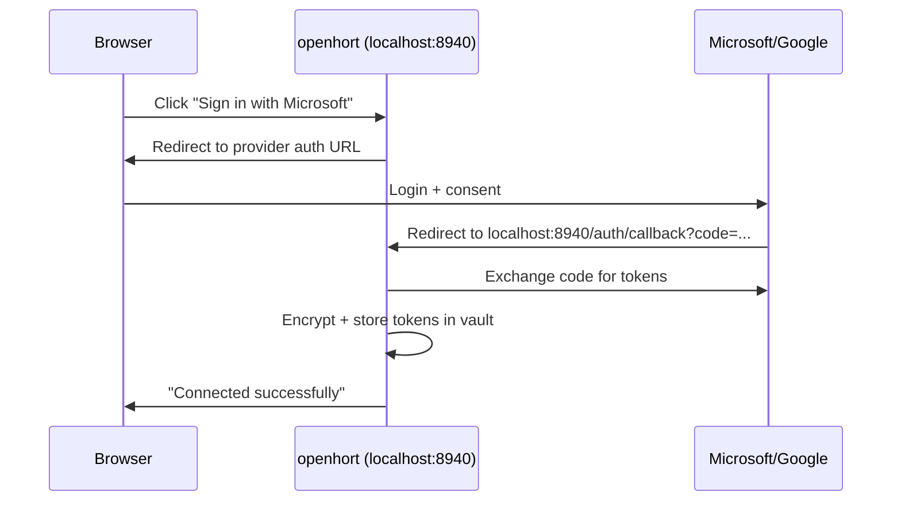
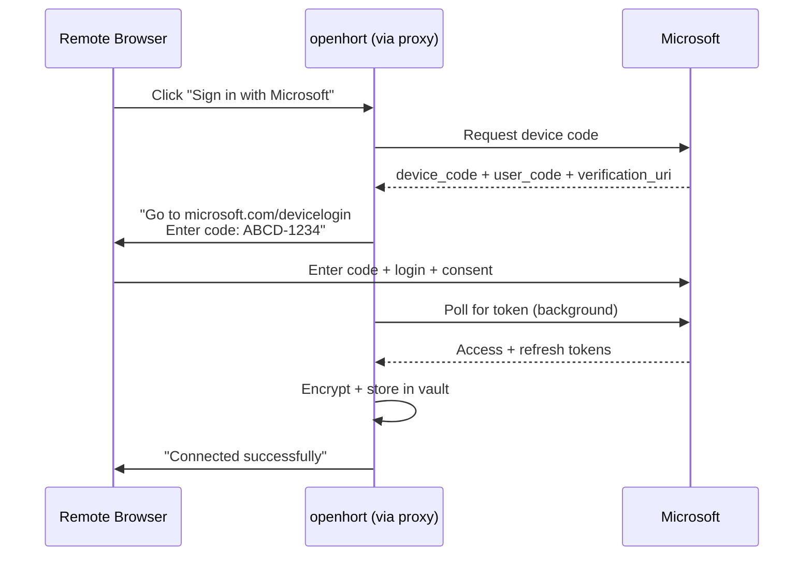

# Credential Management

Unified credential system for all llmings — secure storage, standard UI, OAuth flows, expiry notifications.

## Architecture

```
┌──────────────────────────────────────────────────────┐
│ 🏠 Host                                              │
│                                                       │
│  ┌─────────────┐    ┌──────────────────────────────┐ │
│  │ Llming A     │    │ CredentialManager            │ │
│  │ (needs OAuth)│──→ │  .get(llming, name) → value  │ │
│  └─────────────┘    │  .set(llming, name, value)   │ │
│  ┌─────────────┐    │  .validate(llming, name)     │ │
│  │ Llming B     │──→ │  .revoke(llming, name)      │ │
│  │ (needs key)  │    │  .list_expired() → [...]    │ │
│  └─────────────┘    │                              │ │
│  ┌─────────────┐    │  Storage: encrypted SQLite   │ │
│  │ Llming C     │──→ │  at ~/.openhort/vault.db    │ │
│  │ (user+pass)  │    │  Key: OS keychain           │ │
│  └─────────────┘    └──────────┬───────────────────┘ │
│                                │                      │
│  ┌─────────────────────────────┼────────────────────┐ │
│  │ UI (Quasar SPA)             │                     │ │
│  │  ┌────────────────┐  ┌──────┴───────┐            │ │
│  │  │ Setup Wizards  │  │ Notification │            │ │
│  │  │ (per cred type)│  │ Center       │            │ │
│  │  └────────────────┘  └──────────────┘            │ │
│  └───────────────────────────────────────────────────┘ │
└──────────────────────────────────────────────────────┘
```

## Credential Types

Each llming declares what credentials it needs in its manifest:

```json
{
  "name": "office365",
  "credentials": [
    {
      "id": "microsoft_oauth",
      "type": "oauth2",
      "label": "Microsoft Account",
      "provider": "microsoft",
      "scopes": ["Mail.Read", "Mail.Send", "Calendar.ReadWrite"],
      "required": true
    }
  ]
}
```

### Supported Types

| Type | UI Component | Validation | Example |
|---|---|---|---|
| `oauth2` | "Sign in with..." button → browser redirect | Token exchange + profile fetch | Microsoft, Google |
| `api_key` | Single input field + "Verify" button | HEAD/GET to test endpoint | Anthropic, OpenAI |
| `username_password` | Two fields + "Login" button | POST to auth endpoint | SAP, LDAP |
| `connection_string` | Host + port + optional auth fields | TCP connect + handshake | Database, MQTT |
| `bearer_token` | Paste field + "Verify" button | GET with Authorization header | GitHub, Slack |
| `keychain` | Auto-read from OS credential store | Check if entry exists | Claude Code |

### Manifest Schema

```json
{
  "credentials": [
    {
      "id": "unique_id",
      "type": "oauth2 | api_key | username_password | connection_string | bearer_token | keychain",
      "label": "Human-readable name",
      "required": true,
      "provider": "microsoft",
      "scopes": ["scope1", "scope2"],
      "validate_url": "https://api.example.com/me",
      "validate_method": "GET",
      "placeholder": "sk-...",
      "help_url": "https://docs.example.com/api-keys",
      "expires": true,
      "refresh_supported": true,
      "remote_update": false
    }
  ]
}
```

## Storage

### Encrypted SQLite

Credentials stored in `~/.openhort/vault.db`:

```sql
CREATE TABLE credentials (
    id TEXT PRIMARY KEY,                -- llming:credential_id (e.g. "work-email:microsoft_oauth")
    llming_name TEXT NOT NULL,          -- "work-email"
    credential_id TEXT NOT NULL,        -- "microsoft_oauth"
    credential_type TEXT NOT NULL,      -- "oauth2"
    encrypted_value BLOB NOT NULL,     -- Fernet-encrypted JSON
    created_at TEXT NOT NULL,
    updated_at TEXT NOT NULL,
    expires_at TEXT,                    -- NULL = never expires
    status TEXT DEFAULT 'valid',       -- valid | expired | revoked | error
    metadata TEXT                       -- JSON: provider, scopes, etc.
);
```

### Encryption

- **Key derivation:** PBKDF2 from a master password stored in the OS keychain
- **Encryption:** Fernet (AES-128-CBC + HMAC-SHA256)
- **Key rotation:** Re-encrypt all values when master key changes

```python
class CredentialVault:
    """Encrypted credential storage."""
    
    def __init__(self, db_path: Path = DEFAULT_VAULT_PATH):
        self._db = db_path
        self._key = self._get_or_create_master_key()
        self._fernet = Fernet(self._key)
    
    def store(self, llming: str, cred_id: str, value: dict) -> None:
        """Encrypt and store a credential."""
    
    def retrieve(self, llming: str, cred_id: str) -> dict | None:
        """Decrypt and return a credential, or None."""
    
    def list_for_llming(self, llming: str) -> list[CredentialInfo]:
        """List credentials for a llming (no decryption)."""
    
    def list_expired(self) -> list[CredentialInfo]:
        """List all expired/errored credentials."""
    
    def revoke(self, llming: str, cred_id: str) -> None:
        """Mark as revoked and clear the value."""
```

### Access Control

Llmings NEVER access the vault directly:

```python
class CredentialManager:
    """Proxy between llmings and the vault. Enforces access control."""
    
    def get(self, llming_name: str, credential_id: str) -> str | dict | None:
        """Get a credential for THIS llming only."""
        # Verify the llming is allowed to access this credential
        # Decrypt and return
    
    def request_update(self, llming_name: str, credential_id: str) -> None:
        """Signal that a credential needs re-authentication."""
        # Adds to notification center
```

The `CredentialManager` is injected into `PluginContext` — a llming can only access its own credentials.

## YAML Configuration

### Multiple Instances

```yaml
llmings:
  work-email:
    type: microsoft/office365
    config:
      tenant: company.onmicrosoft.com
    credentials:
      - id: ms_oauth
        type: oauth2
        provider: microsoft
        scopes: [Mail.Read, Mail.Send, Calendar.ReadWrite]

  personal-email:
    type: microsoft/office365
    config:
      tenant: common
    credentials:
      - id: ms_oauth
        type: oauth2
        provider: microsoft
        scopes: [Mail.Read]

  claude:
    type: openhort/claude-code
    config:
      model: claude-sonnet-4-6
    credentials:
      - id: anthropic
        type: keychain
        service: "Claude Code-credentials"

  sap:
    type: sap/connector
    credentials:
      - id: sap_login
        type: username_password
        validate_url: https://sap.internal:8443/api/auth
      - id: sap_api
        type: api_key
        validate_url: https://sap.internal:8443/api/health
```

### Credential Reference in Config

Llmings reference credentials by ID, resolved at runtime:

```yaml
llmings:
  my-service:
    type: custom/service
    config:
      api_key: credential:my_api_key    # resolved from vault
      host: sap.internal
```

## UI Components

### Setup Wizard

When a llming needs credentials, the UI shows a professional setup dialog:

```
┌─────────────────────────────────────────────┐
│  🔐 Set up: Work Email                      │
│                                              │
│  Microsoft Account                           │
│  ┌─────────────────────────────────────────┐ │
│  │     Sign in with Microsoft     →        │ │
│  └─────────────────────────────────────────┘ │
│                                              │
│  Scopes: Mail, Calendar, Contacts            │
│  Status: Not configured                      │
│                                              │
│  [Skip]                     [Sign in]        │
└─────────────────────────────────────────────┘
```

For API keys:

```
┌─────────────────────────────────────────────┐
│  🔐 Set up: Anthropic API                   │
│                                              │
│  API Key                                     │
│  ┌─────────────────────────────────────────┐ │
│  │ sk-ant-...                              │ │
│  └─────────────────────────────────────────┘ │
│  Get your key at console.anthropic.com →     │
│                                              │
│  [Cancel]                    [Verify & Save] │
└─────────────────────────────────────────────┘
```

### Notification Center

Expired or invalid credentials show in a notification bar:

```
┌─────────────────────────────────────────────┐
│ ⚠ 2 credentials need attention              │
│                                              │
│  🔴 Work Email — OAuth token expired         │
│     [Re-authenticate]                        │
│                                              │
│  🟡 SAP — Connection failed                  │
│     [Retry] [Edit credentials]               │
└─────────────────────────────────────────────┘
```

Notifications appear in:
- The SPA toolbar (bell icon with badge count)
- Status bar (macOS native)
- Telegram (if configured: `/credentials` command)

### Remote Update Policy

Per-credential configuration:

```json
{
  "remote_update": false
}
```

- `false` (default) — credentials can only be updated on the host machine (localhost)
- `true` — credentials can be updated via cloud proxy or P2P

OAuth2 redirects always require localhost (browser redirect to `localhost:8940/auth/callback`). API keys and passwords can optionally be entered remotely.

## OAuth2 Flow

### Local (Localhost)



### Remote (Cloud Proxy / P2P)

OAuth redirects CANNOT go through the proxy (multi-tenant callback interception risk). Remote users use device code flow:



## Credential Health Checks

Periodic background checks for credential validity:

```python
class CredentialHealthChecker:
    """Runs every 5 minutes, checks token expiry and endpoint health."""
    
    async def check_all(self) -> list[CredentialAlert]:
        alerts = []
        for cred in vault.list_all():
            if cred.expires_at and cred.expires_at < now + timedelta(hours=1):
                # Try refresh first
                if cred.refresh_supported:
                    success = await self._try_refresh(cred)
                    if success:
                        continue
                alerts.append(CredentialAlert(
                    llming=cred.llming_name,
                    credential_id=cred.credential_id,
                    status="expiring",
                    message=f"Expires in {time_until(cred.expires_at)}",
                ))
        return alerts
```

## Integration with office-connect

office-connect is added as a dependency and provides the Microsoft OAuth implementation:

```yaml
llmings:
  work-email:
    type: openhort/office365
    credentials:
      - id: ms_oauth
        type: oauth2
        provider: microsoft
        scopes: [Mail.Read, Mail.Send, Calendar.ReadWrite]
```

The `openhort/office365` llming wraps office-connect's `OfficeUserInstance`:

```python
class Office365Plugin(PluginBase, MCPMixin):
    def activate(self, config):
        cred = self.credentials.get("ms_oauth")
        if cred:
            self._office = OfficeUserInstance(token=cred["access_token"])
```

## Implementation Files

```
hort/
  credentials/
    __init__.py
    vault.py              # CredentialVault (encrypted SQLite + Fernet)
    manager.py            # CredentialManager (access control proxy)
    health.py             # CredentialHealthChecker (background validation)
    types.py              # CredentialType enum, CredentialInfo, CredentialAlert
    oauth.py              # OAuth2 flow handler (redirect + device code)
  ext/
    plugin.py             # Add credentials to PluginContext
  static/
    index.html            # Add notification center + setup dialogs
  extensions/core/
    office365/            # New: office-connect wrapper llming
```
