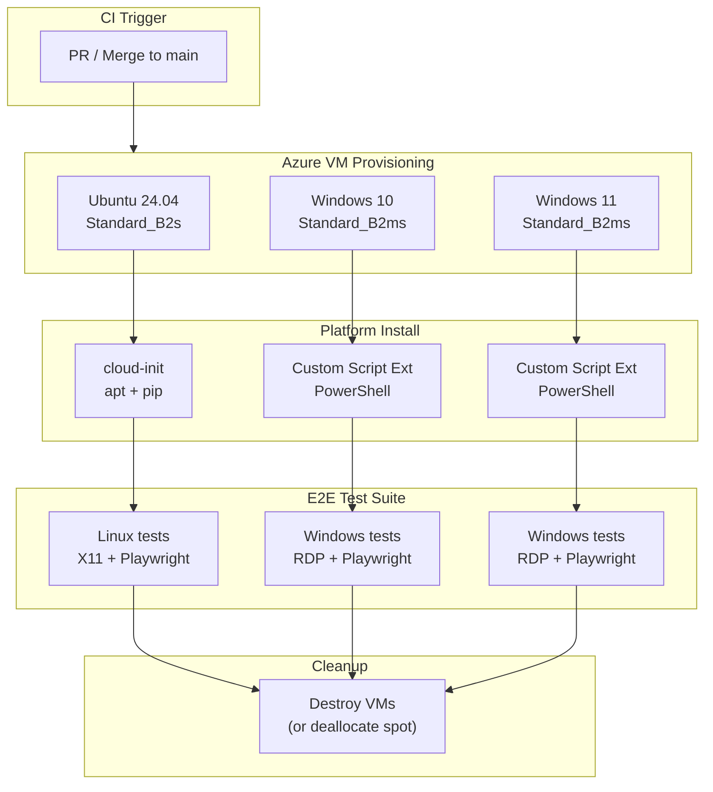
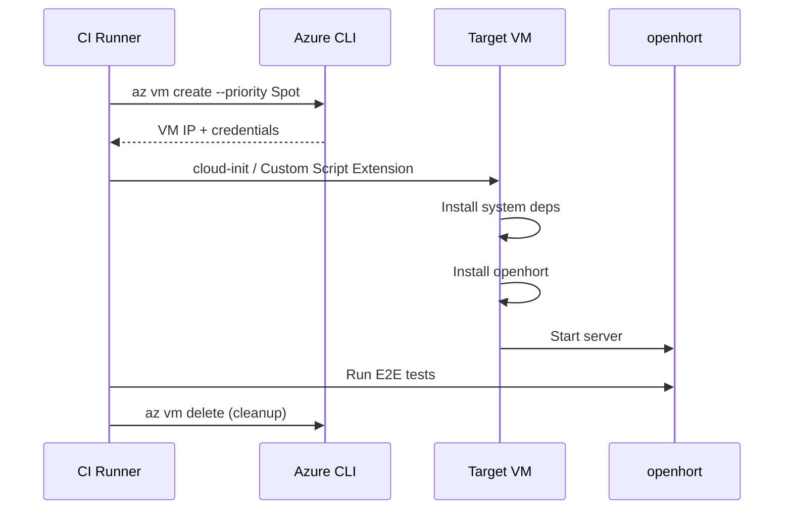
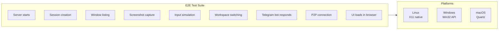
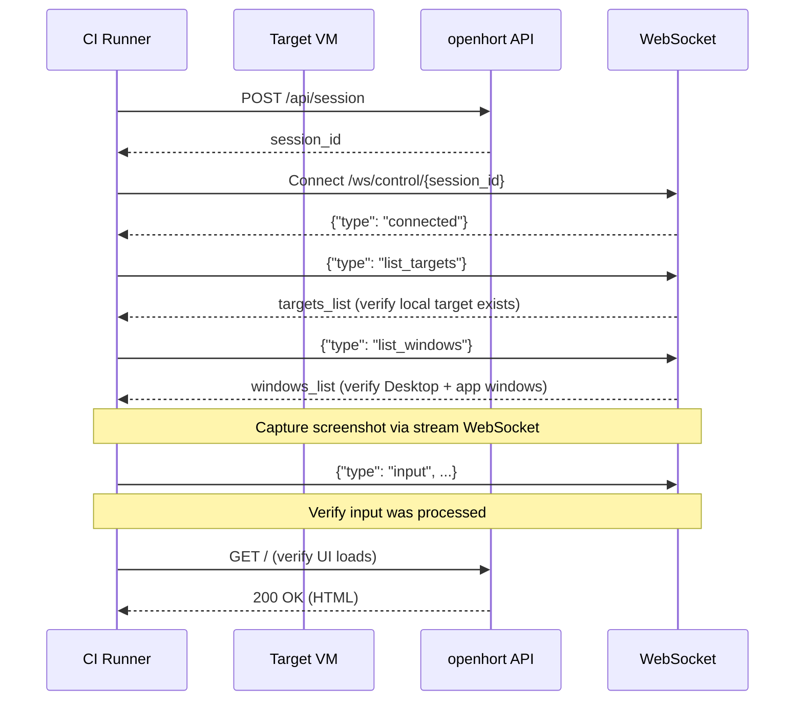
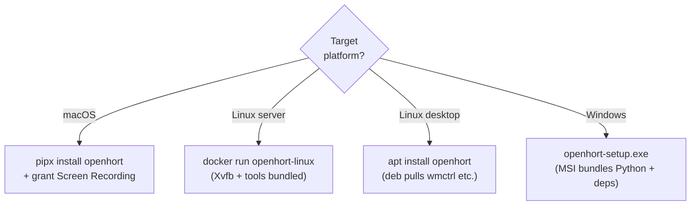
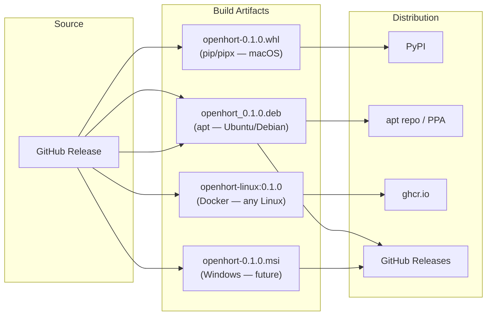

# Cross-Platform Testing & Distribution

Strategy for provisioning test environments on Azure, running end-to-end tests, and distributing openhort to Linux and Windows.

## Overview



## Part A: Azure VM Provisioning

### VM Images & Sizes

| OS | Image URN | Size | ~Cost/hr |
|----|-----------|------|----------|
| Ubuntu 24.04 | `Canonical:ubuntu-24_04-lts:server:latest` | `Standard_B2s` (2 vCPU, 4 GB) | ~$0.04 |
| Windows 10 | `MicrosoftWindowsDesktop:windows-10:win10-22h2-pro-g2:latest` | `Standard_B2ms` (2 vCPU, 8 GB) | ~$0.08 |
| Windows 11 | `MicrosoftWindowsDesktop:windows-11:win11-24h2-pro:latest` | `Standard_B2ms` (2 vCPU, 8 GB) | ~$0.08 |

!!! note "Spot instances"
    Spot pricing (`--priority Spot`) is 60-90% cheaper but B-series availability varies by region. Use `SPOT=1` with the provisioning script when available. The scripts default to pay-as-you-go for reliability.

!!! warning "Windows Desktop Licensing"
    Windows 10/11 desktop images from `MicrosoftWindowsDesktop` require a Visual Studio subscription. For CI/CD, Windows Server with Desktop Experience is an alternative that doesn't require VS licensing.

### Accessing the VM Desktop

Every test VM gets a desktop environment accessible via RDP. This allows manual inspection of what openhort sees and captures.

| OS | Remote Access | Port | Desktop |
|----|--------------|------|---------|
| Ubuntu | xrdp (RDP protocol) | 3389 | XFCE |
| Windows 10/11 | Native RDP | 3389 | Windows Desktop |

Connect with any RDP client (Microsoft Remote Desktop on macOS, `mstsc` on Windows, Remmina on Linux).

The Ubuntu VM also runs a Xvfb virtual framebuffer on `:10` that openhort captures. When you RDP in, you get an independent XFCE session — the openhort-visible desktop runs headless on `:10`.

### Provisioning Flow



### Linux Provisioning (cloud-init)

```yaml title="cloud-init-ubuntu.yml"
#cloud-config
package_update: true
packages:
  - python3.12
  - python3.12-venv
  - python3-pip
  - xvfb
  - fluxbox
  - wmctrl
  - xdotool
  - imagemagick
  - x11-utils
  - x11-apps

write_files:
  - path: /opt/openhort/install.sh
    permissions: '0755'
    content: |
      #!/bin/bash
      set -e
      python3.12 -m venv /opt/openhort/venv
      source /opt/openhort/venv/bin/activate
      pip install git+https://github.com/Alyxion/llming-com.git@main
      pip install git+https://github.com/openhort/openhort.git@main
      # Or from a release artifact:
      # pip install openhort-0.1.0-py3-none-any.whl

  - path: /etc/systemd/system/openhort.service
    content: |
      [Unit]
      Description=openhort server
      After=network.target

      [Service]
      Type=simple
      Environment=DISPLAY=:99
      Environment=LLMING_AUTH_SECRET=test-secret
      ExecStartPre=/usr/bin/Xvfb :99 -screen 0 1920x1080x24 -ac
      ExecStart=/opt/openhort/venv/bin/python -m uvicorn hort.app:app --host 0.0.0.0 --port 8940
      Restart=always

      [Install]
      WantedBy=multi-user.target

runcmd:
  - bash /opt/openhort/install.sh
  - Xvfb :99 -screen 0 1920x1080x24 -ac &
  - sleep 2
  - DISPLAY=:99 fluxbox &
  - systemctl enable --now openhort
```

```bash title="Provision command"
az vm create \
  --resource-group openhort-ci-rg \
  --name test-ubuntu \
  --image Canonical:ubuntu-24_04-lts:server-gen2:latest \
  --size Standard_B2s \
  --priority Spot --eviction-policy Delete --max-price -1 \
  --admin-username azureuser \
  --generate-ssh-keys \
  --custom-data cloud-init-ubuntu.yml \
  --nsg-rule SSH \
  --output json
```

### Windows Provisioning (Custom Script Extension)

```powershell title="setup-windows.ps1"
# Install Python 3.12
winget install Python.Python.3.12 --accept-package-agreements --accept-source-agreements
$env:PATH += ";$env:LOCALAPPDATA\Programs\Python\Python312;$env:LOCALAPPDATA\Programs\Python\Python312\Scripts"

# Install openhort
python -m pip install --upgrade pip
python -m pip install git+https://github.com/Alyxion/llming-com.git@main
python -m pip install git+https://github.com/openhort/openhort.git@main

# Create startup script
@"
cd C:\openhort
set LLMING_AUTH_SECRET=test-secret
python -m uvicorn hort.app:app --host 0.0.0.0 --port 8940
"@ | Out-File -FilePath "C:\openhort\start.bat" -Encoding ASCII

# Open firewall
New-NetFirewallRule -DisplayName "openhort" -Direction Inbound -Port 8940 -Protocol TCP -Action Allow

# Start openhort
Start-Process -FilePath "C:\openhort\start.bat" -WindowStyle Hidden
```

```bash title="Apply after VM creation"
az vm extension set \
  --resource-group openhort-ci-rg \
  --vm-name test-win11 \
  --name CustomScriptExtension \
  --publisher Microsoft.Compute \
  --settings '{"commandToExecute": "powershell -ExecutionPolicy Bypass -File setup-windows.ps1"}'
```

## Part B: End-to-End Testing

### Test Matrix



### Test Runner Architecture

Tests run remotely against the provisioned VMs. The CI runner connects to each VM and executes:



### Test Script (Platform-Agnostic)

```python title="tests/test_e2e_remote.py"
"""E2E tests that run against a remote openhort instance.

Usage: OPENHORT_URL=http://<vm-ip>:8940 OPENHORT_SECRET=test-secret pytest tests/test_e2e_remote.py
"""
import os, json, asyncio, pytest, httpx, websockets

BASE = os.environ["OPENHORT_URL"]
SECRET = os.environ["OPENHORT_SECRET"]

@pytest.fixture
async def session_id():
    async with httpx.AsyncClient() as c:
        r = await c.post(f"{BASE}/api/session", json={},
                         headers={"Authorization": f"Bearer {SECRET}"})
        return r.json()["session_id"]

async def test_ui_loads():
    async with httpx.AsyncClient() as c:
        r = await c.get(BASE)
        assert r.status_code == 200
        assert "openhort" in r.text.lower()

async def test_targets_registered(session_id):
    async with websockets.connect(f"{BASE.replace('http','ws')}/ws/control/{session_id}") as ws:
        await ws.recv()  # connected
        await ws.send(json.dumps({"type": "list_targets"}))
        msg = json.loads(await asyncio.wait_for(ws.recv(), 5))
        assert msg["type"] == "targets_list"
        assert len(msg["targets"]) >= 1

async def test_windows_listed(session_id):
    async with websockets.connect(f"{BASE.replace('http','ws')}/ws/control/{session_id}") as ws:
        await ws.recv()
        await ws.send(json.dumps({"type": "list_windows"}))
        msg = json.loads(await asyncio.wait_for(ws.recv(), 5))
        assert msg["type"] == "windows_list"
        # Should have at least the Desktop entry
        desktops = [w for w in msg["windows"] if w["owner_name"] == "Desktop"]
        assert len(desktops) >= 1

async def test_screenshot_capture(session_id):
    async with websockets.connect(f"{BASE.replace('http','ws')}/ws/control/{session_id}") as ws:
        await ws.recv()
        await ws.send(json.dumps({"type": "list_windows"}))
        msg = json.loads(await asyncio.wait_for(ws.recv(), 5))
        desktop = next(w for w in msg["windows"] if w["owner_name"] == "Desktop")
        # Request thumbnail via stream WebSocket
        async with websockets.connect(
            f"{BASE.replace('http','ws')}/ws/stream/{session_id}"
        ) as stream:
            await ws.send(json.dumps({
                "type": "start_stream",
                "window_id": desktop["window_id"],
            }))
            frame = await asyncio.wait_for(stream.recv(), 10)
            assert isinstance(frame, bytes)
            assert len(frame) > 100  # valid JPEG
            assert frame[:2] == b'\xff\xd8'  # JPEG magic
```

### CI Pipeline

```yaml title=".github/workflows/e2e-cross-platform.yml (concept)"
name: Cross-Platform E2E
on:
  workflow_dispatch:  # manual trigger (VMs cost money)
  # schedule:
  #   - cron: '0 3 * * 1'  # weekly Monday 3am

jobs:
  provision-and-test:
    runs-on: ubuntu-latest
    strategy:
      fail-fast: false
      matrix:
        include:
          - os: ubuntu
            image: "Canonical:ubuntu-24_04-lts:server-gen2:latest"
            size: Standard_B2s
            init: cloud-init
          - os: windows-11
            image: "MicrosoftWindowsDesktop:windows-11:win11-24h2-pro:latest"
            size: Standard_B2ms
            init: custom-script
    steps:
      - uses: actions/checkout@v4
      - uses: azure/login@v2
        with:
          creds: ${{ secrets.AZURE_CREDENTIALS }}

      - name: Create VM
        run: |
          az vm create --resource-group openhort-ci-rg \
            --name openhort-${{ matrix.os }}-${{ github.run_id }} \
            --image "${{ matrix.image }}" \
            --size ${{ matrix.size }} \
            --priority Spot --eviction-policy Delete \
            --output json > vm.json
          echo "VM_IP=$(jq -r .publicIpAddress vm.json)" >> $GITHUB_ENV

      - name: Provision
        run: scripts/ci/provision-${{ matrix.os }}.sh $VM_IP

      - name: Wait for openhort
        run: |
          for i in $(seq 1 60); do
            curl -s http://$VM_IP:8940/ && break
            sleep 5
          done

      - name: Run E2E tests
        run: |
          OPENHORT_URL=http://$VM_IP:8940 OPENHORT_SECRET=test-secret \
            pytest tests/test_e2e_remote.py -v

      - name: Teardown
        if: always()
        run: az vm delete --name openhort-${{ matrix.os }}-${{ github.run_id }} \
               --resource-group openhort-ci-rg --yes --force-deletion
```

## Part C: Distribution Strategy

### The System Dependency Problem

openhort is not a pure Python package. Each platform requires OS-level tools:

| Platform | Python Deps | System Deps | Notes |
|----------|------------|-------------|-------|
| macOS | pyobjc-framework-Quartz, pyobjc-framework-ApplicationServices | None (frameworks are built-in) | Needs Screen Recording permission |
| Linux | Pillow, etc. | wmctrl, xdotool, imagemagick, xvfb (headless) | Must be installed via apt/dnf |
| Windows | pyautogui or ctypes (future) | None (Win32 API built-in) | Needs active desktop session |

This means `pip install openhort` alone will never be enough on Linux. The question is: what's the right packaging for each platform?

### Decision Matrix



### Recommended: Per-Platform Packaging

=== "Linux: Docker (primary)"

    Docker is the **primary Linux distribution** because it bundles all system deps and provides a consistent environment. Already implemented.

    ```bash
    docker run -d --network=host \
      -e LLMING_AUTH_SECRET=changeme \
      openhort/openhort-linux:latest
    ```

    **Pros:** Zero system dep management, reproducible, works on any Docker host.
    **Cons:** Requires Docker, captures container desktop (not host desktop).

=== "Linux: deb package"

    For users who want openhort to capture their **host desktop** (not a container), a deb package handles system deps via apt:

    ```
    openhort_0.1.0_amd64.deb
    ├── DEBIAN/
    │   ├── control          # Depends: python3.12, wmctrl, xdotool, imagemagick
    │   └── postinst         # Creates venv, installs Python deps
    ├── opt/openhort/        # Application files
    └── etc/systemd/system/
        └── openhort.service # systemd unit
    ```

    Build with `fpm`:
    ```bash
    fpm -s python -t deb \
      --depends python3.12 --depends wmctrl --depends xdotool --depends imagemagick \
      --after-install scripts/postinst.sh \
      --name openhort --version 0.1.0 \
      .
    ```

=== "macOS: pipx"

    macOS needs no system packages (pyobjc bundles the framework bindings). Pure `pipx` works:

    ```bash
    pipx install openhort
    # Then grant Screen Recording permission to Terminal
    ```

    The entry point `hort` is already defined in `pyproject.toml`.

=== "Windows: installer (future)"

    Windows support requires a `WindowsNativeExtension` (not yet built). When ready, distribute as a bundled installer:

    ```
    openhort-setup.exe
    ├── Python 3.12 (embedded)
    ├── openhort + all Python deps
    └── Startup shortcut + Windows Service option
    ```

    Build with PyInstaller + Inno Setup or cx_Freeze + WiX.

### Why Not Pure pip?

| Approach | Works? | Why not sufficient |
|----------|--------|--------------------|
| `pip install openhort` | Partially | Missing wmctrl, xdotool, imagemagick on Linux. User must install manually. |
| `pipx install openhort` | macOS only | Same system dep problem on Linux. Works on macOS because pyobjc is pip-installable. |
| `snap install openhort` | Possible | Good sandboxing but snap confinement blocks Docker socket and X11 in strict mode. Classic confinement requires Snap Store approval. |
| `flatpak install openhort` | Possible | Good for desktop Linux but overkill for a server tool. Portal permissions add complexity. |

### Build Artifact Matrix



### Recommended Phased Rollout

| Phase | Scope | Distribution | Priority |
|-------|-------|-------------|----------|
| **1 (now)** | Linux in Docker | `docker run` / `docker compose` | Done |
| **2** | macOS native | `pipx install` from PyPI | High |
| **3** | Linux native (deb) | `.deb` on GitHub Releases or PPA | Medium |
| **4** | Windows native | `.msi` on GitHub Releases | Future (needs Windows provider) |
| **5** | CI/CD pipeline | GitHub Actions with Azure VMs | Medium |

## Key Files

| File | Purpose |
|------|---------|
| `scripts/ci/provision-ubuntu.sh` | One-command Ubuntu VM provisioning |
| `scripts/ci/cloud-init-ubuntu-desktop.yml` | Ubuntu cloud-init (XFCE + xrdp + openhort) |
| `deploy/linux/Dockerfile` | Docker distribution (Linux) |
| `deploy/linux/docker-compose.yml` | One-command Docker deployment |
| `deploy/linux/entrypoint.sh` | Container startup (Xvfb + server) |
| `hort/extensions/core/linux_native/` | Native Linux platform provider |
| `hort/extensions/core/peer2peer/azure_vm.py` | Existing Azure VM provisioning (reusable) |
| `scripts/deploy-access.sh` | Azure App Service deployment (reference) |
| `tests/test_e2e_remote.py` | Cross-platform E2E tests (to be created) |
