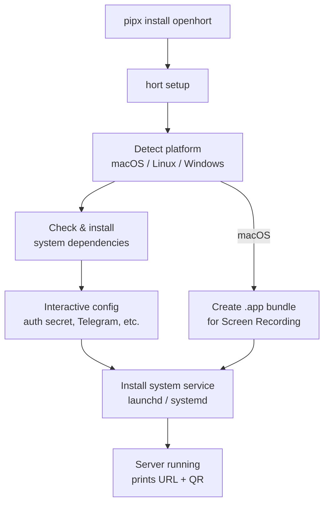
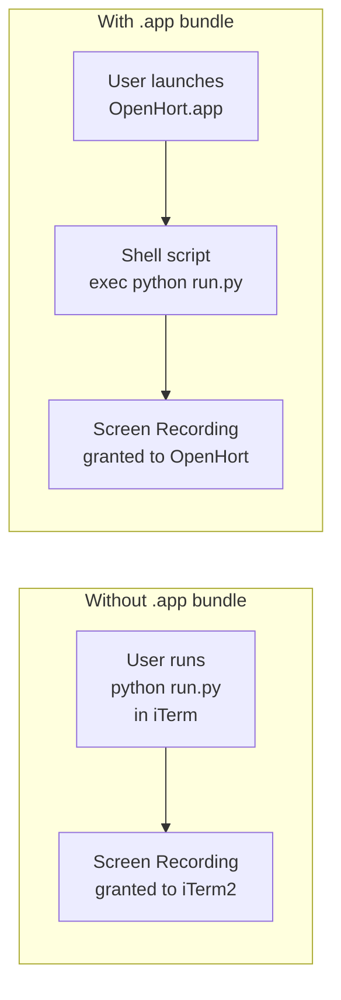
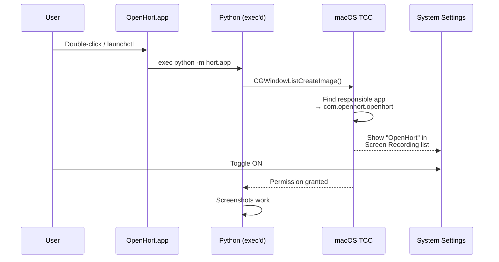
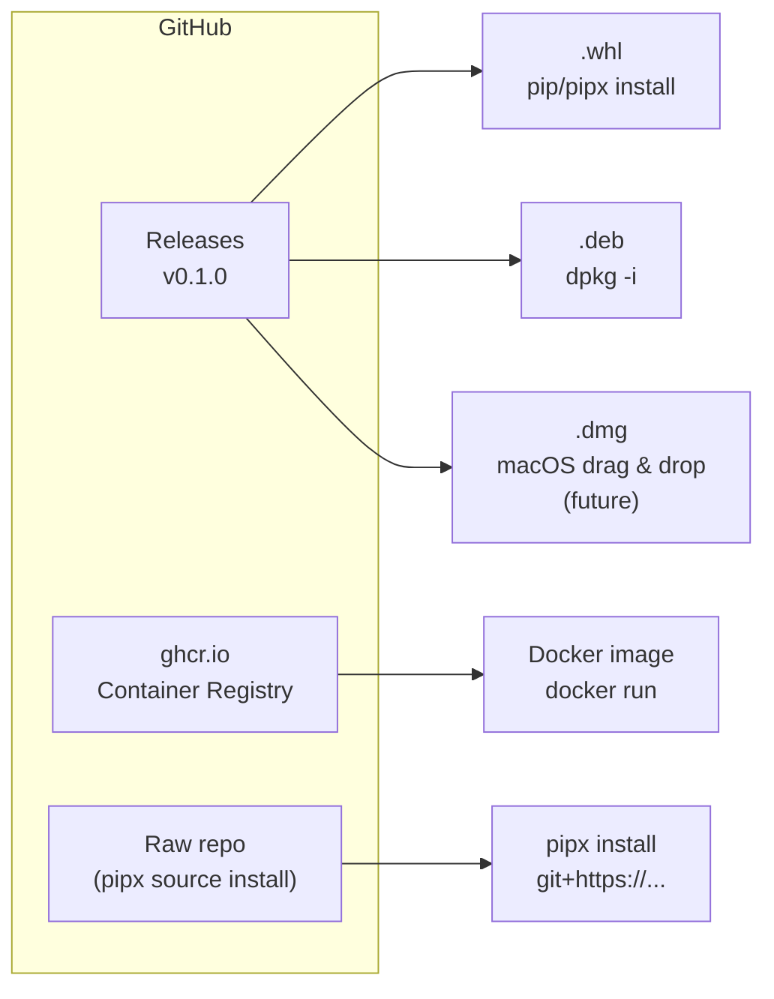

# Distribution & Installation

How openhort is packaged, installed, and configured across platforms. Covers the CLI installer, macOS app bundle for Screen Recording permissions, and per-platform packaging.

## Design Decisions

Key facts and decisions that inform the distribution strategy.

### Distribution is GitHub-only

No PyPI, no PPA, no external registries. All artifacts (wheels, debs, Docker images) are hosted on GitHub Releases and `ghcr.io`. This keeps infrastructure simple and avoids maintaining accounts on multiple package registries.

### pipx, not pip

openhort is a CLI tool, not a library. `pipx` installs it into an isolated venv with the `hort` command on PATH — like `npm install -g` for Python. `pip install` pollutes the system environment and risks dependency conflicts. pipx comes pre-installed on Ubuntu 23.04+ and is available via Homebrew.

### Pure Python is not enough

openhort is **not** a pure Python package. Each platform requires OS-level tools that pip cannot install:

| Platform | Python deps (pip handles) | System deps (pip cannot) |
|----------|--------------------------|--------------------------|
| macOS | pyobjc-framework-Quartz, pyobjc-framework-ApplicationServices | None (frameworks built-in). Needs Screen Recording permission. |
| Linux | Pillow, FastAPI, etc. | `wmctrl`, `xdotool`, `imagemagick`, `xvfb` (headless) |
| Windows (future) | pyautogui or ctypes | None (Win32 API built-in). Needs active desktop session. |

This is why `hort setup` exists — it detects the platform and installs system dependencies interactively, bridging the gap that pip cannot.

### macOS Screen Recording goes to the wrong app

macOS grants Screen Recording permission to **the .app bundle** that owns the calling process. When running from iTerm/Terminal, the permission goes to iTerm — not openhort. This is both a security concern (iTerm gets blanket screen access) and a UX problem (users see "iTerm2" in Privacy settings).

**Solution:** A lightweight `.app` bundle (directory with Info.plist + shell script + icon) wraps the Python server. The shell script uses `exec` to replace itself with Python, which inherits the `.app` identity. macOS then shows "OpenHort" with its own icon in System Settings > Privacy > Screen Recording. No py2app, no PyInstaller, no code signing required for local use.

### Docker is the primary Linux distribution

For Linux servers, Docker bundles all system dependencies (Xvfb, wmctrl, xdotool, imagemagick, fluxbox) into a single image. No manual `apt install` needed. The `.deb` package is an alternative for users who want to capture their **host** desktop (not a container's virtual desktop).

### Each Telegram bot instance needs its own token

One bot token = one polling connection. If two openhort instances poll the same token, Telegram kicks one off with `TelegramConflictError`. Create separate bots via @BotFather (`/newbot`) for each instance (e.g. macOS server, Linux container, dev).

### Poetry is MIT-licensed

Poetry (build system, `pyproject.toml`) is MIT-licensed. Compatible with any project license.

## Installation Flow



## Quick Start

```bash
# Install (isolated venv, CLI on PATH)
pipx install openhort

# Interactive first-run setup
hort setup
```

That's it. `hort setup` handles everything else — system dependencies, configuration, service installation, and (on macOS) creating the `.app` bundle for proper Screen Recording permissions.

## The `hort setup` Command

An interactive first-run wizard that detects the platform and handles all platform-specific setup. Replaces manual installation steps with a guided experience.

### What It Does

```
$ hort setup

  openhort v0.1.0

  Platform: macOS 15.2 (arm64)

  Checking dependencies...
    ✓ Python 3.12.8
    ✓ pyobjc-framework-Quartz 11.0

  Configuration:
    Auth secret: (auto-generated) sk_7f3x...
    Telegram bot token (optional, Enter to skip): 8753...
    HTTP port [8940]:
    Instance name [My Mac]:

  Creating app bundle...
    → /Applications/OpenHort.app
    → Bundle ID: com.openhort.openhort
    → Grant Screen Recording permission in System Settings

  Install as background service? [Y/n] y
    → Created ~/Library/LaunchAgents/com.openhort.openhort.plist
    → Service started

  openhort is running!
    HTTP:  http://192.168.1.42:8940
    HTTPS: https://192.168.1.42:8950
```

### Platform-Specific Behavior

=== "macOS"

    1. Checks pyobjc is installed (it is — pip dependency)
    2. Creates `.app` bundle for Screen Recording permission
    3. Installs launchd plist (`~/Library/LaunchAgents/`)
    4. Prompts user to grant Screen Recording in System Settings

=== "Linux"

    1. Detects distro (Ubuntu/Debian, Fedora, Arch)
    2. Installs system packages:
       ```bash
       # Ubuntu/Debian
       sudo apt install wmctrl xdotool imagemagick x11-utils

       # Fedora
       sudo dnf install wmctrl xdotool ImageMagick xorg-x11-utils

       # Arch
       sudo pacman -S wmctrl xdotool imagemagick xorg-xdpyinfo
       ```
    3. Detects display server (X11 / headless → installs Xvfb if needed)
    4. Installs systemd service (`~/.config/systemd/user/`)

=== "Windows (future)"

    1. Checks Python version
    2. Installs as Windows Service or startup task
    3. Configures firewall rule

### CLI Subcommands

| Command | Description |
|---------|-------------|
| `hort setup` | Interactive first-run wizard |
| `hort start` | Start the server (foreground) |
| `hort service install` | Install system service only |
| `hort service start` | Start the background service |
| `hort service stop` | Stop the background service |
| `hort service uninstall` | Remove the system service |
| `hort doctor` | Check deps, permissions, service status |

## macOS App Bundle

### The Problem

macOS grants Screen Recording permission to **apps**, not to Python or terminal emulators. When openhort runs from iTerm or Terminal, the permission goes to iTerm — which means iTerm can capture any window, not just openhort's. This is a security concern and a UX problem (users see "iTerm2" in Privacy settings, not "openhort").

### The Solution

Create a lightweight `.app` bundle that wraps the Python server. macOS sees this as a proper application with its own identity, icon, and permission grant.



### Bundle Structure

```
OpenHort.app/
  Contents/
    Info.plist              # Bundle identity + metadata
    MacOS/
      openhort              # Shell script launcher
    Resources/
      AppIcon.icns          # App icon (shown in System Settings)
```

### Info.plist

```xml title="Contents/Info.plist"
<?xml version="1.0" encoding="UTF-8"?>
<!DOCTYPE plist PUBLIC "-//Apple//DTD PLIST 1.0//EN"
  "http://www.apple.com/DTDs/PropertyList-1.0.dtd">
<plist version="1.0">
<dict>
    <key>CFBundleIdentifier</key>
    <string>com.openhort.openhort</string>
    <key>CFBundleName</key>
    <string>OpenHort</string>
    <key>CFBundleDisplayName</key>
    <string>OpenHort</string>
    <key>CFBundleExecutable</key>
    <string>openhort</string>
    <key>CFBundleIconFile</key>
    <string>AppIcon</string>
    <key>CFBundlePackageType</key>
    <string>APPL</string>
    <key>CFBundleInfoDictionaryVersion</key>
    <string>6.0</string>
    <key>CFBundleVersion</key>
    <string>0.1.0</string>
    <key>CFBundleShortVersionString</key>
    <string>0.1.0</string>
    <key>LSUIElement</key>
    <true/>
</dict>
</plist>
```

`LSUIElement = true` makes it a background app — no Dock icon, no menu bar. Appropriate for a server.

### Launcher Script

```bash title="Contents/MacOS/openhort"
#!/bin/bash
# Resolve the project directory relative to the .app bundle
BUNDLE_DIR="$(cd "$(dirname "$0")/../.."; pwd)"

# Find the venv — either adjacent to the .app or in a known location
if [ -d "$BUNDLE_DIR/../.venv" ]; then
    VENV="$BUNDLE_DIR/../.venv"
elif [ -d "$HOME/.local/share/openhort/venv" ]; then
    VENV="$HOME/.local/share/openhort/venv"
else
    echo "Cannot find openhort venv" >&2
    exit 1
fi

# exec replaces this process — Python inherits the .app bundle context
exec "$VENV/bin/python" -m hort.app "$@"
```

!!! info "Why `exec`?"
    `exec` replaces the shell process with Python. This ensures the Python process **is** the `.app`'s main process, not a child of it. macOS resolves Screen Recording permission by finding the `.app` bundle that owns the calling process — `exec` makes this chain clean.

### How Permission Flows



### No Code Signing Required

For local use, the `.app` bundle works **unsigned**. macOS shows it in System Settings and allows granting Screen Recording permission without a signature.

For distribution (download from GitHub), ad-hoc signing prevents Gatekeeper warnings:

```bash
codesign --force --deep --sign - OpenHort.app
```

Full notarization (for drag-and-drop `.dmg` distribution) requires an Apple Developer account ($99/year).

### Building the .app

`hort setup` creates the bundle automatically. It can also be built manually:

```bash
hort app build                          # → dist/OpenHort.app
hort app build --install                # → /Applications/OpenHort.app
hort app build --icon path/to/icon.png  # Custom icon
```

## System Services

### macOS (launchd)

```xml title="~/Library/LaunchAgents/com.openhort.openhort.plist"
<?xml version="1.0" encoding="UTF-8"?>
<!DOCTYPE plist PUBLIC "-//Apple//DTD PLIST 1.0//EN"
  "http://www.apple.com/DTDs/PropertyList-1.0.dtd">
<plist version="1.0">
<dict>
    <key>Label</key>
    <string>com.openhort.openhort</string>
    <key>ProgramArguments</key>
    <array>
        <string>/Applications/OpenHort.app/Contents/MacOS/openhort</string>
    </array>
    <key>RunAtLoad</key>
    <true/>
    <key>KeepAlive</key>
    <true/>
    <key>StandardOutPath</key>
    <string>/tmp/openhort.log</string>
    <key>StandardErrorPath</key>
    <string>/tmp/openhort.log</string>
</dict>
</plist>
```

Launched via `.app` bundle so Screen Recording permission is inherited.

### Linux (systemd user service)

```ini title="~/.config/systemd/user/openhort.service"
[Unit]
Description=openhort server
After=network.target

[Service]
Type=simple
Environment=DISPLAY=:0
Environment=LLMING_AUTH_SECRET=%h/.config/openhort/secret
ExecStart=%h/.local/bin/hort start
Restart=always
RestartSec=5

[Install]
WantedBy=default.target
```

## Distribution Channels

Everything stays on GitHub — no PyPI, no PPA, no external registries.



### Install Methods

=== "pipx (recommended)"

    ```bash
    # From GitHub directly (latest main)
    pipx install git+https://github.com/openhort/openhort.git

    # From a release wheel
    pipx install https://github.com/openhort/openhort/releases/download/v0.1.0/openhort-0.1.0-py3-none-any.whl
    ```

=== "Docker (Linux)"

    ```bash
    docker run -d --network=host \
      -e LLMING_AUTH_SECRET=changeme \
      ghcr.io/openhort/openhort-linux:0.1.0
    ```

=== "deb (Ubuntu/Debian)"

    ```bash
    # Download from GitHub Releases
    wget https://github.com/openhort/openhort/releases/download/v0.1.0/openhort_0.1.0_amd64.deb
    sudo dpkg -i openhort_0.1.0_amd64.deb
    sudo apt-get install -f  # resolve dependencies
    ```

### Release Artifacts

| Artifact | Platform | Contains |
|----------|----------|----------|
| `openhort-0.1.0-py3-none-any.whl` | All | Python wheel (pipx install) |
| `openhort_0.1.0_amd64.deb` | Ubuntu/Debian | Python + system deps via apt |
| `ghcr.io/openhort/openhort-linux:0.1.0` | Any (Docker) | Full server + X11 desktop |
| `OpenHort-0.1.0.dmg` | macOS (future) | `.app` bundle + embedded venv |
| `checksums.sha256` | — | Integrity verification |

### GitHub Actions Release Workflow (Concept)

```yaml title=".github/workflows/release.yml (concept)"
on:
  push:
    tags: ['v*']

jobs:
  build-wheel:
    runs-on: ubuntu-latest
    steps:
      - uses: actions/checkout@v4
      - run: pip install build && python -m build --wheel
      - uses: actions/upload-artifact@v4
        with: { name: wheel, path: dist/*.whl }

  build-docker:
    runs-on: ubuntu-latest
    steps:
      - uses: actions/checkout@v4
      - run: |
          docker build -f deploy/linux/Dockerfile -t ghcr.io/openhort/openhort-linux:${{ github.ref_name }} .
          docker push ghcr.io/openhort/openhort-linux:${{ github.ref_name }}

  release:
    needs: [build-wheel, build-docker]
    runs-on: ubuntu-latest
    steps:
      - uses: actions/download-artifact@v4
      - uses: softprops/action-gh-release@v2
        with:
          files: wheel/*.whl
```

## Key Files

| File | Purpose |
|------|---------|
| `hort/cli/setup.py` | `hort setup` wizard (to be created) |
| `hort/cli/service.py` | Service install/start/stop (to be created) |
| `hort/cli/app_bundle.py` | macOS `.app` bundle builder (to be created) |
| `deploy/linux/Dockerfile` | Docker distribution |
| `deploy/linux/docker-compose.yml` | Docker Compose deployment |
| `tools/macos/Info.plist` | App bundle template |
| `tools/macos/AppIcon.icns` | App icon |
