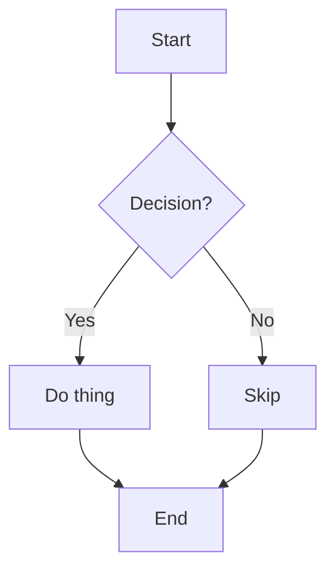
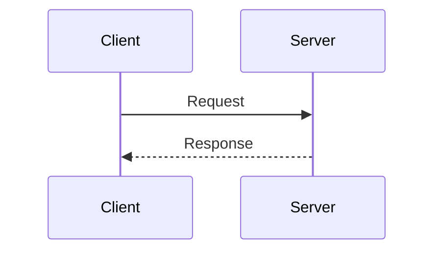
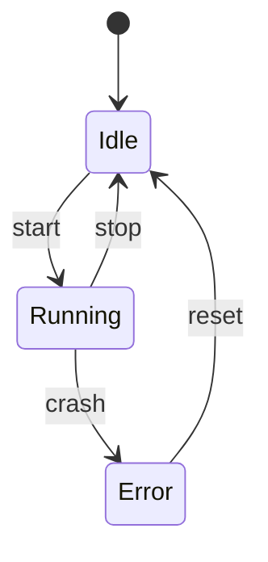
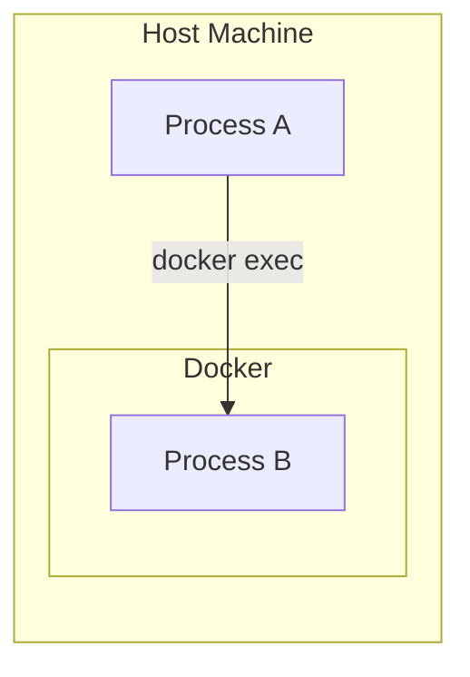

# Documentation Writing Guide

openhort uses mkdocs-material (v9.7.6) with pymdownx (v10.21).

- Config: `docs/mkdocs.yml`
- Source: `docs/manual/`
- Build: `cd docs && poetry run mkdocs build -f mkdocs.yml`
- Serve: `cd docs && poetry run mkdocs serve -f mkdocs.yml`
- Served in-app at `/guide/` (sidebar Help opens in new tab)

## Mermaid Diagrams

Rendered client-side by mkdocs-material. Use fenced code blocks with `mermaid` language.

### Flowchart
````markdown

````

### Sequence Diagram
````markdown

````

### State Diagram
````markdown

````

### Subgraphs (for architecture)
````markdown

````

## Admonitions (Callout Boxes)

```markdown
!!! note "Title here"
    Content inside the box. Must be indented 4 spaces.

!!! warning "Be careful"
    Warning content.

!!! danger "Critical"
    Danger content.

!!! tip "Helpful hint"
    Tip content.

!!! info "FYI"
    Info content.

!!! example "Example"
    Example content.
```

### Collapsible (closed by default)
```markdown
??? note "Click to expand"
    Hidden content revealed on click.
```

### Collapsible (open by default)
```markdown
???+ note "Expanded by default"
    Visible but can be collapsed.
```

## Code Blocks

### With title
````markdown
```python title="container.py"
def get_token():
    return "sk-ant-..."
```
````

### With line numbers
````markdown
```python linenums="1"
def hello():
    print("world")
```
````

### With highlighted lines
````markdown
```python hl_lines="2 3"
def hello():
    x = 1  # highlighted
    y = 2  # highlighted
    return x + y
```
````

### Inline code highlighting
```markdown
Use `#!python range(100)` for iteration.
```

## Tabs

```markdown
=== "Python"
    ```python
    print("hello")
    ```

=== "JavaScript"
    ```javascript
    console.log("hello");
    ```

=== "Bash"
    ```bash
    echo "hello"
    ```
```

## Keyboard Keys

```markdown
Press ++ctrl+shift+p++ to open the command palette.
Press ++cmd+s++ to save.
```

## Text Highlighting

```markdown
This is ==highlighted text== using mark.
```

## Tables

```markdown
| Column A | Column B | Column C |
|----------|----------|----------|
| Cell 1   | Cell 2   | Cell 3   |
```

## Definition Lists

```markdown
Term
:   Definition of the term.

Another term
:   Its definition.
```

## Footnotes

```markdown
This needs clarification[^1].

[^1]: Here is the footnote content.
```

## Emojis

```markdown
:material-check: Supported
:material-close: Not supported
:octicons-alert-16: Warning
```

## Links

```markdown
[Relative link](../internals/permissions.md)
[Section link](../internals/permissions.md#tool-permissions)
```

## HTML in Markdown

Enabled via `md_in_html`. Use sparingly:

```markdown
<div class="grid" markdown>
Content with **markdown** inside HTML.
</div>
```

## Structure Rules

- End-user pages go in `guide/` — task-oriented, no jargon
- Developer pages go in `reference/`, `security/`, `internals/` — nested under "Developer" in nav
- Keep pages under 200 lines where possible
- Use mermaid for architecture/flow diagrams (replaces ASCII art)
- Use admonitions for warnings, prerequisites, tips (not for regular content)
- Use tabs for multi-platform/multi-language code examples
- Cross-reference with relative links
- After editing, rebuild: `cd docs && poetry run mkdocs build -f agent-framework-mkdocs.yml`
