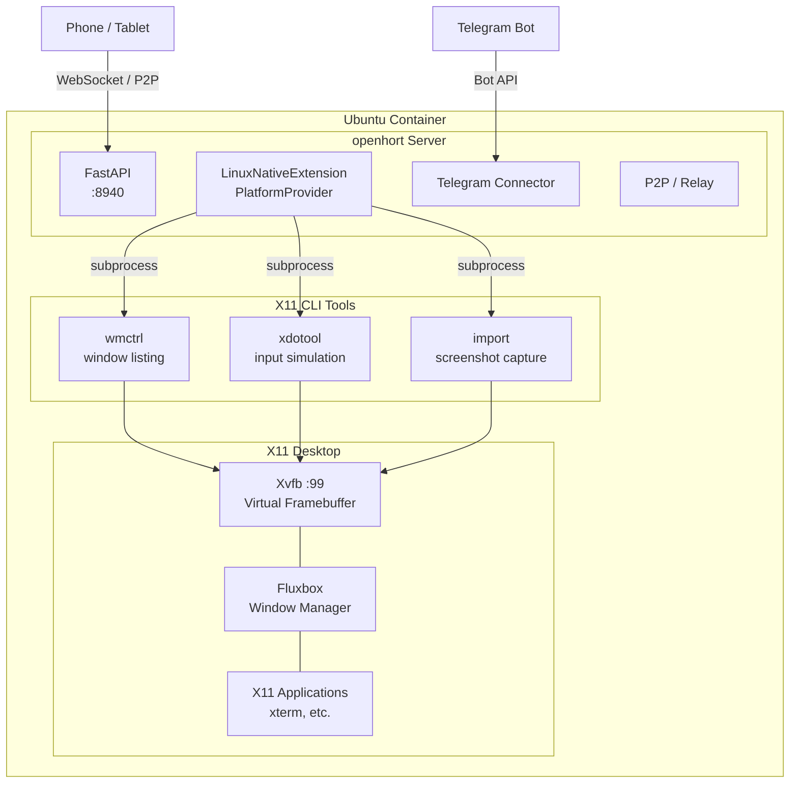
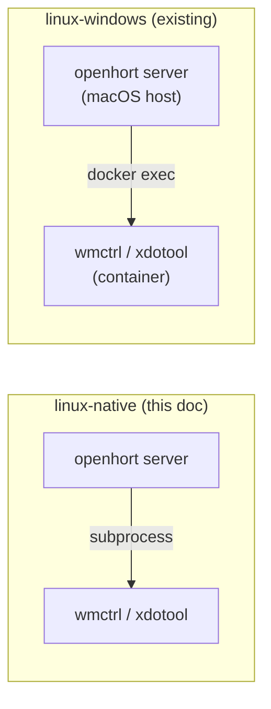
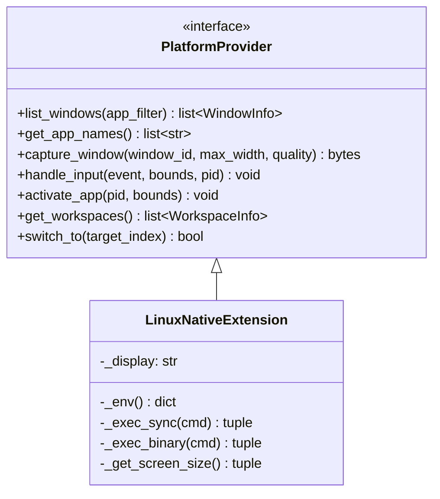
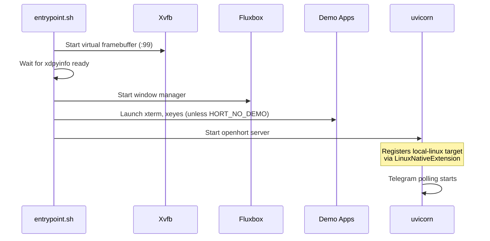

# Linux Support

openhort runs natively on Linux via the `linux-native` extension, which uses X11 tools for window management, screen capture, and input simulation. The entire server can be deployed as a Docker container with a virtual X11 desktop.

## Architecture



## Two Extension Models

openhort has two distinct Linux extensions for different use cases:

| Extension | Directory | Use Case | How It Works |
|-----------|-----------|----------|--------------|
| **linux-native** | `llmings/core/linux_native/` | Server runs **on** Linux | Calls X11 tools directly via `subprocess` |
| **linux-windows** | `llmings/core/linux_windows/` | Server runs on **macOS**, controls a Linux container | Calls X11 tools via `docker exec` |



## Platform Provider

`LinuxNativeExtension` implements the full `PlatformProvider` interface:



### Capability Mapping

| Capability | X11 Tool | Command |
|-----------|----------|---------|
| Window listing | `wmctrl` | `wmctrl -l -p -x -G` |
| App names | `wmctrl` | Extracted from WM_CLASS |
| Screenshot (window) | ImageMagick | `import -window 0x... jpeg:-` |
| Screenshot (desktop) | ImageMagick | `import -window root jpeg:-` |
| Mouse click/move | `xdotool` | `xdotool mousemove X Y click 1` |
| Keyboard input | `xdotool` | `xdotool type --` or `xdotool key` |
| Window activation | `wmctrl` | `wmctrl -i -a <wid>` |
| Workspace list | `wmctrl` | `wmctrl -d` |
| Workspace switch | `wmctrl` | `wmctrl -s <index>` |
| Screen dimensions | `xdpyinfo` | `xdpyinfo | grep dimensions` |

### Desktop Capture

The virtual "Desktop" entry (`window_id=-1`) captures the full X11 root window, matching the macOS behavior where `DESKTOP_WINDOW_ID=-1` triggers `CGDisplayCreateImage`. On Linux this maps to `import -window root`.

## Deployment

### Quick Start

```bash
cd deploy/linux
docker compose up -d
# Open http://localhost:8940
```

### With Telegram Bot

```bash
TELEGRAM_BOT_TOKEN=your_token docker compose up -d
```

### With P2P Support

P2P WebRTC requires `--network=host` so ICE candidates use the host's real IP instead of Docker's internal network:

```bash
docker run -d --network=host --restart=unless-stopped \
  --name openhort-linux \
  -e LLMING_AUTH_SECRET=your_secret \
  -e TELEGRAM_BOT_TOKEN=your_token \
  openhort-linux
```

!!! warning "Docker Desktop on macOS"
    `--network=host` on Docker Desktop (macOS/Windows) works differently than on native Linux Docker. On macOS it maps to the VM's network stack, which still allows P2P to function but may behave differently than true host networking on a Linux host.

### Environment Variables

| Variable | Default | Description |
|----------|---------|-------------|
| `LLMING_AUTH_SECRET` | (required) | Authentication secret for API access |
| `TELEGRAM_BOT_TOKEN` | (optional) | Telegram bot token for connector |
| `DISPLAY` | `:99` | X11 display for Xvfb |
| `HORT_RESOLUTION` | `1920x1080x24` | Virtual framebuffer resolution |
| `HORT_NO_DEMO` | (unset) | Set to skip launching demo X11 windows |
| `HORT_HTTP_PORT` | `8940` | HTTP server port |

## Container Startup Sequence



## Target Registration

When `sys.platform == "linux"`, the server's `_register_targets()` automatically creates a `local-linux` target:

```python title="hort/app.py"
if sys.platform == "linux":
    from llmings.core.linux_native.provider import LinuxNativeExtension
    ext = LinuxNativeExtension()
    ext.activate({})
    registry.register(
        "local-linux",
        TargetInfo(id="local-linux", name="This Linux", provider_type="linux"),
        ext,
    )
```

This mirrors the macOS path which registers `local-macos` with `MacOSWindowsExtension`.

## Key Files

| File | Purpose |
|------|---------|
| `llmings/core/linux_native/provider.py` | `LinuxNativeExtension` — native X11 platform provider |
| `llmings/core/linux_native/extension.json` | Extension manifest (`platforms: ["linux"]`) |
| `deploy/linux/Dockerfile` | Ubuntu 24.04 server image |
| `deploy/linux/entrypoint.sh` | Xvfb + fluxbox + server startup |
| `deploy/linux/docker-compose.yml` | One-command deployment |

## System Requirements (Native Linux)

For running openhort directly on a Linux host (not in Docker):

- Python 3.12+
- X11 display server (Xorg or Xvfb for headless)
- Window manager (any EWMH-compliant: fluxbox, openbox, etc.)
- `wmctrl`, `xdotool`, `imagemagick`, `x11-utils`
- Poetry for dependency management

```bash
# Ubuntu/Debian
sudo apt install wmctrl xdotool imagemagick x11-utils

# Install and run
poetry install
DISPLAY=:0 poetry run python run.py
```
