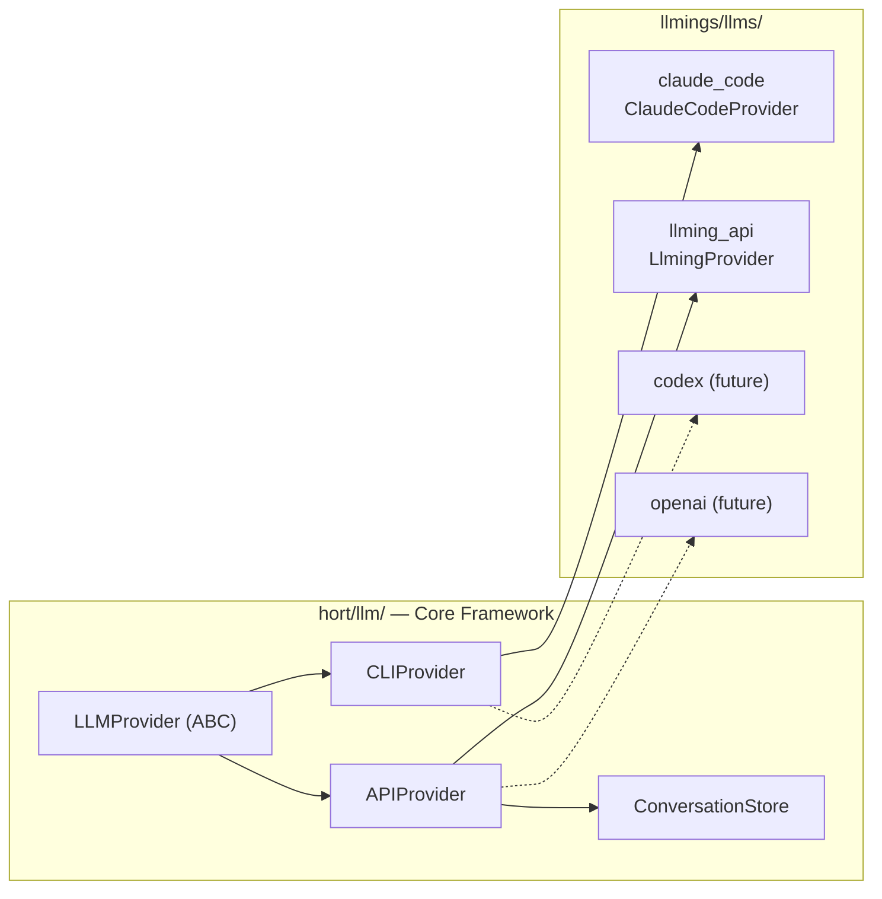
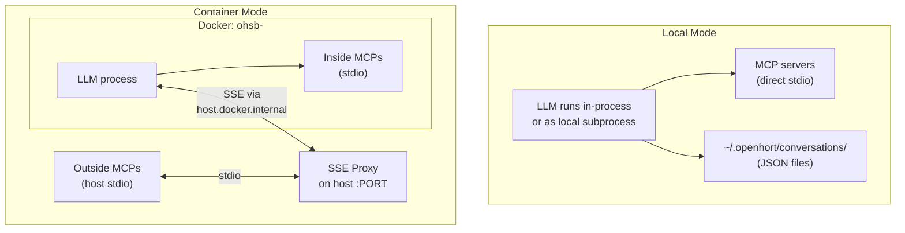
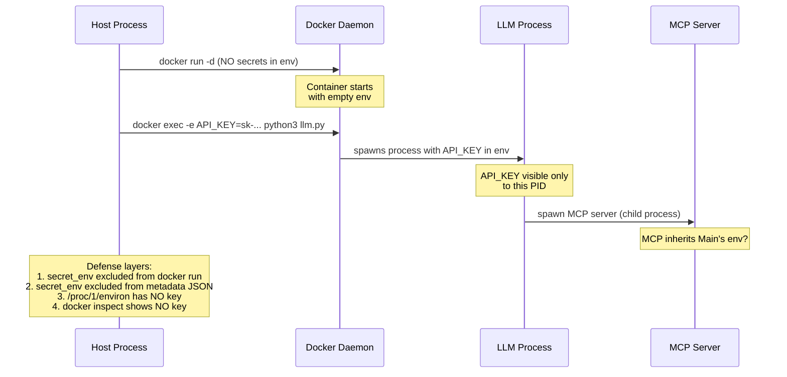
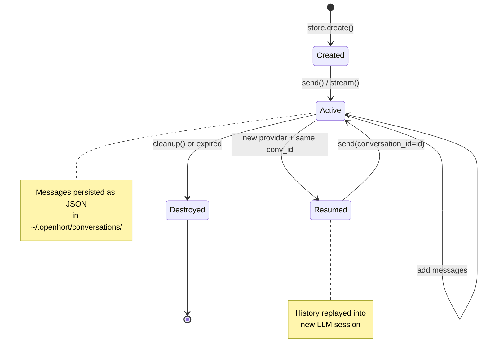
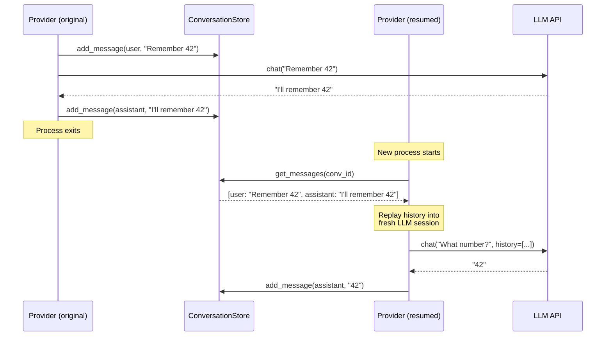
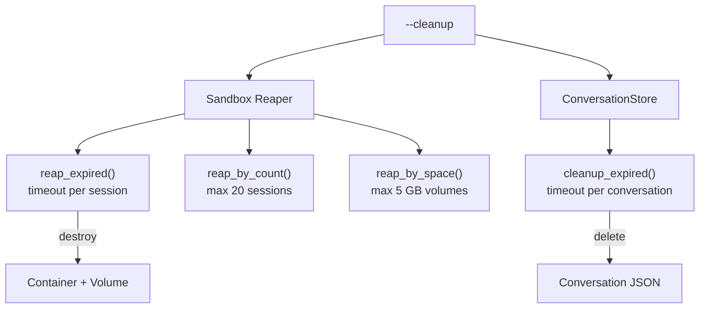
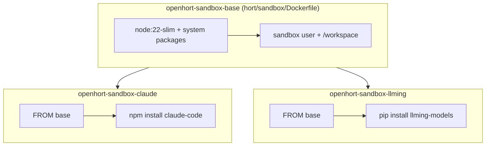

# LLM Extensions

Multi-provider LLM integration with two execution models, unified
conversation history, API key isolation, and MCP tool support.

## Provider Types



### CLI Providers

Executable LLMs that run as subprocesses. They manage their own
conversation state — we just manage the process lifecycle.

| Property | Detail |
|----------|--------|
| Examples | Claude Code, Codex, aider |
| Execution | subprocess (local temp dir or sandbox container) |
| History | Owned by the tool (e.g. `claude --resume`) |
| Cleanup | Reaper destroys sandbox session + volume |

### API Providers

SDK-bound LLMs called via HTTP. We own the conversation history
and replay it on resume.

| Property | Detail |
|----------|--------|
| Examples | Anthropic API, OpenAI API, Mistral, Google Gemini |
| Execution | In-process (local) or inside container |
| History | `ConversationStore` — JSON files with timeout cleanup |
| Cleanup | `store.cleanup_expired()` + reaper for containers |

## Execution Modes

Both provider types support local and container execution:



## API Key Isolation



### How `secret_env` works

```python
# Session creation — key NOT in docker run env
session = mgr.create(SessionConfig(
    image="openhort-sandbox-claude:latest",
    secret_env={"ANTHROPIC_API_KEY": "sk-..."},  # injected per-exec
    env={"SAFE_VAR": "visible"},                  # in container env
))
```

**Three isolation guarantees:**

1. **Not in `docker run`** — `_build_run_cmd()` only includes `env`,
   never `secret_env`. The container's global environment has no key.

2. **Not on disk** — `secret_env` has `exclude=True` in the Pydantic
   model. It's never written to the session metadata JSON file.

3. **Per-process injection** — `_exec_prefix()` adds
   `docker exec -e KEY=VAL` only for the spawned process. The key
   lives in that process's environment, not in `/proc/1/environ`.

!!! warning "MCP limitation"
    MCP servers spawned as child processes of the LLM process
    inherit its environment (standard Unix behavior). Full isolation
    from MCPs requires running MCPs as separate `docker exec`
    processes or using the outside-container proxy (which runs on
    the host and never sees the key).

## Conversation Lifecycle



### Resume across process restarts

API providers replay stored history into a fresh LLM session:



## Cleanup Policies



Both cleaners run automatically on startup and can be triggered
manually via `--cleanup`.

## Docker Layer Strategy



Each extension adds only its specific tools on top of the shared
base image. The base layer (~200 MB) is cached and shared.

## CLI Reference

### Claude Code (`llmings.llms.claude_code`)

```bash
poetry run python -m llmings.llms.claude_code
poetry run python -m llmings.llms.claude_code -c --memory 1g
poetry run python -m llmings.llms.claude_code -c --session <id>
poetry run python -m llmings.llms.claude_code --mcp "fs=npx ..."
```

### llming API (`llmings.llms.llming_api`)

```bash
# Local mode (API key from env)
poetry run python -m llmings.llms.llming_api -m claude_haiku

# Container mode (key isolated via secret_env)
poetry run python -m llmings.llms.llming_api -c --api-key sk-...

# Resume conversation
poetry run python -m llmings.llms.llming_api --conversation <id>

# Container + MCP
poetry run python -m llmings.llms.llming_api -c \
  --mcp "db=npx -y @anthropic/mcp-postgres"

# Management
poetry run python -m llmings.llms.llming_api --list-conversations
poetry run python -m llmings.llms.llming_api --list-sessions
poetry run python -m llmings.llms.llming_api --cleanup
```

## Module Structure

```
hort/llm/                                  Core framework
  base.py           LLMProvider, LLMMessage, LLMChunk, LLMResponse
  cli_provider.py   CLIProvider — subprocess-based LLMs
  api_provider.py   APIProvider — SDK-based LLMs + ConversationStore
  history.py        ConversationStore — JSON conversation persistence

hort/sandbox/                              Core infrastructure
  session.py        Session (secret_env isolation), SessionManager
  reaper.py         Timeout / count / space cleanup
  mcp.py            MCP config + tool filtering
  mcp_proxy.py      SSE proxy for outside-container MCPs
  Dockerfile        Base sandbox image

llmings/llms/claude_code/          Claude Code CLI
  provider.py       ClaudeCodeProvider(CLIProvider)
  Dockerfile        FROM base + claude-code

llmings/llms/llming_api/           llming-models SDK
  provider.py       LlmingProvider(APIProvider)
  container_entry.py  In-container entrypoint (streams JSON)
  Dockerfile        FROM base + llming-models
```

## Test Coverage

| Test | Count | What |
|------|-------|------|
| Core sandbox | 27 | Session lifecycle, secret_env, reaper |
| Core MCP | 32 | Config, proxy, SSE, tool filtering |
| Core LLM history | 11 | CRUD, timeout cleanup, resume |
| Claude Code ext | 14 | Auth, stream parser, typewriter |
| llming API ext | 9 | Real API calls, multi-turn, resume, secret isolation |
