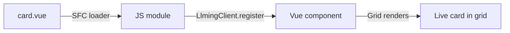

# Llming Development Guide

Build llmings with minimal boilerplate. A llming can be as simple as
a single `.vue` file or as complex as a full Python + Vue application.

## Quick Start: card.vue

The simplest llming: a directory with one Vue file.

```
llmings/samples/my_widget/
  card.vue
```

That's it. No manifest, no Python, no build step. The framework:

- Names it `my-widget` (from directory name)
- Compiles the Vue SFC at serve time
- Renders it live in the grid as an interactive card
- Makes it appear in the Llmings tab automatically

### Standard Vue

Card files are **standard Vue Single File Components**. Write them
exactly as you would in any Vue + Quasar project:

```vue
<template>
  <q-card flat bordered class="q-pa-md">
    <div class="text-h6">{{ greeting }}</div>
    <q-btn label="Click me" color="primary" @click="count++" />
    <div class="text-caption q-mt-sm">Clicked {{ count }} times</div>
  </q-card>
</template>

<script setup>
import { ref } from 'vue'

const greeting = ref('Hello World')
const count = ref(0)
</script>
```

This is 100% standard Vue. No openhort-specific syntax, no custom APIs.
You can develop and test card.vue files with any Vue tooling.

### What the framework handles

The SFC loader compiles your `.vue` file at serve time. Behind the scenes:

- `import { ref, computed, watch } from 'vue'` → rewritten to use the global Vue UMD object
- `import { useQuasar } from 'quasar'` → rewritten to use the global Quasar object
- Top-level `const`, `let`, and `function` declarations → auto-collected and returned from `setup()`
- `<style scoped>` → injected as a `<style>` element in the document head
- The component is registered as a Vue component and mounted live in the grid

You write standard Vue. The framework adapts it to the browser environment.

## Composition API (`<script setup>`)

The recommended way to write card.vue files. Supports the full Vue 3
Composition API:

| Feature | Support |
|---------|---------|
| `ref()`, `reactive()` | Full |
| `computed()` | Full |
| `watch()`, `watchEffect()` | Full |
| `onMounted()`, `onUnmounted()` | Full |
| `provide()`, `inject()` | Full |
| `defineProps()`, `defineEmits()` | Not yet |
| `<script setup>` auto-returns | Full |

### Import rewriting

The SFC loader rewrites standard imports to work without a bundler:

```javascript
// What you write (standard Vue):
import { ref, computed, watch, onMounted } from 'vue'
import { useQuasar } from 'quasar'

// What runs in the browser (automatic):
const { ref, computed, watch, onMounted } = Vue;
const useQuasar = () => ({ notify, dialog, ... });
```

!!! info "Supported imports"
    - `from 'vue'` — all Vue Composition API functions
    - `from 'quasar'` — `useQuasar` composable (shim for UMD)
    - `from 'llming'` — `useLlming` composable (see [Llming API](#llming-api-optional))
    - Other imports are not supported (no bundler) and will log a warning

### Example: Pomodoro Timer

A fully functional pomodoro timer — standard Vue, no framework dependencies:

```vue
<template>
  <q-card flat bordered class="pomodoro-card q-pa-lg">
    <q-card-section class="text-center">
      <div class="text-overline text-grey-6 q-mb-sm">POMODORO</div>

      <q-circular-progress
        :value="progress" size="200px" :thickness="0.08"
        :color="running ? 'green-5' : 'blue-5'"
        track-color="grey-9" center-color="dark" rounded
      >
        <span class="text-h3 text-weight-bold"
              :class="{ 'text-green-5': running }">
          {{ mins }}:{{ secs }}
        </span>
      </q-circular-progress>
    </q-card-section>

    <q-card-section class="text-center q-pt-none">
      <q-btn :label="running ? 'Pause' : 'Start'"
             :color="running ? 'red-5' : 'green-6'"
             :icon="running ? 'pause' : 'play_arrow'"
             unelevated rounded @click="toggle" />
      <q-btn label="Reset" icon="restart_alt" flat rounded
             color="grey-5" @click="reset" />
    </q-card-section>

    <q-card-section class="q-pt-sm">
      <div class="text-caption text-grey-6 q-mb-xs">Duration</div>
      <q-slider v-model="duration" :min="5" :max="60" :step="5"
                :disable="running" label :label-value="duration + ' min'"
                color="blue-5" label-always switch-label-side />
    </q-card-section>
  </q-card>
</template>

<script setup>
import { ref, computed, watch, onMounted, onUnmounted } from 'vue'

const duration = ref(25)
const remaining = ref(25 * 60)
const running = ref(false)

const mins = computed(() => String(Math.floor(remaining.value / 60)).padStart(2, '0'))
const secs = computed(() => String(remaining.value % 60).padStart(2, '0'))
const progress = computed(() => {
  const total = duration.value * 60
  return total > 0 ? ((total - remaining.value) / total) * 100 : 0
})

// Persist to localStorage
watch([remaining, duration], () => {
  localStorage.setItem('pomodoro', JSON.stringify({
    remaining: remaining.value, duration: duration.value,
  }))
})

onMounted(() => {
  const saved = JSON.parse(localStorage.getItem('pomodoro') || '{}')
  if (saved.remaining != null) remaining.value = saved.remaining
  if (saved.duration) duration.value = saved.duration
})

watch(duration, (val) => {
  if (!running.value) remaining.value = val * 60
})

// Standard setInterval — no framework dependency
let timer
watch(running, (on) => {
  clearInterval(timer)
  if (on) {
    timer = setInterval(() => {
      if (remaining.value > 0) remaining.value--
      else running.value = false
    }, 1000)
  }
})
onUnmounted(() => clearInterval(timer))

function toggle() { running.value = !running.value }
function reset() { running.value = false; remaining.value = duration.value * 60 }
</script>

<style scoped>
.pomodoro-card { max-width: 380px; margin: 0 auto; }
</style>
```

This is pure Vue + Quasar. It works offline, persists state to localStorage,
and runs entirely in the browser.

## Options API (`<script>`)

Also supported for simpler cases or migration from older cards:

```vue
<template>
  <q-card flat bordered class="q-pa-md">
    <div class="text-h4">{{ temp }}°</div>
    <div class="text-caption">{{ city }}</div>
  </q-card>
</template>

<script>
export default {
  data() {
    return { temp: '--', city: 'Loading...' };
  },
  async mounted() {
    const data = await this.$llming.vault.get('state');
    this.temp = data.temp || '--';
    this.city = data.city || 'Unknown';
  },
};
</script>
```

In Options API, the llming API is available as `this.$llming`.

## Llming API (optional)

Card.vue files are standard Vue by default — no llming API needed.
When you want to interact with the openhort framework (read vaults,
subscribe to pulses, call powers), the API is available via three
patterns:

### In `<script setup>`

=== "inject (standard Vue)"

    ```javascript
    import { inject } from 'vue'

    const llming = inject('llming')
    const data = await llming.vault.get('state')
    llming.subscribe('cpu_spike', (d) => { /* ... */ })
    ```

=== "useLlming composable"

    ```javascript
    import { useLlming } from 'llming'

    const llming = useLlming()
    await llming.call('get_metrics')
    ```

=== "$llming (closure variable)"

    ```javascript
    // $llming is available in scope — no import needed
    const data = await $llming.vault.get('state')
    $llming.subscribe('tick:1hz', handler)
    ```

### In `<script>` (Options API)

```javascript
export default {
  async mounted() {
    const data = await this.$llming.vault.get('state');
    this.$llming.subscribe('cpu_spike', this.onSpike);
  },
};
```

### API reference

| Method | Description |
|--------|-------------|
| `vault.get(key)` | Read from own vault |
| `vault.set(key, data)` | Write to own vault |
| `subscribe(channel, handler)` | Subscribe to pulse channel |
| `call(power, args)` | Execute own power |
| `callOn(llming, power, args)` | Execute another llming's power |
| `name` | This llming's name |
| `connected` | Whether the server connection is active |

### When to use what

| Need | Solution |
|------|----------|
| Local state (timer, form data) | `ref()` + `localStorage` |
| State synced to server | `$llming.vault.set/get` |
| React to server events | `$llming.subscribe(channel, handler)` |
| Trigger server action | `$llming.call(power, args)` |
| Pure client-side timer | `setInterval` / `watch` |
| React to system tick | `$llming.subscribe('tick:1hz', handler)` |

## Available Libraries

Always available globally — no imports needed:

| Library | Global | Use case |
|---------|--------|----------|
| Vue 3 | `Vue` | Reactivity, components |
| Quasar | `Quasar` | UI components, dialogs, notifications |
| Plotly.js | `Plotly` | Charts, graphs |
| Three.js | `THREE` | 3D scenes |
| ECharts | `echarts` | Advanced charts |

### Quasar in `<script setup>`

In a standard Vue + Quasar app, you'd use `useQuasar()`. The SFC
loader provides a shim:

```javascript
import { useQuasar } from 'quasar'

const $q = useQuasar()
$q.notify({ message: 'Timer complete!', color: 'positive' })
$q.dialog({ title: 'Confirm', message: 'Are you sure?' })
```

You can also use the global `Quasar` object directly:

```javascript
Quasar.Notify.create({ message: 'Done!' })
Quasar.Dialog.create({ title: 'Confirm', message: 'Sure?' })
```

## Manifest (optional)

Add a `manifest.json` for metadata beyond defaults:

```json
{
  "name": "my-widget",
  "description": "A custom widget",
  "icon": "ph ph-chart-bar",
  "version": "0.1.0",
  "execution": "client"
}
```

Everything is optional. Missing fields use defaults:

| Field | Default |
|-------|---------|
| `name` | Directory name (underscores → hyphens) |
| `description` | Empty |
| `icon` | `ph ph-puzzle-piece` |
| `version` | `0.0.0` |
| `execution` | `client` if no Python, `hybrid` if Python exists |
| `entry_point` | `<dir_name>:<ClassName>` (if `.py` exists) |
| `group` | Empty (own process) |
| `publishes` | `[]` |
| `reads_vaults` | `[]` |

## File Structure

### Minimal (Vue only — client-side)

```
my_widget/
  card.vue          ← Vue SFC, renders live in the grid
```

### With manifest

```
my_widget/
  card.vue
  manifest.json     ← icon, description, execution tier
```

### With Python backend (hybrid)

```
my_widget/
  manifest.json
  my_widget.py      ← Llming class with @power, @on
  card.vue           ← Vue SFC card
  SOUL.md            ← AI prompt (optional)
```

### Full llming

```
my_widget/
  manifest.json
  my_widget.py      ← main llming class
  card.vue           ← grid card
  models.py          ← Pydantic models
  static/
    custom.css
  SOUL.md
```

## Grid Rendering

Cards with `card.vue` render as **live Vue components** directly in
the grid — not as canvas thumbnails. The component IS the card.



Classic llmings (with `cards.js` and `renderThumbnail`) continue to
render as canvas thumbnail images. The two modes coexist in the same grid.

## Execution Tiers

Every llming declares where it runs:

| Tier | Description | Offline behavior |
|------|-------------|------------------|
| `client` | Pure client-side (Vue only, no Python) | **Fully functional** |
| `hybrid` | Client UI + server backend | **UI works**, server powers unavailable |
| `server` | Server-only (or UI depends on server) | **Unavailable** |

Default: `client` if no Python file, `hybrid` if Python exists.

### Client-side storage

For `client` llmings, use standard browser APIs:

```javascript
// localStorage — simple key/value, synchronous
localStorage.setItem('key', JSON.stringify(data))
const data = JSON.parse(localStorage.getItem('key') || '{}')

// Or use the llming vault (IndexedDB, async, syncs to server)
await $llming.vault.set('state', data)
const data = await $llming.vault.get('state')
```

## Python Backend

When a llming needs server-side logic, add a Python file alongside
card.vue:

```python
# cpu_monitor.py
from hort.llming import Llming, power, pulse

class CpuMonitor(Llming):
    @pulse("tick:1hz")
    async def poll(self, _data):
        """Poll CPU every second."""
        import psutil
        cpu = psutil.cpu_percent()
        self.vault.set("state", {"cpu": cpu})
        await self.emit("cpu_update", {"cpu": cpu})

    @power("get_cpu", command=True)
    async def get_cpu(self) -> str:
        """Current CPU usage."""
        state = self.vault.get("state")
        return f"CPU: {state.get('cpu', '?')}%"
```

The card.vue subscribes to the Python llming's pulses and reads
its vault:

```vue
<template>
  <q-card flat bordered class="q-pa-md">
    <div class="text-overline">CPU</div>
    <div class="text-h3 text-primary">{{ cpu }}%</div>
    <q-linear-progress :value="cpu / 100" color="primary" />
  </q-card>
</template>

<script setup>
import { ref, onMounted } from 'vue'

const cpu = ref(0)

onMounted(async () => {
  const state = await $llming.vault.get('state')
  cpu.value = state?.cpu || 0

  $llming.subscribe('cpu_update', (d) => {
    cpu.value = d.cpu
  })
})
</script>
```

## Hot Reload

The framework watches all llming directories for changes.
When a tracked file changes while the server is running:

1. Llming is deactivated (clean shutdown)
2. Commands unregistered from CommandRegistry
3. Cards disconnected from viewers
4. Llming reloaded from disk
5. New code activated
6. Cards reconnected, commands re-registered

### Tracked files

By default: `.py`, `.js`, `.css`, `.html`, `.vue`, `.json`, `.md`

Override in manifest:

```json
{
  "watch": ["*.py", "*.vue", "templates/*.jinja"]
}
```

### Subprocess handling

- If the llming runs in a subprocess: killed and restarted with fresh code
- File hashes (SHA256) are compared at startup — mismatch triggers reload

## SFC Loader Details

The SFC loader (`hort/ext/vue_loader.py`) compiles `.vue` files at
serve time. No build step, no Node.js, no webpack/vite.

### What it does

1. Parses `<template>`, `<script setup>`, and `<style scoped>` blocks
2. Detects `<script setup>` vs `<script>` (Options API)
3. Rewrites `import { ... } from 'vue'` → `const { ... } = Vue`
4. Rewrites `import { useQuasar } from 'quasar'` → Quasar UMD shim
5. Strips `import { useLlming } from 'llming'` (provided in scope)
6. Collects top-level `const`, `let`, `function` bindings
7. Wraps everything in a `setup()` function with auto-return
8. Generates a `LlmingClient` class that registers the Vue component
9. Caches the compiled JS by file content hash

### What it doesn't do

- **No TypeScript** — write plain JavaScript
- **No `defineProps` / `defineEmits`** — these are compile-time macros
  that need the official Vue compiler
- **No multi-file imports** — `import { helper } from './utils.js'`
  doesn't work (no bundler). Put everything in one file, or use
  the `static/` directory for separate scripts
- **No JSX** — use Vue templates

### Caching

Compiled JS is cached in-memory by file content hash (SHA256).
Editing card.vue clears the cache automatically. In dev mode with
`--reload`, the server restarts on Python changes — the cache
rebuilds on next request.

## Migration from Legacy Cards

Old-style cards (canvas-based `renderThumbnail` in `cards.js`) continue
to work. To migrate to card.vue:

1. Create `card.vue` in the llming directory
2. Move rendering logic from `renderThumbnail()` to a Vue template
3. Replace `_feedStore(data)` with `ref()` + `$llming.vault.get('state')`
4. Replace polling with `watch()` or `$llming.subscribe(channel, handler)`
5. Delete `cards.js`

The framework prefers `card.vue` over `cards.js` if both exist.

## Examples

See `llmings/samples/` for working examples:

| Sample | Type | Features |
|--------|------|----------|
| `pomodoro/` | Client (Vue only) | `<script setup>`, `ref`, `watch`, `localStorage`, `q-circular-progress` |
| `dice_roller/` | Hybrid (Python + JS) | `@power`, `@pulse`, positional args, Pydantic models |
| `color_picker/` | Hybrid (Python + JS) | Vault storage, pulse events |
