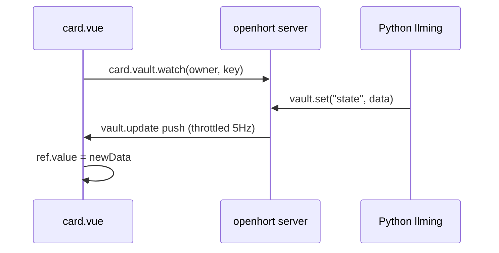
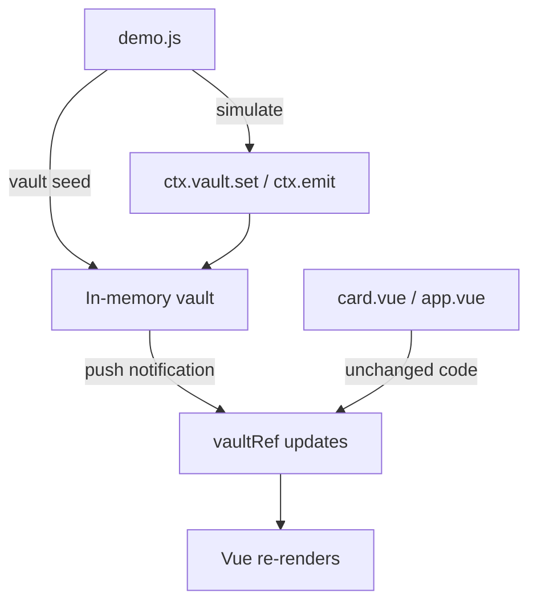

# Llming Development Guide

Build llmings with minimal boilerplate. A llming can be as simple as
a single `.vue` file or as complex as a full Python + Vue application.

## Quick Start

The simplest llming: a directory with one Vue file named after the llming.

```
llmings/samples/my_widget/
  my_widget.vue
```

That's it. No manifest, no Python, no build step. The framework:

- Names it `my-widget` (from directory name, underscores → hyphens)
- Compiles the Vue SFC at serve time
- Renders it live in the grid as an interactive card
- Makes it appear in the Llmings tab automatically

## File Naming

| File | Purpose | Discovery |
|------|---------|-----------|
| `{name}.vue` | Card — renders in the grid | Default: matches directory name |
| `app.vue` | Full app — opens on card click | Or `app/index.vue` for multi-page |
| `{name}.py` | Python backend | `@power`, `@pulse` decorators |
| `manifest.json` | Metadata | Icon, description, execution tier |
| `demo.js` | Demo simulation | Fake data for demo mode |
| `SOUL.md` | AI prompt | Injected into LLM system prompt |

Override the card file name in manifest: `"card": "custom_name.vue"`.

## File Structure

### Minimal (Vue only)

```
my_widget/
  my_widget.vue       ← card (renders in grid)
```

### Card + App

```
my_widget/
  my_widget.vue       ← card (grid, glanceable)
  app.vue             ← full app (opens on card click)
  manifest.json
```

### With Python backend

```
my_widget/
  my_widget.vue       ← card
  my_widget.py        ← Llming class with @power, @pulse
  manifest.json
  SOUL.md
```

### Full llming with demo

```
my_widget/
  my_widget.vue       ← card
  app.vue             ← full app
  my_widget.py        ← Python backend
  demo.js             ← demo mode simulation
  manifest.json
  static/
    demo/             ← demo data files
      sample.json
  SOUL.md
```

### Multi-page app

```
my_widget/
  my_widget.vue       ← card
  app/
    index.vue         ← main app entry
    settings.vue      ← sub-page
    history.vue       ← sub-page
  manifest.json
```

## Standard Vue

Card and app files are **standard Vue Single File Components**. Write them
exactly as you would in any Vue + Quasar project:

```vue
<template>
  <q-card flat bordered class="q-pa-md">
    <div class="text-h6">{{ greeting }}</div>
    <q-btn label="Click me" color="primary" @click="count++" />
    <div class="text-caption q-mt-sm">Clicked {{ count }} times</div>
  </q-card>
</template>

<script setup>
import { ref } from 'vue'

const greeting = ref('Hello World')
const count = ref(0)
</script>
```

100% standard Vue. No openhort-specific syntax needed.

### Import rewriting

The SFC loader rewrites standard imports to work without a bundler:

| What you write | What runs (automatic) |
|---|---|
| `import { ref, computed } from 'vue'` | `const { ref, computed } = Vue` |
| `import { useQuasar } from 'quasar'` | Quasar UMD shim |
| `import { vaultRef } from 'llming'` | Provided in scope |
| `import { useLlming } from 'llming'` | Provided in scope |

!!! warning "No bundler"
    Only `'vue'`, `'quasar'`, and `'llming'` imports are supported.
    Other imports (`from './utils.js'`) won't work — put everything
    in one file or use the `static/` directory for separate scripts.

## vaultRef — Reactive Data Binding

`vaultRef` binds a Vue ref directly to a vault value. **Zero subscription
code, zero handlers.** The server pushes updates when the vault changes.

```vue
<script setup>
import { computed } from 'vue'
import { vaultRef } from 'llming'

const cpu  = vaultRef('system-monitor', 'state.cpu_percent', 0)
const mem  = vaultRef('system-monitor', 'state.mem_percent', 0)
const disk = vaultRef('system-monitor', 'state.disk_percent', 0)
</script>

<template>
  <div>CPU: {{ cpu }}% | MEM: {{ mem }}% | DISK: {{ disk }}%</div>
</template>
```

That's the **entire llming**. No `onMounted`, no `subscribe`, no watchers.

### API

```javascript
vaultRef(owner, path, defaultValue, options?)
```

| Parameter | Description |
|-----------|-------------|
| `owner` | Source llming name, or `'self'` for own vault |
| `path` | Dot-separated path: `'state.cpu_percent'` |
| `defaultValue` | Value before first update |
| `options.onChange` | `(newVal, oldVal) => void` callback |

### How it works



1. `vaultRef` sends `card.vault.watch` to the server
2. When `vault.set()` is called by any llming, the server pushes the update
3. The Vue ref updates, template re-renders automatically
4. Throttled to 5Hz max per (owner, key) — burst writes coalesce to latest value
5. On WS reconnect, watches are automatically re-registered

### Python vault_ref

The same concept works in Python llmings:

```python
from hort.llming import Llming, vault_ref

class AlertManager(Llming):
    cpu = vault_ref('system-monitor', 'state.cpu_percent', default=0)
    mem = vault_ref('system-monitor', 'state.mem_percent', default=0)

    @cpu.on_change
    async def on_cpu_spike(self, value, old):
        if value > 90:
            await self.emit('cpu_alert', {'cpu': value})
```

Descriptors update immediately when the source vault changes (no polling).

## Llming API (optional)

When you need to interact with the openhort framework beyond `vaultRef`:

### In `<script setup>`

=== "inject (standard Vue)"

    ```javascript
    import { inject } from 'vue'
    const llming = inject('llming')
    await llming.vault.get('state')
    llming.subscribe('cpu_spike', handler)
    ```

=== "useLlming composable"

    ```javascript
    import { useLlming } from 'llming'
    const llming = useLlming()
    await llming.call('get_metrics')
    ```

=== "$llming (closure variable)"

    ```javascript
    const data = await $llming.vault.get('state')
    $llming.subscribe('tick:1hz', handler)
    ```

### API reference

| Method | Description |
|--------|-------------|
| `vault.get(key)` | Read from own vault |
| `vault.set(key, data)` | Write to own vault |
| `subscribe(channel, handler)` | Subscribe to pulse channel |
| `call(power, args)` | Execute own power |
| `callOn(llming, power, args)` | Execute another llming's power |
| `name` | This llming's name |
| `connected` | Server connection active? |

### When to use what

| Need | Solution |
|------|----------|
| Bind to server data | `vaultRef('owner', 'key.path', default)` |
| Local-only state | `ref()` + `localStorage` |
| Read/write own vault | `$llming.vault.get/set` |
| React to server events | `$llming.subscribe(channel, handler)` |
| Trigger server action | `$llming.call(power, args)` |
| Pure client-side timer | `setInterval` / `watch` |

## Cards and Apps

### Card (`{name}.vue`)

Renders **live in the grid** as an interactive Vue component. Small,
glanceable, always visible. The component IS the card — no canvas
thumbnails.

### App (`app.vue` or `app/index.vue`)

Opens when the user clicks the card. Full-page on mobile, floating
panel on desktop. Same API as cards — `vaultRef`, `$llming`, everything
works identically.

```
Card (grid)           App (click to open)
┌──────────┐         ┌────────────────────┐
│  CPU 22% │  click  │  Detailed metrics  │
│  MEM 77% │ ──────→ │  History graphs    │
│  DSK 53% │         │  Settings panel    │
└──────────┘         └────────────────────┘
```

## Python Backend

### Powers

```python
from hort.llming import Llming, power, pulse

class MyLlming(Llming):
    @power("get_metrics")
    async def get_metrics(self) -> MetricsResponse:
        """Get current system metrics."""
        return MetricsResponse(cpu=42.0)

    @power("cpu", command=True)
    async def cpu_command(self) -> str:
        """Current CPU usage."""
        return f"CPU: {self._cpu}%"
```

### Pulse subscriptions

```python
@pulse("tick:1hz")
async def poll(self, data):
    """Runs every second."""
    self.vault.set("state", {"cpu": get_cpu()})
    await self.emit("cpu_update", {"cpu": get_cpu()})

@pulse("cpu_spike")
async def on_spike(self, data):
    """Fires when another llming emits cpu_spike."""
    self.log.warning("CPU spike: %s%%", data["cpu"])
```

Built-in tick channels: `tick:10hz`, `tick:1hz`, `tick:5s`.

### Vault bindings (vault_ref)

```python
class Dashboard(Llming):
    cpu = vault_ref('system-monitor', 'state.cpu_percent', default=0)

    @cpu.on_change
    async def on_cpu_change(self, value, old):
        if value > 90:
            await self.emit('cpu_alert', {'cpu': value})
```

## Manifest

```json
{
  "name": "my-widget",
  "description": "A custom widget",
  "icon": "ph ph-chart-bar",
  "version": "0.1.0",
  "execution": "client",
  "card": "my_widget.vue"
}
```

| Field | Default |
|-------|---------|
| `name` | Directory name (underscores → hyphens) |
| `description` | Empty |
| `icon` | `ph ph-puzzle-piece` |
| `version` | `0.0.0` |
| `execution` | `client` if no Python, `hybrid` if Python exists |
| `card` | `{dir_name}.vue` |
| `entry_point` | `<dir_name>:<ClassName>` (if `.py` exists) |

## Demo Mode

Demo mode replaces the server with an in-memory mock — vault, pulses,
and power calls all run locally in the browser. Cards and apps work
**unchanged**. Each llming can provide a `demo.js` that seeds data
and runs simulations.

### Activating demo mode

| Method | Use case |
|--------|----------|
| `POST /api/debug/demo/{on\|off\|toggle}` | From CLI, Playwright, scripts |
| 5 rapid clicks on the OpenHORT logo | In the browser |
| `HortDemo.toggle()` | Browser console |

When active, an amber **DEMO MODE** banner appears at the top of the screen.
All card components re-mount with fresh demo state.

### demo.js

```javascript
// system_monitor/demo.js
export default {
  // Seed vault data before components mount
  vault: {
    'state': { cpu_percent: 22, mem_percent: 77, disk_percent: 53 }
  },

  // Called once when demo activates
  async setup(ctx) {
    // Load data from this llming's static/ directory
    const history = await ctx.load('demo/history.json');
    ctx.vault.set('history', history);

    // Load from shared sample-data/ directory
    const avatars = await ctx.shared('avatars.json');
    ctx.vault.set('contacts', avatars);
  },

  // Called once when demo deactivates
  teardown(ctx) {
    // Optional cleanup
  },

  // Ongoing simulation — intervals auto-cleaned on teardown
  simulate(ctx) {
    ctx.interval(() => {
      ctx.vault.set('state', {
        cpu_percent: 15 + Math.random() * 40 | 0,
        mem_percent: 70 + Math.random() * 15 | 0,
        disk_percent: 53,
      });
      ctx.emit('system_metrics', { cpu_percent: 42 });
    }, 1000);
  },

  // Mock power responses
  powers: {
    get_metrics: () => ({ code: 200, cpu: 42, memory: 77 }),
    restart: () => ({ code: 200, message: 'Restarted (demo)' }),
  }
}
```

### Demo context (ctx)

| Method | Description |
|--------|-------------|
| `vault.get(key)` | Read from this llming's mock vault |
| `vault.set(key, data)` | Write to mock vault (triggers vaultRef push) |
| `emit(channel, data)` | Emit a pulse to all subscribers |
| `load(path)` | Fetch from this llming's `static/` dir (JSON or text) |
| `shared(path)` | Fetch from `sample-data/` shared dir |
| `interval(fn, ms)` | setInterval with auto-cleanup on teardown |
| `timeout(fn, ms)` | setTimeout with auto-cleanup on teardown |

### How it works



1. `demo.js` seeds the in-memory vault and starts simulation
2. `window.hortWS` is replaced with a mock that routes `card.vault.read/write/watch` to the in-memory store
3. `vault.set()` in the mock triggers `LlmingClient._notifyVaultUpdate()` — same push mechanism as the real server
4. `vaultRef` refs update automatically, templates re-render
5. Card and app components work **unchanged** — they don't know they're in demo mode

### Shared data

All demo llmings share one in-memory vault store. Cross-llming reads work
naturally — if system-monitor's demo writes `state.cpu_percent`, any card
using `vaultRef('system-monitor', 'state.cpu_percent')` sees the updates.

Shared sample data files go in `sample-data/` at the project root,
accessible via `ctx.shared('path')`.

### Realistic simulation

Use random walks instead of random noise for realistic-looking data:

```javascript
simulate(ctx) {
  let cpu = 22, mem = 77;
  ctx.interval(() => {
    cpu += (Math.random() - 0.52) * 6;         // drift
    cpu += (25 - cpu) * 0.02;                   // mean reversion
    if (Math.random() < 0.03) cpu += 20;        // rare spike
    cpu = Math.max(3, Math.min(98, cpu));
    mem += (Math.random() - 0.5) * 0.3;         // very slow
    ctx.vault.set('state', { cpu_percent: Math.round(cpu), mem_percent: Math.round(mem) });
  }, 1000);
}
```

## Available Libraries

Always available globally — no imports needed:

| Library | Global | Use case |
|---------|--------|----------|
| Vue 3 | `Vue` | Reactivity, components |
| Quasar | `Quasar` | UI components, dialogs, notifications |
| Plotly.js | `Plotly` | Charts, graphs |
| ECharts | `echarts` | Advanced charts |

## SFC Loader

The SFC loader (`hort/ext/vue_loader.py`) compiles `.vue` files at
serve time. No build step, no Node.js, no webpack/vite.

### What it does

1. Parses `<template>`, `<script setup>`, `<style scoped>` blocks
2. Rewrites vue/quasar/llming imports for UMD environment
3. Collects top-level bindings, wraps in `setup()` with auto-return
4. Generates `LlmingClient` class (card) or component registration (app)
5. Injects `$llming`, `useLlming()`, `vaultRef()` into scope
6. Caches compiled JS by content hash

### Limitations

- No TypeScript
- No `defineProps` / `defineEmits` (compile-time macros)
- No multi-file imports (no bundler)
- No JSX

## Migration from Legacy Cards

Old-style cards (`cards.js` + `renderThumbnail`) continue to work.
To migrate:

1. Create `{name}.vue` in the llming directory
2. Move rendering logic to a Vue template
3. Replace `_feedStore(data)` with `vaultRef()` or `$llming.vault.get()`
4. Delete `cards.js`

## Examples

| Sample | Type | Features |
|--------|------|----------|
| `pomodoro/` | Client | `<script setup>`, `ref`, `watch`, `localStorage`, auto-start in demo |
| `system_monitor/` | Hybrid | `vaultRef`, push-based gauges, 1Hz updates, realistic demo simulation |
| `dice_roller/` | Hybrid | `@power`, `@pulse`, positional args, Pydantic models |
