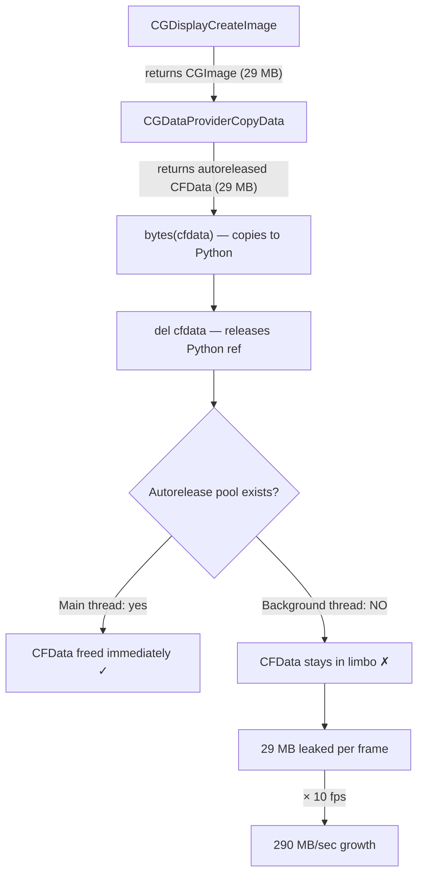

# Memory Safety

Critical findings from debugging a 95 GB memory leak (March 2026).

## Root Cause: Quartz CGImage Native Memory

`CGWindowListCreateImage()` returns a Core Foundation `CGImage` object.
Its pixel buffer (10-50 MB per capture, depending on window resolution
and Retina scaling) is allocated in **native C memory** that Python's
garbage collector does not track.

Python only sees a lightweight pyobjc wrapper object (~100 bytes).
The GC can collect the wrapper, but the native pixel buffer stays
allocated until the Core Foundation reference count reaches zero.

### The Leak

```python
# BEFORE (leaking):
def capture_window(window_id, max_width, quality):
    cg_image = CGWindowListCreateImage(...)       # 30 MB native alloc
    pil_image = _cgimage_to_pil(cg_image)         # copies pixels, but cg_image still alive
    # ... encode to JPEG ...
    return jpeg_bytes
    # cg_image goes out of scope here, but pyobjc may NOT release it immediately
    # At 10 FPS = 300 MB/sec of unreleased native memory
```

### The Fix

```python
# AFTER (fixed):
def capture_window(window_id, max_width, quality):
    cg_image = CGWindowListCreateImage(...)
    try:
        pil_image = _cgimage_to_pil(cg_image)
    finally:
        CFRelease(cg_image)                        # explicit native release
        del cg_image                               # drop Python reference
    # ... encode to JPEG ...
    pil_image.close()                              # release PIL's internal buffer
    return jpeg_bytes
```

### Why Python's GC Doesn't Help

1. **Pyobjc bridge objects** hold a reference to the underlying CF object.
   Python's refcount may drop to zero, but pyobjc defers the `CFRelease`
   to its own ref tracking, which can lag.

2. **Circular references** between the CGImage, its data provider, and
   the raw data object prevent immediate collection. The cyclic GC
   eventually collects them, but "eventually" at 10 FPS means hundreds
   of frames accumulate before a GC cycle runs.

3. **Python's memory allocator (pymalloc)** does not return freed memory
   to the OS. Once the process RSS grows, it stays high even after GC
   runs. Only restarting the process reclaims OS memory.

### Impact

| Scenario | Leak rate | Time to 10 GB |
|----------|----------|---------------|
| Streaming at 10 FPS, 1080p window | ~120 MB/min | ~83 minutes |
| Streaming at 10 FPS, via cloud proxy | ~120 MB/min | ~83 minutes |
| No streaming (thumbnails only) | ~2 MB/min | ~83 hours |

## Root Cause 2: CGDataProviderCopyData Autorelease Leak (March 2026)

After fixing the original CGImage leak (explicit `del` after pixel extraction),
memory still grew unboundedly during streaming — **17 GB RSS after 1200 frames**
on a 5120×1440 Retina display.

### The Problem

`CGDataProviderCopyData()` returns a `CFData` object that is **autoreleased**
by Core Foundation. On the main thread, the NSRunLoop drains the autorelease
pool every iteration. But `hort/stream.py` runs captures in a **thread pool
executor** (`run_in_executor`), and background threads in Python have **no
autorelease pool** by default.



The native `CFData` object (`raw_data` from `CGDataProviderCopyData`) was
marked for autorelease but never actually released because no pool existed
to drain. `del raw_data` only removed the Python wrapper — the underlying
CF memory stayed allocated, invisible to Python's GC.

### What Didn't Work

| Attempt | Result | Why |
|---------|--------|-----|
| `gc.collect()` every frame | RSS still grew to 19 GB | GC collects Python objects, not autoreleased CF objects |
| `gc.collect()` every 50 frames | Same | Same root cause |
| `objc.autorelease_pool()` wrapper | Reduced leak but didn't eliminate | Some CF objects escaped the pool scope via pyobjc bridge caching |
| Moving capture+crop+resize into executor | No improvement | The leak was inside `_cgimage_to_pil`, not in the caller |
| Closing PIL images aggressively | Helped marginally | PIL `.close()` releases PIL buffers but not the CF source data |
| RGBA→RGB `.convert()` fix (close original) | Saved ~30% | Was leaking the RGBA copy, but CF leak was the main problem |

### The Fix: CGBitmapContext (Zero CF Temporaries)

Replaced `CGDataProviderCopyData` entirely with `CGBitmapContextCreate`,
which renders the CGImage directly into a **Python-owned `bytearray`**.
No autoreleased CF objects are created.

```python
# BEFORE (leaking — CGDataProviderCopyData creates autoreleased CFData):
def _cgimage_to_pil(cg_image):
    data_provider = CGImageGetDataProvider(cg_image)
    raw_data = CGDataProviderCopyData(data_provider)  # ← AUTORELEASED CFData
    pixel_bytes = bytes(raw_data)                      # copies 29 MB
    del raw_data  # Python ref gone, but CF autorelease holds 29 MB forever
    ...

# AFTER (fixed — no CF temporaries, Python owns the buffer):
def _cgimage_to_pil(cg_image):
    buf = bytearray(width * height * 4)               # Python-owned buffer
    ctx = CGBitmapContextCreate(buf, width, height, 8, width * 4,
                                colorspace, kCGImageAlphaPremultipliedLast)
    CGContextDrawImage(ctx, rect, cg_image)            # renders into buf
    del ctx                                            # flushes + releases context
    pil_image = Image.frombuffer("RGBA", (w, h), bytes(buf), ...)
    del buf
    return pil_image.convert("RGB")
```

### Memory Profile: Before vs After

| Metric | CGDataProviderCopyData | CGBitmapContext |
|--------|----------------------|-----------------|
| RSS after 100 frames | 7.5 GB (growing) | 1.08 GB (stable) |
| RSS after 500 frames | 19 GB (growing) | 1.08 GB (stable) |
| RSS after 1000 frames | 35+ GB (OOM risk) | 1.08 GB (stable) |
| Peak per-frame overhead | ~109 MB (4 buffers) | ~51 MB (2 buffers) |

### Per-Frame Buffer Analysis

With `CGDataProviderCopyData` (old path), four large buffers exist simultaneously:

1. **CFData** from `CGDataProviderCopyData` — 29 MB (autoreleased, never freed)
2. **Python bytes** from `bytes(raw_data)` — 29 MB
3. **PIL RGBA image** from `Image.frombytes` — 29 MB
4. **PIL RGB image** from `.convert("RGB")` — 22 MB

**Peak: 109 MB**, with buffer #1 never freed on background threads.

With `CGBitmapContext` (new path):

1. **Python bytearray** target buffer — 29 MB (freed by `del buf`)
2. **PIL RGBA image** from `Image.frombuffer` — 29 MB (freed by `.close()`)
3. **PIL RGB image** from `.convert("RGB")` — 22 MB

**Peak: 51 MB**, all Python-owned, all freed deterministically.

### Rules (additions)

!!! danger "Never use `CGDataProviderCopyData` on background threads"
    This function creates **autoreleased** CFData objects. Background threads
    in Python have no autorelease pool, so the native memory is never freed.
    Use `CGBitmapContextCreate` + `CGContextDrawImage` instead — it renders
    directly into a Python-owned buffer with zero CF temporaries.

!!! warning "`objc.autorelease_pool()` is not sufficient"
    Even wrapping captures in `objc.autorelease_pool()` did not fully prevent
    the leak. Some CF objects created by pyobjc bridge methods escape the
    pool scope through internal caching. The only reliable fix is to avoid
    creating autoreleased objects in the first place.

!!! tip "Validate with isolated benchmark"
    Always test memory in a tight loop before deploying capture changes:
    ```python
    import os, psutil, objc
    from hort.screen import _raw_capture_desktop, _cgimage_to_pil
    proc = psutil.Process(os.getpid())
    for i in range(200):
        with objc.autorelease_pool():
            cg = _raw_capture_desktop()
            pil = _cgimage_to_pil(cg)
            del cg
        pil.close(); del pil
        if (i+1) % 50 == 0:
            print(f"{i+1}: RSS={proc.memory_info().rss / 1e6:.0f}MB")
    # RSS must stabilize, not grow. Target: <2 GB after 200 frames at 5K.
    ```

## Secondary Issue: WebSocket Backpressure

When the browser connects through the cloud proxy (access server tunnel),
JPEG frames are:
1. Captured by `hort/screen.py`
2. Sent via `websocket.send_bytes()` to the browser
3. Relayed via the tunnel client as base64-encoded JSON

If the tunnel (Azure WebSocket) is slower than the capture rate,
`send_bytes()` queues frames in Starlette's internal buffer. Each
frame is ~200 KB. At 10 FPS with a slow tunnel, this adds ~2 MB/sec
of buffered data on top of the CGImage leak.

### Fix: Frame Queue with Drop

`hort/stream.py` now uses a `maxsize=1` asyncio Queue. The capture
loop puts the latest frame in; the send loop takes it out. If a new
frame arrives before the old one was sent, the old one is replaced.
At most 1 frame is ever buffered.

```python
_frame_queue: asyncio.Queue[bytes | None] = asyncio.Queue(maxsize=1)

# Capture loop:
if _frame_queue.full():
    _frame_queue.get_nowait()   # drop old frame
_frame_queue.put_nowait(frame)

# Send loop:
frame = await _frame_queue.get()
await websocket.send_bytes(frame)
```

### Tunnel Client Backpressure

`hort/access/tunnel_client.py` has the same issue for binary frames
forwarded through the H2H tunnel. Fix: a lock-based drop mechanism
that skips frames when the previous send is still in progress.

## Rules

1. **Never use `CGDataProviderCopyData()` on background threads.**
   It creates autoreleased CFData that never drains. Use
   `CGBitmapContextCreate` + `CGContextDrawImage` to render into a
   Python-owned `bytearray` instead. This is the single most important
   rule — violating it causes unbounded memory growth (~290 MB/sec at
   10 FPS on a 5K display).

2. **Do NOT call `CFRelease()` on pyobjc-managed objects** — pyobjc
   owns the reference and a double-release causes SIGABRT (crash).
   Instead, `del` the Python reference and let pyobjc handle it.

3. **Always `pil_image.close()`** after encoding. PIL images hold
   internal C buffers that are not freed until `close()` or `__del__()`.
   When converting formats (e.g. `.convert("RGB")`), close the source
   image immediately — don't wait for it to go out of scope.

4. **Never queue frames unbounded.** Any producer-consumer pattern
   for binary data (frames, audio, video) must have a bounded buffer
   with a drop policy. Use `asyncio.Queue(maxsize=1)` for latest-wins.

5. **Test with continuous streaming.** Memory leaks in capture/stream
   paths only manifest under sustained load. The debug endpoint
   `GET /api/debug/memory` returns RSS, GC object counts, and asyncio
   task counts for monitoring.

6. **Benchmark before shipping capture changes.** Run 200 frames in a
   tight loop and verify RSS stabilizes. If it grows linearly, there is
   a native memory leak. See the benchmark script in "Root Cause 2" above.

7. **Set `limit=` on asyncio subprocess pipes that carry large payloads.**
   `asyncio.create_subprocess_exec(stdout=PIPE)` defaults to a 64 KB
   stream buffer. A single `readline()` call will raise
   `LimitOverrunError` if a line exceeds this. Claude Code's
   `--output-format stream-json` emits `result` events as single JSON
   lines that can be megabytes when MCP tool outputs contain base64
   screenshots. Use `limit=10 * 1024 * 1024` (10 MB) for any subprocess
   that may return large tool results.

## Debug Endpoint

`GET /api/debug/memory` returns:

```json
{
  "rss_mb": 154.5,
  "gc_objects": 150275,
  "asyncio_tasks": 22,
  "task_names": ["Task-1", "..."],
  "top_object_counts": [["dict", 49736], ...],
  "top_object_sizes_mb": [["dict", 11.28], ...]
}
```

Key signals:
- **RSS growing but gc_objects stable** → native memory leak (CGImage, PIL buffers)
- **RSS growing and gc_objects growing** → Python object leak (unbounded list, leaked tasks)
- **asyncio_tasks growing** → leaked `create_task()` calls (tasks never awaited/cancelled)
