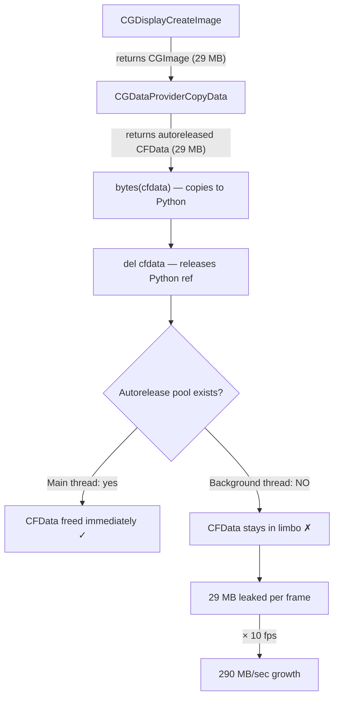

# Memory Safety

Critical findings from debugging a 95 GB memory leak (March 2026).

## Root Cause: Quartz CGImage Native Memory

`CGWindowListCreateImage()` returns a Core Foundation `CGImage` object.
Its pixel buffer (10-50 MB per capture, depending on window resolution
and Retina scaling) is allocated in **native C memory** that Python's
garbage collector does not track.

Python only sees a lightweight pyobjc wrapper object (~100 bytes).
The GC can collect the wrapper, but the native pixel buffer stays
allocated until the Core Foundation reference count reaches zero.

### The Leak

```python
# BEFORE (leaking):
def capture_window(window_id, max_width, quality):
    cg_image = CGWindowListCreateImage(...)       # 30 MB native alloc
    pil_image = _cgimage_to_pil(cg_image)         # copies pixels, but cg_image still alive
    # ... encode to JPEG ...
    return jpeg_bytes
    # cg_image goes out of scope here, but pyobjc may NOT release it immediately
    # At 10 FPS = 300 MB/sec of unreleased native memory
```

### The Fix

```python
# AFTER (fixed):
def capture_window(window_id, max_width, quality):
    cg_image = CGWindowListCreateImage(...)
    try:
        pil_image = _cgimage_to_pil(cg_image)
    finally:
        CFRelease(cg_image)                        # explicit native release
        del cg_image                               # drop Python reference
    # ... encode to JPEG ...
    pil_image.close()                              # release PIL's internal buffer
    return jpeg_bytes
```

### Why Python's GC Doesn't Help

1. **Pyobjc bridge objects** hold a reference to the underlying CF object.
   Python's refcount may drop to zero, but pyobjc defers the `CFRelease`
   to its own ref tracking, which can lag.

2. **Circular references** between the CGImage, its data provider, and
   the raw data object prevent immediate collection. The cyclic GC
   eventually collects them, but "eventually" at 10 FPS means hundreds
   of frames accumulate before a GC cycle runs.

3. **Python's memory allocator (pymalloc)** does not return freed memory
   to the OS. Once the process RSS grows, it stays high even after GC
   runs. Only restarting the process reclaims OS memory.

### Impact

| Scenario | Leak rate | Time to 10 GB |
|----------|----------|---------------|
| Streaming at 10 FPS, 1080p window | ~120 MB/min | ~83 minutes |
| Streaming at 10 FPS, via cloud proxy | ~120 MB/min | ~83 minutes |
| No streaming (thumbnails only) | ~2 MB/min | ~83 hours |

## Root Cause 2: CGDataProviderCopyData Autorelease Leak (March 2026)

After fixing the original CGImage leak (explicit `del` after pixel extraction),
memory still grew unboundedly during streaming — **17 GB RSS after 1200 frames**
on a 5120×1440 Retina display.

### The Problem

`CGDataProviderCopyData()` returns a `CFData` object that is **autoreleased**
by Core Foundation. On the main thread, the NSRunLoop drains the autorelease
pool every iteration. But `hort/stream.py` runs captures in a **thread pool
executor** (`run_in_executor`), and background threads in Python have **no
autorelease pool** by default.



The native `CFData` object (`raw_data` from `CGDataProviderCopyData`) was
marked for autorelease but never actually released because no pool existed
to drain. `del raw_data` only removed the Python wrapper — the underlying
CF memory stayed allocated, invisible to Python's GC.

### What Didn't Work

| Attempt | Result | Why |
|---------|--------|-----|
| `gc.collect()` every frame | RSS still grew to 19 GB | GC collects Python objects, not autoreleased CF objects |
| `gc.collect()` every 50 frames | Same | Same root cause |
| `objc.autorelease_pool()` wrapper | Reduced leak but didn't eliminate | Some CF objects escaped the pool scope via pyobjc bridge caching |
| Moving capture+crop+resize into executor | No improvement | The leak was inside `_cgimage_to_pil`, not in the caller |
| Closing PIL images aggressively | Helped marginally | PIL `.close()` releases PIL buffers but not the CF source data |
| RGBA→RGB `.convert()` fix (close original) | Saved ~30% | Was leaking the RGBA copy, but CF leak was the main problem |

### Fix History: CGBitmapContext Was Worse

The first fix replaced `CGDataProviderCopyData` with `CGBitmapContextCreate`,
reasoning that a Python-owned `bytearray` avoids autoreleased CF objects.
**This was wrong.** `CGContextDrawImage` creates an internal decompression
cache (~34 MB per frame on 5K displays) that pyobjc cannot release. Even
with `del ctx`, the cache persists until the process exits.

| Approach | Leak rate (5120x1440) | After 20 frames |
|----------|----------------------|-----------------|
| `CGDataProviderCopyData` (no pool) | ~28 MB/frame | 563 MB |
| `CGBitmapContextCreate` (any pool) | ~34 MB/frame | 680 MB |
| **`CGDataProviderCopyData` + `autorelease_pool()`** | **<2 MB/frame** | **~40 MB stable** |

### The Actual Fix: CGDataProviderCopyData + autorelease_pool()

The correct solution uses `CGDataProviderCopyData` but wraps every call
site in `objc.autorelease_pool()` so the autoreleased CFData is drained
immediately — even on background threads.

```python
# CORRECT (current implementation):
def capture_window(window_id, max_width, quality):
    import objc

    with objc.autorelease_pool():                      # ← drains CF objects
        cg_image = _raw_capture(window_id)             # CGImage (29 MB native)
        if cg_image is None:
            return None
        try:
            pil_image = _cgimage_to_pil(cg_image)      # CGDataProviderCopyData inside
        finally:
            del cg_image                               # release CGImage immediately
    # autorelease pool drained — CFData from CGDataProviderCopyData freed

    return _encode_pil_to_jpeg(pil_image, max_width, quality)
```

The key insight: `objc.autorelease_pool()` **does** work when it wraps the
entire capture-to-PIL pipeline. The earlier failure was because some call
sites (stream.py, video_track.py, llming_lens) ran captures **without any
pool at all**, not because the pool was insufficient.

### Rules

!!! danger "Every CG*Create* call MUST be inside `objc.autorelease_pool()`"
    This applies to `CGWindowListCreateImage`, `CGDisplayCreateImage`,
    `CGImageCreateWithImageInRect`, `CGDataProviderCopyData`, and all
    SkyLight `CGSCopy*` calls. Without a pool, autoreleased CF objects
    leak their native memory on background threads.

!!! danger "Never use `CGBitmapContextCreate` for pixel extraction"
    `CGContextDrawImage` creates an internal decompression cache (~34 MB
    per frame) that cannot be released by Python. Use `CGDataProviderCopyData`
    inside an autorelease pool instead (<2 MB/frame residual).

!!! warning "SkyLight calls need pools too"
    `CGSCopyManagedDisplaySpaces()` and `CGSCopySpacesForWindows()` return
    CF objects via ctypes. Wrap them in `objc.autorelease_pool()` to prevent
    leaks during window list refreshes.

!!! tip "Validate with the integration test"
    `tests/test_screen.py::TestRealQuartzCapture::test_repeated_captures_no_leak`
    runs 20 real desktop captures and asserts RSS growth stays under 50 MB.
    Run it after any capture code changes:
    ```bash
    poetry run pytest tests/test_screen.py::TestRealQuartzCapture -v
    ```

## Secondary Issue: WebSocket Backpressure

When the browser connects through the cloud proxy (access server tunnel),
JPEG frames are:
1. Captured by `hort/screen.py`
2. Sent via `websocket.send_bytes()` to the browser
3. Relayed via the tunnel client as base64-encoded JSON

If the tunnel (Azure WebSocket) is slower than the capture rate,
`send_bytes()` queues frames in Starlette's internal buffer. Each
frame is ~200 KB. At 10 FPS with a slow tunnel, this adds ~2 MB/sec
of buffered data on top of the CGImage leak.

### Fix: Frame Queue with Drop

`hort/stream.py` now uses a `maxsize=1` asyncio Queue. The capture
loop puts the latest frame in; the send loop takes it out. If a new
frame arrives before the old one was sent, the old one is replaced.
At most 1 frame is ever buffered.

```python
_frame_queue: asyncio.Queue[bytes | None] = asyncio.Queue(maxsize=1)

# Capture loop:
if _frame_queue.full():
    _frame_queue.get_nowait()   # drop old frame
_frame_queue.put_nowait(frame)

# Send loop:
frame = await _frame_queue.get()
await websocket.send_bytes(frame)
```

### Tunnel Client Backpressure

`hort/access/tunnel_client.py` has the same issue for binary frames
forwarded through the H2H tunnel. Fix: a lock-based drop mechanism
that skips frames when the previous send is still in progress.

## aiortc RTCPeerConnection Resource Leak (April 2026)

`aiortc` `RTCPeerConnection` objects hold significant internal resources:

- **UDP sockets** — 4-6 ports per peer (STUN, ICE candidates, DTLS)
- **asyncio tasks** — ICE timers, DTLS handshake, SCTP state machine
- **Internal state** — candidate pairs, transport buffers

Unlike browser WebRTC, `aiortc` does **not** garbage-collect these when the Python
object is dereferenced. `.close()` must be called explicitly.

### The Problem

When a mobile app is swipe-killed, the WebRTC DataChannel closes abruptly on the
client side. The server-side `aiortc` peer never receives a clean close notification.
The `on_state_change` callback may not fire (state stays "connecting" forever).

After 5-6 zombie sessions accumulate, the asyncio event loop becomes congested with
dead peer housekeeping tasks. New ICE negotiations time out because the event loop
can't process their callbacks in time.

### The Fix

```python
# Force-kill sessions not in "connected" state after 30 seconds
async def _cleanup_dead_sessions(self) -> None:
    for sid, session in list(self._sessions.items()):
        state = session.peer.connection_state
        age = time.monotonic() - session.created_at
        if state in ("failed", "closed", "disconnected"):
            await self._close_session(session)
        elif age > 30 and state != "connected":
            # App was swipe-killed, network dropped, or ICE failed silently
            await self._close_session(session)
```

**Critical**: `_close_session` must call both `proxy.stop()` and `peer.close()`.
Without `peer.close()`, the UDP sockets and asyncio tasks leak indefinitely.

### aiortc Rules

- **Always call `peer.close()`** — never let a `RTCPeerConnection` exist without a cleanup path
- **Cleanup interval: 15 seconds** — fast enough to catch zombies before they accumulate
- **Force-kill threshold: 30 seconds** — any session not "connected" after 30s is dead
- **Log state changes** — `on_state_change` should log every state to diagnose silent failures
- **Monitor session count** — if `active_sessions` grows without matching "ended" logs, sessions are leaking

## Quartz Rules

1. **Never use `CGDataProviderCopyData()` on background threads.**
   It creates autoreleased CFData that never drains. Use
   `CGBitmapContextCreate` + `CGContextDrawImage` to render into a
   Python-owned `bytearray` instead. This is the single most important
   rule — violating it causes unbounded memory growth (~290 MB/sec at
   10 FPS on a 5K display).

2. **Do NOT call `CFRelease()` on pyobjc-managed objects** — pyobjc
   owns the reference and a double-release causes SIGABRT (crash).
   Instead, `del` the Python reference and let pyobjc handle it.

3. **Always `pil_image.close()`** after encoding. PIL images hold
   internal C buffers that are not freed until `close()` or `__del__()`.
   When converting formats (e.g. `.convert("RGB")`), close the source
   image immediately — don't wait for it to go out of scope.

4. **Never queue frames unbounded.** Any producer-consumer pattern
   for binary data (frames, audio, video) must have a bounded buffer
   with a drop policy. Use `asyncio.Queue(maxsize=1)` for latest-wins.

5. **Test with continuous streaming.** Memory leaks in capture/stream
   paths only manifest under sustained load. The debug endpoint
   `GET /api/debug/memory` returns RSS, GC object counts, and asyncio
   task counts for monitoring.

6. **Benchmark before shipping capture changes.** Run 200 frames in a
   tight loop and verify RSS stabilizes. If it grows linearly, there is
   a native memory leak. See the benchmark script in "Root Cause 2" above.

7. **Set `limit=` on asyncio subprocess pipes that carry large payloads.**
   `asyncio.create_subprocess_exec(stdout=PIPE)` defaults to a 64 KB
   stream buffer. A single `readline()` call will raise
   `LimitOverrunError` if a line exceeds this. Claude Code's
   `--output-format stream-json` emits `result` events as single JSON
   lines that can be megabytes when MCP tool outputs contain base64
   screenshots. Use `limit=10 * 1024 * 1024` (10 MB) for any subprocess
   that may return large tool results.

## Debug Endpoint

`GET /api/debug/memory` returns:

```json
{
  "rss_mb": 154.5,
  "gc_objects": 150275,
  "asyncio_tasks": 22,
  "task_names": ["Task-1", "..."],
  "top_object_counts": [["dict", 49736], ...],
  "top_object_sizes_mb": [["dict", 11.28], ...]
}
```

Key signals:
- **RSS growing but gc_objects stable** → native memory leak (CGImage, PIL buffers)
- **RSS growing and gc_objects growing** → Python object leak (unbounded list, leaked tasks)
- **asyncio_tasks growing** → leaked `create_task()` calls (tasks never awaited/cancelled)
