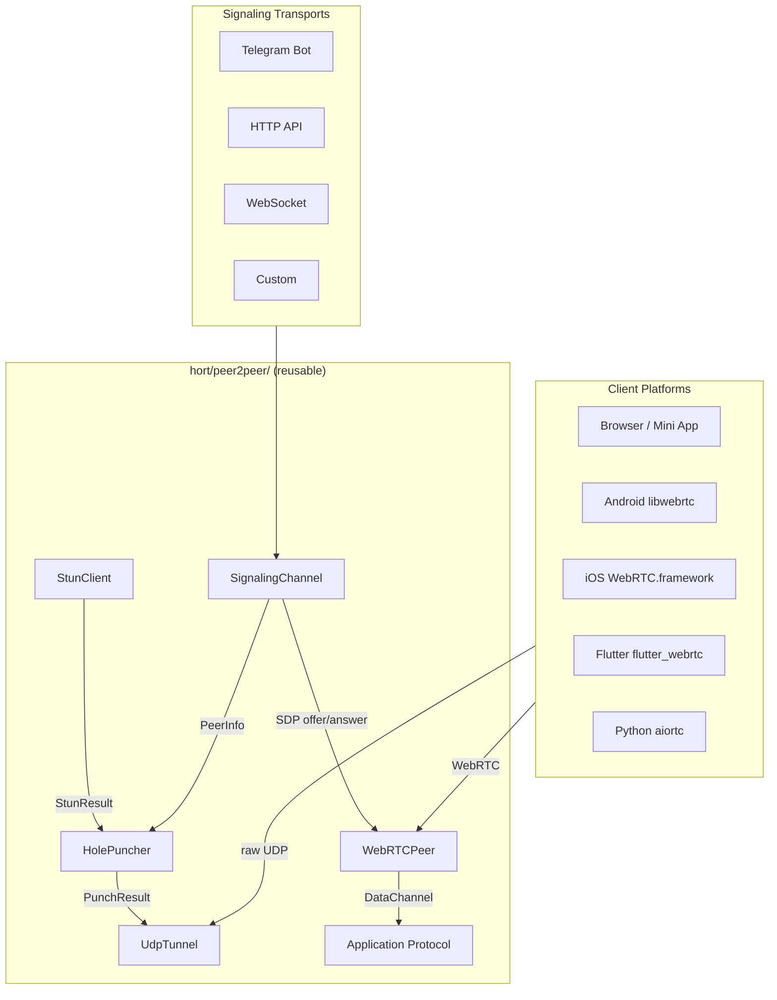
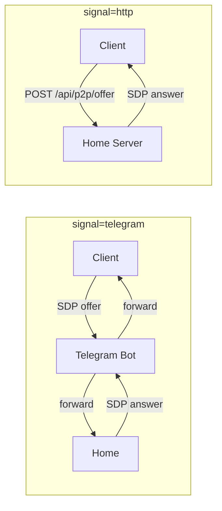
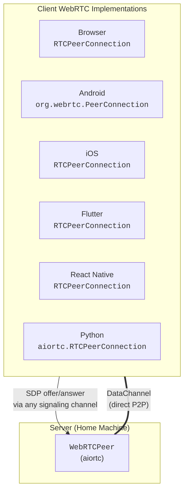

# Peer-to-Peer Library Reference

Reusable P2P connectivity library at `hort/peer2peer/`. Framework-agnostic — no openhort extension dependencies.

## Architecture



## Three-Layer Design

Every P2P connection has three layers. Each is independent and swappable:

```mermaid
flowchart TB
    subgraph L3["Layer 3: Application Protocol"]
        direction LR
        FRAMES["JPEG frames (binary)"]
        INPUT["Input events (JSON)"]
        CONTROL["Control messages (JSON)"]
    end
    subgraph L2["Layer 2: Transport"]
        direction LR
        WEBRTC_T["WebRTC DataChannel<br/>(browsers, native apps)"]
        UDP_T["UDP Tunnel<br/>(server-to-server)"]
    end
    subgraph L1["Layer 1: Signaling"]
        direction LR
        TG_S["Telegram<br/>(no server needed)"]
        HTTP_S["HTTP fetch<br/>(LAN / direct)"]
        WS_S["WebSocket<br/>(relay server)"]
    end
    L3 --> L2 --> L1

    style L3 fill:#1a3a1a
    style L2 fill:#1a2a3a
    style L1 fill:#2a1a3a
```



| Layer | Responsibility | Implementation |
|-------|---------------|----------------|
| **Signaling** | Exchange ~4 KB of SDP to bootstrap connection | `SignalingChannel` ABC |
| **Transport** | Encrypted bidirectional data channel through NAT | `WebRTCPeer` or `UdpTunnel` |
| **Protocol** | Application data over the channel | Defined by the consumer |

## Signaling Modes



| Mode | When to use | Requires server visible? |
|------|-------------|------------------------|
| `telegram` | Remote access over internet | No |
| `http` | LAN access, testing | Yes |

The `?signal=` query parameter on the Mini App URL selects the mode. The bot dynamically constructs the URL with the right parameter.

## WebRTC Peer (Server-Side)

`WebRTCPeer` wraps an `aiortc.RTCPeerConnection` for browser-to-server connections:

```python
from hort.peer2peer.webrtc import WebRTCPeer, WebRTCPeerRegistry

# Single peer
peer = WebRTCPeer(
    on_message=handle_message,     # called when browser sends data
    on_state_change=handle_state,  # "connecting", "connected", "failed", ...
    stun_servers=["stun:stun.l.google.com:19302"],
)
answer_sdp = await peer.accept_offer(browser_sdp_offer)
# → send answer_sdp back via signaling

await peer.wait_connected(timeout=30)
await peer.send(jpeg_bytes)         # binary to browser
await peer.send_json({"type": "windows", ...})  # JSON to browser
await peer.close()
```

### Peer Registry

Manages multiple peers (one per browser session):

```python
registry = WebRTCPeerRegistry()

# Accept offer, get answer
answer = await registry.create_peer(
    session_id="abc123",
    offer_sdp=sdp,
    on_message=handler,
)

# Send to specific session
await registry.send_to("abc123", frame_bytes)

# List active sessions
sessions = registry.active_sessions  # ["abc123", ...]

# Cleanup
await registry.close_all()
```

## Client Platforms

The same server-side `WebRTCPeer` works with any WebRTC client:



All platforms follow the same flow:

1. Create `RTCPeerConnection` with STUN server config
2. Create DataChannel (or wait for server to create one)
3. Create SDP offer → send via signaling → receive answer
4. ICE negotiation happens automatically
5. DataChannel opens → exchange frames and input

### Native App Integration

For Android/iOS native apps, the WebRTC API is nearly identical to the browser:

=== "Android (Kotlin)"

    ```kotlin
    val factory = PeerConnectionFactory.builder().createPeerConnectionFactory()
    val pc = factory.createPeerConnection(config, observer)
    val dc = pc.createDataChannel("hort", DataChannel.Init())

    pc.createOffer(object : SdpObserver {
        override fun onCreateSuccess(sdp: SessionDescription) {
            pc.setLocalDescription(this, sdp)
            // Send sdp.description via Telegram bot
        }
    }, constraints)
    ```

=== "iOS (Swift)"

    ```swift
    let factory = RTCPeerConnectionFactory()
    let pc = factory.peerConnection(with: config, constraints: constraints, delegate: self)
    let dc = pc.dataChannel(forLabel: "hort", configuration: dcConfig)

    pc.offer(for: constraints) { sdp, error in
        pc.setLocalDescription(sdp!) { _ in
            // Send sdp.sdp via Telegram bot
        }
    }
    ```

=== "Flutter (Dart)"

    ```dart
    final pc = await createPeerConnection({'iceServers': [{'urls': 'stun:stun.l.google.com:19302'}]});
    final dc = await pc.createDataChannel('hort', RTCDataChannelInit());

    final offer = await pc.createOffer();
    await pc.setLocalDescription(offer);
    // Send offer.sdp via Telegram bot
    ```

## Core Types

### NatType

```python
class NatType(enum.Enum):
    FULL_CONE = "full-cone"         # punchable=True
    RESTRICTED = "restricted"       # punchable=True
    PORT_RESTRICTED = "port-restricted"  # punchable=True
    SYMMETRIC = "symmetric"         # punchable=False
    OPEN = "open"                   # punchable=True (no NAT)
    UNKNOWN = "unknown"             # punchable=False
```

### StunResult

| Field | Type | Description |
|-------|------|-------------|
| `public_ip` | `str` | Public IP as seen by STUN server |
| `public_port` | `int` | Public port (NAT-mapped) |
| `local_ip` | `str` | Local interface IP |
| `local_port` | `int` | Local socket port |
| `nat_type` | `NatType` | Detected NAT classification |

### PeerInfo

Exchanged via signaling. Serializable with `to_dict()` / `from_dict()`:

| Field | Type | Description |
|-------|------|-------------|
| `peer_id` | `str` | Unique peer identifier |
| `public_ip` | `str` | Public IP from STUN |
| `public_port` | `int` | Public port from STUN |
| `local_ip` | `str` | Local IP (for LAN fallback) |
| `local_port` | `int` | Local port |
| `nat_type` | `NatType` | Peer's NAT type |

### PunchResult

| Field | Type | Description |
|-------|------|-------------|
| `success` | `bool` | Whether the punch succeeded |
| `local_port` | `int` | Local UDP port used |
| `remote_addr` | `tuple[str, int]` | Remote (ip, port) that responded |
| `rtt_ms` | `float` | Round-trip time in milliseconds |
| `error` | `str` | Error message if failed |

## STUN Client

RFC 5389 Binding Request/Response. No external dependencies.

```python
from hort.peer2peer import StunClient

client = StunClient(
    stun_servers=[("stun.l.google.com", 19302)],
    timeout=5.0,
)

result = await client.detect_nat_type()
# StunResult(public_ip='93.184.216.34', public_port=12345, nat_type=NatType.PORT_RESTRICTED)
```

**NAT detection:** Sends Binding Requests to two STUN servers from the same local port. If mapped ports differ → symmetric NAT. If same → cone NAT (conservatively classified as port-restricted).

## SignalingChannel ABC

```python
class SignalingChannel(ABC):
    async def send_offer(self, peer_info: PeerInfo) -> None: ...
    async def wait_answer(self, timeout: float = 30.0) -> PeerInfo: ...
    async def close(self) -> None: ...
    async def exchange(self, local: PeerInfo, timeout: float) -> PeerInfo:
        """Convenience: send_offer + wait_answer."""
```

### CallbackSignaling

For embedding into existing channels:

```python
from hort.peer2peer.signal import CallbackSignaling

channel = CallbackSignaling(on_send=my_send_function)
await channel.deliver(received_data)  # dict or JSON string
```

## UDP Tunnel (Server-to-Server)

For non-browser scenarios (two openhort nodes, VNC relay, etc.):

```python
from hort.peer2peer import StunClient, HolePuncher, UdpTunnel

# Discover + punch
stun = StunClient()
result = await stun.detect_nat_type()
punch = await HolePuncher.punch_with_signaling(result, signal, "my-id")

# Reliable tunnel
tunnel = await UdpTunnel.create(punch.local_port, punch.remote_addr)
await tunnel.send(b"data")
data = await tunnel.recv()
await tunnel.close()
```

### Wire Protocol

```
[type:1][sequence:4][length:2][payload:0-1200]
```

| Type | Value | ACK Required |
|------|-------|-------------|
| PING | 0x01 | No (PONG response) |
| PONG | 0x02 | No |
| DATA | 0x03 | Yes |
| ACK  | 0x04 | No |
| FIN  | 0x05 | No |

## Building a New P2P Extension

The library is decoupled from openhort. To build a new P2P feature:

```python
from hort.peer2peer.webrtc import WebRTCPeer

class MyP2PFeature:
    async def accept_connection(self, sdp_offer: str) -> str:
        """Accept a WebRTC offer from any client platform."""
        self.peer = WebRTCPeer(on_message=self.handle_data)
        return await self.peer.accept_offer(sdp_offer)

    async def handle_data(self, data: bytes | str) -> None:
        # Process incoming data from client
        ...

    async def send_update(self, data: bytes) -> None:
        await self.peer.send(data)
```

The same pattern works for VNC, file transfer, remote terminal, or any other protocol over a direct P2P channel.

## API Endpoints

| Endpoint | Method | Purpose |
|----------|--------|---------|
| `/api/p2p/offer` | POST | Accept SDP offer, return SDP answer |
| `/api/p2p/status/{session_id}` | GET | Check if P2P connection is active |
| `/p2p` | GET | Serve the P2P viewer (Telegram & standalone) |

## Testing

```bash
# Unit tests (84 tests, 100% coverage, mocked — no network)
poetry run pytest tests/test_peer2peer_*.py -v

# Integration tests (Playwright, real WebRTC in headless Chromium)
poetry run pytest tests/test_p2p_playwright.py -v -m integration
```
