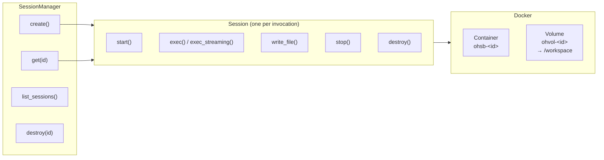
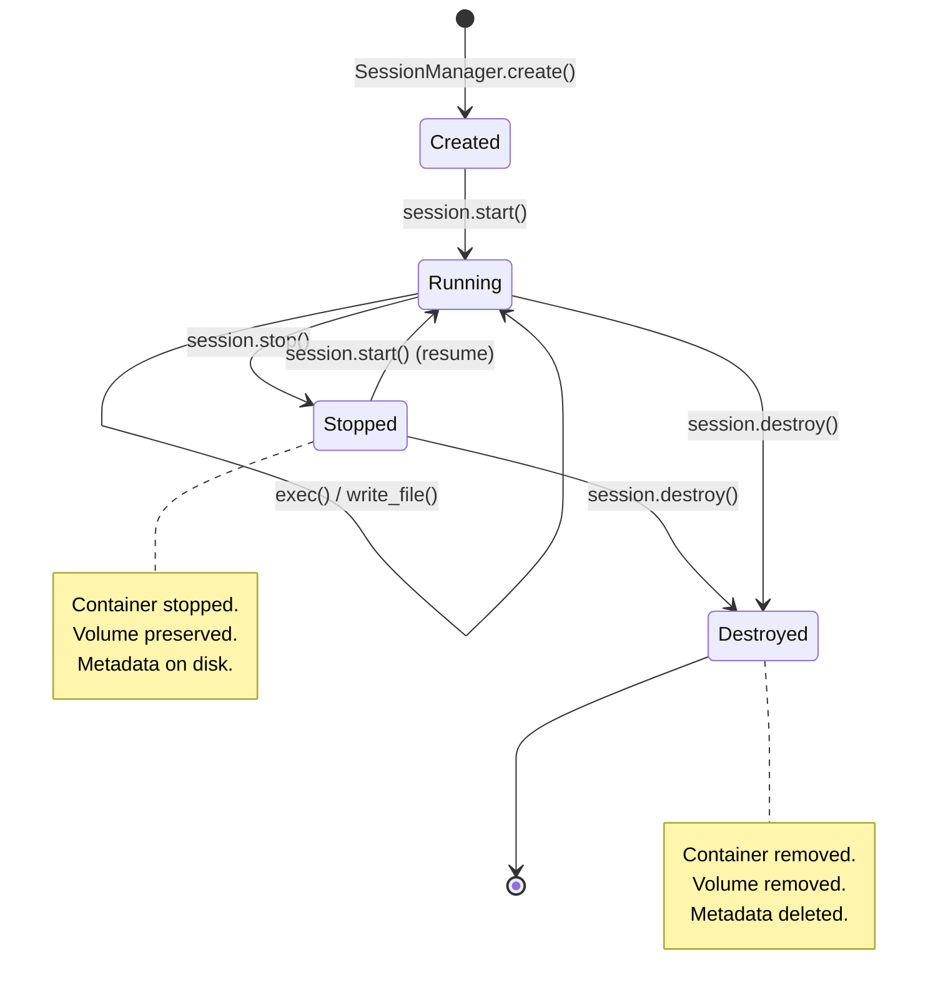
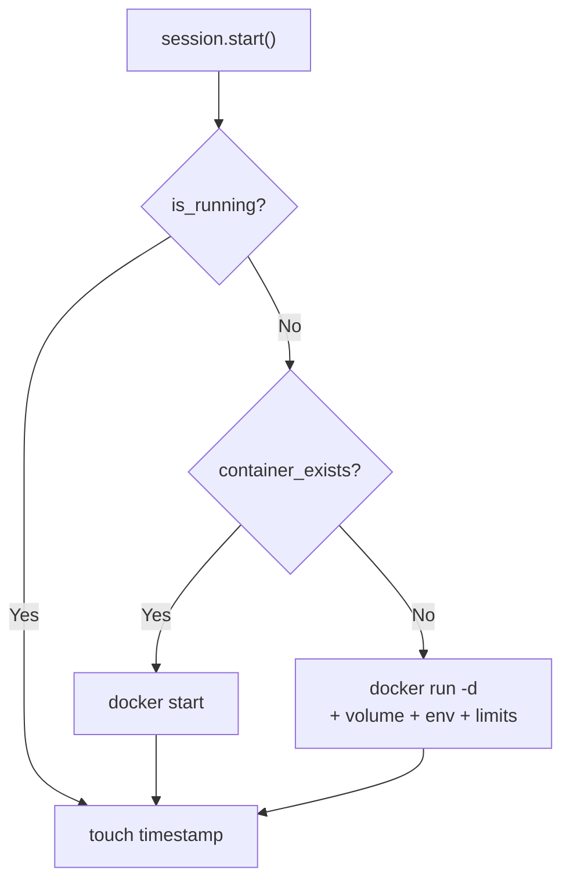
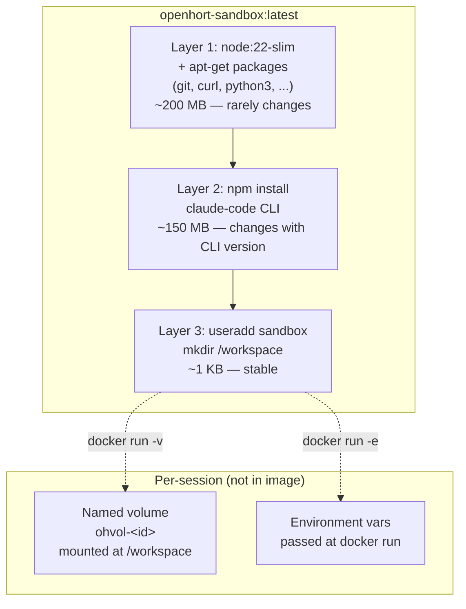
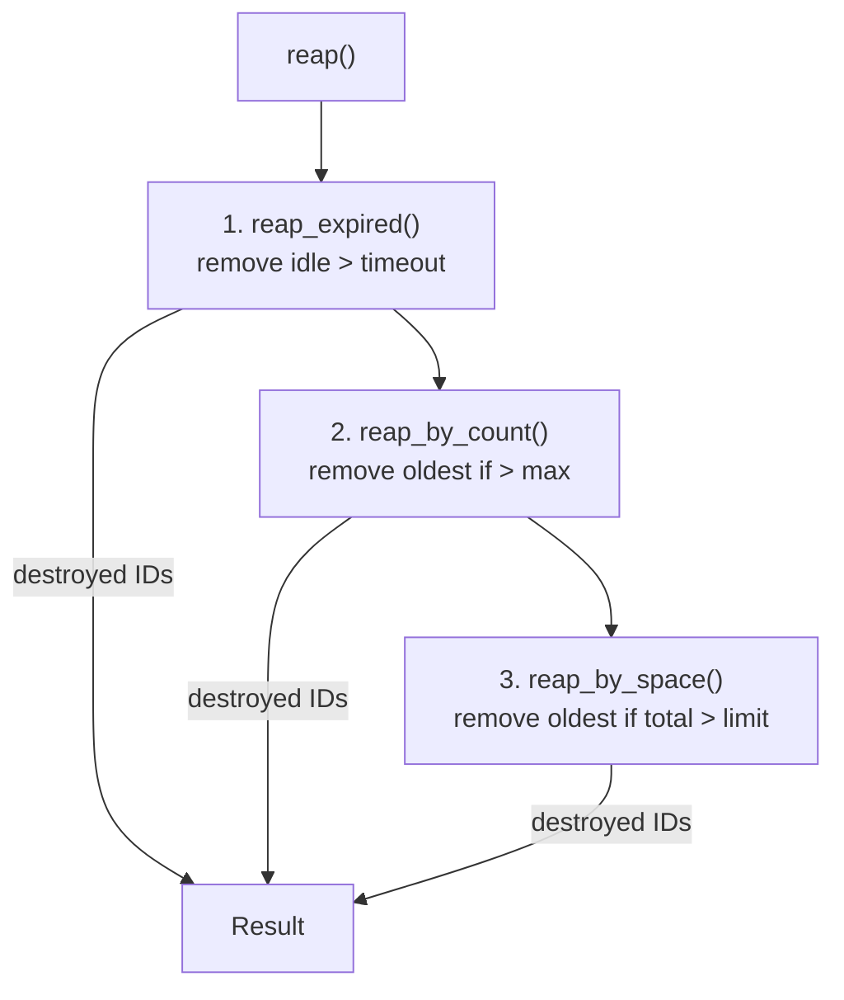
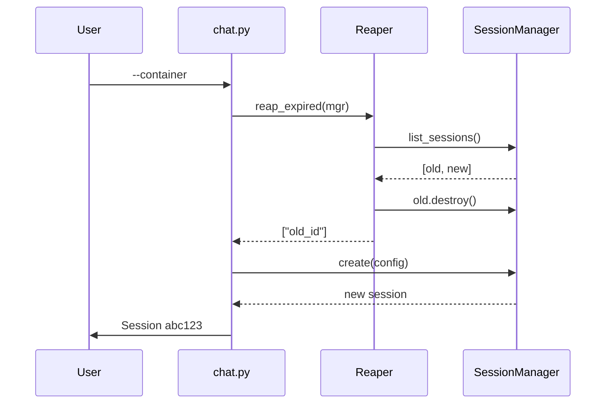

# Sandbox Sessions

Reusable isolated execution environments backed by Docker containers
and named volumes.  Sessions can be created, stopped, resumed, and
destroyed — with automatic cleanup for expired or space-exceeding
sessions.

## Overview



A session is **not** tied to Claude or any specific tool.  It is a
general-purpose sandbox that any command can run in.

## Session Lifecycle



### Create

Allocates IDs, writes metadata, does **not** start Docker.

```python
from hort.sandbox import SessionManager, SessionConfig

mgr = SessionManager()
session = mgr.create(SessionConfig(
    memory="1g",
    cpus=2,
    env={"API_KEY": "sk-..."},
    timeout_minutes=120,
))
```

### Start

Creates the Docker container (or starts a stopped one).  The named
volume is mounted at `/workspace`.

```python
session.start()
```



### Execute

Run commands inside the session.  Two modes:

```python
# Blocking — wait for result
result = session.exec(["python3", "-c", "print('hello')"],
                      capture_output=True, text=True)
print(result.stdout)

# Streaming — pipe stdout for real-time processing
proc = session.exec_streaming(["claude", "-p", "explain Docker"])
for line in proc.stdout:
    print(line.decode(), end="")
```

Both modes auto-start the container if it's stopped.

### Stop (preservable)

Stops the container but preserves the volume and metadata.
The session can be resumed later with `start()`.

```python
session.stop()
# Volume /workspace still exists
# Metadata file ~/.openhort/sessions/<id>.json still exists
```

### Resume

Load a previous session by ID and restart it.  All workspace files
are intact because they live in the volume.

```python
session = mgr.get("abc123def456")
session.start()  # docker start (not docker run)
session.exec(["ls", "/workspace"])  # previous files are there
```

### Destroy

Removes everything: container, volume, metadata file.

```python
session.destroy()
# or
mgr.destroy("abc123def456")
```

## Docker Layer Strategy

The sandbox image is designed for maximum layer reuse across rebuilds:



!!! tip "Key principle"
    Session-specific state (files, config, env vars) is **never** baked
    into the image.  It lives in volumes and env vars passed at runtime.
    This means one image serves all sessions.

### Pinning CLI versions

```bash
# Latest (default)
docker build -t openhort-sandbox:latest .

# Pinned version (reproducible)
docker build --build-arg CLAUDE_CLI_VERSION=1.0.20 \
  -t openhort-sandbox:latest .
```

### Extending for custom tools

```dockerfile
FROM openhort-sandbox:latest
USER root
RUN pip3 install numpy pandas scikit-learn
USER sandbox
```

The base layers are reused — only the new `pip install` layer is added.

## Cleanup & Reaper

Sessions accumulate over time.  The reaper automatically removes
stale sessions based on configurable policies.



### Policy: Expired sessions

Each session has a `timeout_minutes` (default: 60).  If
`last_active + timeout < now`, the session is destroyed.

```python
from hort.sandbox.reaper import reap_expired

destroyed = reap_expired(mgr)
# Returns list of destroyed session IDs
```

The `last_active` timestamp updates on every `start()`, `stop()`,
`exec()`, and `write_file()` call.

### Policy: Session count

Keep at most N sessions.  Oldest (by `last_active`) are removed first.

```python
from hort.sandbox.reaper import reap_by_count

destroyed = reap_by_count(mgr, max_sessions=10)
```

### Policy: Disk space

Measures actual Docker volume sizes.  Removes oldest sessions until
total space is under the limit.

```python
from hort.sandbox.reaper import reap_by_space

destroyed = reap_by_space(mgr, max_bytes=5 * 1024**3)  # 5 GB
```

### Combined

Run all policies in priority order:

```python
from hort.sandbox.reaper import reap

destroyed = reap(mgr, max_sessions=20, max_bytes=5 * 1024**3)
```

### Automatic cleanup

The chat loop runs `reap_expired()` on every startup.  No manual
intervention needed for timeout-based cleanup.



### Manual cleanup

```bash
# List all sessions
poetry run python -m hort.extensions.claude_chat --list-sessions

# Destroy a specific session
poetry run python -m hort.extensions.claude_chat --destroy-session abc123

# Run all cleanup policies
poetry run python -m hort.extensions.claude_chat --cleanup
```

## Metadata Storage

Session metadata is stored as JSON files in `~/.openhort/sessions/`:

```
~/.openhort/sessions/
  abc123def456.json
  789012345678.json
```

Each file contains:

```json
{
  "id": "abc123def456",
  "container_name": "ohsb-abc123def456",
  "volume_name": "ohvol-abc123def456",
  "config": {
    "image": "openhort-sandbox:latest",
    "memory": "1g",
    "cpus": 2,
    "env": {"ANTHROPIC_API_KEY": "sk-..."},
    "timeout_minutes": 120
  },
  "created_at": "2026-03-27T10:00:00+00:00",
  "last_active": "2026-03-27T11:30:00+00:00",
  "user_data": {
    "claude_session_id": "session_abc123"
  }
}
```

The `user_data` field is free-form — callers can store arbitrary
metadata (e.g., Claude's conversation session ID for resume).

## CLI Reference

| Flag | Description |
|------|-------------|
| `--container` / `-c` | Run in a Docker sandbox session |
| `--session ID` | Resume an existing session |
| `--memory SIZE` | Memory limit (e.g. `512m`, `2g`) |
| `--cpus N` | CPU limit (e.g. `1`, `0.5`, `4`) |
| `--disk SIZE` | Disk limit (e.g. `1g`) |
| `--list-sessions` | List all sessions and exit |
| `--destroy-session ID` | Destroy a session and exit |
| `--cleanup` | Run cleanup policies and exit |

## Usage Examples

### Basic sandboxed chat

```bash
poetry run python -m hort.extensions.claude_chat --container
# Prints: Session abc123def456
# Chat normally, then Ctrl-C
# Prints: Session preserved: --session abc123def456
```

### Resume a previous session

```bash
poetry run python -m hort.extensions.claude_chat -c --session abc123def456
# Workspace files from previous session are still there
# Claude conversation resumes automatically
```

### Custom resource limits

```bash
poetry run python -m hort.extensions.claude_chat -c \
  --memory 2g --cpus 4 --model opus
```

### Non-chat usage (programmatic)

```python
from hort.sandbox import SessionManager, SessionConfig

mgr = SessionManager()
session = mgr.create(SessionConfig(
    image="python:3.12-slim",
    memory="256m",
    timeout_minutes=30,
))
session.start()

# Run arbitrary commands
result = session.exec(
    ["python3", "-c", "import sys; print(sys.version)"],
    capture_output=True, text=True,
)
print(result.stdout)

# Write files
session.write_file("/workspace/script.py", "print('hello')")
session.exec(["python3", "/workspace/script.py"])

# Stop (preserves workspace)
session.stop()

# Later: resume
session = mgr.get(session.id)
session.start()

# Done: clean up
session.destroy()
```

## Module Structure

```
hort/sandbox/                          ← Core (any extension can use)
  session.py       — SessionConfig, SessionMeta, Session, SessionManager
  reaper.py        — reap_expired, reap_by_count, reap_by_space, reap
  mcp.py           — MCP server config, tool filtering
  mcp_proxy.py     — SSE proxy for outside-container MCPs

hort/extensions/claude_chat/           ← Claude extension
  auth.py          — get_oauth_token (macOS Keychain)
  chat.py          — interactive chat loop
  Dockerfile       — layered image (base → Claude CLI → user)
```

## Test Coverage

| Test file | Tests | Covers |
|-----------|-------|--------|
| `test_sandbox.py` | 22 | Config, state queries, start/stop/destroy, exec, write_file, run command construction, metadata persistence, SessionManager CRUD, image ops |
| `test_reaper.py` | 11 | Size parsing, expired cleanup, count limits, space limits, combined reap |
| `test_container.py` | 4 | Keychain token extraction |
