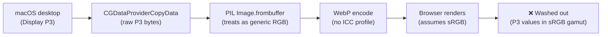
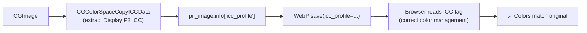
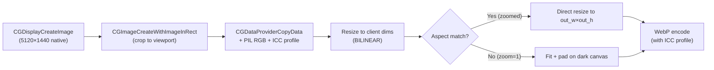

# Screen Capture Architecture

How openhort captures windows and the full desktop on macOS.

## Capture Modes

### Per-Window Capture

Uses `CGWindowListCreateImage` with `kCGWindowListOptionIncludingWindow`
to capture a single window by its window ID.

```python
capture_window(window_id=12345, max_width=800, quality=70)
```

### Full Desktop Capture

Uses `CGDisplayCreateImage(CGMainDisplayID())` to capture the
entire main display — all windows composited, like TeamViewer
or Remote Desktop.

```python
from hort.screen import DESKTOP_WINDOW_ID
capture_window(window_id=DESKTOP_WINDOW_ID, max_width=800, quality=70)
```

`DESKTOP_WINDOW_ID = -1` is a magic constant. When passed to
`capture_window()`, it routes to `_raw_capture_desktop()` instead
of `_raw_capture()`.

## Virtual Desktop Entry

`hort/windows.py` prepends a virtual "Desktop — Full Screen" entry
to the window list (window_id=-1). It appears as the first card in
the picker grid.

```python
WindowInfo(
    window_id=DESKTOP_WINDOW_ID,  # -1
    owner_name="Desktop",
    window_name="Full Screen",
    bounds=WindowBounds(x=0, y=0, width=screen_w, height=screen_h),
    owner_pid=0,  # no specific app
)
```

**Bounds** come from `CGDisplayBounds(CGMainDisplayID())` — the
actual logical pixel dimensions of the main display. These must
match the captured image dimensions for click coordinate mapping.

## Input in Desktop Mode

When clicking in the Desktop viewer:
- `owner_pid=0` → `_activate_app()` is skipped (no app to raise)
- Click goes to absolute screen coordinates via `CGEventPost`
- macOS delivers the click to whatever window is at those coordinates

The stream also skips `_raise_window()` for Desktop (window_id < 0).

## Thumbnail Rotation (`hort/thumbnailer.py`)

Instead of the client requesting all thumbnails simultaneously
(N concurrent Quartz captures), the server maintains a rotation
queue.

### How it works

1. Client sends `subscribe_thumbnails` once (instead of N `get_thumbnail` requests)
2. Server cycles through all windows, capturing one at a time
3. Each thumbnail is pushed to all subscribed clients
4. Rate: ~2 captures/second, regardless of window count

### Timing

| Windows | Cycle time | Per-window refresh |
|---------|-----------|-------------------|
| 5 | 2.5s | every 2.5s |
| 10 | 5s | every 5s |
| 30 | 15s | every 15s |
| 50 | 15s (capped) | every 15s |

Constants:
```python
MIN_INTERVAL = 0.5    # fastest: 2 captures/sec
MAX_CYCLE_TIME = 15.0 # full rotation capped at 15s
THUMB_MAX_WIDTH = 400  # smaller than stream (400 vs 800)
THUMB_QUALITY = 40     # lower quality for thumbs
```

### Memory

- At most 1 CGImage in memory at a time (sequential captures)
- Cached thumbnails stored as base64 strings (~20-50 KB each)
- Old cache entries removed when windows disappear

### Client Integration

```javascript
// Old (N concurrent captures — DO NOT USE):
state.navWindows.forEach(w => requestThumbnail(w.window_id));

// New (server-side rotation):
subscribeThumbnails();
```

## Stream Backpressure (`hort/stream.py`)

The binary stream WebSocket uses a `maxsize=1` asyncio Queue to
prevent memory growth when the client can't keep up:

```python
_frame_queue = asyncio.Queue(maxsize=1)

# Capture loop (producer):
if _frame_queue.full():
    _frame_queue.get_nowait()  # drop old frame
_frame_queue.put_nowait(frame)

# Send loop (consumer):
frame = await _frame_queue.get()
await websocket.send_bytes(frame)
```

At most 1 frame is buffered. If the client is slow (proxy, slow
network), frames are dropped — the viewer gets a lower effective
FPS but memory stays flat.

## Mobile Keyboard

On touch devices, the viewer toolbar shows a keyboard icon.
Tapping it focuses a hidden `<input>` element that triggers the
on-screen keyboard. Key input is forwarded as `input` events to
the remote machine.

Hidden on desktop (detected via `@media (hover: hover) and (pointer: fine)`).

## Color Profile Management (Display P3 → sRGB)

Modern Macs use **Display P3** (wide gamut) as their native color space.
Quartz captures return pixel data in the display's color space — not sRGB.
Without proper handling, streamed frames appear **washed out and desaturated**
because the browser interprets P3 pixel values as sRGB.

### The Problem



The browser applies sRGB→P3 display mapping, but the pixel values are
**already P3** — double-mapping compresses the dynamic range.

### The Fix: ICC Profile Embedding



The ICC profile is extracted once from the CGImage's color space and
attached to every PIL image via `info["icc_profile"]`. The WebP encoder
embeds it in each frame (~3.4 KB overhead). The browser's color
management engine reads the profile and renders correctly on any display.

**Key implementation details:**

- **`_cgimage_to_pil()` in `hort/screen.py`** extracts the ICC profile
  from `CGColorSpaceCopyICCData()` and stores it in `pil_image.info`.
- **`_capture_crop_resize()` in `hort/stream.py`** preserves the ICC
  profile across PIL `crop()`, `resize()`, and `Image.new()` operations
  (PIL doesn't copy `info` automatically).
- **WebP encode** passes `icc_profile=` to `pil_image.save()`.
- **VP8/VP9 path** uses `yuv420p` which has no ICC mechanism — color
  is only accurate in WebP mode. This is a known limitation.

### WebP Encode Quality (`method` parameter)

The `method` parameter controls the encode quality/speed tradeoff.
Detected at startup based on CPU capability:

| CPU | Cores | `method` | Quality | Speed |
|-----|-------|----------|---------|-------|
| Raspberry Pi (ARM) | ≤4 | 0 | Fastest, lowest fidelity | ~2ms |
| Mid-range laptop | 5–7 | 2 | Good balance | ~5ms |
| Apple Silicon / desktop | ≥8 | 4 | Best fidelity | ~10ms |

Detection runs once at import time (`_detect_webp_method()` in `hort/stream.py`).

### Verifying Color Accuracy

```python
# Compare original capture vs WebP-decoded pixel values
import objc, io
from hort.screen import Quartz, _raw_capture_desktop
from PIL import Image

with objc.autorelease_pool():
    cg = _raw_capture_desktop()
    cs = Quartz.CGImageGetColorSpace(cg)
    cs_name = Quartz.CGColorSpaceGetName(cs)
    print(f"Color space: {cs_name}")  # "kCGColorSpaceDisplayP3" on modern Macs
    
    icc = Quartz.CGColorSpaceCopyICCData(cs)
    print(f"ICC profile: {len(bytes(icc))} bytes")
```

!!! warning "PIL operations lose ICC profiles"
    `Image.crop()`, `Image.resize()`, and `Image.new()` do NOT copy
    `info["icc_profile"]` from the source. Always save the profile
    before these operations and reattach it afterward.

## Future: ScreenCaptureKit Migration

`CGWindowListCreateImage` is deprecated in macOS 15 SDK (still
works at runtime through macOS 26). The modern replacement is
ScreenCaptureKit (`SCScreenshotManager`, macOS 14+).

Benefits:
- System permission asked once (not per-window)
- Buffer pool management (better memory for streaming)
- HDR capture support (macOS 15+)

Complexity:
- All APIs are async with completion handlers
- pyobjc has no `await` bridge yet (must use threading)
- `SCScreenshotManager` requires macOS 14+ (Sonoma)

On the roadmap for Phase 4. See `docs/manual/internals/roadmap.md`.

## Viewport-Based Streaming

The stream always outputs at the **client's logical window dimensions** and
fills the frame completely. The client controls what portion of the source
is visible via viewport parameters (`vp_x`, `vp_y`, `vp_w`, `vp_h`).

### Pipeline



### Viewport Parameters

Sent from client to server in every `stream_config` message:

| Field | Range | Description |
|-------|-------|-------------|
| `vp_x` | 0–1 | Viewport left edge (normalized source coords) |
| `vp_y` | 0–1 | Viewport top edge |
| `vp_w` | 0.01–1 | Viewport width (1 = full source) |
| `vp_h` | 0.01–1 | Viewport height (1 = full source) |

At **zoom=1**: `vp_w=1, vp_h=1` — full source visible. If aspect ratios
differ (e.g. 32:9 ultrawide on a 16:10 laptop), the source is centered and
padded with dark pixels baked into the frame. No CSS letterboxing.

At **zoom>1**: viewport is cropped to the client's aspect ratio. The crop
fills the entire output frame — no padding needed. The client computes
viewport dimensions using:

```javascript
const vpAr = clientAspect * srcHeight / srcWidth;
vp_h = 1 / zoom;
vp_w = vp_h * vpAr;
```

### Output Resolution

The server outputs at **logical client pixels** (not physical/Retina):

```python
client_w = max(320, config.screen_width or 1920)   # NOT multiplied by DPR
client_h = max(240, config.screen_height or 1080)
out_w = int(client_w * res_scale)
out_h = int(client_h * res_scale)
```

!!! danger "Never apply DPR to stream output dimensions"
    Streaming at 2× physical pixels (DPR=2) produces 4× more pixels to encode
    with zero visible quality gain on a remote desktop stream. A 5120×1440
    source already has more than enough resolution — the capture is at native,
    only the output is at logical size. This was a 4× performance regression
    (2–3 fps → 15 fps) when accidentally enabled.

### Resize Strategy

- **BILINEAR** resampling for all resizes (3× faster than LANCZOS, negligible
  quality difference for video). LANCZOS is only better for static images
  with fine text — the VP8/WebP compression already smears more than the
  resize filter.

- **Upscale is allowed** when zoomed — a small crop (e.g. 800×400 from a 5K
  source) is resized up to fill the client window (e.g. 1847×873). This is
  intentional: the crop has enough native pixels for sharp text at moderate
  zoom, and the client window must always be filled.

### VP8/VP9 Specific Considerations

- **Frame dimensions must stay constant** across the entire VP8 session.
  The output is always `out_w × out_h` regardless of viewport — this prevents
  MSE SourceBuffer reinit which would break the video stream.

- **No DPR**: `stream_config.screen_dpr` is available but intentionally
  ignored for output dimensions. The VP8 encoder performance is directly
  proportional to pixel count.

- **Element reference bug** (fixed March 2026): In VP8 mode, the ``
  element (used for WebP) is hidden via `v-show` but its Vue ref still
  resolves. `getBoundingClientRect()` on a `display:none` element returns
  0×0, causing all coordinate calculations (zoom center, click mapping,
  pan deltas) to produce `Infinity`. Fix: use `_activeStreamEl()` helper
  that returns the `<video>` element when MSE is active.

### Zoom Behavior

- **macOS smooth scrolling** fires 10–15 wheel events per physical scroll
  tick due to inertia. An 80ms cooldown between zoom steps prevents
  runaway zoom (without cooldown: `1.05^15 = 2.1×` per tick).

- **Snap to zoom=1** when zoom drops below 1.01 — prevents getting stuck
  at fractional zoom near 1.0. `_resetViewport()` force-sends the config
  immediately, bypassing the throttle.

- **Viewport reset** clears the throttle timer and sends synchronously
  to guarantee the server receives it (rapid zoom-out events would
  otherwise lose the final reset in the throttle window).
