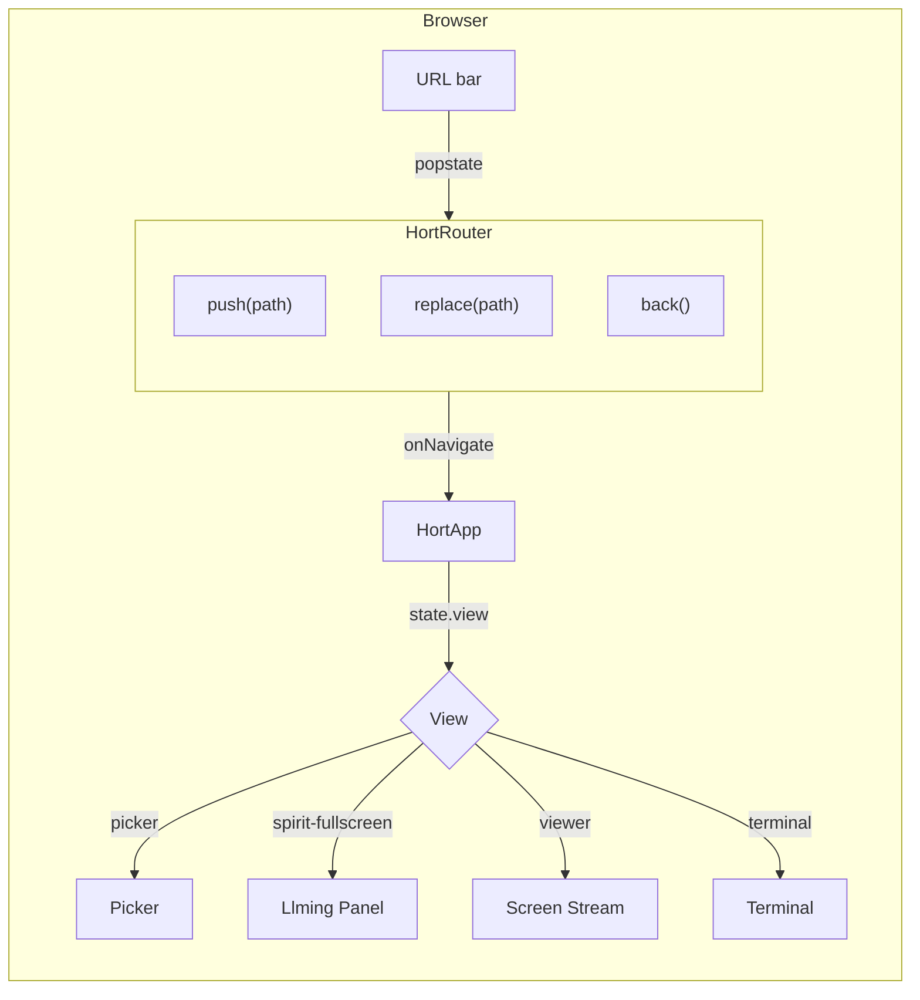
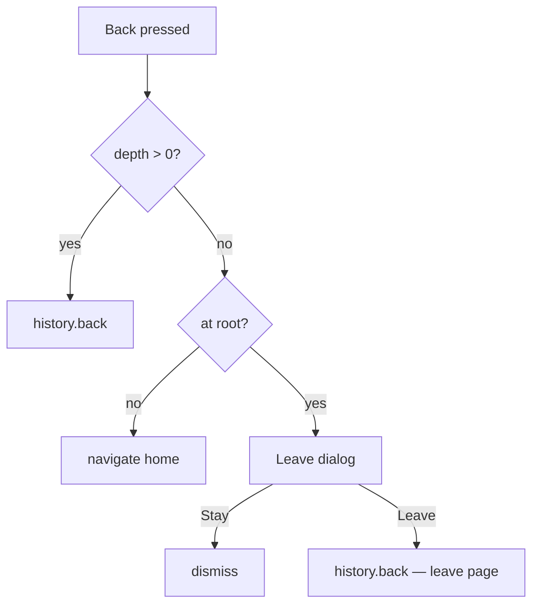

# SPA Navigation & Routing

openhort uses a unified client-side router based on the History API. Every view
is a **llming** — there are no special-cased routes for the viewer, terminal, or
any other component. The URL scheme is flat and predictable.

## URL Scheme

```
/                                     picker (home)
/{provider}/{name}                    llming root
/{provider}/{name}/{sub}              llming sub-page
/{provider}/{name}/{sub}/{id}         llming sub-page with ID
/{provider}/{name}/{sub}?key=val      llming sub-page with params
```

### Examples

| URL | What it shows |
|-----|---------------|
| `/` | Picker — grid of all llmings |
| `/core/llming-lens` | LlmingLens menu (Desktop / Windows tiles) |
| `/core/llming-lens/screens` | Window overview grid |
| `/core/llming-lens/screens/-1` | Desktop stream (window ID -1) |
| `/core/llming-lens/screens/42?target=linux-1` | Window 42 on a Linux target |
| `/core/llming-wire` | Chat panel (fullscreen on mobile, float on desktop) |
| `/core/system-monitor` | System monitor dashboard |
| `/core/terminal/abc123` | Terminal session |

!!! info "No hash routing"
    URLs are clean paths (History API `pushState`), not hash-based (`#/`).
    The server has a catch-all route that serves `index.html` for any SPA path.

## Architecture



### Key Files

| File | Role |
|------|------|
| `hort/static/vendor/hort-router.js` | Router core — route parsing, `push`/`replace`/`back`, leave guard |
| `hort/static/vendor/hort-ext.js` | Extension navigation API — `navigate()`, `back()`, `openViewer()`, `openTerminal()`, `openLlming()` |
| `hort/static/index.html` | `onNavigate()` callback — maps routes to internal view states |
| `hort/app.py` | Server catch-all route for SPA paths |

### Route Parsing

The router parses `location.pathname` into two shapes:

```js
{ view: 'picker' }                              // root
{ view: 'llming', provider, name, sub, params }  // everything else
```

The `sub` field captures everything after `/{provider}/{name}/` — including
nested paths like `screens/-1`. The `params` field is a `URLSearchParams`
from the query string.

### View Resolution

The `onNavigate` callback in `index.html` maps routes to internal view states
via `_resolveView()`:

```js
function _resolveView(route) {
    if (route.view === 'picker') return 'picker';
    if (route.name === 'llming-lens' && route.sub?.startsWith('screens')) return 'viewer';
    if (route.name === 'terminal' && route.sub != null) return 'terminal';
    return 'spirit-fullscreen';
}
```

As llmings take over more rendering responsibilities, the special cases for
`llming-lens` and `terminal` will shrink.

## Navigation API for Extensions

Extensions use static methods on `HortExtension` — never touch `state.view`
directly.

### Core Methods

```js
// Navigate to any path (pushes history)
HortExtension.navigate('/core/my-llming/sub-page');

// Go back (returns false if at root)
HortExtension.back();

// Open a llming (auto-selects float vs fullscreen based on screen size)
HortExtension.openLlming('my-llming');
HortExtension.openLlming('my-llming', 'settings');  // with sub-page

// Convenience: open viewer for a window
HortExtension.openViewer(-1);                        // desktop
HortExtension.openViewer(42, 'linux-1');             // window 42 on target

// Convenience: open terminal
HortExtension.openTerminal('abc123');
```

### Float vs Fullscreen

`openLlming()` checks screen size via `resolveDisplayMode()`:

- **Desktop** (>= 1024x600): opens as a **float window** overlay — no URL change
- **Mobile / small screen**: opens **fullscreen** — pushes URL

Float windows are overlays managed by `HortExtension.openFloat()` /
`closeFloat()`. They exist independently of the router and do not push
history entries.

## Sub-Pages

Llmings can define sub-pages as path segments. The router captures the full
sub-path and passes it to `onNavigate`.

### Example: LlmingLens

LlmingLens defines two sub-pages:

| Sub-path | View | Description |
|----------|------|-------------|
| *(none)* | Menu | Desktop / Windows tile grid |
| `screens` | Overview | All-windows thumbnail grid |
| `screens/{windowId}` | Stream | Live screen stream |

The `cards.js` navigates between them:

```js
function onSelect(item) {
    if (item.id === 'windows') {
        HortExtension.navigate('/core/llming-lens/screens');
    } else {
        HortExtension.openViewer(item.windowId);
    }
}
```

### Defining Sub-Pages in Your Llming

Any llming can use sub-pages. The router doesn't need to know about them —
just navigate to `/{provider}/{name}/{your-sub-path}`:

```js
// In your cards.js
class MyDashboard extends HortExtension {
    static id = 'my-dashboard';
    // ...
    setup(app) {
        app.component('my-dashboard-panel', {
            template: `<div>
                <button @click="openDetail(item)">View Detail</button>
            </div>`,
            setup() {
                function openDetail(item) {
                    HortExtension.navigate('/core/my-dashboard/detail/' + item.id);
                }
                return { openDetail };
            }
        });
    }
}
```

!!! warning "View resolution"
    The `_resolveView()` function in `index.html` currently special-cases
    `llming-lens` and `terminal`. For new llmings with sub-pages, all
    sub-page routes resolve to `spirit-fullscreen` by default — the llming's
    Vue component handles its own sub-page rendering internally.

## Back Button Behavior

The router tracks navigation depth within the current session:

| Scenario | Back button action |
|----------|--------------------|
| Navigated within session (depth > 0) | `history.back()` — browser handles it |
| Fresh load at deep URL (depth 0) | Navigate to home (`/`) |
| At root with no history | Show "Leave openhort?" dialog |



The leave dialog uses `Quasar.Dialog.create()` — never `alert()` or
`confirm()`.

## Unified Toolbar

The app has one toolbar rendered by `HortApp` that changes content based on
`state.view`. Llmings do **not** render their own toolbars.

| View | Left | Center | Right |
|------|------|--------|-------|
| Picker | Hamburger menu | Tabs (Llmings / Spirits / Config) | Connector indicators |
| Spirit fullscreen | Back arrow | Llming name | *(empty)* |
| Viewer (streaming) | Back arrow | Window title + counter | Action buttons (fit, settings, etc.) |
| Viewer (overview) | Back arrow | "All Windows" | *(empty)* |
| Terminal | Back arrow | Terminal title | Close button |

### Adding Actions to the Toolbar

Viewer and terminal expose action functions via the `window.__hort` bridge.
The unified toolbar calls these:

```js
// Viewer exposes:
window.__hort.viewerApplyAutoFit
window.__hort.viewerApplyFitVertical
window.__hort.viewerToggleMobileKeyboard
window.__hort.cleanupViewer

// Terminal exposes:
window.__hort.terminalConfirmClose
window.__hort.disconnectTerminal
```

## Server-Side Catch-All

The FastAPI server has catch-all routes that serve `index.html` for any SPA
path:

```python
@app.get("/{provider}/{name}", response_class=HTMLResponse)
@app.get("/{provider}/{name}/{sub:path}", response_class=HTMLResponse)
async def spa_catch_all(provider: str, name: str, sub: str = "") -> HTMLResponse:
    if "." in name or "." in sub.split("/")[-1]:
        return Response(status_code=404)
    return await viewer_page()
```

Paths with file extensions (`.js`, `.css`, `.png`) are rejected — they fall
through to the static file mounts. API (`/api/`), WebSocket (`/ws/`), and
static file (`/static/`, `/ext/`) routes are registered before the catch-all.

The `<base href="/">` tag in `index.html` ensures relative script/style paths
resolve correctly regardless of the current SPA path depth.

## Native Bridge Integration

When running inside the Android/iOS native shell, navigation commands flow
through the bridge:

```js
// Native → SPA
window.openhortReceive({ type: 'nav.action', command: 'back' });
// → HortRouter.back(), sends nav.atRoot if at root

// SPA → Native (on every view change)
sendToNative({ type: 'nav.update', topbar: {...}, drawer: {...} });
```

## Deep Links & Reload

Any URL can be bookmarked, shared, or reloaded:

- `/core/llming-lens/screens` — reloads with window overview (fetches window list via WS)
- `/core/llming-lens/screens/-1?codec=vp9` — reloads with desktop stream and VP9 codec
- `/core/terminal/abc123` — reloads terminal (reconnects if session alive)

The router fires `onNavigate` on init. Routes that need WebSocket are deferred
via `_pendingRoute` until the connection is established.
