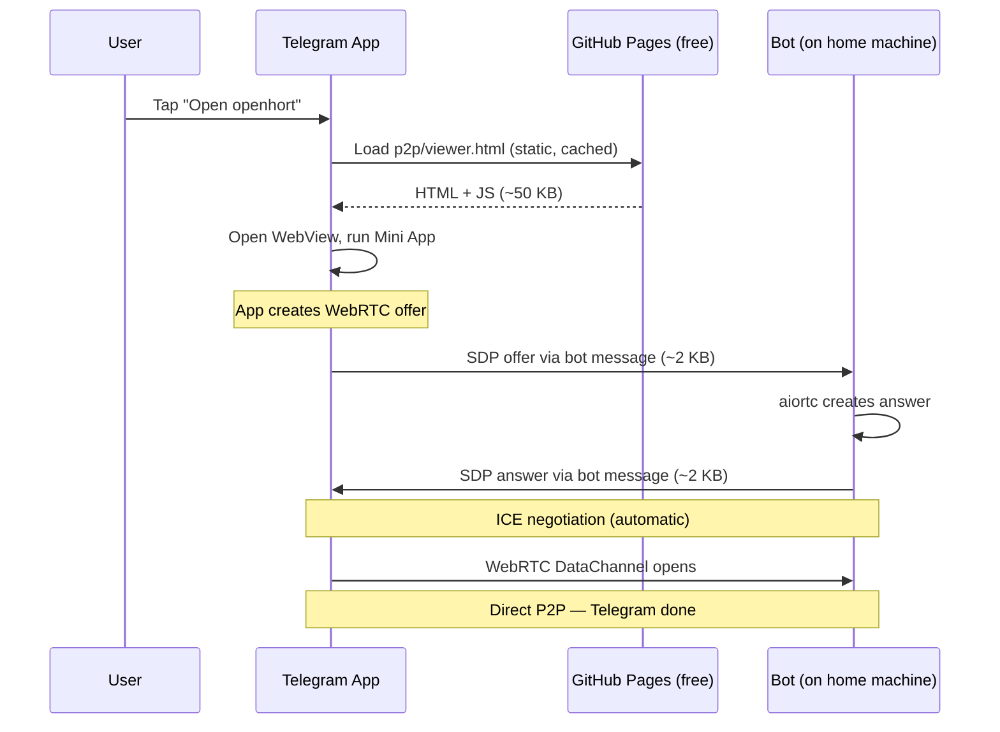
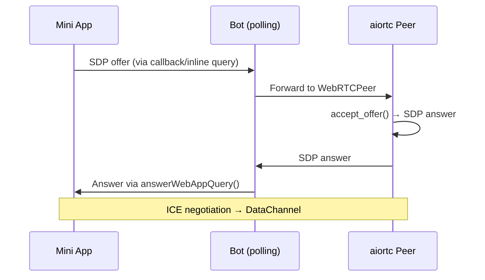

# Telegram Integration

openhort uses Telegram as both a **command interface** and a **delivery platform** for the full remote-access UI — no external server required.

## Role in the Architecture

Telegram serves three purposes, all free:

```mermaid
flowchart TD
    subgraph Telegram["Telegram (free)"]
        BOT[Bot API — command interface]
        MINI[Mini App — full UI delivery]
        SIG[Signaling — WebRTC SDP exchange]
    end
    subgraph Phone
        TG_APP[Telegram App]
        TG_APP --> BOT
        TG_APP --> MINI
    end
    subgraph Home["Home Machine"]
        CONNECTOR[TelegramConnector Plugin]
        WEBRTC[aiortc WebRTC Peer]
        CONNECTOR --> BOT
        CONNECTOR --> SIG
        SIG --> WEBRTC
    end
    MINI ==>|WebRTC DataChannel| WEBRTC

    style Telegram fill:#2a1a3a
```



| Role | What it does | Data volume |
|------|-------------|-------------|
| **Commands** | `/status`, `/stun`, `/help` | Tiny text messages |
| **App delivery** | Opens Mini App (WebView) with static URL | One HTTP redirect |
| **Signaling** | Exchanges SDP offer/answer for WebRTC | ~4 KB total, then done |

After the WebRTC connection is established, Telegram is no longer involved. All screen frames and input events flow directly between phone and home machine.

## Bot API

### Setup

The Telegram connector uses [aiogram](https://docs.aiogram.dev/) v3 with long-polling:

```python
from aiogram import Bot, Dispatcher
bot = Bot(token=os.environ["TELEGRAM_BOT_TOKEN"])
dp = Dispatcher()
```

!!! info "Getting a bot token"
    Message [@BotFather](https://t.me/BotFather) on Telegram → `/newbot` → follow prompts → copy token. Set as `TELEGRAM_BOT_TOKEN` in `.env`.

### Why Long-Polling (Not Webhooks)

- Works behind NAT — no public endpoint needed
- No TLS certificate required
- No DNS setup
- Exclusive access: `delete_webhook(drop_pending_updates=True)` claims the bot on startup

### Access Control

Users whitelisted by Telegram username:

```json
{
  "allowed_users": ["michael", "alice"]
}
```

Empty list = anyone can use the bot.

### Response Formatting

Always use **HTML**, not Markdown v1:

```python
# Good
ConnectorResponse(html="<b>CPU:</b> 42%\n<code>192.168.1.10</code>")

# Bad — Markdown v1 breaks on dashes, slashes, special chars
ConnectorResponse(markdown="**CPU:** 42%")
```

## Mini Apps

Telegram Mini Apps run a **full web page** inside the Telegram chat. This is how openhort delivers its UI without any server infrastructure.

### What the User Sees

```
┌─ Telegram Chat ──────────────────┐
│ openhort_bot                     │
│                                  │
│ 🤖 Machine online. NAT: cone    │
│                                  │
│  ┌──────────────────────────┐    │
│  │    Open openhort ▶       │    │  ← Menu button
│  └──────────────────────────┘    │
│                                  │
│ ┌──────────────────────────────┐ │
│ │                              │ │
│ │   Full openhort UI           │ │  ← WebView (fullscreen)
│ │   WebRTC → direct to home   │ │
│ │   No server in between      │ │
│ │                              │ │
│ └──────────────────────────────┘ │
└──────────────────────────────────┘
```

### How It Works (No Server Required)



The P2P viewer (Telegram & standalone) is hosted on **GitHub Pages** (free, static, HTTPS). It never touches an openhort server — the WebRTC signaling goes through Telegram, and the data flows directly.

### WebView Capabilities

| Feature | Supported |
|---------|-----------|
| WebRTC (`RTCPeerConnection`) | Yes |
| WebSocket | Yes |
| Canvas / WebGL | Yes |
| localStorage | Yes |
| Camera / Microphone | Yes (with permission) |
| Fullscreen | Yes (`expand()` + `requestFullscreen()`) |
| File upload | Yes |

### Telegram WebApp SDK

Injected automatically when loaded inside Telegram:

```html
<script src="https://telegram.org/js/telegram-web-app.js"></script>
```

Key APIs:

```javascript
const tg = window.Telegram.WebApp;

// Lifecycle
tg.ready();                    // Signal app is loaded
tg.expand();                   // Fullscreen (keeps thin header)
tg.requestFullscreen();        // True fullscreen (API 8.0+)
tg.close();                    // Close Mini App

// User identity (authenticated by Telegram — no login needed)
tg.initDataUnsafe.user.id;          // Telegram user ID
tg.initDataUnsafe.user.username;    // Username
tg.initDataUnsafe.user.first_name;  // Display name

// Theme (adapts to user's Telegram theme)
tg.colorScheme;                // "dark" or "light"
tg.themeParams.bg_color;       // Background color
tg.themeParams.text_color;     // Text color

// Viewport
tg.viewportHeight;             // Available height in pixels
tg.isExpanded;                 // Whether expand() was called

// Main button (bottom action button)
tg.MainButton.setText("Connect");
tg.MainButton.show();
tg.MainButton.onClick(() => { /* connect */ });
```

### Query Parameters

The bot constructs the Mini App URL dynamically with config via query parameters:

```python
# Remote access (signaling through Telegram)
url = f"https://openhort.github.io/openhort/hort/extensions/core/peer2peer/static/viewer.html?signal=telegram"

# LAN access (direct HTTP to server)
url = f"https://192.168.1.10:8950/p2p?signal=http"
```

| Parameter | Values | Purpose |
|-----------|--------|---------|
| `signal` | `telegram`, `http` | Signaling mode |
| `server` | URL | Server URL (only for `signal=http`) |

### Hosting the Viewer (GitHub Pages)

The viewer HTML must be served over HTTPS. GitHub Pages is free and takes 30 seconds:

1. Go to **github.com/openhort/openhort/settings/pages**
2. Set **Source:** Deploy from a branch
3. Set **Branch:** `main`, **Folder:** `/ (root)`
4. Save

The viewer is then available at:

```
https://openhort.github.io/openhort/hort/extensions/core/peer2peer/static/viewer.html
```

!!! note "Why not raw.githubusercontent.com?"
    Raw GitHub links serve files with `Content-Type: text/plain`. Telegram's WebView needs `text/html` — only GitHub Pages serves with the correct content type.

### Setting Up the Mini App

Register with BotFather or programmatically:

```python
from aiogram.types import MenuButtonWebApp, WebAppInfo

# Set the bot's menu button
await bot.set_chat_menu_button(
    menu_button=MenuButtonWebApp(
        text="Open openhort",
        web_app=WebAppInfo(url="https://openhort.github.io/openhort/hort/extensions/core/peer2peer/static/viewer.html?signal=telegram")
    )
)
```

Or send an inline button in a message:

```python
from aiogram.types import InlineKeyboardButton, InlineKeyboardMarkup, WebAppInfo

keyboard = InlineKeyboardMarkup(inline_keyboard=[[
    InlineKeyboardButton(
        text="Open openhort",
        web_app=WebAppInfo(url="https://openhort.github.io/openhort/hort/extensions/core/peer2peer/static/viewer.html?signal=telegram")
    )
]])
await message.answer("Tap to connect:", reply_markup=keyboard)
```

### Signaling Through the Bot

!!! warning "sendData() limitation"
    `Telegram.WebApp.sendData()` sends data to the bot but **closes the Mini App**. For SDP exchange, the Mini App communicates with the bot via callback queries or a lightweight relay.

The recommended signaling flow:



### Debugging

=== "Desktop (easiest)"

    Open the Mini App in Telegram Desktop → right-click → **Inspect Element**. Full Chrome DevTools.

=== "Android"

    Enable USB debugging → `chrome://inspect` in Chrome → select Telegram WebView.

=== "iOS"

    Safari → Develop → your device → Telegram WebView.

=== "Mobile (no USB)"

    Add eruda for in-app DevTools:

    ```html
    <script src="https://cdn.jsdelivr.net/npm/eruda"></script>
    <script>eruda.init();</script>
    ```

### Test Environment

Telegram's test server allows HTTP URLs and localhost:

```bash
# Create test bot at https://t.me/BotFather on test server
# Desktop: hold Alt + click Settings to switch to test mode
```

### Security

Validate `initData` server-side (signed by Telegram):

```python
import hashlib, hmac

def validate_init_data(init_data: str, bot_token: str) -> bool:
    data_dict = dict(pair.split("=", 1) for pair in init_data.split("&"))
    received_hash = data_dict.pop("hash", "")
    check_string = "\n".join(f"{k}={v}" for k, v in sorted(data_dict.items()))
    secret = hmac.new(b"WebAppData", bot_token.encode(), hashlib.sha256).digest()
    computed = hmac.new(secret, check_string.encode(), hashlib.sha256).hexdigest()
    return hmac.compare_digest(computed, received_hash)
```

## File Reference

| File | Purpose |
|------|---------|
| `hort/extensions/core/telegram_connector/provider.py` | Bot setup, polling, commands |
| `hort/extensions/core/telegram_connector/static/panel.js` | Settings panel UI |
| `hort/peer2peer/webrtc.py` | aiortc WebRTC peer |
| `hort/extensions/core/peer2peer/static/viewer.html` | P2P viewer (Telegram Mini App and standalone) |

## Related

- [Peer-to-Peer Library](peer2peer-lib.md) — Full API reference
- [Peer-to-Peer Extension](../guide/extensions/peer2peer.md) — User guide
