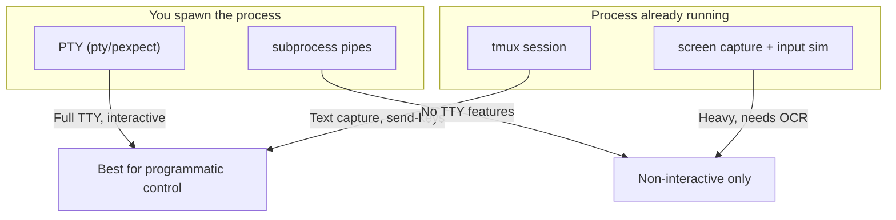

# Terminal Automation

Programmatic interaction with CLI processes running in terminal
windows — reading their output and sending input without manual
intervention. Useful for controlling tools like Claude Code from
openhort or external scripts.

## Approaches



## tmux (Recommended)

tmux gives you clean text read/write access to any terminal session,
including terminals inside VS Code, Windsurf, or any other IDE.

### Setup

```bash
# Start a CLI tool in a named tmux session
tmux new-session -d -s claude 'claude'
```

### Read output

```bash
# Capture current visible pane content
tmux capture-pane -t claude -p

# Capture with scrollback (last 500 lines)
tmux capture-pane -t claude -p -S -500
```

### Send input

```bash
# Type text and press Enter
tmux send-keys -t claude "your prompt here" Enter

# Send special keys
tmux send-keys -t claude C-c      # Ctrl+C
tmux send-keys -t claude Escape   # Escape key
```

### Python wrapper

```python title="tmux_automation.py"
import subprocess

def tmux_read(session: str, scrollback: int = 100) -> str:
    """Capture text from a tmux pane."""
    result = subprocess.run(
        ["tmux", "capture-pane", "-t", session, "-p", "-S", str(-scrollback)],
        capture_output=True, text=True,
    )
    return result.stdout

def tmux_send(session: str, text: str, *, enter: bool = True) -> None:
    """Send text to a tmux session."""
    cmd = ["tmux", "send-keys", "-t", session, text]
    if enter:
        cmd.append("Enter")
    subprocess.run(cmd, check=True)
```

!!! tip "VS Code / Windsurf compatibility"
    tmux works in any IDE's integrated terminal — it's just a shell
    process. The only caveat is that IDE keybinding layers may
    intercept tmux prefix keys (e.g. ++ctrl+b++). This doesn't matter
    for programmatic use since you call `tmux send-keys` from a
    separate process, not interactively.

## PTY spawn (pexpect)

When you spawn the process yourself, a pseudo-terminal gives full
interactive control. This is what `hort/terminal.py` uses internally.

### pexpect (high-level)

```python title="pty_pexpect.py"
import pexpect

child = pexpect.spawn("claude")

# Wait for output matching a pattern
child.expect(r"\$|>")
print(child.before.decode())

# Send input
child.sendline("your prompt here")

# Read until next prompt
child.expect(r"\$|>", timeout=30)
print(child.before.decode())
```

### Raw PTY (low-level)

```python title="pty_raw.py"
import pty, os, select

master_fd, slave_fd = pty.openpty()
pid = os.fork()

if pid == 0:
    # Child: become session leader, attach to PTY
    os.setsid()
    os.dup2(slave_fd, 0)
    os.dup2(slave_fd, 1)
    os.dup2(slave_fd, 2)
    os.execvp("claude", ["claude"])
else:
    os.close(slave_fd)
    # Read stdout
    ready, _, _ = select.select([master_fd], [], [], 5.0)
    if ready:
        data = os.read(master_fd, 4096)
        print(data.decode())
    # Send input
    os.write(master_fd, b"hello\n")
```

!!! warning "Async integration"
    Raw PTY reads are blocking. In openhort, wrap them in
    `asyncio.get_event_loop().add_reader()` or run in a thread
    executor to avoid blocking the event loop. See
    `hort/terminal.py` for the production pattern.

## subprocess pipes (non-interactive)

For CLI tools that support a non-interactive mode (e.g. `claude --print`),
plain pipes are simplest but lack TTY features like color and cursor
control.

```python title="subprocess_pipes.py"
import subprocess

proc = subprocess.Popen(
    ["claude", "--print", "-p", "your prompt"],
    stdin=subprocess.PIPE,
    stdout=subprocess.PIPE,
    stderr=subprocess.PIPE,
)
stdout, stderr = proc.communicate(timeout=60)
print(stdout.decode())
```

!!! note
    Many interactive CLIs detect when stdin is not a TTY and either
    refuse to run or switch to a limited mode. Use PTY or tmux if the
    tool requires interactive input.

## Comparison

| Approach | Read output | Send input | Needs to own process | TTY support | Complexity |
|----------|:-----------:|:----------:|:--------------------:|:-----------:|:----------:|
| **tmux** | :material-check: text | :material-check: send-keys | No | Full | Low |
| **pexpect** | :material-check: stream | :material-check: sendline | Yes | Full | Low |
| **Raw PTY** | :material-check: fd read | :material-check: fd write | Yes | Full | Medium |
| **subprocess** | :material-check: pipes | :material-check: stdin | Yes | None | Low |
| **Screen capture** | :material-check: pixels | :material-check: CGEvent | No | N/A | High |

## Integration with openhort

openhort already has the building blocks for terminal automation:

- **`hort/terminal.py`** — PTY-backed terminal sessions with async I/O
- **`hort/input.py`** — macOS input simulation (keyboard/mouse via CGEvent)
- **`hort/screen.py`** — Window screenshot capture via Quartz

For new integrations, prefer **tmux** when the target process runs in
a visible terminal, or **PTY spawn** when openhort manages the process
lifecycle directly.
