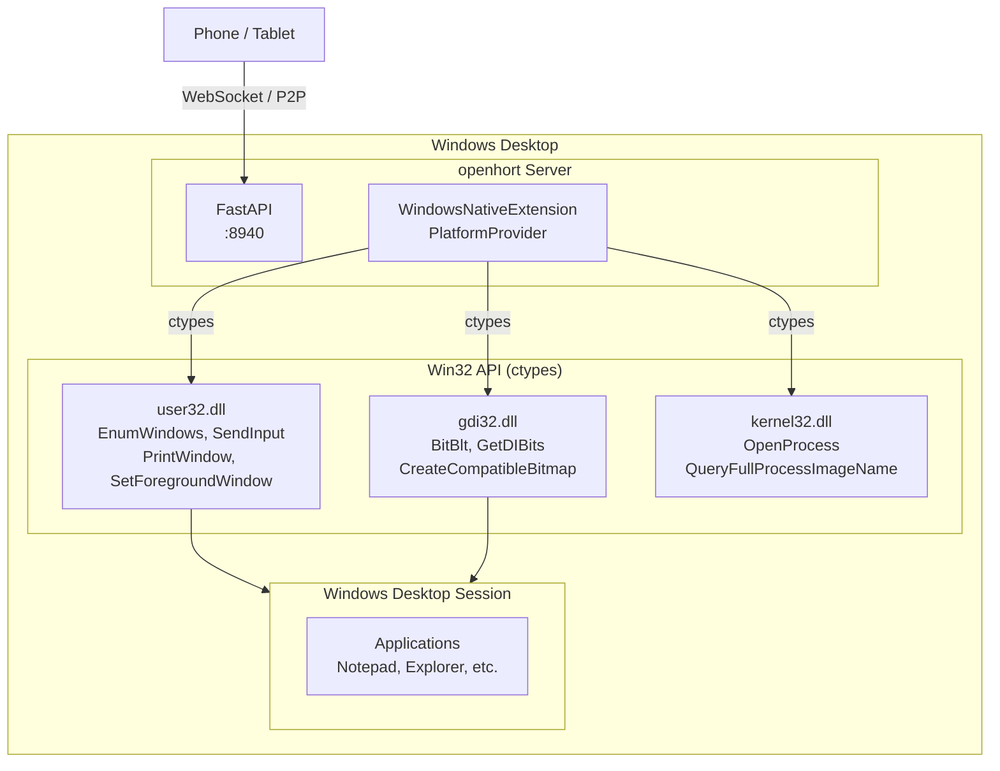

# Windows Support

openhort runs natively on Windows via the `windows-native` extension, which uses the Win32 API (user32.dll, gdi32.dll, kernel32.dll) for window management, screen capture, and input simulation. No extra dependencies beyond Pillow.

## Architecture



## Provider Implementation

`WindowsNativeExtension` implements the full `PlatformProvider` interface using only `ctypes` — no pywin32, no mss, no extra packages.

### Capability Mapping

| Capability | Win32 API | Function |
|-----------|----------|----------|
| Window listing | `user32.dll` | `EnumWindows` + `GetWindowTextW` + `GetWindowRect` |
| App names | `kernel32.dll` | `OpenProcess` + `QueryFullProcessImageNameW` |
| Screenshot (window) | `user32.dll` + `gdi32.dll` | `PrintWindow` (captures occluded windows) |
| Screenshot (desktop) | `gdi32.dll` | `BitBlt` from screen DC |
| Mouse click/move | `user32.dll` | `SetCursorPos` + `SendInput` |
| Keyboard input | `user32.dll` | `SendInput` (VK codes or Unicode) |
| Window activation | `user32.dll` | `ShowWindow` + `SetForegroundWindow` |
| Workspaces | — | Single desktop (virtual desktops future) |

### Window Filtering

The provider filters the `EnumWindows` results to show only real application windows:

- Must have `WS_VISIBLE` style
- Must have `WS_CAPTION` (title bar)
- Excludes `WS_EX_TOOLWINDOW` (unless also `WS_EX_APPWINDOW`)
- Must have a non-empty title

### Desktop Capture

The virtual "Desktop" entry (`window_id=-1`) captures the full screen using `BitBlt` from the screen device context. This matches the macOS (`CGDisplayCreateImage`) and Linux (`import -window root`) behavior.

### Keyboard Input

Two methods depending on the key:

- **Special keys** (Enter, Tab, arrows, F-keys): Sent as virtual key codes via `SendInput`
- **Printable characters**: Sent as Unicode scancodes via `KEYEVENTF_UNICODE` — this handles all characters regardless of keyboard layout

Modifiers (Ctrl, Shift, Alt, Meta) are pressed before and released after the main key.

## Deployment

### Azure VM (testing)

```bash
# Provision Windows 11 VM with openhort pre-installed
bash scripts/ci/spinup.sh windows11

# Or provision all platforms
bash scripts/ci/spinup.sh all

# Tear down
bash scripts/ci/teardown.sh
```

The provisioning script:
1. Creates a Windows 11 VM (`Standard_B2ms`, 2 vCPU, 8 GB)
2. Opens RDP (3389) and openhort (8940) ports
3. Runs `setup-windows.ps1` which installs Python, Git, and openhort
4. Registers openhort as a scheduled task (starts on login)

### Manual Installation

```powershell
# Install Python 3.12 (from python.org or winget)
winget install Python.Python.3.12

# Install openhort
python -m venv C:\openhort\venv
C:\openhort\venv\Scripts\pip install git+https://github.com/openhort/openhort.git

# Run
set LLMING_AUTH_SECRET=your-secret
C:\openhort\venv\Scripts\python -m uvicorn hort.app:app --host 0.0.0.0 --port 8940
```

### Requirements

- Windows 10 (21H2) or later
- Python 3.12+
- Active desktop session (console or RDP) — screen capture requires a rendered desktop
- No admin rights needed for basic operation (admin only for firewall rules)

!!! warning "RDP Session Required"
    Windows screen capture APIs require an active desktop session. If the RDP session is **disconnected** (not just minimized), screen capture returns black. Keep the RDP session connected, or use the `tscon.exe` trick to transfer the session to the console.

## Azure VM Setup Details

Hard-won practical knowledge from provisioning and debugging Windows Azure VMs. These gotchas will save hours.

### OpenSSH Server

Windows has no SSH server by default. Install it for remote management:

```powershell title="Install and configure OpenSSH Server"
# Install the OpenSSH Server capability
Add-WindowsCapability -Online -Name OpenSSH.Server~~~~0.0.1.0

# Start the service and set it to auto-start
Start-Service sshd
Set-Service -Name sshd -StartupType Automatic

# Set PowerShell as the default shell (instead of cmd.exe)
New-ItemProperty -Path "HKLM:\SOFTWARE\OpenSSH" -Name DefaultShell `
    -Value "C:\Windows\System32\WindowsPowerShell\v1.0\powershell.exe" `
    -PropertyType String -Force

# Open firewall port
netsh advfirewall firewall add rule name="SSH" dir=in action=allow protocol=TCP localport=22
```

!!! danger "Firewall rule gotcha"
    `New-NetFirewallRule` has a `-LocalPort` parameter, **not** `-Port`. If you use `-Port` it silently does nothing. Use `netsh advfirewall` instead — it always works.

### SSH Key Auth for Admin Users

Windows OpenSSH handles admin users differently from regular users. Keys for members of the `Administrators` group are read from a **separate file**, not the user's home directory.

| User type | Authorized keys file |
|-----------|---------------------|
| Regular user | `C:\Users\<user>\.ssh\authorized_keys` |
| Admin user (default config) | `C:\ProgramData\ssh\administrators_authorized_keys` |
| Admin user (after sshd_config fix) | `C:\Users\<user>\.ssh\authorized_keys` |

To use the per-user `authorized_keys` for admin users, remove or comment out the `Match Group administrators` block at the bottom of `C:\ProgramData\ssh\sshd_config`:

```text title="C:\ProgramData\ssh\sshd_config (remove these lines)"
# Match Group administrators
#        AuthorizedKeysFile __PROGRAMDATA__/ssh/administrators_authorized_keys
```

If using `administrators_authorized_keys`, permissions must be locked down:

```powershell title="Set permissions on administrators_authorized_keys"
icacls "C:\ProgramData\ssh\administrators_authorized_keys" /inheritance:r `
    /grant "hortuser:(R)" /grant "SYSTEM:(F)"
```

!!! note "Password authentication"
    To enable password auth, you must **both** set `PasswordAuthentication yes` in sshd_config **and** remove the `Match Group administrators` block at the bottom of the file. The Match block overrides earlier settings for admin users.

### Custom Script Extension Gotchas

Azure's Custom Script Extension and `az vm run-command` have several sharp edges on Windows.

#### Git stderr breaks PowerShell error detection

Git writes branch-switch messages (e.g., `Switched to branch 'main'`) to stderr. PowerShell treats any stderr output as a non-terminating error, causing the Custom Script Extension to report the script as "failed" even when everything succeeded.

```powershell title="Fix: redirect stderr to null"
# BAD — extension reports failure
git checkout main

# GOOD — suppress stderr
$null = git checkout main 2>&1
```

#### Run-command is single-threaded and blocking

`az vm run-command invoke` acquires a VM-level lock. Only one can run at a time, and it blocks until the command completes. Do not use it for long-running operations like starting the server.

#### Start-Process blocks on output redirection

`Start-Process` with `-RedirectStandardError` or `-RedirectStandardOutput` waits for the child process to exit before returning. Do not use it to launch the openhort server from a run-command — it will hang until the server is killed.

### Dependency Installation

`pip install -e .` may fail to resolve all dependencies when `pyproject.toml` references local path dev dependencies (like `llming-com`). Install runtime deps explicitly:

```powershell title="Install runtime dependencies directly"
pip install "uvicorn[standard]" "Pillow" "qrcode[pil]" "pydantic>=2.10" `
    "websockets" "itsdangerous" "pyyaml" "psutil" "aiortc"
```

### PowerShell via SSH Quirks

When connecting via SSH to a PowerShell session, several things behave differently from a local terminal.

| Issue | Cause | Workaround |
|-------|-------|------------|
| `&&` doesn't chain commands | PowerShell uses `;` not `&&` | Use `;` as command separator |
| f-strings with `{}` break | PowerShell interprets curly braces | `scp` Python scripts to the VM instead of `ssh ... python -c "..."` |
| Multiline stdin gets collapsed | SSH + PowerShell stdin handling | Write to a `.py` file first, then execute it |

```powershell title="Command chaining in PowerShell"
# BAD — syntax error
cd C:\openhort && python run.py

# GOOD
cd C:\openhort; python run.py
```

### Starting the Server Correctly

The server MUST run in the interactive RDP session for screen capture to work. The correct startup sequence:

1. Create a scheduled task with `/IT` (interactive) flag:

```powershell title="Create interactive scheduled task"
schtasks /Create /TN "openhort" /TR "powershell -ExecutionPolicy Bypass -File C:\openhort\run.ps1" /SC ONLOGON /RL HIGHEST /IT /F
```

2. Start it via `schtasks /Run` with the `/I` flag (runs in the interactive session):

```powershell title="Start in interactive session"
schtasks /Run /TN "openhort" /I
```

3. Verify it's in Session 2 (RDP):

```powershell title="Check session ID"
Get-Process python* | Format-Table Id,SessionId
```

!!! danger "Start-Process and Start-ScheduledTask don't work"
    - `Start-ScheduledTask` from PowerShell does **not** guarantee the interactive session. Use `schtasks /Run /I` instead.
    - `Start-Process` from SSH starts the process in Session 0 — screen capture returns black.

### File Sync During Development

Use `scp` for direct file sync instead of git push/pull cycles:

```bash title="Sync files to Azure VM"
# Sync a single file
scp hort/termd_client.py hortuser@<IP>:C:/openhort/src/hort/termd_client.py

# Sync entire directory
scp -r hort/extensions/core/windows_native/ hortuser@<IP>:C:/openhort/src/hort/extensions/core/windows_native/
```

After syncing, reinstall the editable package if module structure changed:

```powershell title="Reinstall editable package"
C:\openhort\venv\Scripts\pip.exe install -e C:\openhort\src
```

### Screen Capture Requires Active Desktop

Windows screen capture APIs (`BitBlt`, `PrintWindow`) render from the desktop compositor. Under a SYSTEM service account or a bare SSH session, there is no desktop — capture returns black or fails.

!!! warning "The server must run under a user session"
    The openhort process needs a real desktop session (RDP or console). Options:

    - **Scheduled task at login** — create a task triggered by user logon that starts the server
    - **Start via RDP** — connect via RDP, launch the server, keep the session connected
    - **Console session** — on physical hardware, log in at the console

    Running as a Windows service or from an SSH session **will not work** for screen capture.

### BitBlt from Thread Pool Returns Black

The thumbnailer uses `run_in_executor()` (thread pool) for capture. On Windows, `BitBlt` from a thread pool thread doesn't have access to the desktop DC — it returns black pixels. The stream handler calls `capture_window()` directly on the main asyncio thread, which **does** have desktop access. This means:

- **Live streaming works** — direct call on main thread
- **Thumbnail cards may show black** — thread pool call has no desktop DC

### Capture Verified in RDP Session (Session 2)

When the server process runs in the RDP session (Session 2) **and** the capture runs on the main thread, `BitBlt` returns real desktop content (average brightness ~325, not black). Per-window `PrintWindow` also works with real content.

### Session 0 Always Returns Black

Any process in Session 0 (SSH, SYSTEM services) gets black from `BitBlt` — there is no desktop to capture. This is a fundamental Windows limitation: Session 0 has no interactive desktop since Windows Vista (Session 0 isolation).

### Private PC vs Azure VM

On a **private PC**, none of the Session 0 issues apply:

- The user logs in at the console (Session 1) — the only session
- `hort setup` installs a startup entry (Startup folder or scheduled task at logon)
- The server starts in the user's session automatically — full desktop access
- Screen capture just works, no special configuration needed

The Session 0 problem is specific to **Azure VMs** (and remote provisioning in general):

1. The Custom Script Extension runs as SYSTEM (Session 0) during provisioning
2. The user later RDPs in (Session 2) — a separate desktop session
3. Processes started in Session 0 **cannot** be moved to Session 2
4. There is no API to inject a process into an existing RDP session from Session 0 without third-party tools (PsExec)

**The fix for Azure VMs:** Place a startup script in the user's Startup folder (`C:\Users\<user>\AppData\Roaming\Microsoft\Windows\Start Menu\Programs\Startup\`). It runs on every logon, starting the server in the interactive session. After placing the script, the user must **disconnect and reconnect** RDP (or log out and back in) to trigger it.

```powershell title="Place startup script (run during provisioning)"
$startup = "$env:USERPROFILE\AppData\Roaming\Microsoft\Windows\Start Menu\Programs\Startup"
@"
@echo off
powershell -ExecutionPolicy Bypass -File C:\openhort\run.ps1
"@ | Out-File "$startup\openhort.bat" -Encoding ASCII
```

## Target Registration

When `sys.platform == "win32"`, the server automatically registers a `local-windows` target:

```python title="hort/app.py"
if sys.platform == "win32":
    from hort.extensions.core.windows_native.provider import WindowsNativeExtension
    ext = WindowsNativeExtension()
    ext.activate({})
    registry.register(
        "local-windows",
        TargetInfo(id="local-windows", name="This PC", provider_type="windows"),
        ext,
    )
```

## Limitations

| Feature | Status | Notes |
|---------|--------|-------|
| Window listing | Working | Filters to real app windows |
| Screenshot (per-window) | Working | `PrintWindow` — works on main thread |
| Screenshot (desktop) | Working | `BitBlt` — works on main thread |
| Live streaming | Working | Main thread capture, real content |
| Thumbnails | Partial | Thread pool capture may return black |
| Mouse input | Working | `SetCursorPos` + `SendInput` |
| Keyboard input | Working | VK codes + Unicode |
| Window activation | Working | `SetForegroundWindow` |
| Terminal (PTY) | Not supported | Unix sockets not available on Windows |
| Virtual desktops | Not yet | Undocumented COM interfaces |
| Multi-monitor | Partial | Primary monitor only |
| DPI scaling | Partial | High-DPI may report scaled coordinates |

## Key Files

| File | Purpose |
|------|---------|
| `hort/extensions/core/windows_native/provider.py` | `WindowsNativeExtension` — Win32 platform provider |
| `hort/extensions/core/windows_native/extension.json` | Extension manifest (`platforms: ["win32"]`) |
| `scripts/ci/setup-windows.ps1` | PowerShell setup for Azure VMs |
| `scripts/ci/spinup.sh` | One-command VM provisioning (includes Windows) |
