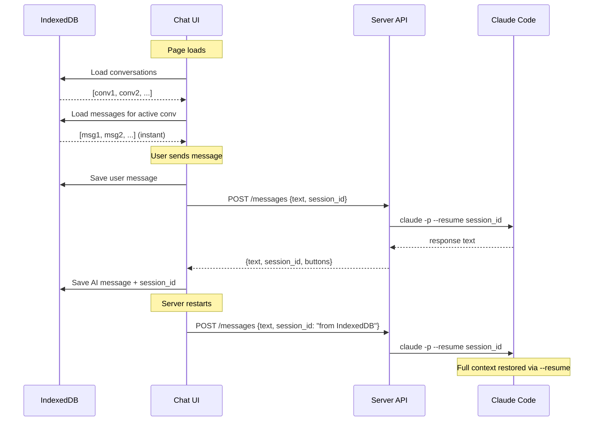

# Wire Chat Extension

Developer reference for the `openhort/llming-wire` extension — built-in chat UI with IndexedDB persistence and Claude Code backend.

## Module Structure

```
llmings/core/llming_wire/
    extension.json                 Manifest (UI widget, risk level)
    provider.py                    REST API + chat backend routing
    __init__.py
    static/
        panel.js                   Vue component + IndexedDB + thumbnail
        llming-wire.css            Telegram-style chat CSS
```

## Provider — Server Side

### REST API

The provider registers a FastAPI router at `/api/plugins/llming-wire/`:

| Endpoint | Method | Description |
|----------|--------|-------------|
| `/conversations` | GET | List all server-side conversations |
| `/conversations` | POST | Create new conversation → `{id}` |
| `/conversations/{cid}/messages` | GET | Get messages for conversation |
| `/conversations/{cid}/messages` | POST | Send message → AI response |

### Chat Backend Integration

Messages are routed to Claude Code CLI via `ChatBackendManager`:

```python
async def _get_ai_response(self, cid, text, client_session_id=None):
    from hort.ext.chat_backend import ChatBackendManager
    from hort.agent import AgentConfig

    cfg = AgentConfig(container=False)  # host mode
    self._chat_mgr = ChatBackendManager(agent_cfg=cfg)
    self._chat_mgr.start()

    session = self._chat_mgr.get_session(f"llming-wire:{cid}")
    # Resume from client's session_id after server restart
    if client_session_id and not session._session_id:
        session._session_id = client_session_id
    return await session.send(text)
```

### Session Resumption

The server is stateless — it doesn't persist conversation history. Instead:

1. Client stores `session_id` in IndexedDB (per conversation)
2. On each message, client sends `session_id` in the POST body
3. Server passes it to `ChatSession._session_id` for `--resume`
4. Claude Code picks up the full conversation context

If the server restarts, the client's stored `session_id` restores continuity.

### Button Extraction

Numbered options in Claude's response are extracted as buttons:

```python
def _extract_buttons(text):
    # Matches: "1. Fix the bug", "2. Write tests", etc.
    # Returns buttons only if 2-10 options found
    buttons = re.finditer(r"^\s*(\d+)\.\s+(.+)$", text, re.MULTILINE)
    return [{"id": num, "label": f"{num}. {label}"} for ...]
```

Buttons are removed from the response text and sent separately. The UI renders them as tappable options.

## Panel — Client Side

### IndexedDB Schema

```
Database: llming-wire (version 2)

conversations store:
    keyPath: id
    Fields: id, title, lastMsg, lastActive, sessionId, serverConvId

messages store:
    keyPath: id
    Index: cid (conversation ID)
    Fields: id, cid, role, text, ts, buttons, mediaRef

media store:
    keyPath: id
    Fields: id, blob (Blob), mime, size, created, refIds[]
```

### IndexedDB Helpers

```javascript
dbPut(store, obj)                    // Upsert a record
dbGet(store, key)                    // Get by primary key
dbGetAll(store, indexName?, key?)     // Get all (optionally by index)
dbDelete(store, key)                 // Delete by key
```

### Media Storage

Binary data (images, videos, files) stored as `Blob` in the `media` store:

```javascript
// Save — returns media ID for the message's mediaRef
const mediaId = await mediaSave(blob, 'image/jpeg', messageId);

// Load
const media = await mediaGet(mediaId);
// media.blob → Blob, media.mime → 'image/jpeg', media.size → 245000

// Add reference (when media shared across messages)
await mediaAddRef(mediaId, anotherMessageId);
```

### Garbage Collection

When a conversation is deleted:

1. All messages with matching `cid` are deleted
2. `mediaGC()` scans all media entries
3. For each media, check if ANY `refId` matches a remaining message
4. Delete media where no references survive

```javascript
async function mediaGC() {
    const allMedia = await dbGetAll('media');
    const allMessages = await dbGetAll('messages');
    const msgIds = new Set(allMessages.map(m => m.id));
    for (const m of allMedia) {
        const alive = (m.refIds || []).some(rid => msgIds.has(rid));
        if (!alive) await dbDelete('media', m.id);
    }
}
```

### Conversation Lifecycle



### Vue Component

The chat widget is registered as `llming-wire-chat`:

```javascript
app.component('llming-wire-chat', {
    data() {
        return {
            conversations: [],    // from IndexedDB
            messages: [],         // from IndexedDB
            draft: '',
            loading: false,
            activeConvId: null,
            serverConvId: null,   // server-side conversation ID
            sessionId: null,      // Claude session_id for --resume
            showSidebar: false,
        };
    },
    // ...
});
```

### Thumbnail

The `renderThumbnail()` method draws a preview of chat bubbles on the dashboard card canvas:

- Blue user bubble (top-right)
- Dark AI bubble (left)
- Input bar at bottom
- Matches the Telegram-style color scheme

## CSS Architecture

All classes prefixed with `llming-wire-` to avoid collisions:

| Class | Element |
|-------|---------|
| `llming-wire-root` | Flex container (sidebar + chat area) |
| `llming-wire-sidebar` | Conversation list |
| `llming-wire-conv-item` | Conversation row (title, preview, time) |
| `llming-wire-chat-area` | Header + messages + input |
| `llming-wire-bubble` | Message bubble base |
| `llming-wire-user` | User bubble (blue, right-aligned, tail right) |
| `llming-wire-ai` | AI bubble (dark, left-aligned, tail left) |
| `llming-wire-ts` | Inline timestamp (floats right inside bubble) |
| `llming-wire-check` | Double checkmarks (✓✓) on user messages |
| `llming-wire-typing` | Bouncing dots animation |
| `llming-wire-buttons` | Choice buttons column |
| `llming-wire-input-bar` | Input + send button |

Bubble tails use CSS `::after` / `::before` pseudo-elements with border triangles.
