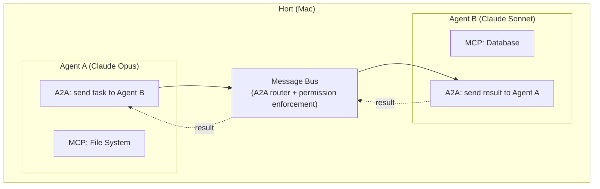
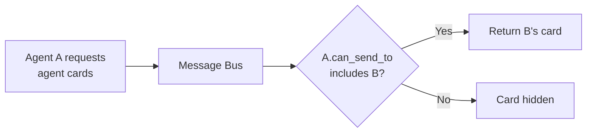
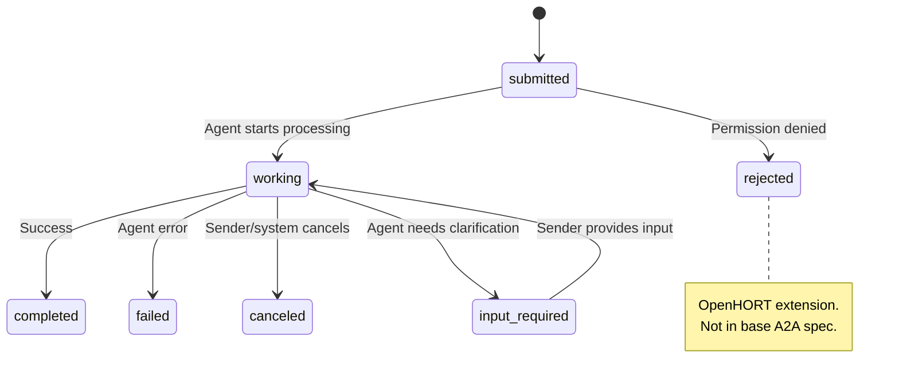
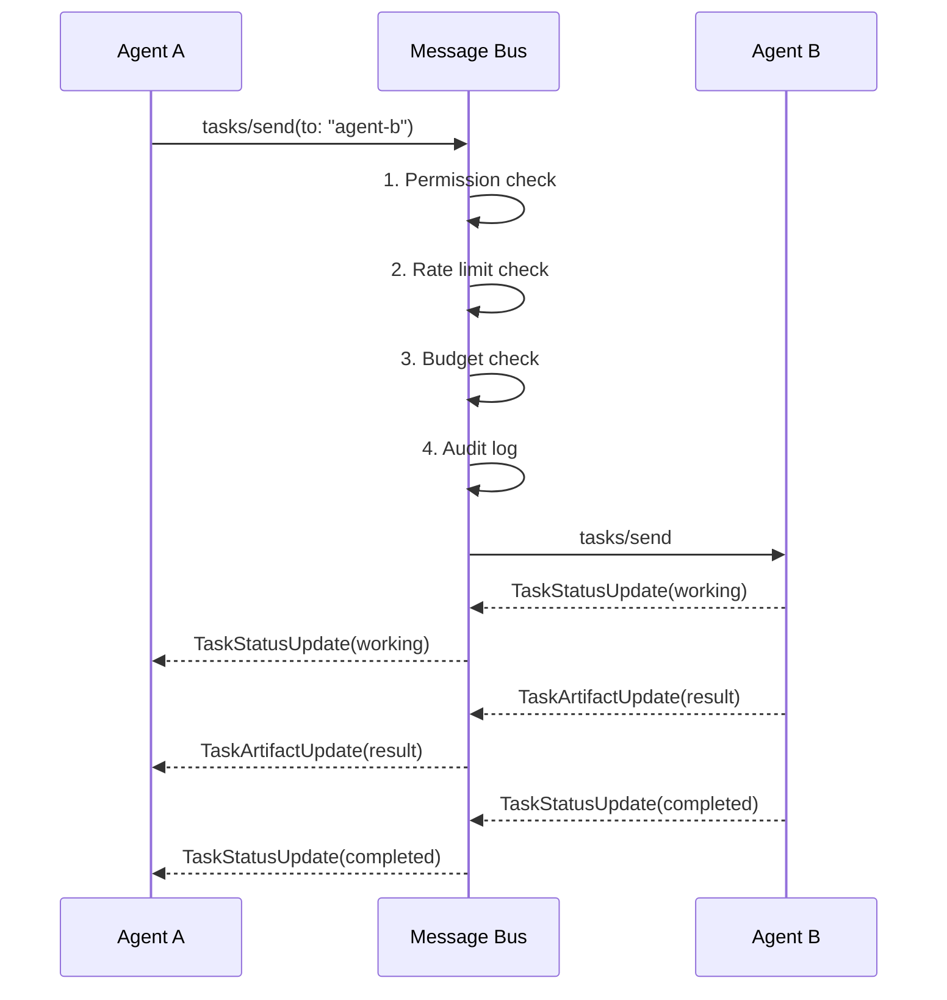
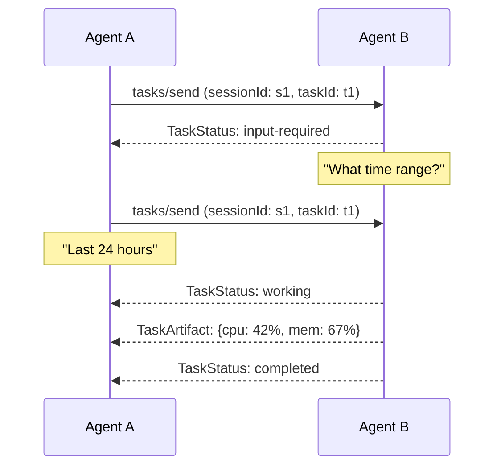
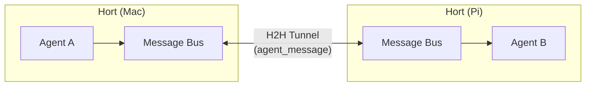
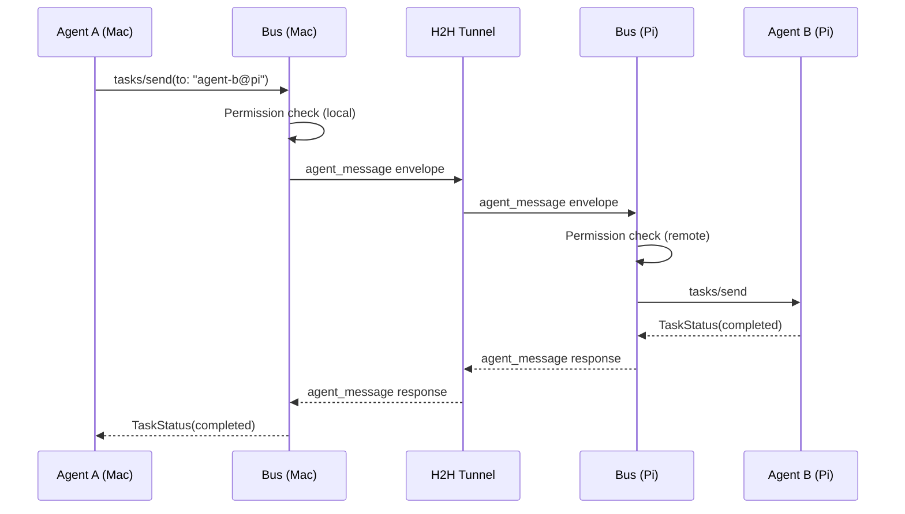
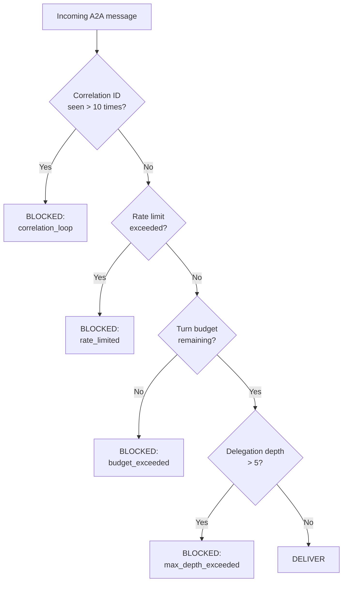

# A2A Integration

OpenHORT uses Google's Agent-to-Agent (A2A) protocol as the standard
for inter-agent communication. A2A handles agent-to-agent coordination
the same way MCP handles agent-to-tool access — OpenHORT adopts both
standards and layers its own security and permission model on top.

## Why Two Protocols

MCP and A2A solve different problems:

| | MCP | A2A |
|---|---|---|
| **Connects** | Agent to tools | Agent to agents |
| **Interaction** | Structured, schema-driven | Unstructured, task-driven |
| **Timing** | Synchronous call-response | Asynchronous, streaming |
| **Discovery** | Tool list with JSON Schema | Agent Cards with skill metadata |
| **State** | Stateless (each call independent) | Stateful (task lifecycle) |

An agent uses MCP to read a file, query a database, or run a linter.
It uses A2A to delegate a research task to another agent, request a
code review, or coordinate a multi-step workflow across specialists.

OpenHORT does not reinvent either protocol. It implements both as-is
and enforces its permission, budget, and audit systems at the
transport layer.

## How A2A Fits the Hort Model



- A2A messages flow through the Hort's **message bus** -- never
  directly between containers
- The bus enforces permissions, rate limits, budget checks, and
  audit logging on every message
- Agents have no container-to-container networking
- The bus acts as the A2A "server"; each agent is both A2A client
  and server from the protocol's perspective

## Agent Cards

Every agent in OpenHORT publishes an Agent Card for A2A discovery.
Cards are generated automatically from the agent's configuration
and MCP tool/resource declarations.

```json
{
  "name": "system-monitor",
  "description": "Monitors CPU, memory, disk, and network",
  "url": "hort://mac-studio/agents/system-monitor",
  "version": "1.0.0",
  "capabilities": {
    "streaming": true,
    "pushNotifications": false,
    "stateTransitionHistory": true
  },
  "skills": [
    {
      "id": "check_health",
      "name": "System Health Check",
      "description": "Reports current CPU, memory, and disk usage",
      "tags": ["monitoring", "system"]
    }
  ],
  "defaultInputModes": ["text"],
  "defaultOutputModes": ["text", "data"]
}
```

### Card Properties

| Property | Source | Description |
|----------|--------|-------------|
| `name` | Agent YAML `name` field | Unique identifier within the Hort |
| `description` | Agent YAML `system_prompt` (first line) | Human-readable summary |
| `url` | Generated: `hort://node-id/agents/name` | Virtual URI for addressing |
| `capabilities` | Inferred from runtime config | Streaming, push, history support |
| `skills` | Derived from MCP tools + explicit declarations | What the agent can do |
| `defaultInputModes` | `["text"]` unless configured | Accepted input formats |
| `defaultOutputModes` | `["text", "data"]` unless configured | Output formats |

### Card Visibility

Agent Cards are filtered by permissions. An agent only sees cards
for agents it is allowed to communicate with (per `can_send_to`).
This prevents capability enumeration by unauthorized agents.



## Task Lifecycle

A2A defines a task state machine. OpenHORT maps these states directly
and adds `rejected` for permission failures.



| State | Meaning in OpenHORT |
|-------|---------------------|
| `submitted` | Message received by the message bus, queued for delivery |
| `working` | Target agent is processing the task |
| `input-required` | Target agent needs more information (triggers multi-turn) |
| `completed` | Task finished, result available as artifact |
| `failed` | Agent encountered an error during processing |
| `canceled` | Sender or system canceled (budget exceeded, timeout) |
| `rejected` | Permission denied by the message bus |

## Message Format

A2A messages in OpenHORT follow the JSON-RPC 2.0 envelope defined
by the A2A spec.

```json
{
  "jsonrpc": "2.0",
  "method": "tasks/send",
  "params": {
    "id": "task-uuid",
    "sessionId": "session-uuid",
    "message": {
      "role": "user",
      "parts": [
        {"type": "text", "text": "What's the current CPU usage?"}
      ]
    }
  }
}
```

### Part Types

| Part type | Usage | Example |
|-----------|-------|---------|
| `TextPart` | Plain text messages | Questions, instructions, results |
| `FilePart` | File references within the Hort's filesystem | Logs, reports, code files |
| `DataPart` | Structured JSON payloads | Metrics, configs, query results |

!!! info "FilePart references, not embeds"
    File parts contain a path reference, not the file content. The
    message bus verifies the sender has read access to the referenced
    path before delivering the message. This prevents agents from
    exfiltrating files they cannot access directly.

## Routing Through the Message Bus

The message bus is the central A2A router. Every message passes
through a five-stage pipeline before delivery.



If any check fails, the task status is set to `rejected` with a
reason string, and the sender receives the rejection immediately.

## Permission Integration

A2A permissions are configured in the agent's YAML alongside all
other permissions (see [Permissions](permissions.md)).

```yaml
messaging:
  can_send_to: [agent-b, agent-c]
  can_receive_from: [orchestrator]
  max_message_size: 32768
  max_messages_per_minute: 30
```

### Resolution for Each Message

Every A2A message is checked against six conditions. All must pass.

| # | Check | Failure reason |
|---|-------|---------------|
| 1 | Sender lists receiver in `can_send_to` | `sender_not_authorized` |
| 2 | Receiver lists sender in `can_receive_from` | `receiver_rejected_sender` |
| 3 | Message size within `max_message_size` | `message_too_large` |
| 4 | Sender within `max_messages_per_minute` | `rate_limited` |
| 5 | Sender's budget allows another turn | `budget_exceeded` |
| 6 | Access source policy allows messaging | `source_policy_denied` |

!!! warning "Both sides must agree"
    Permissions are bilateral. The sender must list the receiver in
    `can_send_to` AND the receiver must list the sender in
    `can_receive_from`. If either side is missing, the message is
    rejected. This prevents agents from being spammed by peers they
    did not opt into hearing from.

## Streaming and Multi-Turn

### Streaming (SSE)

For long-running tasks, A2A supports streaming via `tasks/sendSubscribe`.
Agent B sends `TaskStatusUpdate` and `TaskArtifactUpdate` SSE events
as it works. The bus passes events through after verifying the
session is still authorized. For cross-Hort streaming, SSE events
are serialized into H2H tunnel `agent_message` frames.

### Multi-Turn Conversations

A2A supports multi-turn interactions through the `sessionId` field:



The `sessionId` groups related tasks into a conversation. Multiple
tasks can share a session, and the receiving agent uses session
context to understand follow-up requests.

## Cross-Hort A2A

When agents on different machines need to communicate, A2A messages
are routed through the H2H (Hort-to-Hort) tunnel.



The agent does not know or care whether the target is local or
remote. The same A2A interface is used in both cases — the message
bus handles routing transparently.



!!! info "Double permission check"
    Permission checks happen on BOTH sides. The sending Hort verifies
    its agent is allowed to send. The receiving Hort verifies its agent
    is allowed to receive. Either side can reject independently.

## Loop Detection

Infinite loops (A sends to B, B sends back to A, repeat) are
prevented by four independent mechanisms:

| Mechanism | How it works | Limit |
|-----------|-------------|-------|
| **Correlation ID tracking** | Same `correlation_id` seen repeatedly | > 10 occurrences blocked |
| **Rate limits** | Per-agent message rate | `max_messages_per_minute` (default 30) |
| **Turn budget** | Each message costs a turn | Agent's `max_turns` budget |
| **Depth limit** | Chain of delegations tracked | Max 5 levels (A to B to C to D to E, then blocked) |



The depth counter is embedded in A2A message metadata. Each hop
increments it. This catches transitive loops (A to B to C to A)
that rate limits alone would not prevent.

## Security Considerations

### Design Principles

A2A messages are **inspectable** by the message bus. There is no
end-to-end encryption between agents. This is by design: the Hort
owner can audit all inter-agent communication.

- Agents cannot establish side channels (no direct networking)
- Message content is logged in the audit trail (truncated to 1 KB
  for large messages)
- File parts reference paths, not embedded content. The bus verifies
  the sender has access to the referenced file before delivery.

### Attack Vectors and Mitigations

| Attack | Description | Mitigation |
|--------|-------------|------------|
| **Message injection** | Agent crafts A2A messages that manipulate the receiving agent (prompt injection via A2A) | Content filtering at the bus; receiving agent runs in its own sandbox with independent permissions; damage is bounded by receiver's tool/file/network access |
| **Amplification** | A triggers B which triggers A in a loop, consuming budget | Correlation ID tracking, rate limits, turn budget, depth limit (see Loop Detection above) |
| **Information exfiltration** | Agent sends sensitive data to a colluding agent with network access | Bilateral permissions (`can_send_to` + `can_receive_from`); network permissions are per-agent; audit log flags cross-permission-boundary transfers |
| **Task squatting** | Agent creates tasks faster than they can be processed (resource exhaustion) | Rate limits (`max_messages_per_minute`); each task counts against budget; bus can drop tasks for agents that are already at capacity |
| **Card spoofing** | Agent advertises capabilities it does not have | Cards are generated by the framework from actual config, not self-reported by agents; agents cannot modify their own cards |

!!! danger "What A2A does NOT protect against"
    A2A message content is opaque to the transport layer. If Agent A
    sends a carefully crafted text message that causes Agent B to
    misinterpret instructions (model-level prompt injection through
    message content), neither A2A nor the message bus can detect this.

    Mitigations are at the agent level:

    - Sandbox isolation limits blast radius (Agent B's permissions
      are independent of Agent A's)
    - Budget limits cap total damage
    - Audit logging provides post-hoc forensics
    - System prompts can instruct agents to treat peer messages as
      untrusted input

### Audit Trail

Every A2A message produces an audit log entry in JSONL format:

```json
{"ts": "2026-03-27T14:30:00Z", "event": "a2a_message", "from": "agent-a", "to": "agent-b", "task_id": "task-uuid", "method": "tasks/send", "size_bytes": 1024, "content_preview": "What is the current CPU usage?...", "result": "delivered"}
{"ts": "2026-03-27T14:30:01Z", "event": "a2a_message", "from": "agent-c", "to": "agent-b", "task_id": "task-uuid-2", "method": "tasks/send", "size_bytes": 256, "result": "rejected", "reason": "receiver_rejected_sender"}
```

Stored at `~/.hort/agent-audit/{agent-name}/{date}.jsonl`, retained
90 days (see [Wire Protocol](wire-protocol.md#audit-log-format)).

??? note "Relationship to internal AgentMessage format"
    The internal `AgentMessage` dataclass ([Wire Protocol](wire-protocol.md#agent-message-format))
    is preserved as the H2H tunnel envelope. A2A adds discovery
    (Agent Cards), task lifecycle (state machine), multi-turn
    (`sessionId` + `input-required`), streaming (SSE), and
    interoperability with non-OpenHORT A2A agents. A2A messages
    are wrapped in `AgentMessage` for cross-node transport.

## Configuration Reference

```yaml
messaging:
  can_send_to: [agent-b, agent-c]       # agents this one can message
  can_receive_from: [orchestrator]       # agents allowed to message this one
  max_message_size: 32768                # bytes, default 32 KB
  max_messages_per_minute: 30            # rate limit, default 30

a2a:                                     # optional Agent Card overrides
  skills:
    - id: analyze_data
      name: Data Analysis
      description: Analyzes CSV and JSON datasets
      tags: [data, analysis]
  input_modes: [text, data]
  output_modes: [text, data, file]
  streaming: true
```

If `a2a` is omitted, skills are inferred from MCP tool declarations
and the card uses default input/output modes.

| Field | Type | Default | Description |
|-------|------|---------|-------------|
| `messaging.can_send_to` | list | `[]` | Agents this one can send A2A messages to |
| `messaging.can_receive_from` | list | `[]` | Agents allowed to send A2A messages here |
| `messaging.max_message_size` | int | `32768` | Max message size in bytes |
| `messaging.max_messages_per_minute` | int | `30` | Rate limit per agent |
| `a2a.skills` | list | auto-generated | Explicit skill declarations for the Agent Card |
| `a2a.input_modes` | list | `["text"]` | Accepted input formats |
| `a2a.output_modes` | list | `["text", "data"]` | Output formats |
| `a2a.streaming` | bool | `false` | Advertise SSE streaming support |

## Related Documentation

- [Permissions](permissions.md) — tool, MCP, command, file, and network permissions
- [Wire Protocol](wire-protocol.md) — stream-json, AgentMessage, tunnel protocol
- [Budget Limits](budget.md) — cost, turn, and runtime caps
- [Access Sources](source-policies.md) — per-source permission policies
- [Multi-Agent Setups](../../guide/multi-agent.md) — topologies, examples, loop protection
- [Architecture](../internals/architecture.md) — module structure, multi-node design
