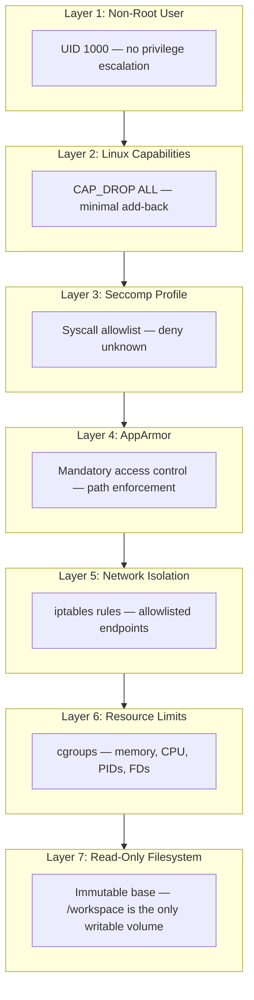
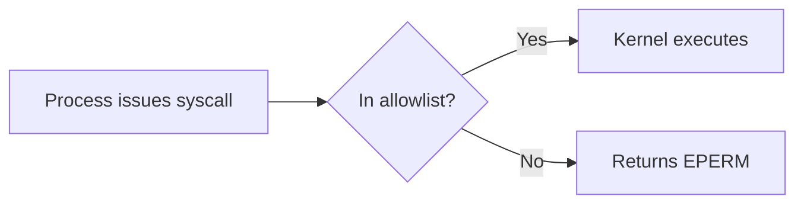
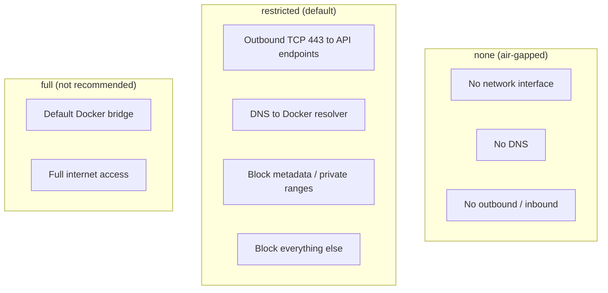
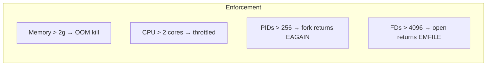
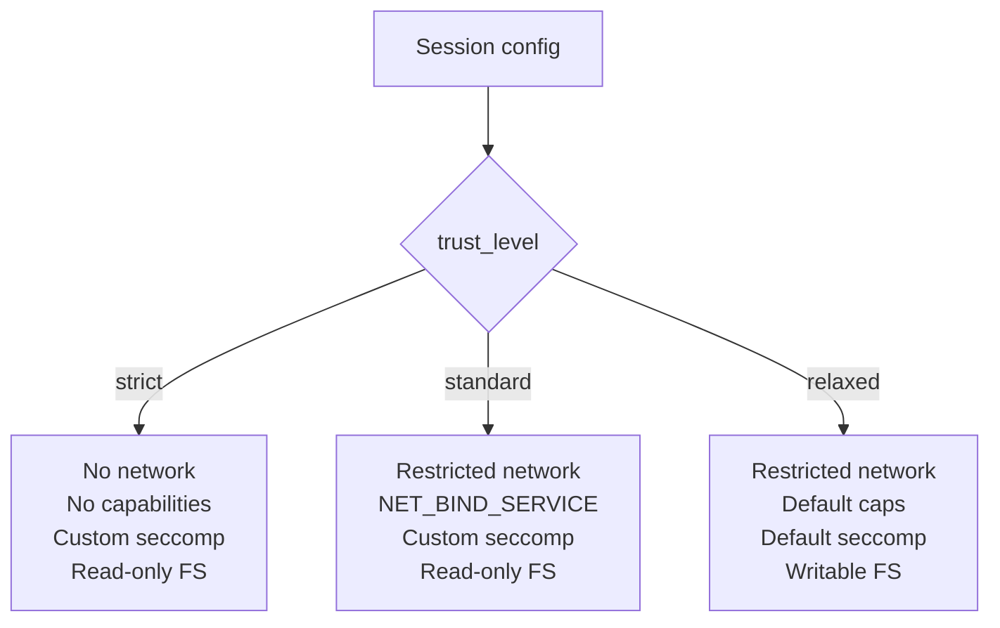
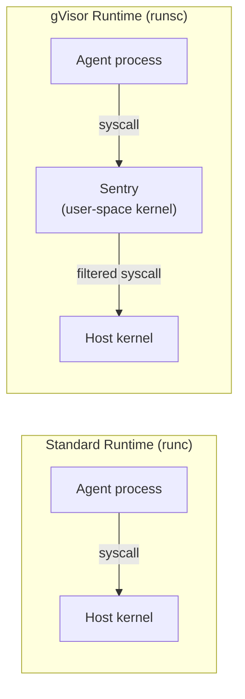
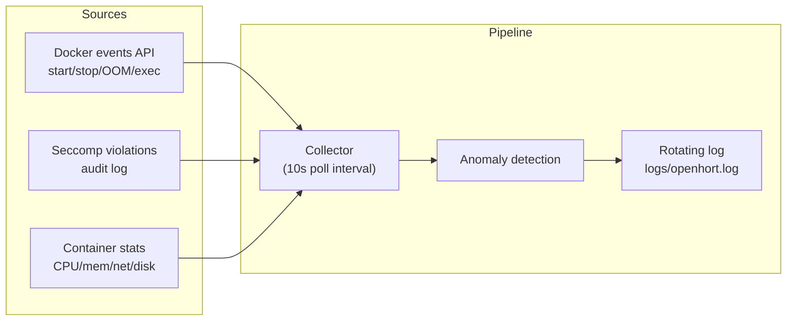

# Container Security

Security hardening specification for Container Horts (Sub-Horts).
Every sandboxed agent session in OpenHORT runs inside a Docker
container. This document specifies exactly how those containers
are secured.

## Defense in Depth

OpenHORT applies seven independent layers of security to every
container. Each layer limits damage on its own -- a failure in
one layer is caught by the next.



!!! info "Independence principle"
    Layers are not cumulative gates. Each one enforces its policy
    regardless of whether a previous layer was bypassed. An attacker
    who gains `CAP_NET_RAW` (Layer 2 failure) is still blocked by
    iptables (Layer 5) and seccomp (Layer 3).

---

## Layer 1: Non-Root User

The container process runs as the `claude` user (UID 1000). Root
access is impossible at runtime.

| Property | Value |
|----------|-------|
| Username | `claude` |
| UID / GID | 1000 / 1000 |
| Home | `/home/claude` |
| Shell | `/bin/bash` |
| `sudo` installed | No |
| `su` installed | No |
| SUID binaries | None (stripped at build time) |

```dockerfile title="Dockerfile (excerpt)"
RUN useradd -m -u 1000 -s /bin/bash claude
RUN find / -perm /6000 -type f -exec chmod a-s {} \; 2>/dev/null || true
USER claude
WORKDIR /workspace
```

- `/etc/passwd` and `/etc/shadow` are bind-mounted read-only at
  runtime, preventing the process from creating new users.
- Claude Code's `--dangerously-skip-permissions` flag refuses to
  run as root, providing an additional hard stop.
- Even if the process somehow acquires `CAP_SETUID`, the user
  namespace mapping prevents escalation to host root.

---

## Layer 2: Linux Capabilities

All capabilities are dropped. Only the minimum set is added back.

```bash title="docker run flags"
docker run --cap-drop ALL \
           --cap-add NET_BIND_SERVICE \
           ...
```

### Capability matrix

| Capability | Granted | Rationale |
|------------|---------|-----------|
| `NET_BIND_SERVICE` | Yes | Bind to ports below 1024 (MCP servers) |
| `CHOWN` | No | Ownership changes not needed |
| `DAC_OVERRIDE` | No | File permission bypass not needed |
| `FOWNER` | No | Not needed |
| `KILL` | No | Agent must not kill arbitrary processes |
| `NET_RAW` | No | Prevents raw sockets / network scanning |
| `SYS_CHROOT` | No | Not needed |
| `SETUID` | No | Prevents privilege escalation |
| `SETGID` | No | Prevents privilege escalation |
| `SYS_ADMIN` | **Never** | Root-equivalent -- grants mount, cgroups, namespaces |
| `SYS_PTRACE` | No | Prevents debugging / inspecting other processes |
| `MKNOD` | No | Device node creation not needed |
| `AUDIT_WRITE` | No | Kernel audit log not needed |
| `NET_ADMIN` | No | Network configuration not needed |

!!! danger "SYS_ADMIN is never granted"
    `CAP_SYS_ADMIN` is effectively root. It enables `mount`,
    namespace manipulation, BPF program loading, and more.
    No OpenHORT container profile grants this capability.

---

## Layer 3: Seccomp Profile

A custom seccomp profile replaces Docker's default. The default
action is `SCMP_ACT_ERRNO` -- any syscall not in the allowlist
returns an error instead of executing.



### Allowed syscalls

| Category | Syscalls |
|----------|----------|
| Process | `fork`, `clone` (without `CLONE_NEWUSER`), `execve`, `exit`, `exit_group`, `wait4`, `waitid` |
| File I/O | `open`, `openat`, `read`, `write`, `close`, `stat`, `lstat`, `fstat`, `lseek`, `mmap`, `munmap`, `access`, `readlink`, `rename`, `unlink`, `mkdir`, `rmdir`, `getdents64` |
| Network | `socket` (AF_INET/AF_INET6 only), `connect`, `bind`, `listen`, `accept`, `accept4`, `sendto`, `recvfrom`, `sendmsg`, `recvmsg`, `setsockopt`, `getsockopt`, `getpeername`, `getsockname` |
| Time | `clock_gettime`, `clock_getres`, `gettimeofday`, `nanosleep`, `clock_nanosleep` |
| Memory | `brk`, `mprotect`, `mremap`, `madvise`, `mincore` |
| Signals | `rt_sigaction`, `rt_sigprocmask`, `rt_sigreturn`, `kill` (own process group only) |
| Misc | `ioctl`, `fcntl`, `pipe`, `pipe2`, `dup`, `dup2`, `dup3`, `getpid`, `getppid`, `getuid`, `getgid`, `geteuid`, `getegid`, `getcwd`, `chdir`, `futex`, `set_tid_address`, `set_robust_list`, `poll`, `epoll_create1`, `epoll_ctl`, `epoll_wait`, `eventfd2` |

### Blocked syscalls (critical)

| Syscall | Risk |
|---------|------|
| `mount`, `umount2` | Filesystem mounting / container escape |
| `reboot`, `kexec_load` | System reboot from within container |
| `init_module`, `delete_module`, `finit_module` | Kernel module loading |
| `ptrace` | Process debugging / memory inspection |
| `unshare` (with `CLONE_NEWUSER`) | User namespace creation / privilege escalation |
| `keyctl` | Kernel keyring access |
| `bpf` | eBPF program loading |
| `pivot_root` | Root filesystem replacement |
| `swapon`, `swapoff` | Swap management |
| `acct` | Process accounting manipulation |
| `settimeofday`, `adjtimex` | System clock manipulation |
| `personality` | Execution domain changes |

??? note "Full seccomp JSON profile"
    The profile lives at `hort/sandbox/seccomp-openhort.json`.
    It is passed to Docker with `--security-opt seccomp=<path>`.
    The structure follows Docker's seccomp profile format with
    `defaultAction: "SCMP_ACT_ERRNO"` and an explicit `syscalls`
    allowlist.

---

## Layer 4: AppArmor Profile

A custom AppArmor profile (`openhort-sandbox`) enforces mandatory
access control at the kernel level. This is independent of file
permissions -- even if a file is world-readable, AppArmor can deny
access.

```bash title="Loading the profile"
sudo apparmor_parser -r /etc/apparmor.d/openhort-sandbox
docker run --security-opt apparmor=openhort-sandbox ...
```

```text title="/etc/apparmor.d/openhort-sandbox"
#include <tunables/global>

profile openhort-sandbox flags=(attach_disconnected) {
  #include <abstractions/base>

  # Deny raw network access (no packet sniffing)
  deny network raw,

  # Deny mount operations
  deny mount,

  # Deny writes to sensitive kernel interfaces
  deny /proc/*/mem rw,
  deny /proc/sysrq-trigger rw,
  deny /proc/kcore rw,
  deny /sys/** w,

  # Writable paths (agent workspace)
  /workspace/** rw,
  /home/claude/** rw,
  /tmp/** rw,

  # Read-only system paths
  /usr/** r,
  /lib/** r,
  /lib64/** r,
  /bin/** r,
  /sbin/** r,
  /etc/** r,

  # Executable paths (inherit profile)
  /usr/bin/** ix,
  /usr/local/bin/** ix,
  /bin/** ix,
}
```

| Path | Access | Purpose |
|------|--------|---------|
| `/workspace/**` | rw | Agent working directory |
| `/home/claude/**` | rw | Session persistence (`.claude/`) |
| `/tmp/**` | rw | Temporary files (tmpfs, limited) |
| `/usr/**`, `/lib/**`, `/bin/**` | r | System libraries and binaries |
| `/proc/*/mem` | denied | Memory access of other processes |
| `/sys/**` | denied (write) | Kernel sysfs interface |

!!! warning "macOS / Docker Desktop"
    AppArmor is a Linux kernel feature. On Docker Desktop for macOS,
    containers run inside a LinuxKit VM that provides its own
    isolation layer. The AppArmor profile applies within that VM.
    On Linux hosts with direct Docker, AppArmor is the primary
    mandatory access control mechanism.

---

## Layer 5: Network Isolation

Three network modes are available. The mode is set per session
in the runtime configuration.



### Mode: `none`

```bash
docker run --network none ...
```

Completely air-gapped. No network interface is created inside the
container. Use for agents that only process local data with no
API calls required.

### Mode: `restricted` (default)

The default for all agent sessions. Uses a custom Docker network
with iptables rules enforced at container creation.

```bash title="Network and iptables setup"
# Create isolated Docker network (once)
docker network create --driver bridge \
  --subnet 172.30.0.0/24 \
  --opt com.docker.network.bridge.enable_icc=false \
  openhort-sandbox-net

# Per-container iptables rules (applied by the session manager)
# Allow DNS to Docker's embedded resolver
iptables -A FORWARD -s 172.30.0.0/24 -d 127.0.0.11 -p udp --dport 53 -j ACCEPT
iptables -A FORWARD -s 172.30.0.0/24 -d 127.0.0.11 -p tcp --dport 53 -j ACCEPT

# Allow outbound HTTPS to Anthropic API
iptables -A FORWARD -s 172.30.0.0/24 -d api.anthropic.com -p tcp --dport 443 -j ACCEPT

# Block cloud metadata endpoints
iptables -A FORWARD -s 172.30.0.0/24 -d 169.254.169.254 -j DROP

# Block private network ranges (host network, other containers)
iptables -A FORWARD -s 172.30.0.0/24 -d 10.0.0.0/8 -j DROP
iptables -A FORWARD -s 172.30.0.0/24 -d 172.16.0.0/12 -j DROP
iptables -A FORWARD -s 172.30.0.0/24 -d 192.168.0.0/16 -j DROP

# Block link-local
iptables -A FORWARD -s 172.30.0.0/24 -d 169.254.0.0/16 -j DROP

# Drop all other outbound
iptables -A FORWARD -s 172.30.0.0/24 -j DROP
```

| Rule | Target | Action | Purpose |
|------|--------|--------|---------|
| DNS | `127.0.0.11:53` | ACCEPT | Docker embedded DNS resolver |
| API | `api.anthropic.com:443` | ACCEPT | LLM API calls |
| Metadata | `169.254.169.254` | DROP | Block AWS/GCP/Azure metadata |
| Private | `10.0.0.0/8` | DROP | Block host and LAN access |
| Private | `172.16.0.0/12` | DROP | Block inter-container access |
| Private | `192.168.0.0/16` | DROP | Block home network access |
| Link-local | `169.254.0.0/16` | DROP | Block link-local range |
| Default | everything else | DROP | Deny-by-default |

!!! info "Docker Desktop on macOS"
    Docker Desktop runs containers inside a LinuxKit VM. The VM
    itself provides network isolation from the macOS host. The
    iptables rules above apply within the VM and still matter --
    they prevent containers from reaching Docker's gateway
    (`172.17.0.1`) and the host's LAN interfaces tunneled through
    the VM.

### Mode: `full`

```bash
docker run --network bridge ...
```

Standard Docker bridge networking with full internet access. Only
for trusted agents that require arbitrary outbound connections.
Not recommended for sandboxed sessions.

!!! danger "full mode disables network isolation"
    An agent with full network access can exfiltrate data, scan
    internal networks, and reach cloud metadata endpoints. Use
    `restricted` or `none` unless you have a specific reason.

---

## Layer 6: Resource Limits (cgroups)

Docker's cgroup integration enforces hard resource caps. Exceeding
a limit results in immediate enforcement (OOM kill, throttling,
or error), not a warning.

| Resource | Docker flag | Default | Enforcement |
|----------|------------|---------|-------------|
| Memory | `--memory` | `2g` | OOM-killed (SIGKILL) |
| Memory + swap | `--memory-swap` | `2g` (same, no swap) | Prevents swap usage |
| CPU | `--cpus` | `2` | CFS scheduler throttling |
| PIDs | `--pids-limit` | `256` | Fork bomb protection (EAGAIN) |
| File descriptors | `--ulimit nofile=` | `1024:4096` | Prevents FD exhaustion |
| Disk | `--storage-opt size=` | Not set | Requires `overlay2` + `xfs` + `pquota` |

```bash title="Complete resource flags"
docker run \
  --memory 2g \
  --memory-swap 2g \
  --cpus 2 \
  --pids-limit 256 \
  --ulimit nofile=1024:4096 \
  ...
```



!!! tip "Disk quotas"
    The `--storage-opt size=` flag requires the Docker storage
    driver to be `overlay2` on an XFS filesystem with project
    quotas enabled (`pquota` mount option). This is not available
    on Docker Desktop by default. Without it, disk usage is
    unbounded -- rely on the reaper's `reap_by_space()` policy
    for volume cleanup.

---

## Layer 7: Read-Only Root Filesystem

The container's root filesystem is mounted read-only. Only
explicitly listed paths are writable.

```bash title="Filesystem flags"
docker run \
  --read-only \
  --tmpfs /tmp:rw,noexec,nosuid,size=100m \
  --tmpfs /run:rw,noexec,nosuid,size=10m \
  -v ohvol-<id>:/workspace:rw \
  -v claude-home:/home/claude:rw \
  ...
```

| Path | Type | Access | Flags | Purpose |
|------|------|--------|-------|---------|
| `/` | overlay | read-only | `--read-only` | Immutable base system |
| `/tmp` | tmpfs | read-write | `noexec`, `nosuid`, 100 MB | Temporary files |
| `/run` | tmpfs | read-write | `noexec`, `nosuid`, 10 MB | Runtime state (PID files) |
| `/workspace` | named volume | read-write | none | Agent working directory |
| `/home/claude/.claude` | named volume | read-write | none | Session persistence |

- No package installs (`apt-get` fails because dpkg cannot write)
- No binary modifications (cannot replace `/usr/bin/node`)
- `/tmp` has `noexec` -- binaries cannot be executed from temp
- `/tmp` is capped at 100 MB -- prevents disk exhaustion via temp files
- `/workspace` is the only persistent writable path

---

## Docker Image Hardening

The sandbox base image is built with security as a constraint,
not an afterthought.

| Property | Value |
|----------|-------|
| Base image | `node:22-slim` |
| Image pinning | By digest (`node@sha256:...`), not tag |
| SUID/SGID binaries | Stripped at build time |
| `curl` / `wget` | Not installed (restricted mode) |
| Secrets | None baked into image |
| Build user | `claude` (UID 1000) via `USER` directive |

```dockerfile title="Dockerfile (hardening layers)" hl_lines="3 6 9"
FROM node:22-slim@sha256:<pinned-digest>

# Strip all SUID/SGID bits
RUN find / -perm /6000 -type f -exec chmod a-s {} \; 2>/dev/null || true

# Remove network tools in restricted builds
RUN apt-get purge -y curl wget && apt-get autoremove -y

# Create non-root user
RUN useradd -m -u 1000 -s /bin/bash claude
USER claude
WORKDIR /workspace
```

---

## Runtime Protection Flags

These Docker flags provide additional runtime hardening beyond
the seven layers.

```bash title="All runtime security flags"
docker run \
  --no-new-privileges \
  --security-opt no-new-privileges:true \
  --security-opt seccomp=seccomp-openhort.json \
  --security-opt apparmor=openhort-sandbox \
  --read-only \
  --cap-drop ALL \
  --cap-add NET_BIND_SERVICE \
  --tmpfs /tmp:rw,noexec,nosuid,size=100m \
  --pids-limit 256 \
  --memory 2g \
  --cpus 2 \
  ...
```

| Flag | Effect |
|------|--------|
| `--no-new-privileges` | Prevents child processes from gaining privileges via SUID binaries or `execve` |
| `--read-only` | Root filesystem is immutable |
| `--tmpfs /tmp:noexec` | Temp directory cannot execute binaries |
| `--pids-limit 256` | Prevents fork bombs |
| `--cap-drop ALL` | Start with zero capabilities |

---

## Trust Levels

OpenHORT defines three trust levels. Each maps to a specific
combination of the security layers.

| Trust Level | Capabilities | Seccomp | Network | Filesystem | Use Case |
|-------------|-------------|---------|---------|------------|----------|
| `strict` | ALL dropped | Custom (restrictive) | `none` | Read-only, `/workspace` rw | Processing sensitive data, offline analysis |
| `standard` | `NET_BIND_SERVICE` only | Custom | `restricted` | Read-only, `/workspace` rw | Default for all agent sessions |
| `relaxed` | Docker default set | Docker default | `restricted` | Standard Docker (writable) | Trusted internal tools, development |



```yaml title="Session configuration"
runtime:
  trust_level: standard          # strict | standard | relaxed
  network: restricted            # overrides trust_level default
  memory: 2g
  cpus: 2
  allowed_hosts:
    - api.anthropic.com
```

---

## Limitations

Container isolation is strong but not absolute. These are known
limitations and their mitigations.

| Limitation | Risk | Mitigation |
|------------|------|------------|
| Shared host kernel | Kernel vulnerability = container escape | gVisor (`runsc`) for untrusted workloads |
| Side-channel attacks | Timing / cache attacks across containers | Accepted risk; not mitigated |
| API key in environment | `env` visible via `/proc/self/environ` | Never written to disk; use scoped short-lived keys |
| Prompt injection | Model tricked into acting within permissions | Not a container concern; handled at framework level |
| Supply chain attacks | Compromised base image or npm package | Pin by digest; scan images with Trivy/Snyk |
| Docker socket access | Mount of `/var/run/docker.sock` = host root | Never mounted; not available in any trust level |

!!! danger "Docker socket"
    The Docker socket (`/var/run/docker.sock`) is **never** mounted
    into sandbox containers. Access to the Docker socket is
    equivalent to root access on the host. The session manager
    communicates with Docker from the host process only.

---

## gVisor (Future Hardening)

For untrusted workloads, OpenHORT will support gVisor (`runsc`)
as an alternative container runtime. gVisor interposes a
user-space kernel between the container and the host kernel,
intercepting all syscalls.



| Property | runc (default) | runsc (gVisor) |
|----------|---------------|----------------|
| Syscall handling | Direct to host kernel | Intercepted by Sentry |
| Kernel exposure | Full kernel attack surface | Minimal (~70 host syscalls) |
| I/O performance | Native | 10--30% overhead |
| Kernel zero-day risk | Exposed | Blocked (Sentry isolation) |
| Docker flag | `--runtime=runc` | `--runtime=runsc` |
| Compatibility | Full Linux ABI | Most Linux ABI (some gaps) |

```bash title="Running with gVisor"
docker run --runtime=runsc \
  --cap-drop ALL \
  --read-only \
  ...
```

---

## Monitoring

Container security events are logged and polled for anomaly
detection.



### Monitored events

| Event | Source | Response |
|-------|--------|----------|
| Container OOM killed | Docker events | Log + restart (if policy allows) |
| Seccomp violation | Audit log | Log syscall name and PID |
| PID limit hit | Docker events | Log (fork bomb indicator) |
| Unusual network connection | Stats polling | Log destination IP and port |
| Container exec | Docker events | Log command (audit trail) |
| Resource threshold (>80%) | Stats polling | Log warning |

### Log format

All security events are written to the rotating log at
`logs/openhort.log` (5 MB, 3 backups) with structured fields:

```
2026-03-27 14:22:01 [SECURITY] container=ohsb-abc123 event=seccomp_violation syscall=mount pid=42
2026-03-27 14:22:05 [SECURITY] container=ohsb-abc123 event=oom_killed memory_limit=2g
2026-03-27 14:22:10 [SECURITY] container=ohsb-abc123 event=pids_exhausted limit=256 current=256
```

---

## Complete Docker Run Command

For reference, this is the full `docker run` command that the
session manager constructs for a `standard` trust level session.

```bash title="Standard trust level — full command"
docker run -d \
  --name ohsb-<session-id> \
  --hostname sandbox \
  --user 1000:1000 \
  --read-only \
  --no-new-privileges \
  --cap-drop ALL \
  --cap-add NET_BIND_SERVICE \
  --security-opt seccomp=seccomp-openhort.json \
  --security-opt apparmor=openhort-sandbox \
  --security-opt no-new-privileges:true \
  --network openhort-sandbox-net \
  --memory 2g \
  --memory-swap 2g \
  --cpus 2 \
  --pids-limit 256 \
  --ulimit nofile=1024:4096 \
  --tmpfs /tmp:rw,noexec,nosuid,size=100m \
  --tmpfs /run:rw,noexec,nosuid,size=10m \
  -v ohvol-<session-id>:/workspace:rw \
  -v claude-home-<session-id>:/home/claude:rw \
  -e ANTHROPIC_API_KEY=sk-ant-... \
  openhort-sandbox@sha256:<pinned-digest> \
  sleep infinity
```

## See Also

- [Sandbox Sessions](sandbox-sessions.md) -- session lifecycle, reaper, metadata
- [Permissions](permissions.md) -- tool, command, file, and network permission model
- [Threat Model](../security/threat-model.md) -- attack vectors and mitigations
