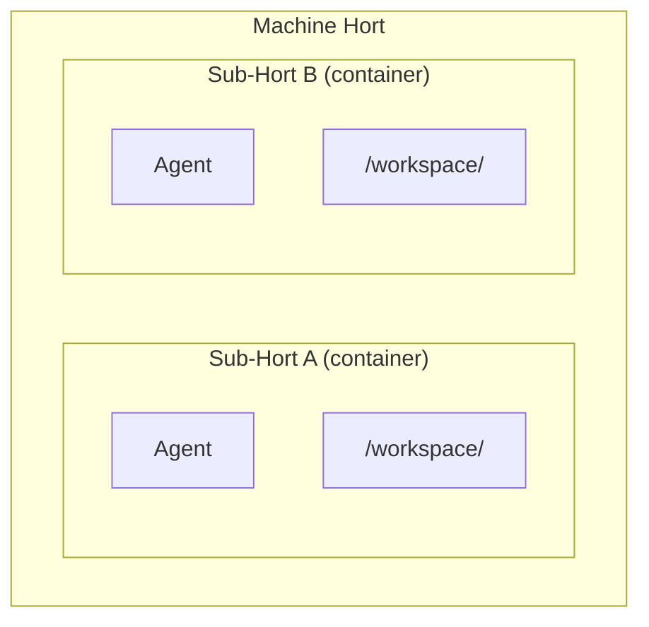
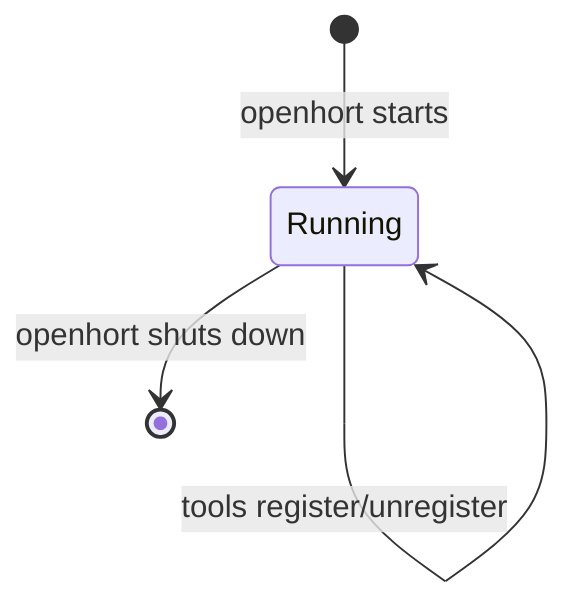
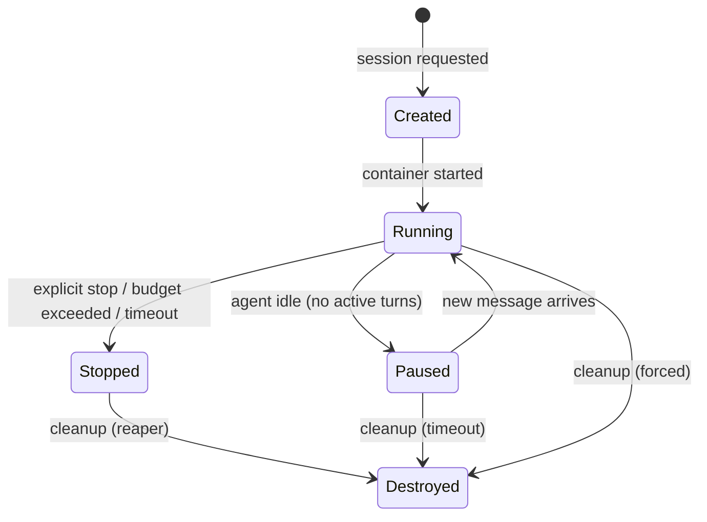

# Hort Model

A **Hort** is the fundamental isolation unit in OpenHORT — a bounded
space where AI agents, tools, and data live under controlled conditions.
The name comes from *Kinderhort* (German: a safe, supervised space for
children). Everything inside a Hort shares the same trust level.
By default, nothing crosses the boundary.

## Hort Types

### Machine Hort (Root Hort)

A physical or virtual machine running openhort. The OS provides
the isolation boundary.

- Your Mac, a Raspberry Pi, a cloud VM
- Always the root of the Hort tree (cannot be nested)
- Contains all tools, data, and network access on that machine
- **Exports nothing by default** — this is the most important security property

```mermaid
flowchart TB
    subgraph Mac ["Machine Hort (Mac)"]
        direction TB
        FS["Filesystem"]
        Net["Network"]
        Tools["Tools & MCPs"]
        Agents["LLMings"]
    end
    style Mac fill:#1a1a2e,stroke:#3b82f6
```



### Container Hort (Sub-Hort)

A Docker container running inside a Machine Hort. Uses Linux
namespaces, cgroups, seccomp, and capabilities for isolation.

- Created on demand (agent session, sandboxed task)
- Destroyed on cleanup (timeout, explicit stop, reaper)
- Has its own filesystem, process tree, and (optionally) network stack
- Can only access tools explicitly granted by the parent



!!! info "Sub-Horts are always one level deep"
    Container Horts are children of a Machine Hort. We do not
    support containers-in-containers (Docker-in-Docker). This
    simplifies the security model — there is exactly one parent
    and one level of nesting.

### Virtual Hort

A logical Hort without container isolation — just permission-scoped
within a Machine Hort. Lighter weight, weaker isolation.

- No OS-level boundary (same process space as the parent)
- Isolation is enforced only by the permission engine
- For trusted tools that don't need sandboxing
- Example: a monitoring LLMing that runs as a plugin in the main process

!!! warning "Virtual Horts provide no security against malicious code"
    Virtual Horts rely entirely on the permission engine. A
    compromised tool in a Virtual Hort has the same OS-level
    access as the parent. Use Container Horts for untrusted workloads.

## Identity

Every Hort has a unique identity used for message routing, audit
logging, and permission resolution.

| Hort Type | ID Format | Example |
|-----------|----------|---------|
| Machine Hort | UUID + human-readable `node_id` | `node_id: mac-studio`, `hort_id: 550e8400-...` |
| Container Hort | Session UUID | `hort_id: 7c9e6679-...` |
| Virtual Hort | Plugin ID | `hort_id: system-monitor` |

Machine Horts also carry a `node_id` (human-readable, configured
in `cluster.yaml` or `node.yaml`). This is used in cross-machine
references: `agent-name@node-id`.

Identity is:
- Assigned at creation, immutable for the Hort's lifetime
- Used in audit logs for every cross-boundary action
- Used by the message bus for A2A routing
- Verified via connection keys for H2H (cross-machine)

## Nesting Rules

```mermaid
flowchart TB
    Root["Machine Hort (root)"]
    Root --> C1["Container Hort A"]
    Root --> C2["Container Hort B"]
    Root --> V1["Virtual Hort X"]
    style Root fill:#1a1a2e,stroke:#3b82f6
    style C1 fill:#1e293b,stroke:#22c55e
    style C2 fill:#1e293b,stroke:#22c55e
    style V1 fill:#1e293b,stroke:#eab308,stroke-dasharray: 5 5
```



| Rule | Rationale |
|------|-----------|
| Machine Horts are always root-level | A physical machine cannot be nested inside another |
| Container Horts are children of a Machine Hort | One level of nesting (no Docker-in-Docker) |
| Virtual Horts can exist at any level | They're logical, not physical |
| A Sub-Hort can NEVER have more permissions than its parent | **Intersection rule** — permissions only reduce downward |
| Parent grants any subset of its own permissions to children | Parent decides what each child sees |
| Children cannot escalate beyond what the parent allows | Enforced by the permission engine and proxy layer |

### The Intersection Rule

This is the core security invariant. A Sub-Hort's effective
permissions are the **intersection** of:

1. What the parent Hort has
2. What the parent explicitly grants to this child
3. What the child's own config requests
4. What the access source allows (see [source policies](source-policies.md))

At every layer, permissions can only be **reduced**, never expanded.

??? example "Intersection example"
    Parent has tools: `[Read, Write, Edit, Bash, Glob, Grep, WebSearch]`

    Parent grants child: `[Read, Write, Glob, Grep, WebSearch]` (no Edit, no Bash)

    Child config requests: `[Read, Glob, Grep, WebSearch, Bash]` (requests Bash)

    **Effective**: `[Read, Glob, Grep, WebSearch]` — Bash is denied because
    the parent didn't grant it, even though the child requested it.

## Lifecycle

### Machine Hort



Machine Horts exist as long as openhort is running. They don't
have a complex lifecycle.

### Container Hort



Cleanup policies (see [sandbox sessions](sandbox-sessions.md)):
- **Timeout**: idle sessions destroyed after configurable timeout (default: 30 min)
- **Count**: max sessions per Machine Hort (oldest destroyed first)
- **Disk space**: sessions destroyed when disk usage exceeds threshold

## What Lives Inside a Hort

| Component | Description | Details |
|-----------|-------------|---------|
| Tools | MCPs, LLMings, Programs | See [tool system](tool-system.md) |
| Agents (LLMings) | AI models with tool access | See [LLM extensions](llm-extensions.md) |
| Data | Files, databases, state stores | Scoped to the Hort's filesystem |
| Configuration | Permissions, budgets, network rules | YAML config or inherited from parent |
| Exports | Tools made available to other Horts | See [export/import](export-import.md) |
| Imports | Tools received from other Horts | See [export/import](export-import.md) |

## Boundary Enforcement

Each Hort type enforces its boundary differently:

| Boundary | Machine Hort | Container Hort | Virtual Hort |
|----------|-------------|---------------|-------------|
| Process isolation | OS process tree | Linux PID namespace | None |
| Filesystem | OS permissions | Mount namespace + bind mounts | Permission engine only |
| Network | OS firewall | Network namespace + iptables | Permission engine only |
| Tool access | Permission engine | Permission engine + MCP proxy | Permission engine |
| Resource limits | OS limits | cgroups (memory, CPU, PIDs) | None |
| Syscall filtering | None (full OS) | Seccomp profile | None |
| Mandatory access control | OS-level (if configured) | AppArmor/SELinux | None |

For Container Hort hardening details, see [container security](container-security.md).

## The Root Hort (Default State)

When openhort starts on your machine, the root Machine Hort:

- Contains ALL installed tools, ALL filesystem access, ALL network
- Exports NOTHING — no Sub-Hort or remote Hort can access anything
- Has no budget limits (it's your machine)
- Has full access source permissions for `local`

!!! danger "The root Hort is the trust anchor"
    If the root Machine Hort is compromised, all Sub-Horts are
    compromised. The framework cannot protect against a compromised
    host. This is why the root Hort must be treated as the highest
    trust level.

## Hort Registry

The openhort server maintains a registry of all known Horts:

```python
@dataclass
class HortEntry:
    hort_id: str              # UUID
    hort_type: str            # "machine" | "container" | "virtual"
    node_id: str | None       # human-readable (machine horts only)
    parent_id: str | None     # parent hort (None for root)
    status: str               # "running" | "paused" | "stopped"
    exports: list[ExportDecl] # tools exported to other horts
    imports: list[ImportDecl] # tools imported from other horts
    created_at: float
```

The registry is used by:
- **Permission engine**: resolve cross-Hort tool access
- **Message bus**: route A2A messages to the correct Hort
- **H2H protocol**: advertise exports to remote nodes
- **Dashboard**: display Hort status in the UI

## Security Properties

### Isolation Guarantee

A compromised Container Hort cannot affect its parent or siblings.
Enforced by:
- Linux namespaces (PID, mount, network, user)
- Dropped capabilities (no privilege escalation)
- Seccomp (syscall filtering)
- AppArmor (mandatory access control)
- No direct container-to-container networking

### Permission Inheritance

Sub-Horts can only have a **subset** of parent permissions.
Enforced by:
- Intersection rule at the permission engine level
- MCP proxy filters tool lists (agents never see disallowed tools)
- File mounts controlled by parent (child cannot mount arbitrary paths)

### Audit Trail

Every cross-boundary action is logged:
- Source Hort, target Hort, action type, arguments, result
- Stored on the host (outside all containers)
- Append-only, containers cannot modify audit logs

### Revocation

Permissions can be revoked at any time:
- Export declarations updated → takes effect on next tool call
- Container stopped → all permissions revoked immediately
- H2H connection dropped → all remote imports unavailable

## Attack Vectors

| Attack | Target | Mitigation |
|--------|--------|------------|
| Container escape | Container → Host | Seccomp, capabilities, gVisor (see [container security](container-security.md)) |
| Permission escalation | Sub-Hort gains parent perms | Intersection rule enforced at registry + proxy |
| Identity spoofing | Hort impersonates another | UUID + connection key verification |
| Parent trust abuse | Parent injects malicious tools | By design: parent IS trusted (documented assumption) |
| Sibling interference | Container A affects Container B | No direct networking, separate namespaces |
| Registry manipulation | Tamper with Hort registry | Registry on host, containers have no access |

!!! info "Parent trust is an accepted assumption"
    The parent Hort is always trusted by its children. A Machine
    Hort can inject any tool, env var, or file mount into its
    Container Horts. This is by design — the machine owner controls
    the machine. If you don't trust the machine, don't run agents
    on it.
