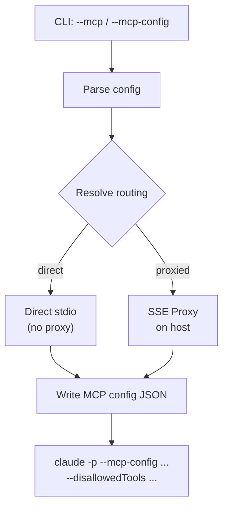
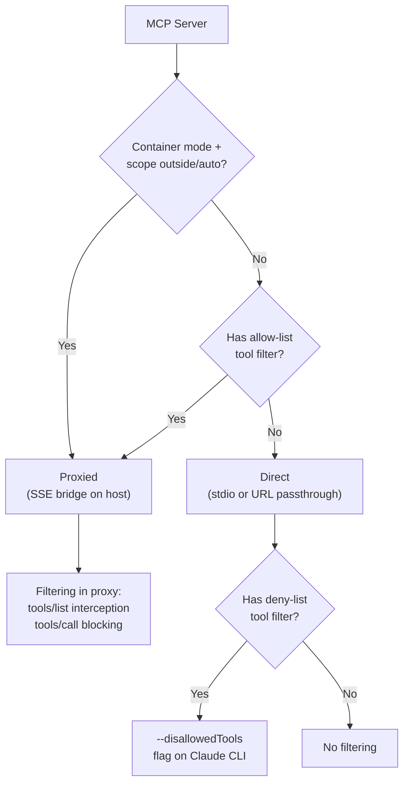
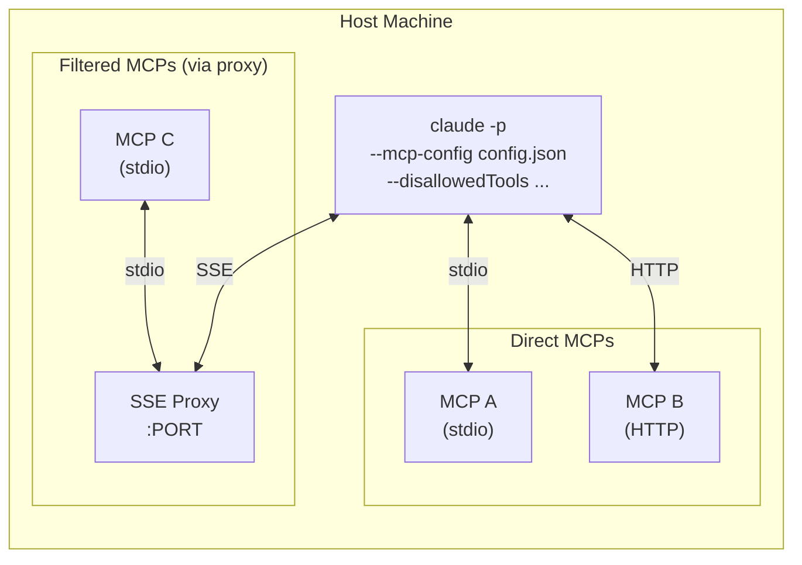
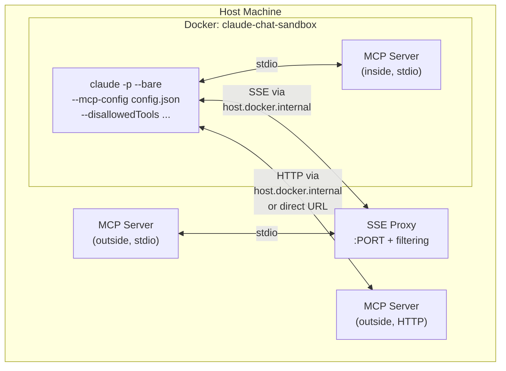
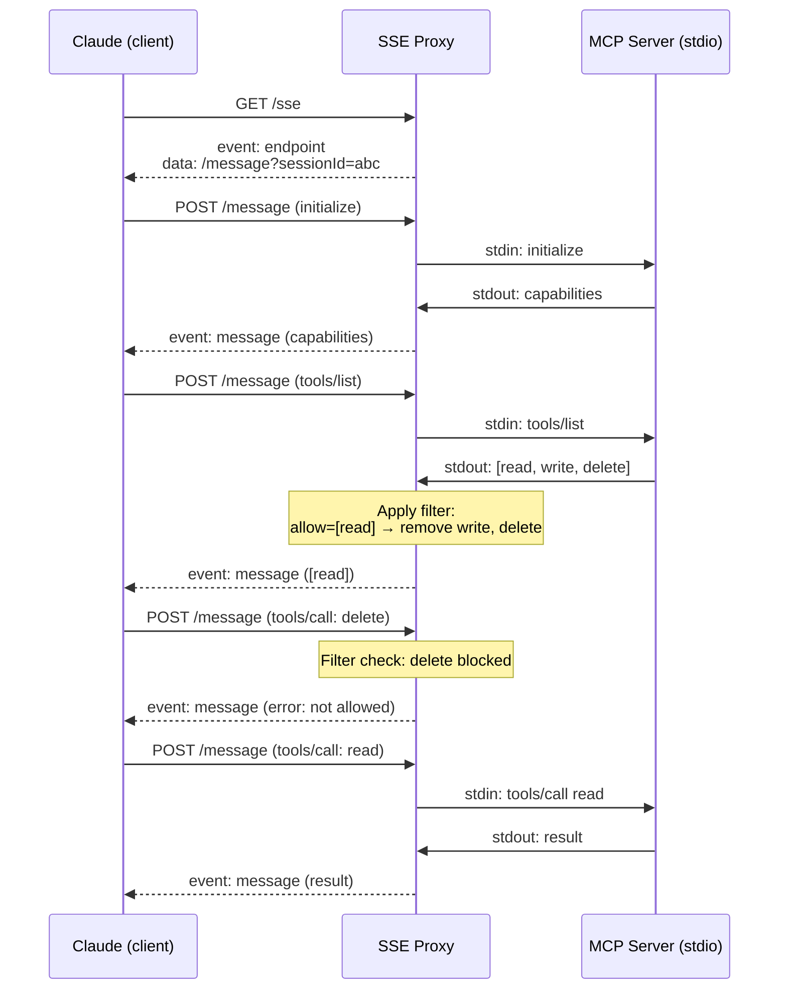
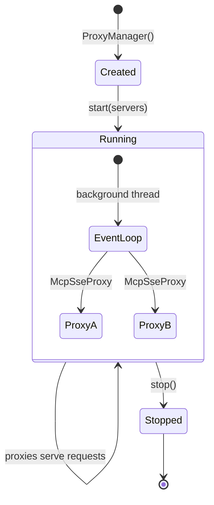
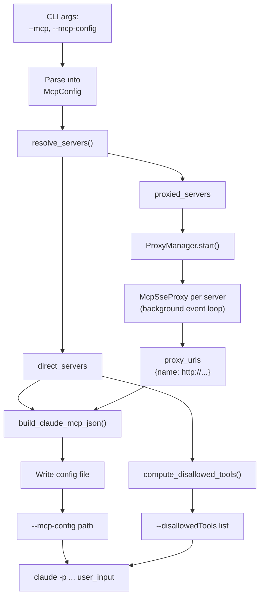

# MCP Servers

Dynamic MCP (Model Context Protocol) server assignment for Claude chat
sessions. MCPs can run on the host, inside a container, or as remote
HTTP services — with per-server tool filtering.

## Overview



An MCP server can be **stdio** (a local command) or **HTTP** (a remote
URL). Both types work in local mode and container mode. Tool filtering
applies to both.

## Transport Types

### Stdio MCP

A process on the local machine. Claude starts it, communicates via
stdin/stdout using Content-Length framed JSON-RPC.

```json
{
  "mcpServers": {
    "filesystem": {
      "command": "npx",
      "args": ["-y", "@anthropic/mcp-filesystem", "/tmp"]
    }
  }
}
```

### HTTP MCP

An already-running server reachable via URL. Claude connects using the
MCP SSE transport (Server-Sent Events + POST).

```json
{
  "mcpServers": {
    "database": {
      "url": "http://localhost:3000/sse"
    }
  }
}
```

## Routing Decision

Every MCP server is classified as **direct** (Claude talks to it
directly) or **proxied** (goes through an SSE proxy on the host).



!!! info "Why allow-lists always need a proxy"
    An allow-list means "only these tools exist." This requires
    intercepting the `tools/list` response from the MCP and removing
    unlisted tools before Claude sees them. The proxy sits between
    Claude and the MCP to do this.

    A deny-list means "all tools except these." Claude CLI natively
    supports `--disallowedTools`, so no proxy is needed — the flag
    handles it directly.

## Architecture

### Local Mode (no container)



In local mode, most MCPs connect directly. A proxy is only started
when an MCP has an allow-list tool filter (needs `tools/list`
interception).

### Container Mode



In container mode, MCPs with `scope: outside` or `scope: auto` run
on the host. Stdio MCPs go through the SSE proxy so Claude inside
the container can reach them. HTTP MCPs are accessible if the URL
is reachable from the container.

MCPs with `scope: inside` run directly inside the container (the
command must be available in the Docker image).

## SSE Proxy

The proxy bridges a stdio MCP process to the MCP SSE transport
protocol. It also applies tool filtering at the protocol level.



### Proxy lifecycle

The `ProxyManager` runs all proxies in a background asyncio event
loop on a daemon thread. Proxies start before the first chat turn
and stop when the session ends.



## Tool Filtering

Control which tools from an MCP server are visible to Claude.

### Allow list

Only the listed tools exist. All others are hidden.

```json
{
  "toolFilter": {
    "allow": ["read_file", "list_directory"]
  }
}
```

- `tools/list` response is intercepted — unlisted tools removed
- `tools/call` for unlisted tools returns JSON-RPC error
- Always routed through the proxy (needs response interception)

### Deny list

All tools are available except the listed ones.

```json
{
  "toolFilter": {
    "deny": ["delete_file", "write_file"]
  }
}
```

- Direct MCPs: handled via `--disallowedTools` CLI flag
- Proxied MCPs: handled at proxy level (same interception as allow)
- `tools/call` for denied tools returns JSON-RPC error

### Combined

Both can be used together. Allow is applied first, then deny.

```json
{
  "toolFilter": {
    "allow": ["read_file", "write_file", "list_dir"],
    "deny": ["write_file"]
  }
}
```

Result: only `read_file` and `list_dir` are available.

## Configuration

### CLI flags

```bash
# Inline MCP (stdio, no filtering)
--mcp "name=command arg1 arg2"

# Config file (full control)
--mcp-config path/to/mcps.json

# Both can be combined — inline MCPs merge into the config
--mcp-config mcps.json --mcp "extra=some-command"
```

### Config file format

```json
{
  "mcpServers": {
    "filesystem": {
      "command": "npx",
      "args": ["-y", "@anthropic/mcp-filesystem", "/tmp"],
      "env": {"HOME": "/tmp"},
      "scope": "outside",
      "toolFilter": {
        "allow": ["read_file", "list_directory"]
      }
    },
    "database": {
      "url": "http://localhost:5432/mcp",
      "scope": "outside",
      "toolFilter": {
        "deny": ["drop_table", "truncate"]
      }
    },
    "linter": {
      "command": "python",
      "args": ["-m", "mcp_linter"],
      "scope": "inside"
    }
  }
}
```

### Field reference

| Field | Type | Default | Description |
|-------|------|---------|-------------|
| `command` | string | — | Executable for stdio MCPs |
| `args` | list | `[]` | Arguments for the command |
| `env` | object | `{}` | Extra environment variables |
| `url` | string | — | URL for HTTP/SSE MCPs (mutually exclusive with `command`) |
| `scope` | string | `auto` | `inside`, `outside`, or `auto` |
| `toolFilter` | object | — | Tool allow/deny filter |
| `toolFilter.allow` | list | — | Whitelist: only these tools are visible |
| `toolFilter.deny` | list | — | Blacklist: these tools are hidden |

### Scope behavior

| Scope | Local mode | Container mode |
|-------|-----------|---------------|
| `auto` | Direct (or proxy if allow-filter) | Proxied on host |
| `inside` | Direct | Runs inside container |
| `outside` | Direct (or proxy if allow-filter) | Proxied on host |

!!! warning "Inside scope + allow filter"
    Inside-container MCPs cannot have allow-list filters because
    there is no proxy to intercept `tools/list` inside the container.
    Use `scope: outside` instead, or switch to a deny-list filter
    (handled natively by `--disallowedTools`).

## Examples

### Read-only filesystem access

Give Claude file reading but block writes and deletes:

=== "Inline"

    ```bash
    poetry run python -m hort.extensions.claude_chat \
      --mcp "fs=npx -y @anthropic/mcp-filesystem /home/user/project" \
      --mcp-config <(echo '{"mcpServers":{"fs":{"command":"npx","args":["-y","@anthropic/mcp-filesystem","/home/user/project"],"toolFilter":{"deny":["write_file","create_directory","move_file"]}}}}')
    ```

=== "Config file"

    ```json
    {
      "mcpServers": {
        "fs": {
          "command": "npx",
          "args": ["-y", "@anthropic/mcp-filesystem", "/home/user/project"],
          "toolFilter": {
            "deny": ["write_file", "create_directory", "move_file"]
          }
        }
      }
    }
    ```

### Sandboxed container with host database

Claude runs in a container but queries a database on the host:

```json
{
  "mcpServers": {
    "db": {
      "url": "http://localhost:5432/mcp",
      "scope": "outside",
      "toolFilter": {
        "allow": ["query_table", "list_tables"],
        "deny": ["drop_table"]
      }
    }
  }
}
```

```bash
poetry run python -m hort.extensions.claude_chat \
  --container --memory 1g --cpus 2 \
  --mcp-config db-config.json
```

### Multiple MCPs with mixed scopes

```json
{
  "mcpServers": {
    "github": {
      "command": "npx",
      "args": ["-y", "@anthropic/mcp-github"],
      "env": {"GITHUB_TOKEN": "ghp_..."},
      "scope": "outside",
      "toolFilter": {
        "deny": ["delete_repository", "delete_branch"]
      }
    },
    "linter": {
      "command": "python",
      "args": ["-m", "pylint_mcp"],
      "scope": "inside"
    },
    "docs": {
      "url": "http://docs-service.internal:8080/mcp",
      "scope": "outside"
    }
  }
}
```

## Implementation Details

### Module structure

```
hort/sandbox/
  mcp.py           — config models, parsing, scope resolution, filtering
  mcp_proxy.py     — McpSseProxy (stdio↔SSE bridge), ProxyManager

hort/extensions/claude_chat/
  chat.py          — integrates MCP setup into the chat loop
```

### Data flow (full)



### Config generation

The system produces two inputs for each `claude -p` invocation:

1. **`--mcp-config`** — JSON file with `mcpServers` entries:
    - Direct stdio MCPs: `{"command": ..., "args": ...}`
    - Proxied MCPs: `{"url": "http://..."}`

2. **`--disallowedTools`** — comma-separated list of
   `mcp__<server>__<tool>` patterns for deny-list filtering on
   direct MCPs.

### Container networking

Docker containers reach the host via `host.docker.internal`. The
container is created with `--add-host=host.docker.internal:host-gateway`
for portability across macOS and Linux Docker.

The SSE proxy's endpoint URL is constructed from the HTTP `Host`
header of the incoming connection. This means the endpoint URL
automatically matches however the client connected — whether via
`localhost` (local mode) or `host.docker.internal` (container mode).

### Test coverage

| Test file | Tests | Covers |
|-----------|-------|--------|
| `test_mcp.py` | 21 | Config parsing, inline MCP specs, scope resolution, JSON generation, allow/deny filtering |
| `test_mcp_proxy.py` | 11 | Proxy lifecycle, SSE protocol, message roundtrip, tool list filtering, tool call blocking, ProxyManager |

Proxy tests use a real mock MCP subprocess (Python script speaking
the stdio protocol) for full end-to-end verification.
