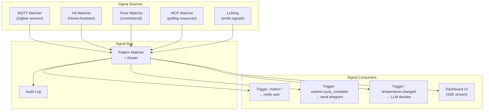
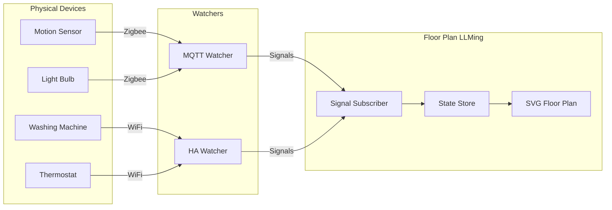
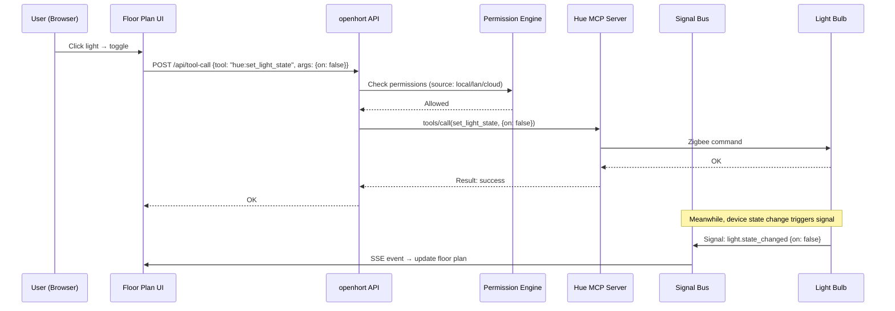
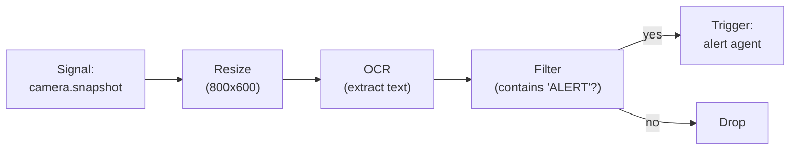

# Signals and Triggers

MCP handles request/response: an agent calls a tool, gets a result.
But the real world is event-driven: a motion sensor fires, a washing
machine finishes, a timer expires. Signals fill that gap.

## The Problem MCP Doesn't Solve

MCP's `resources/subscribe` only flags that something changed — it
doesn't carry the data. There are no wildcards, no QoS, no streaming.
For IoT and automation, we need:

- Push events with payloads (not just "something changed")
- Pattern-based subscriptions (all sensors on floor 1)
- Trigger → Condition → Reaction chains
- Cross-Hort event routing (sensor on Pi, agent on Mac)
- Backwards-compatible, versioned event schemas

## Core Concepts

### Signals

A **Signal** is a typed, timestamped event that flows through
the Hort ecosystem. It carries data about something that happened.

```python
from pydantic import BaseModel, Field
from datetime import datetime
from typing import Any

class Signal(BaseModel):
    """A typed event in the Hort ecosystem.

    Versioned Pydantic model — new fields get defaults,
    removed fields are ignored. Safe across versions.
    """
    model_config = {"extra": "allow"}  # forward-compatible

    version: int = 1
    signal_type: str                   # "motion.detected", "washer.cycle_complete"
    source: str                        # "pi-kitchen/motion-sensor-1"
    hort_id: str                       # originating Hort UUID
    timestamp: datetime = Field(default_factory=datetime.utcnow)
    data: dict[str, Any] = {}          # signal-specific payload
    ttl_seconds: float | None = None   # auto-expire (None = never)
    correlation_id: str | None = None  # link related signals
```

Signals use dot-notation types for hierarchical matching:

| Signal type | Example data |
|-------------|-------------|
| `motion.detected` | `{"zone": "hallway", "confidence": 0.95}` |
| `motion.cleared` | `{"zone": "hallway"}` |
| `washer.cycle_complete` | `{"program": "cotton_60", "duration_min": 45}` |
| `washer.state_changed` | `{"from": "washing", "to": "idle"}` |
| `temperature.changed` | `{"value": 22.5, "unit": "celsius", "room": "kitchen"}` |
| `timer.fired` | `{"timer_id": "daily-check", "scheduled_at": "..."}` |
| `button.pressed` | `{"button": "doorbell", "press_type": "single"}` |
| `light.state_changed` | `{"entity": "living_room", "on": true, "brightness": 80}` |
| `hort.agent_started` | `{"agent": "researcher", "hort_id": "..."}` |
| `hort.budget_warning` | `{"agent": "coder", "percent": 85}` |

!!! info "Signals complement MCP, they don't replace it"
    MCP handles "agent wants to do X" (request/response).
    Signals handle "X happened, someone should react" (push).
    An agent uses MCP tools to act. Signals tell the agent when to act.

### Triggers

A **Trigger** defines when a LLMing should wake up and react.
It watches for Signals that match a pattern and optional conditions.

```python
class TriggerCondition(BaseModel):
    """A condition that must be true for the trigger to fire."""
    model_config = {"extra": "allow"}

    field: str              # JSON path in signal.data, e.g. "zone"
    operator: str           # "eq", "ne", "gt", "lt", "gte", "lte", "in", "contains", "matches"
    value: Any              # comparison value

class Trigger(BaseModel):
    """A rule that activates a LLMing when matching signals arrive."""
    model_config = {"extra": "allow"}

    version: int = 1
    trigger_id: str                         # unique within the LLMing
    signal_pattern: str                     # glob: "motion.*", "washer.cycle_*", "*"
    conditions: list[TriggerCondition] = [] # all must match (AND)
    cooldown_seconds: float = 0             # min time between firings
    source_filter: str | None = None        # glob on source: "pi-kitchen/*"
    enabled: bool = True
```

**Pattern matching** uses dot-glob notation:

| Pattern | Matches |
|---------|---------|
| `motion.detected` | Exactly `motion.detected` |
| `motion.*` | `motion.detected`, `motion.cleared` |
| `washer.*` | Any washer signal |
| `*.state_changed` | `washer.state_changed`, `light.state_changed`, etc. |
| `*` | Everything |

### Reactions

A **Reaction** defines what happens when a trigger fires. It's
a reference to an action the LLMing can take using its available
tools.

```python
class Reaction(BaseModel):
    """What to do when a trigger fires."""
    model_config = {"extra": "allow"}

    version: int = 1
    reaction_type: str     # "tool_call", "message", "llm_prompt", "signal"
    config: dict[str, Any] # type-specific configuration

    # For reaction_type = "tool_call":
    #   {"tool": "telegram:send_message", "arguments": {"text": "Motion in {zone}!"}}
    #
    # For reaction_type = "message" (A2A):
    #   {"to": "security-agent", "content": "Motion detected in {zone}"}
    #
    # For reaction_type = "llm_prompt":
    #   {"prompt": "Motion detected in {zone}. What should we do?"}
    #   The LLM decides what tools to call based on the prompt.
    #
    # For reaction_type = "signal" (emit another signal):
    #   {"signal_type": "alarm.triggered", "data": {"reason": "motion in {zone}"}}
```

**Template variables:** Reactions can reference signal data using
`{field_name}` syntax. `{zone}` expands to `signal.data["zone"]`.

### Watchers

A **Watcher** is a background process that bridges external event
sources into the Signal system. Watchers emit Signals.

```python
class Watcher(BaseModel):
    """Bridges an external event source into the Signal system."""
    model_config = {"extra": "allow"}

    version: int = 1
    watcher_type: str      # "mqtt", "homeassistant", "polling", "timer", "webhook"
    config: dict[str, Any] # type-specific configuration
    signal_mapping: dict[str, str]  # external event → signal_type
```

Built-in watcher types:

| Type | Source | How it works |
|------|--------|-------------|
| `mqtt` | MQTT broker | Subscribes to MQTT topics, maps messages to Signals |
| `homeassistant` | Home Assistant | Connects to HA WebSocket API, maps state_changed events |
| `polling` | Any MCP resource | Periodically reads an MCP resource, emits Signal on change |
| `timer` | Internal | Emits Signals on cron or interval schedule |
| `webhook` | HTTP | Listens for incoming HTTP POST, maps to Signal |
| `mcp_subscribe` | MCP server | Uses MCP `resources/subscribe`, emits Signal on notification |

## Signal Bus Architecture



The bus is in-process (no external dependencies like Redis for single-
machine setups). For multi-machine, Signals route over H2H tunnels.

### Signal Routing

```python
class SignalBus:
    """In-process signal router with pattern matching."""

    async def emit(self, signal: Signal) -> None:
        """Emit a signal. Routes to all matching subscribers."""

    def subscribe(self, pattern: str, callback) -> str:
        """Subscribe to signals matching a glob pattern. Returns subscription ID."""

    def unsubscribe(self, subscription_id: str) -> None:
        """Remove a subscription."""

    async def replay(self, signal_type: str, since: datetime) -> list[Signal]:
        """Replay recent signals (from in-memory buffer). For late subscribers."""
```

The bus keeps a circular buffer of recent Signals (configurable,
default 1000) for replay. New subscribers can catch up on recent
events without missing state.

!!! tip "Inspired by llming-plumber"
    The Signal model borrows from llming-plumber's Parcel concept:
    self-describing data units with typed payloads. The key
    difference is that Parcels flow through a DAG (pipeline),
    while Signals flow through a pub/sub bus (event-driven).
    Both use Pydantic models for type safety and serialization.

## Cross-Hort Signals

Signals can cross Hort boundaries using the same export/import
model as tools.

### Export

```yaml
exports:
  - signals:
      patterns: ["washer.*", "temperature.changed"]
      to: ["mac-studio"]
```

### Import

```yaml
imports:
  - signals:
      from: pi-kitchen
      patterns: ["washer.*"]
```

Signals are forwarded over the H2H tunnel as a new message type:

```json
{
  "type": "signal",
  "signal": {
    "signal_type": "washer.cycle_complete",
    "source": "pi-kitchen/washer",
    "data": {"program": "cotton_60"}
  }
}
```

The receiving Hort's bus delivers the Signal to matching local
triggers, prefixed with the source Hort: `pi-kitchen/washer`.

## Trigger Configuration (YAML)

Triggers are defined in the LLMing's agent config:

```yaml
name: home-security
model:
  provider: claude-code
  api_key_source: keychain

triggers:
  - trigger_id: motion-alert
    signal_pattern: "motion.detected"
    source_filter: "pi-hallway/*"
    conditions:
      - field: confidence
        operator: gte
        value: 0.8
    cooldown_seconds: 60
    reaction:
      reaction_type: tool_call
      config:
        tool: telegram:send_message
        arguments:
          text: "Motion detected in {zone} (confidence: {confidence})"

  - trigger_id: motion-lights
    signal_pattern: "motion.detected"
    conditions:
      - field: zone
        operator: in
        value: ["hallway", "entrance"]
    reaction:
      reaction_type: tool_call
      config:
        tool: hue:set_light_state
        arguments:
          group: "{zone}"
          on: true
          brightness: 100

  - trigger_id: intruder-response
    signal_pattern: "motion.detected"
    conditions:
      - field: zone
        operator: eq
        value: "garage"
      - field: confidence
        operator: gte
        value: 0.9
    reaction:
      reaction_type: llm_prompt
      config:
        prompt: |
          ALERT: Motion detected in the garage with high confidence ({confidence}).
          Time: {timestamp}. You have access to cameras and lights.
          Assess the situation and take appropriate action.
          Available tools: camera:snapshot, hue:set_light_state, telegram:send_message

  - trigger_id: washer-done
    signal_pattern: "washer.cycle_complete"
    reaction:
      reaction_type: tool_call
      config:
        tool: telegram:send_message
        arguments:
          text: "Washing machine finished ({program}, {duration_min} min)"

watchers:
  - watcher_type: mqtt
    config:
      broker: mqtt://localhost:1883
      subscriptions:
        - topic: "zigbee2mqtt/motion_hallway"
          signal_type: motion.detected
          data_mapping:
            zone: "hallway"
            confidence: "$.occupancy_confidence"
        - topic: "zigbee2mqtt/motion_garage"
          signal_type: motion.detected
          data_mapping:
            zone: "garage"
            confidence: "$.occupancy_confidence"

  - watcher_type: homeassistant
    config:
      url: http://homeassistant.local:8123
      token_source: env:HA_TOKEN
      entities:
        - entity_id: sensor.washing_machine_status
          signal_type: washer.state_changed
          data_mapping:
            from: "$.old_state.state"
            to: "$.new_state.state"

  - watcher_type: timer
    config:
      schedules:
        - timer_id: daily-check
          cron: "0 8 * * *"
          signal_type: timer.fired
```

## The Floor Plan Use Case

A floor plan LLMing displays your home with real device states.
It works by subscribing to Signals.



### Component Types

The floor plan understands component categories:

| Category | Behavior | Examples | Signal direction |
|----------|----------|---------|-----------------|
| **Passive controllable** | Can be switched on/off, dimmed, etc. | Lights, plugs, blinds | User → device (via MCP tool) |
| **Active sensor** | Emits events when something happens | Motion, door, smoke, water leak | Device → user (via Signal) |
| **Stateful device** | Has a state that changes over time | Washer, oven, AC, thermostat | Both directions |
| **Display-only** | Shows a value, no control | Temperature, humidity, energy meter | Device → user (via Signal) |

```python
class FloorPlanComponent(BaseModel):
    """A device on the floor plan."""
    model_config = {"extra": "allow"}

    version: int = 1
    component_id: str
    component_type: str         # "light", "motion_sensor", "washer", "thermostat"
    category: str               # "passive", "active", "stateful", "display"
    label: str                  # "Kitchen Light"
    position: tuple[float, float]  # (x%, y%) on floor plan
    floor: str                  # "cellar", "ground", "first", "second"

    # What signals this component emits/consumes
    signal_types: list[str]     # ["light.state_changed"]

    # What MCP tools control this component (for interactive UI)
    control_tools: list[str]    # ["hue:set_light_state"]

    # Current state (updated by signals)
    state: dict[str, Any] = {}  # {"on": true, "brightness": 80}
```

### Interaction Flow

When a user clicks a light on the floor plan:



!!! warning "Human approval for destructive actions"
    The floor plan UI can call MCP tools directly — but the permission
    engine and `humanApprovalRequired` annotations still apply. If
    the user clicks "start washing machine," the system checks
    whether this source (local? LAN? cloud?) is allowed to call
    that tool. The floor plan doesn't bypass permissions.

## Signal Pipelines (Processing Without LLMs)

Not everything needs an AI. When a camera sends an image, you might
want to resize it, run OCR, check a condition, and THEN decide
whether to trigger an agent. This is a **Signal Pipeline** — a
chain of lightweight processing steps between a Signal and its
trigger, inspired by llming-plumber's block model.



### Processors

A **Processor** is a lightweight, stateless function that transforms
a Signal's data before it reaches a trigger. No LLM, no MCP call —
just code.

```python
class Processor(BaseModel):
    """A processing step in a signal pipeline."""
    model_config = {"extra": "allow"}

    version: int = 1
    processor_type: str         # "resize_image", "ocr", "filter", "transform", "template"
    config: dict[str, Any] = {} # type-specific settings
```

Built-in processor types:

| Type | What it does | Example config |
|------|-------------|---------------|
| `resize_image` | Resize an image in signal data | `{"max_width": 800, "max_height": 600}` |
| `ocr` | Extract text from image (tesseract) | `{"language": "eng"}` |
| `filter` | Drop signal if condition is false | `{"field": "text", "operator": "contains", "value": "ALERT"}` |
| `transform` | Reshape signal data (rename/compute fields) | `{"mappings": {"temp_f": "{temp_c} * 9/5 + 32"}}` |
| `template` | Render a text template | `{"output_field": "message", "template": "Temp is {temp_c}C"}` |
| `aggregate` | Collect N signals, emit one summary | `{"count": 5, "fields": ["value"], "operation": "average"}` |
| `debounce` | Suppress duplicate signals within a window | `{"window_seconds": 10}` |
| `enrich` | Add data from an MCP resource read | `{"resource": "weather://current", "fields": ["humidity"]}` |
| `classify` | Rule-based classification (no LLM) | `{"rules": [{"if": "temp_c > 30", "label": "hot"}]}` |
| `script` | Run a Python expression | `{"expression": "data['values'] = sorted(data['values'])"}` |

!!! info "Processors are NOT MCP servers"
    Processors run in-process, no protocol overhead. They're
    simple functions: Signal in → Signal out (or drop). For heavy
    processing (ML inference, complex pipelines), use llming-plumber
    pipelines instead — a trigger can start a pipeline run.

### Pipeline Configuration

Processors chain in the trigger definition:

```yaml
triggers:
  - trigger_id: camera-alert
    signal_pattern: "camera.snapshot"
    pipeline:
      - processor_type: resize_image
        config: { max_width: 640 }
      - processor_type: ocr
        config: { language: eng }
      - processor_type: filter
        config:
          field: ocr_text
          operator: contains
          value: "PACKAGE"
      - processor_type: template
        config:
          output_field: alert_message
          template: "Package detected at door! OCR: {ocr_text}"
    reaction:
      reaction_type: tool_call
      config:
        tool: telegram:send_message
        arguments:
          text: "{alert_message}"
```

The pipeline runs **synchronously** before the trigger fires.
If any processor drops the signal (e.g., filter returns false),
the trigger does not fire.

### Custom Processors

Write a custom processor by registering a function:

```python
from hort.signals import register_processor

@register_processor("face_detect")
def face_detect(signal: Signal, config: dict) -> Signal | None:
    """Detect faces in an image. Returns None to drop."""
    image_data = signal.data.get("image_b64")
    if not image_data:
        return None
    faces = run_face_detection(image_data)  # your code
    signal.data["face_count"] = len(faces)
    signal.data["faces"] = faces
    return signal  # continue pipeline
```

Processors follow the same plugin discovery pattern as LLMings —
drop a Python module in the right directory and it's available.

### When to Use What

| Task | Use | Why |
|------|-----|-----|
| Resize an image | Processor (`resize_image`) | No LLM needed, instant, in-process |
| Extract text from image | Processor (`ocr`) | Deterministic, no LLM needed |
| Filter by a field value | Processor (`filter`) | Simple condition, no LLM needed |
| Decide what to do about an intruder | LLM reaction (`llm_prompt`) | Needs judgment, context, tool selection |
| Complex multi-step data pipeline | llming-plumber pipeline | Heavy processing, multiple stages, persistence |
| Call an external API | MCP tool call | Structured request/response |

The rule: **use the simplest mechanism that works.** Processors
for data transforms, MCP for tool calls, LLMs for decisions.

## Signal vs MCP: When to Use Which

| Scenario | Use | Why |
|----------|-----|-----|
| Agent wants to read sensor value | MCP `tools/call` or `resources/read` | Request/response, agent-initiated |
| Agent wants to turn on a light | MCP `tools/call` | Command with confirmation |
| Motion sensor fires | Signal | Push event, device-initiated |
| Washing machine finishes | Signal | Push event, device-initiated |
| Timer expires | Signal | Push event, system-initiated |
| Agent A asks Agent B to do something | A2A | Agent-to-agent delegation |
| Dashboard needs real-time device state | Signal (via SSE) | Continuous push updates |

## Versioning and Compatibility

All models use Pydantic with `extra = "allow"`:

```python
class Signal(BaseModel):
    model_config = {"extra": "allow"}  # ignore unknown fields
    version: int = 1                   # schema version
```

**Forward compatibility:** Old consumers ignore new fields they
don't understand (`extra = "allow"`). New fields always have defaults.

**Backward compatibility:** The `version` field lets consumers
handle old signal formats. Migration logic checks version:

```python
def handle_signal(signal: Signal):
    if signal.version == 1:
        # original format
        ...
    elif signal.version == 2:
        # new format with additional fields
        ...
```

**Wire format:** Signals are JSON-serialized Pydantic models.
Same format in-process, over H2H, and in audit logs.

## Security

| Threat | Mitigation |
|--------|------------|
| Signal injection (fake motion event) | Signals carry `source` and `hort_id`; bus verifies origin |
| Signal flooding (DoS via high-frequency events) | Rate limits per source; configurable max signals/second |
| Trigger abuse (reaction calls dangerous tool) | Reactions go through the permission engine; `humanApprovalRequired` respected |
| Cross-Hort signal spoofing | H2H tunnel authenticates both ends; signals from remote Horts carry verified `hort_id` |
| Sensitive data in signals | Signal data is logged in audit trail; don't put secrets in signal payloads |
| Watcher credential leakage | Watcher configs use `token_source: env:VAR` (never literal tokens) |

!!! danger "Signals trigger actions — all permission rules apply"
    A Signal-triggered reaction goes through the SAME permission
    engine as a manual tool call. The access source is `signal`
    (a new source type). Source policies for `signal` can restrict
    which tools are callable via triggers.

## Relationship to llming-plumber

llming-plumber's Parcel system and this Signal system serve
different purposes:

| | llming-plumber Parcels | OpenHORT Signals |
|---|---|---|
| **Flow model** | DAG (pipeline, ordered stages) | Pub/sub (event bus, any-to-any) |
| **Execution** | Batch (run pipeline start to end) | Reactive (fire on event) |
| **Data** | Rich (fields + attachments + MIME) | Lightweight (type + data dict) |
| **Use case** | Data processing, ETL, document workflows | IoT events, triggers, real-time state |

They can work together: a Signal can trigger a plumber pipeline
(reaction type: `pipeline_run`), and a plumber pipeline can emit
Signals when it completes.

## Adding a New Device (Philips Hue Example)

### Step 1: Install the Hue LLMing

The Hue LLMing is a standard LLMing that bundles:
- **MCP server**: exposes tools (`set_light_state`, `get_light_state`,
  `set_scene`, `get_groups`) and resources (`hue://lights`, `hue://groups`)
- **Watcher**: connects to Hue Bridge SSE API (`/eventstream/clip/v2`),
  maps Hue events to Signals (`light.state_changed`, `motion.detected`)
- **UI widget**: shows light group overview in the dashboard

### Step 2: Configure

```yaml
# In hort.yaml or plugin config
hue:
  bridge_ip: 192.168.1.50
  api_key_source: env:HUE_API_KEY
  rooms:
    - name: living_room
      group_id: 1
    - name: kitchen
      group_id: 3
```

### Step 3: Draw Floor Plan

Open the floor plan LLMing. Drag-drop components:
- Living room light → component type: `light`, control tool: `hue:set_light_state`
- Kitchen motion sensor → component type: `motion_sensor`, signal: `motion.detected`

### Step 4: Set Up Triggers

```yaml
triggers:
  - trigger_id: kitchen-motion-lights
    signal_pattern: "motion.detected"
    conditions:
      - field: zone
        operator: eq
        value: kitchen
    reaction:
      reaction_type: tool_call
      config:
        tool: hue:set_light_state
        arguments:
          group: kitchen
          on: true
```

That's it. Motion in the kitchen turns on the kitchen lights.
The floor plan shows real-time state. Clicking a light on the
plan toggles it. All through the same permission engine.
