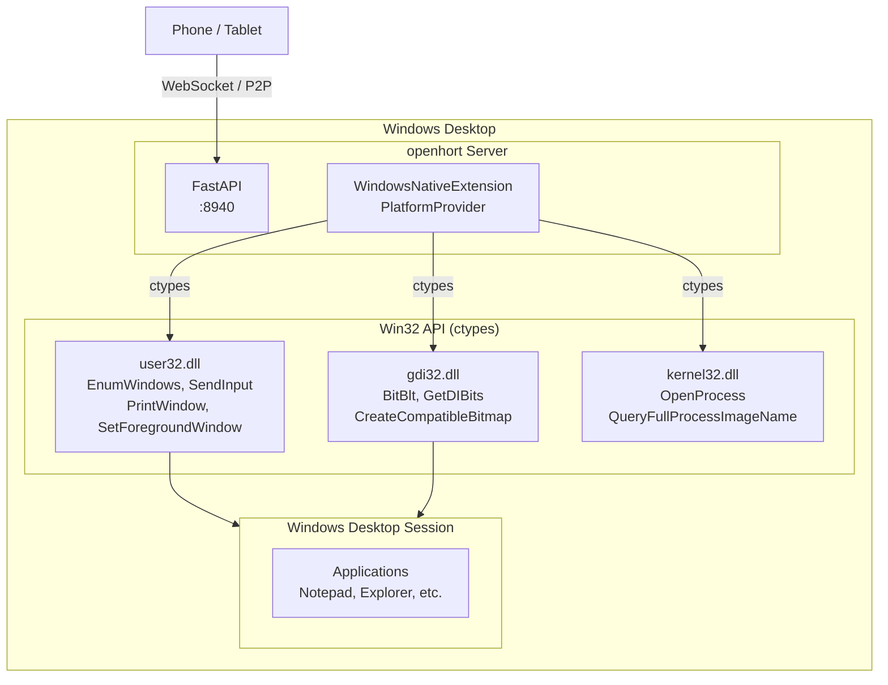

# Windows Support

openhort runs natively on Windows via the `windows-native` extension, which uses the Win32 API (user32.dll, gdi32.dll, kernel32.dll) for window management, screen capture, and input simulation. No extra dependencies beyond Pillow.

## Architecture



## Provider Implementation

`WindowsNativeExtension` implements the full `PlatformProvider` interface using only `ctypes` — no pywin32, no mss, no extra packages.

### Capability Mapping

| Capability | Win32 API | Function |
|-----------|----------|----------|
| Window listing | `user32.dll` | `EnumWindows` + `GetWindowTextW` + `GetWindowRect` |
| App names | `kernel32.dll` | `OpenProcess` + `QueryFullProcessImageNameW` |
| Screenshot (window) | `user32.dll` + `gdi32.dll` | `PrintWindow` (captures occluded windows) |
| Screenshot (desktop) | `gdi32.dll` | `BitBlt` from screen DC |
| Mouse click/move | `user32.dll` | `SetCursorPos` + `SendInput` |
| Keyboard input | `user32.dll` | `SendInput` (VK codes or Unicode) |
| Window activation | `user32.dll` | `ShowWindow` + `SetForegroundWindow` |
| Workspaces | — | Single desktop (virtual desktops future) |

### Window Filtering

The provider filters the `EnumWindows` results to show only real application windows:

- Must have `WS_VISIBLE` style
- Must have `WS_CAPTION` (title bar)
- Excludes `WS_EX_TOOLWINDOW` (unless also `WS_EX_APPWINDOW`)
- Must have a non-empty title

### Desktop Capture

The virtual "Desktop" entry (`window_id=-1`) captures the full screen using `BitBlt` from the screen device context. This matches the macOS (`CGDisplayCreateImage`) and Linux (`import -window root`) behavior.

### Keyboard Input

Two methods depending on the key:

- **Special keys** (Enter, Tab, arrows, F-keys): Sent as virtual key codes via `SendInput`
- **Printable characters**: Sent as Unicode scancodes via `KEYEVENTF_UNICODE` — this handles all characters regardless of keyboard layout

Modifiers (Ctrl, Shift, Alt, Meta) are pressed before and released after the main key.

## Deployment

### Azure VM (testing)

```bash
# Provision Windows 11 VM with openhort pre-installed
bash scripts/ci/spinup.sh windows11

# Or provision all platforms
bash scripts/ci/spinup.sh all

# Tear down
bash scripts/ci/teardown.sh
```

The provisioning script:
1. Creates a Windows 11 VM (`Standard_B2ms`, 2 vCPU, 8 GB)
2. Opens RDP (3389) and openhort (8940) ports
3. Runs `setup-windows.ps1` which installs Python, Git, and openhort
4. Registers openhort as a scheduled task (starts on login)

### Manual Installation

```powershell
# Install Python 3.12 (from python.org or winget)
winget install Python.Python.3.12

# Install openhort
python -m venv C:\openhort\venv
C:\openhort\venv\Scripts\pip install git+https://github.com/openhort/openhort.git

# Run
set LLMING_AUTH_SECRET=your-secret
C:\openhort\venv\Scripts\python -m uvicorn hort.app:app --host 0.0.0.0 --port 8940
```

### Requirements

- Windows 10 (21H2) or later
- Python 3.12+
- Active desktop session (console or RDP) — screen capture requires a rendered desktop
- No admin rights needed for basic operation (admin only for firewall rules)

!!! warning "RDP Session Required"
    Windows screen capture APIs require an active desktop session. If the RDP session is **disconnected** (not just minimized), screen capture returns black. Keep the RDP session connected, or use the `tscon.exe` trick to transfer the session to the console.

## Target Registration

When `sys.platform == "win32"`, the server automatically registers a `local-windows` target:

```python title="hort/app.py"
if sys.platform == "win32":
    from hort.extensions.core.windows_native.provider import WindowsNativeExtension
    ext = WindowsNativeExtension()
    ext.activate({})
    registry.register(
        "local-windows",
        TargetInfo(id="local-windows", name="This PC", provider_type="windows"),
        ext,
    )
```

## Limitations

| Feature | Status | Notes |
|---------|--------|-------|
| Window listing | Working | Filters to real app windows |
| Screenshot (per-window) | Working | `PrintWindow` captures even occluded windows |
| Screenshot (desktop) | Working | `BitBlt` from screen DC |
| Mouse input | Working | Absolute positioning via `SetCursorPos` |
| Keyboard input | Working | VK codes + Unicode |
| Window activation | Working | `SetForegroundWindow` (may fail if another window has focus lock) |
| Virtual desktops | Not yet | Windows 10+ has virtual desktops via undocumented COM interfaces |
| Multi-monitor | Partial | Desktop capture gets primary monitor only |
| DPI scaling | Partial | High-DPI displays may report scaled coordinates |

## Key Files

| File | Purpose |
|------|---------|
| `hort/extensions/core/windows_native/provider.py` | `WindowsNativeExtension` — Win32 platform provider |
| `hort/extensions/core/windows_native/extension.json` | Extension manifest (`platforms: ["win32"]`) |
| `scripts/ci/setup-windows.ps1` | PowerShell setup for Azure VMs |
| `scripts/ci/spinup.sh` | One-command VM provisioning (includes Windows) |
