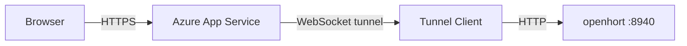

# Azure — App Service Containers

Deploy openhort's access server as a managed Docker container on
Azure App Service. No VM management required — Azure handles
scaling, restarts, and TLS.

!!! warning "Not free tier"
    App Service is not part of Azure's free tier. The B1 plan costs
    ~$13/month.

!!! info "This is how openhort's cloud proxy runs"
    The production access server at
    `openhort-access.azurewebsites.net` uses exactly this setup.

## Architecture



App Service runs your Docker image, provides HTTPS and a
`*.azurewebsites.net` domain, and restarts the container on
crashes.

## Prerequisites

- Azure CLI authenticated (`az login`)
- Docker installed locally
- An Azure Container Registry (ACR) or Docker Hub account

## Create a Container Registry

```bash
az acr create \
  --resource-group openhort-rg \
  --name <registry-name> \
  --sku Basic \
  --admin-enabled true
```

Get the login credentials:

```bash
az acr credential show \
  --name <registry-name> \
  --query '{username:username, password:passwords[0].value}' \
  --output table
```

## Build and Push the Image

From the openhort repo root:

```bash
# Log in to ACR
az acr login --name <registry-name>

# Build for linux/amd64 (required for App Service)
docker buildx build \
  --platform linux/amd64 \
  -t <registry-name>.azurecr.io/openhort/access-server:v1 \
  -f hort/access/Dockerfile \
  --push .
```

!!! warning "Always use versioned tags"
    Azure caches images by tag. Using `latest` means redeployments
    may not pick up your changes. Always use a versioned tag
    like `v1`, `v2`, or a git hash.

## Create the App Service

```bash
# Create a Linux App Service Plan (B1 = ~$13/month, cheapest)
az appservice plan create \
  --resource-group openhort-rg \
  --name openhort-plan \
  --is-linux \
  --sku B1

# Create the Web App with your container image
az webapp create \
  --resource-group openhort-rg \
  --plan openhort-plan \
  --name <app-name> \
  --container-image-name <registry-name>.azurecr.io/openhort/access-server:v1 \
  --container-registry-url https://<registry-name>.azurecr.io \
  --container-registry-user <acr-username> \
  --container-registry-password <acr-password>
```

## Configure the App

Critical settings — the access server won't work without these:

```bash
# Enable WebSockets (mandatory — without this, tunnels silently drop messages)
az webapp config set \
  --resource-group openhort-rg \
  --name <app-name> \
  --web-sockets-enabled true

# Set the container port
az webapp config appsettings set \
  --resource-group openhort-rg \
  --name <app-name> \
  --settings \
    WEBSITES_PORT=8080 \
    ACCESS_SESSION_SECRET=$(openssl rand -hex 32) \
    HORT_HTTPS=1 \
    HORT_ADMIN_PASSWORD=<choose-a-password>
```

!!! danger "WebSockets must be enabled"
    Without `--web-sockets-enabled true`, the tunnel connects but
    messages are silently dropped. This is the most common
    deployment issue.

## Verify

```bash
curl https://<app-name>.azurewebsites.net/cfversion
```

Should return the build version and timestamp.

## Deploying Updates

The deploy script automates build, push, and restart:

```bash
bash scripts/deploy-access.sh
```

It creates a versioned tag (`v<git-hash>-<timestamp>`), pushes to
ACR, updates the App Service config, and restarts.

### Manual redeployment

```bash
# Build and push new version
docker buildx build \
  --platform linux/amd64 \
  -t <registry-name>.azurecr.io/openhort/access-server:v2 \
  -f hort/access/Dockerfile \
  --push .

# Update the app to use the new image
az webapp config container set \
  --resource-group openhort-rg \
  --name <app-name> \
  --container-image-name <registry-name>.azurecr.io/openhort/access-server:v2

# Restart (stop + start ensures clean image pull)
az webapp stop --resource-group openhort-rg --name <app-name>
sleep 5
az webapp start --resource-group openhort-rg --name <app-name>
```

## Known Azure Pitfalls

| Issue | Cause | Fix |
|-------|-------|-----|
| Tunnel connects but no data flows | WebSockets not enabled | `az webapp config set --web-sockets-enabled true` |
| Large responses silently dropped | Azure 64KB WebSocket message limit | Access server chunks at 32KB automatically |
| Fonts/images corrupted | Response body decoded as UTF-8 | Keep bodies as raw bytes (already handled) |
| Old code still running after deploy | `latest` tag cached | Use versioned tags |
| `Content-Length` mismatch | `<base>` tag injection changes body size | Remove `Content-Length` header (already handled) |
| Quasar UI blank | Scripts in `<head>` | Scripts must be in `<body>` (Quasar needs DOM at load time) |
| ACR login fails | Password contains `/` or `+` | Regenerate the ACR password |

## Persistent Storage

The access server stores user/host data in `/data/` inside the
container. Mount a persistent volume so registrations survive
restarts:

```bash
# The docker-compose.yml already defines this:
# volumes:
#   - access-data:/data
```

On App Service, this maps to Azure's built-in persistent storage.
Without it, all hosts need re-registration after every restart.

## Connecting a Tunnel Client

On your local machine, start the tunnel client to link your
openhort instance to the cloud proxy:

```bash
poetry run python -m hort.access.tunnel_client \
  --server=https://<app-name>.azurewebsites.net \
  --key=<connection-key> \
  --local=http://localhost:8940
```

The connection key is generated when you register a host through
the access server's admin interface.
