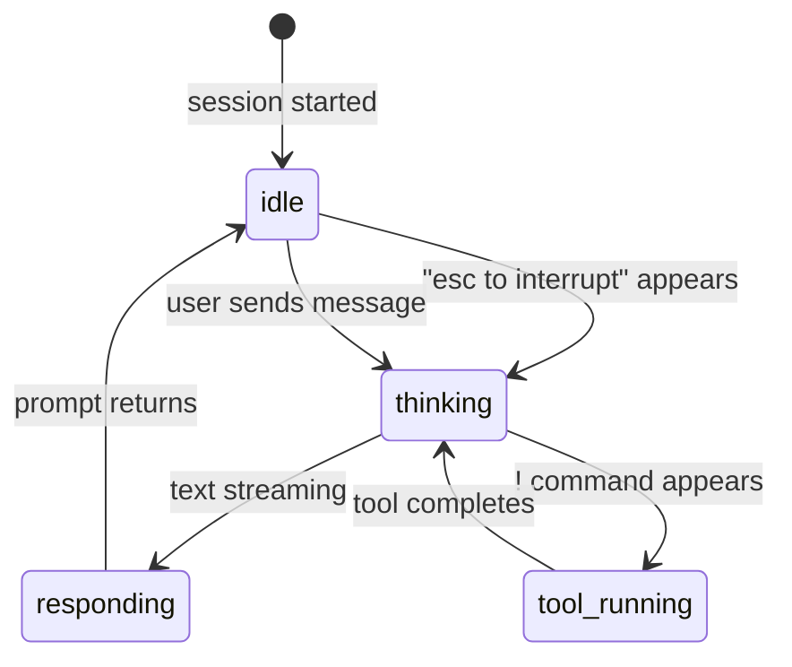
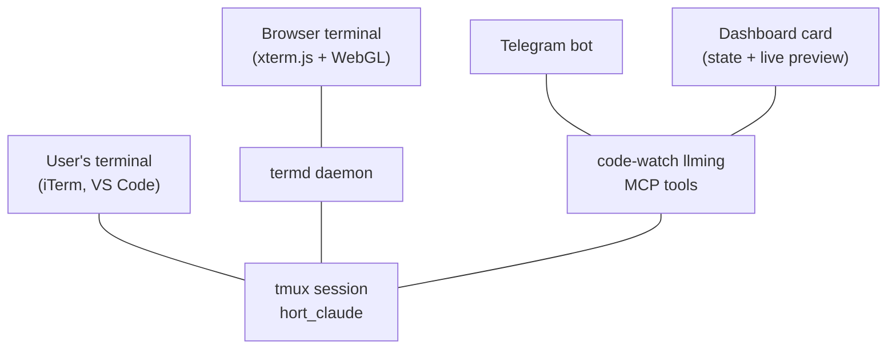

# Code Watch

Monitor and interact with coding sessions from the dashboard, Telegram, or the CLI.

## Quick Start

Create a tmux session and start Claude Code:

```bash
hort watch claude       # starts Claude Code in hort_claude
hort watch clauded      # starts Claude Code (dangerous mode)
hort watch shell        # just a shell
hort watch my-project   # shell session named my-project
```

Detach with `Ctrl+B D`. The session keeps running in the background.

## Dashboard

Code sessions appear as cards on the Llmings grid with live status:

| Card indicator | Meaning |
|---------------|---------|
| Spinning ⚡ | Claude is working (thinking, writing, running tools) |
| Animated Zzz | Claude is idle, waiting for input |
| "idle 5m" | How long Claude has been idle |
| Red border | Dangerous mode (`--dangerously-skip-permissions`) |
| Blue border | Plan mode |
| Amber border | Accept edits mode |

Click a card to open the session as a web terminal in the browser. Both the browser and your local terminal (iTerm, VS Code) can view the same session simultaneously.

The card also shows a **live output preview** — the last few lines of Claude's response, updated every 3 seconds.

## CLI Commands

```bash
hort watch              # list all active sessions
hort watch claude       # create/attach (runs claude)
hort watch clauded      # create/attach (dangerous mode)
hort watch shell [dir]  # create/attach shell in directory
hort watch <name>       # create/attach (shell)
hort watch read <name>  # read last 30 lines of output
hort watch send <name> "text"  # send text to session
hort watch stop <name>  # kill session
```

## State Detection

The code-watch llming detects Claude Code's state by reading the visible terminal pane:



Detection signals:

- **`esc to interrupt`** in the status bar → Claude is actively working
- **Screen content changing** between polls → streaming response
- **`❯` prompt** with stable screen → idle
- **Mode indicators** (`bypass permissions on`, `plan mode on`) → border color

## Session Permissions

Each tmux session has a `HORT_ALLOW` environment variable that controls which llmings can read its content:

```bash
# Presets set permissions automatically:
# claude/clauded → allows code-watch + claude-watch
# shell          → allows code-watch only
# custom names   → allows code-watch only
```

A community `claude-watch` plugin can monitor Claude sessions but cannot read your banking SSH session — the permission is per-session, set at creation time.

## MCP Tools

The code-watch llming provides these MCP tools (usable by the AI agent via Telegram or the web chat):

| Tool | Description |
|------|-------------|
| `list_sessions` | List all active code sessions with status |
| `read_output` | Read recent terminal output (permission-gated) |
| `is_busy` | Check if a process is running or idle |
| `send_text` | Send keystrokes to a session (permission-gated) |
| `create_session` | Create a new tmux session |
| `kill_session` | Terminate a session |

## Architecture



All paths read from the same tmux session. The user's terminal and browser can be attached simultaneously (grouped sessions with independent window sizes).
