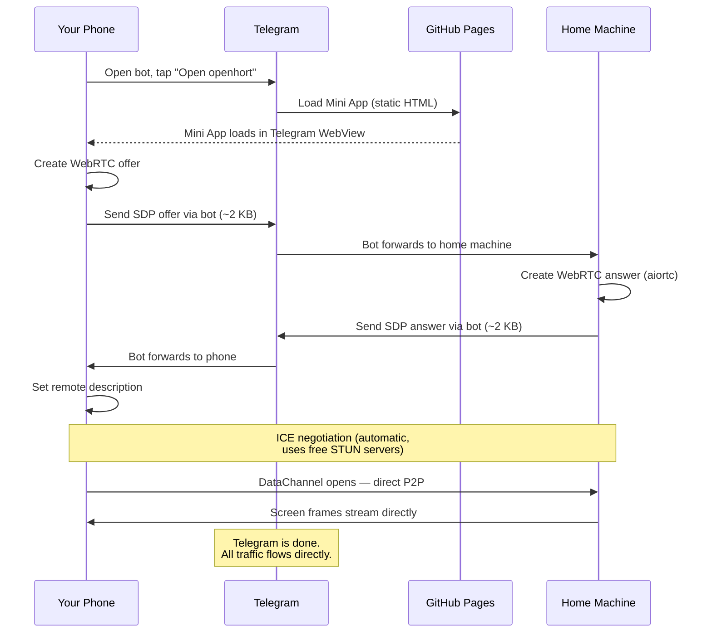
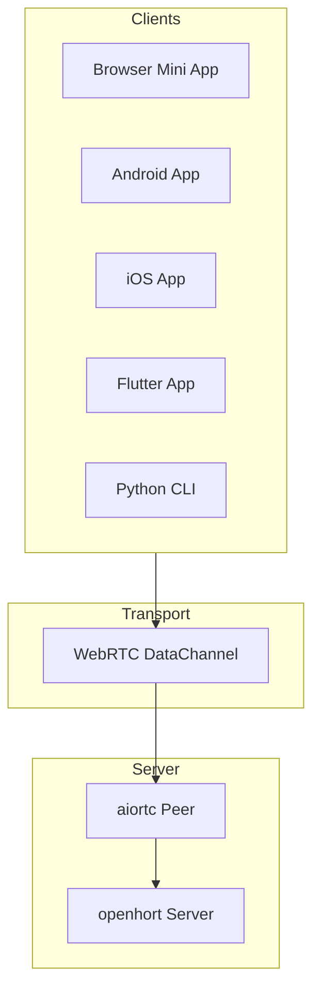

# Peer-to-Peer Direct Connection

Connect to your machine directly over the internet — no relay server, no cloud subscription, no monthly costs.

## Overview

```mermaid
flowchart LR
    subgraph before["Traditional (relay)"]
        A1[Phone] -->|all traffic| B1[Cloud Server] -->|all traffic| C1[Home]
    end
    subgraph after["P2P (direct)"]
        A2[Phone] ==>|direct| C2[Home]
    end
    style after fill:#1a3a1a
```



openhort establishes a **direct WebRTC connection** between your device and your home machine. The only things needed are:

| Requirement | Cost | Purpose |
|------------|------|---------|
| Telegram bot | Free | Signaling (exchange ~4 KB to set up connection) |
| GitHub Pages | Free | Host the Mini App (static HTML) |
| Google STUN server | Free | Discover your public IP |

No Azure, no AWS, no VPS, no domain name.

## How It Works



**Total data through Telegram: ~4 KB.** Everything after that is direct.

## What You Need

### On Your Home Machine

1. openhort running with the Telegram connector configured
2. The peer2peer extension enabled (included by default)

### On Your Phone

1. Telegram installed
2. Your openhort bot added

That's it. No app to install, no account to create.

## Using It

### Opening the App

1. Open Telegram → your openhort bot
2. Tap the **"Open openhort"** menu button
3. The Mini App opens fullscreen inside Telegram
4. Tap **Connect**
5. Your machine's screen appears

### Via Telegram Commands

```
/stun     — Check your NAT type and public IP
/vm       — Manage test VM (developer use only)
```

### Signaling Modes

The Mini App automatically picks the right signaling mode:

| Where you are | What happens | `?signal=` |
|--------------|-------------|------------|
| **Remote** (outside your LAN) | SDP goes through Telegram bot | `telegram` |
| **LAN** (same network) | SDP goes directly via HTTP | `http` |

On LAN, the connection is instant (no Telegram roundtrip needed).

## NAT Compatibility

WebRTC handles NAT traversal automatically via ICE:

| Your Router | Success Rate | Notes |
|------------|-------------|-------|
| Full Cone NAT | ~100% | Best case |
| Restricted Cone | ~100% | Very common |
| Port-Restricted | ~95% | Most home routers |
| Symmetric NAT | ~70% | ICE tries relay candidates |

!!! tip "Checking your NAT type"
    Send `/stun` to your bot. If it shows "symmetric" on both sides, the connection may need a TURN relay (not yet implemented — planned).

## Works on Every Platform

The same connection works from any device with WebRTC:



| Platform | Library | Status |
|----------|---------|--------|
| **Telegram Mini App** | Native `RTCPeerConnection` | Working |
| **Standalone browser** | Native `RTCPeerConnection` | Working |
| **Android** | Google `libwebrtc` | Planned |
| **iOS** | Google `WebRTC.framework` | Planned |
| **Flutter** | `flutter_webrtc` | Planned |
| **CLI** | `aiortc` (Python) | Planned |

All clients use the same signaling flow and the same server-side peer.

## Architecture

Three independent layers:

```mermaid
flowchart TB
    subgraph L3["Protocol Layer"]
        direction LR
        F[JPEG Frames] --- I[Input Events] --- C[Control JSON]
    end
    subgraph L2["Transport Layer"]
        direction LR
        DC[DataChannel] --- ICE[ICE/STUN] --- ENC[DTLS Encryption]
    end
    subgraph L1["Signaling Layer"]
        direction LR
        TG[Telegram] --- HTTP[HTTP API] --- OTHER[Other]
    end

    L3 -->|bytes + JSON| L2
    L2 -->|SDP exchange| L1

    style L3 fill:#1a3a1a
    style L2 fill:#1a2a3a
    style L1 fill:#2a1a3a
```



| Layer | What it does | Can be swapped? |
|-------|-------------|-----------------|
| **Protocol** | Defines what data flows (frames, input, control) | Yes — could carry VNC, file transfer, etc. |
| **Transport** | WebRTC with encryption and NAT traversal | No — WebRTC is the standard |
| **Signaling** | Exchanges the ~4 KB needed to start WebRTC | Yes — Telegram, HTTP, QR code, etc. |

## Configuration

| Setting | Default | Description |
|---------|---------|-------------|
| `stun_servers` | `["stun.l.google.com:19302"]` | STUN servers for NAT discovery |

## Technical Details

For developers building P2P extensions or native clients, see the [developer reference](../../develop/peer2peer-lib.md).
