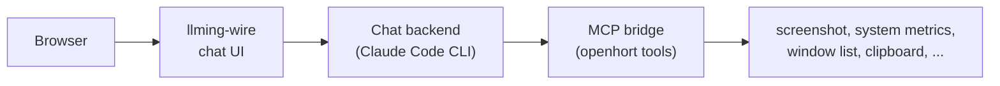
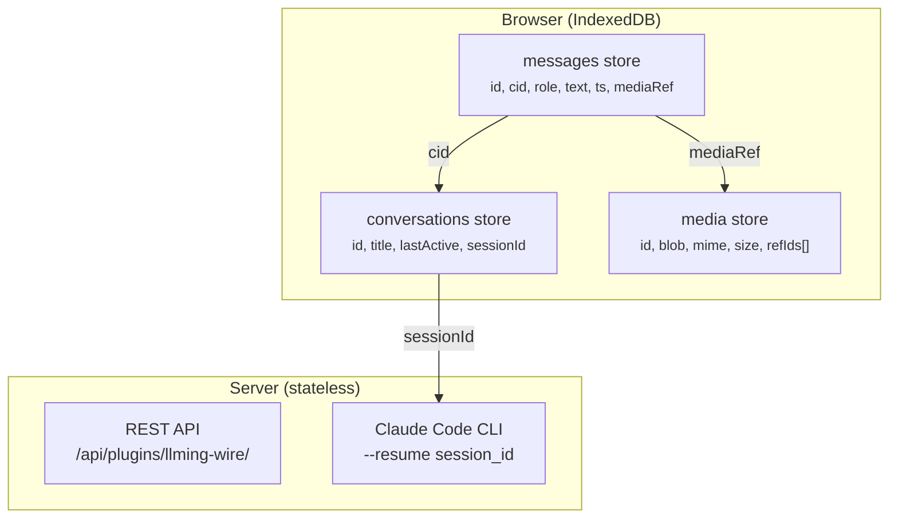

# Wire Chat

Built-in chat UI for talking to your hort directly from the browser. Telegram-style bubbles with persistent conversations stored in IndexedDB.

## Overview

The `llming-wire` extension provides a native chat interface in the openhort dashboard. Click the Wire card on the Llmings grid to open it.



## Features

- **Telegram-style bubbles** — user messages on the right (blue), AI responses on the left (dark), with tails and inline timestamps
- **Typing indicator** — animated dots while Claude is thinking
- **Button responses** — numbered options (1. 2. 3.) rendered as tappable buttons
- **Multiple conversations** — sidebar with chat list, create new, switch, delete
- **Persistent history** — all messages stored in IndexedDB, survives page reloads and server restarts
- **Session resumption** — Claude's `session_id` stored per conversation, passed via `--resume` on reconnect so Claude remembers the full context

## Conversation Persistence

Messages and media are stored entirely on the client device using IndexedDB:



### Why client-side?

- **Instant load** — conversations appear immediately from IndexedDB, no network round-trip
- **Works offline** — browse history without a server connection
- **Images/videos stay local** — large media never uploaded to the server
- **Server is stateless** — restart the server, lose nothing
- **Privacy** — chat content lives on your device

### Media Storage

Images and videos are stored as `Blob` objects in the `media` store:

```javascript
// Saving media
const mediaId = await mediaSave(imageBlob, 'image/jpeg', messageId);
// message: { id: 'msg123', mediaRef: mediaId, ... }

// Loading media
const media = await mediaGet(mediaId);
// media.blob → Blob, media.mime → 'image/jpeg'
```

**Garbage collection**: When a conversation is deleted, its messages are removed, then `mediaGC()` scans the media store and deletes any entry where no remaining message references it. No orphaned blobs.

### Session Resumption

Each conversation stores Claude's `session_id`. On page reload:

1. Browser loads conversation from IndexedDB (instant)
2. User sends a message
3. Client includes `session_id` in the POST request
4. Server passes it to `claude -p --resume <session_id>`
5. Claude picks up the full conversation context

If the server restarted and lost its in-memory state, the client's `session_id` restores continuity.

## REST API

| Endpoint | Method | Description |
|----------|--------|-------------|
| `/api/plugins/llming-wire/conversations` | GET | List all conversations |
| `/api/plugins/llming-wire/conversations` | POST | Create new conversation |
| `/api/plugins/llming-wire/conversations/{id}/messages` | GET | Get messages |
| `/api/plugins/llming-wire/conversations/{id}/messages` | POST | Send message, get AI response |

### Send message request:

```json
{
  "text": "How much disk space is available?",
  "session_id": "abc123..."
}
```

### Response:

```json
{
  "id": "msg-456",
  "role": "assistant",
  "text": "You've got 870 GB free out of 1.8 TB.",
  "ts": 1712345678.9,
  "buttons": [],
  "session_id": "abc123..."
}
```

## Button Responses

When Claude's response contains numbered options, they're automatically extracted as buttons:

```
Claude responds:
  Which approach do you prefer?
  1. Fix the bug directly
  2. Write a test first
  3. Refactor the module
```

The numbered lines become tappable buttons in the chat. Clicking a button sends that option as the next message.
