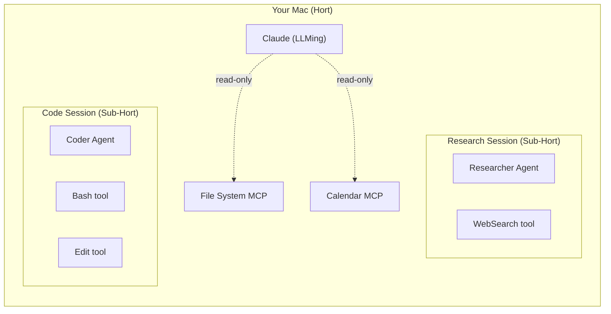
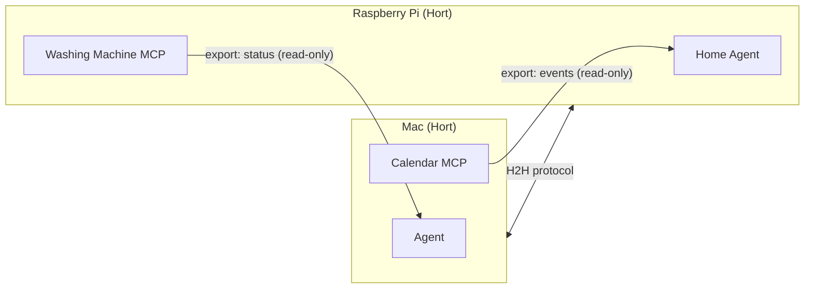
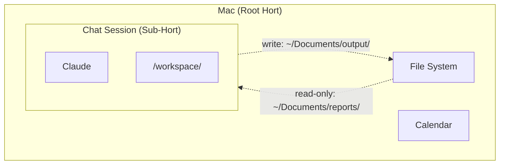
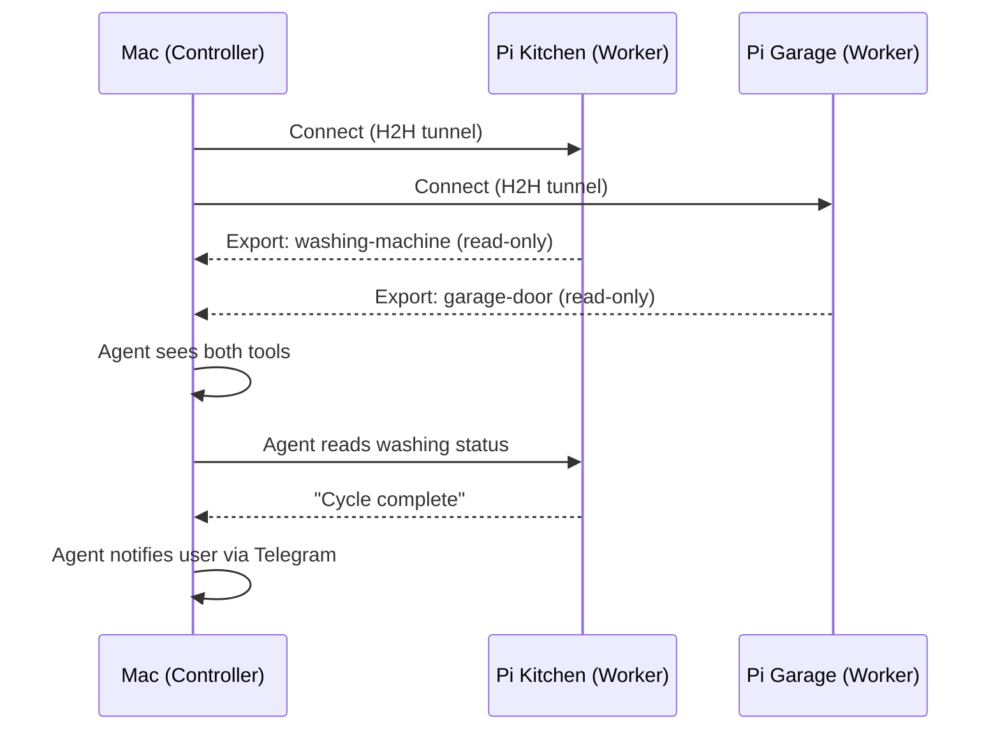
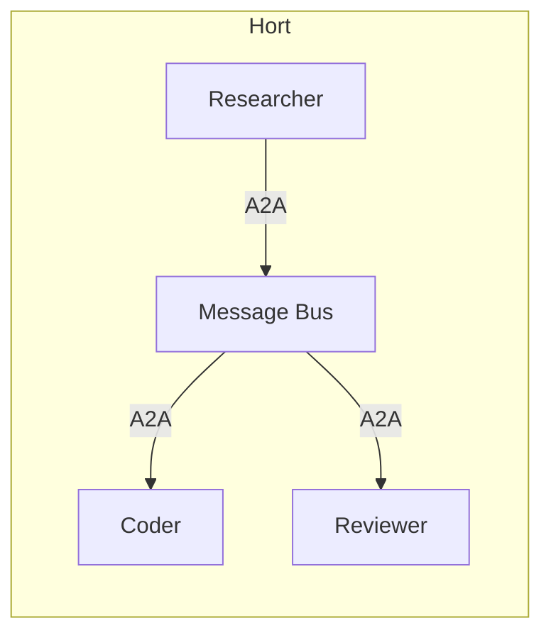

# OpenHORT

**Open Hort** — safe, isolated spaces for AI in your personal network.

## Philosophy

Your notebook, your Raspberry Pi, your smart home — they're yours.
AI should be able to help you with them without you worrying that
it accidentally reformats your disk, leaks your photos, or turns
on your washing machine at 3 AM.

OpenHORT creates **Horts** — well-defined, isolated spaces (like a
*Kinderhort*) where AI agents, tools, and data sources live and
work together under your control. By default, nothing gets in or
out unless you say so.

The goal: you should be able to connect your washing machine's MCP,
point an AI agent at it, and be **100% sure** the agent can read
the status and notify you when it's done — but only YOU can press
the button to start or stop it, via a Telegram message or a UI click.

Setting that up should take 3 clicks, not 3 hours.

## Core Concepts

### Horts

A **Hort** is an isolated space with clear boundaries. It contains
tools, agents, and data — and controls what can cross those boundaries.



**By default, your whole machine is a single Hort.** It exports
nothing — no tools, no data, no access. Everything stays inside
unless you explicitly open a door.

Horts can be:

- **A full machine** — your Mac, a Raspberry Pi, a cloud VM
- **A container** — a Docker sandbox running inside a machine
- **Nested** — Sub-Horts inside Horts, each with their own boundaries

### Tools

**Tools** are the things agents can work with:

| Tool type | Example | What it does |
|-----------|---------|-------------|
| **MCP server** | File system MCP, Calendar MCP, Washing machine MCP | Exposes structured data and actions via the MCP protocol |
| **LLMing** | System monitor, clipboard history | Collects data and/or provides tools within a Hort |
| **Program** | A script, a build step, a deployment pipeline | Runs defined program steps (name TBD) |

Tools live inside a Hort. By default, they're only accessible to
other tools in the **same** Hort. To make a tool available across
Hort boundaries, you explicitly **export** it.

### LLMings (Agents)

**LLMings** are AI agents that live inside a Hort. They can be:

- An LLM like Claude, GPT, Gemini, or a local model
- Connected to tools via MCP or direct integration
- Constrained by permissions, budgets, and access rules

LLMings talk to each other using the **A2A protocol** (agent-to-agent)
when they need to collaborate.

## How It Works

### Isolation by Default

```mermaid
flowchart LR
    subgraph Mac ["Mac (Hort)"]
        A["Agent"]
        T1["Tool A"]
        T2["Tool B"]
        A --> T1
        A --> T2
    end

    subgraph Pi ["Raspberry Pi (Hort)"]
        B["Agent"]
        T3["Sensor MCP"]
        B --> T3
    end

    Mac ~~~ Pi
    style Mac fill:#1a1a2e,stroke:#3b82f6
    style Pi fill:#1a1a2e,stroke:#3b82f6
```



Two machines, two Horts. **They cannot see each other.** No tools,
no data, no messages cross the boundary. This is the default.

### Exporting and Importing

To let Horts work together, you **export** tools from one and
**import** them in another:



The **H2H protocol** (Hort-to-Hort) handles cross-machine
communication. It's the same tunnel protocol OpenHORT already uses
for remote access, extended with tool export/import semantics.

**Key rules:**
- Exports are per-tool, not per-Hort (you choose exactly what to share)
- Each export has an access level: read-only, write-only, read-write, or none
- Sub-Horts can import from their parent Hort (and vice versa, if allowed)
- Horts on the same level can import from each other (if both sides agree)

### Permission Granularity

Permissions work at two levels:

**Coarse: entire MCP / extension**
```yaml
tools:
  deny: ["washing-machine-mcp"]   # block the whole MCP
```

**Fine: individual tools within an MCP**
```yaml
tools:
  allow:
    - washing-machine-mcp:
        tools: [get_status, get_cycle_info]   # read-only tools only
  deny:
    - washing-machine-mcp:
        tools: [start_cycle, stop_cycle]      # block control tools
```

### The Washing Machine Example

You buy a smart washing machine. It comes with an MCP server.
You want your AI to tell you when it's done, but you do NOT want
the AI to start or stop it.

**Step 1: Add the MCP to your Hort**

```yaml
# hort.yaml
tools:
  - name: washing-machine
    type: mcp
    command: "npx washing-machine-mcp"
```

**Step 2: Grant read-only access to the agent**

```yaml
# In your agent config
permissions:
  tools:
    allow:
      - washing-machine:
          tools: [get_status, get_cycle_info, get_remaining_time]
    deny:
      - washing-machine:
          tools: [start_cycle, stop_cycle, set_temperature]
```

**Step 3: Set up notifications**

```yaml
messaging:
  can_send_to: [telegram]   # agent can notify you
sources:
  telegram:
    tools:
      allow:
        - washing-machine:
            tools: [start_cycle, stop_cycle]   # YOU can control it via Telegram
  agent:*:
    tools:
      deny:
        - washing-machine:
            tools: [start_cycle, stop_cycle]   # agents CANNOT
```

That's it. The agent watches the status and messages you on
Telegram when it's done. Only you can press "Start" or "Stop".

### Sub-Horts (Sandboxed Sessions)

When you start a chat session, it runs in a **Sub-Hort** — a
container inside your machine's Hort. The Sub-Hort:

- Has its own filesystem (`/workspace/`)
- Can only access tools you explicitly grant
- Has resource limits (memory, CPU, disk)
- Gets cleaned up when the session ends



Directory access is controlled per-mount:

| Access | What the agent can do |
|--------|----------------------|
| `ro` | Read files, but not modify them |
| `rw` | Read and write files |
| `wo` | Write new files, but not read existing ones |
| `none` | Directory is not visible at all |

### Cross-Machine Orchestration (H2H)

Horts on different machines communicate via the **H2H protocol**
(Hort-to-Hort). This extends the existing OpenHORT tunnel:



**Trust flows downward by default:** a Mac can orchestrate Pis,
but Pis cannot control the Mac unless explicitly allowed.

### Agent-to-Agent (A2A)

LLMings collaborate via the **A2A protocol**. Messages flow through
the Hort's message bus — never directly between containers:



Each agent declares who it can talk to. The bus enforces permissions,
rate limits, and audit logging on every message.

## Design Principles

1. **Deny-by-default** — nothing crosses a Hort boundary unless
   explicitly exported/imported
2. **3 clicks, not 3 hours** — common setups (read-only monitoring,
   notification agents) should be trivial to configure
3. **Defense in depth** — container isolation, permissions, budgets,
   command filters, network rules, and audit logs each independently
   limit damage
4. **Intuitive but precise** — simple YAML for common cases, full
   granularity (per-tool, per-source, per-direction) when you need it
5. **Works across machines** — H2H protocol makes multi-device setups
   feel like one system, without sacrificing isolation
6. **Your data stays yours** — no cloud dependency, no phone-home,
   everything runs locally unless you choose otherwise

## Next Steps

- [Quick Start](guide/quickstart.md) — set up your first Hort in 5 minutes
- [Configuration](guide/configuration.md) — full YAML reference
- [Permissions](internals/permissions.md) — how tool access control works
- [Security](internals/security/threat-model.md) — threat model and safety rails
