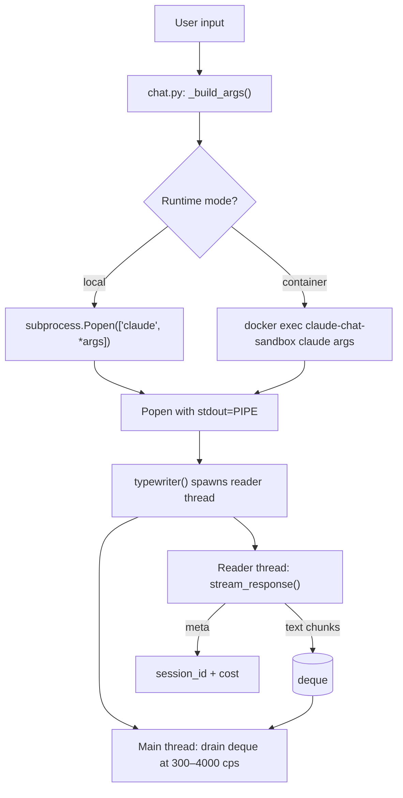
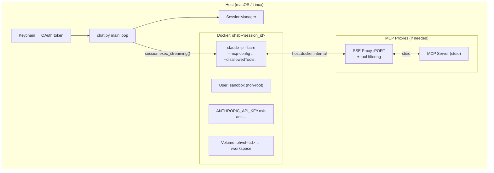
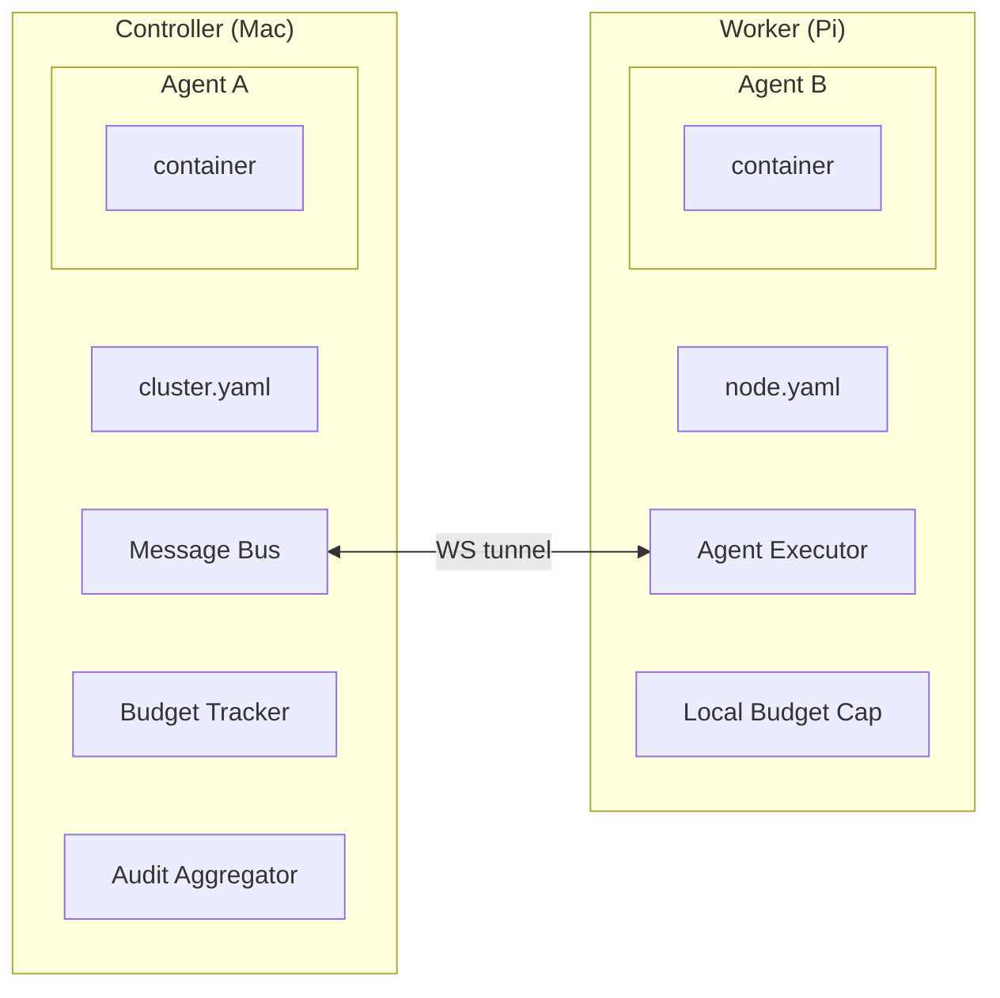
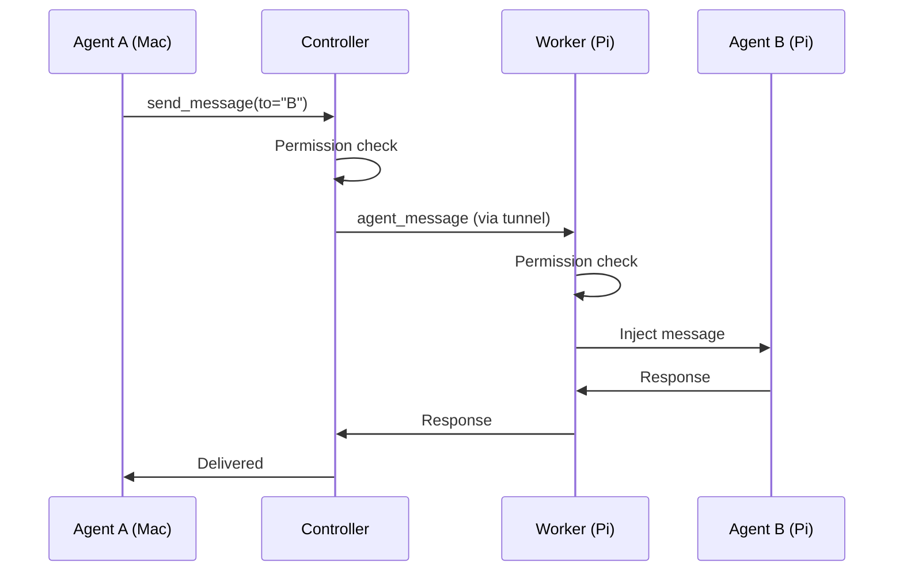

# Architecture

Technical internals for contributors and developers.

## Module Structure

```
hort/sandbox/                      ← CORE (covered by main test suite)
  __init__.py          — public API (Session, SessionConfig, SessionManager)
  session.py           — session lifecycle, Docker container + volume management
  reaper.py            — cleanup policies (timeout, count, space)
  mcp.py               — MCP server config, scope resolution, tool filtering
  mcp_proxy.py         — SSE proxy for outside-container MCPs + tool filtering

llmings/claude_chat/       ← EXTENSION (Claude-specific)
  __init__.py          — package marker
  __main__.py          — CLI entry point (argparse + session management)
  chat.py              — main chat loop, _build_args(), local vs container
  stream.py            — stream-json parser (yields text/meta from Popen)
  typewriter.py        — adaptive display engine (reader thread + drain)
  auth.py              — macOS Keychain extraction (OAuth token)
  Dockerfile           — layered sandbox image (base → Claude CLI → user)
  tests/               — extension-specific tests (14)

tests/                             ← CORE TESTS (run with main suite)
  test_sandbox.py      — 22 session lifecycle tests
  test_sandbox_reaper.py — 11 cleanup policy tests
  test_sandbox_mcp.py  — 21 MCP config/filter tests
  test_sandbox_mcp_proxy.py — 11 SSE proxy integration tests
```

## Data Flow (Single Turn)



## Container Architecture



## Multi-Node Architecture



!!! info "Connection direction"
    The controller connects TO the worker, never the reverse.
    Auth uses pre-shared connection keys per node.
    All messages route through the controller's message bus.

## Cross-Node Message Flow



## How It Builds on openhort

| openhort component | Role in agent framework |
|-------------------|------------------------|
| `hort/containers/base.py` | ContainerProvider ABC for sandboxes |
| `hort/containers/docker.py` | Docker-based agent execution |
| `hort/ext/plugin.py` | PluginContext for agent state |
| `hort/ext/mcp.py` | MCPMixin for agent capabilities |
| `hort/ext/connectors.py` | Task submission (Telegram, web) |
| `hort/ext/scheduler.py` | Health checks, timeout enforcement |
| `hort/ext/store.py` | Task state, execution logs |
| `hort/targets.py` | TargetRegistry for running agents |
| `hort/access/tokens.py` | Agent API authentication |
| `hort/access/tunnel_client.py` | Multi-node tunnel protocol |
| `hort/config.py` | Agent configuration persistence |

## Key Interfaces (Planned)

```python
class ModelProvider(ABC):
    def send(self, message, *, session_id=None) -> AgentTurn
    def stream(self, message, *, session_id=None) -> Generator
    def supports_tools(self) -> bool

class ToolPermissions:
    def is_allowed(self, tool_name: str) -> bool

class CommandFilter:
    def check(self, command: str) -> tuple[bool, str]

class BudgetState:
    def check(self, limits: BudgetLimits) -> str | None
```

!!! tip "Full interface definitions"
    See `subprojects/claude_chat/CONCEPT.md` for complete interface
    specs including all data classes and enums.
