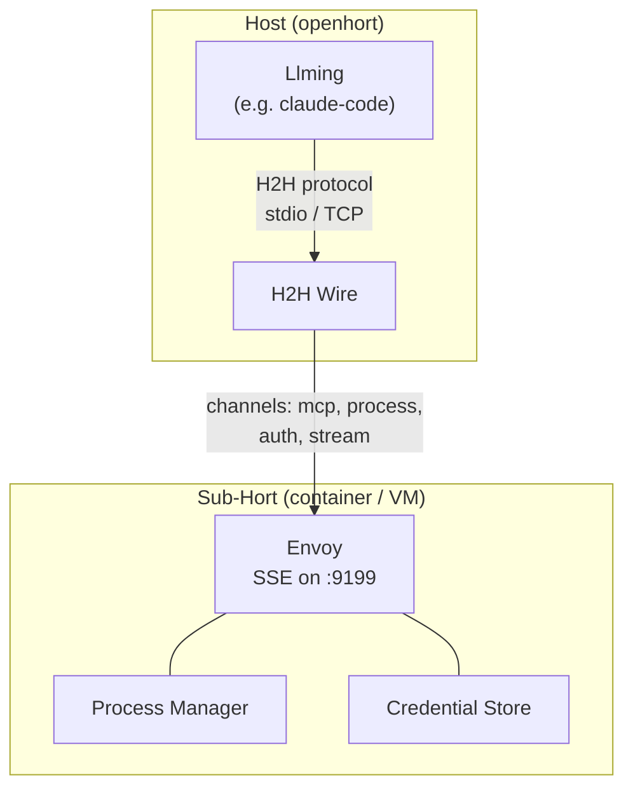
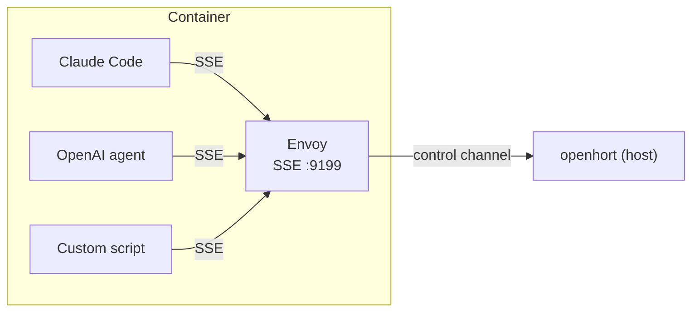
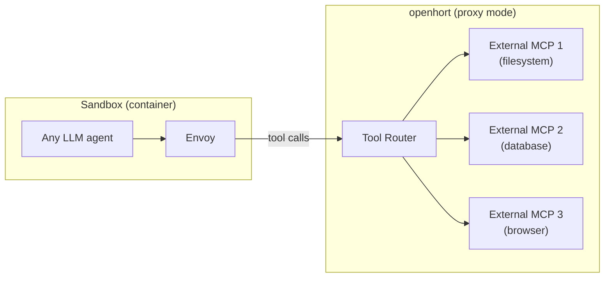
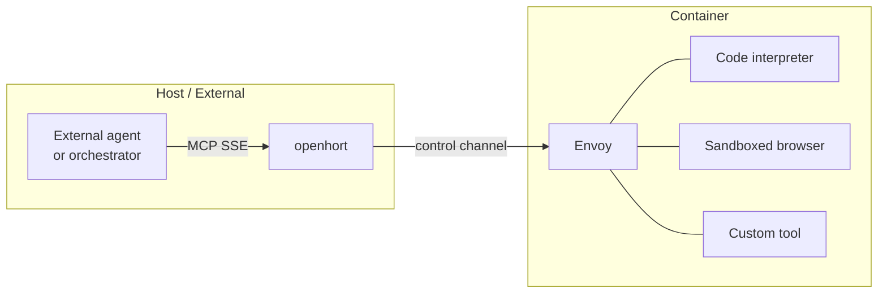
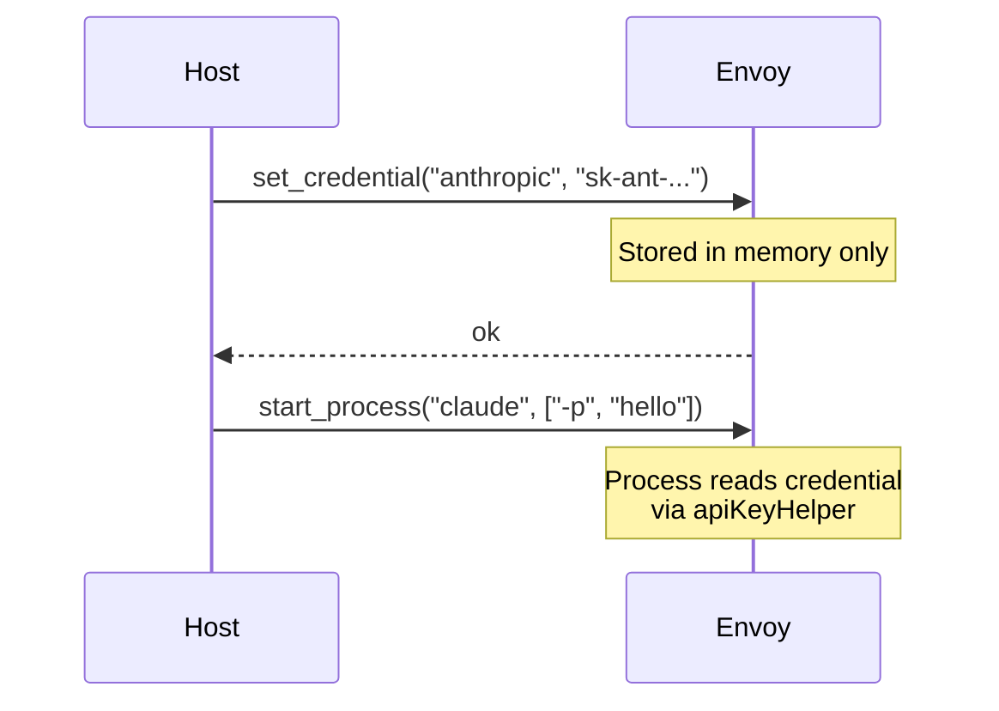

# Envoy Architecture

The Envoy is a llming's execution agent inside a sub-hort (container, VM,
or remote machine). It receives commands from the host, executes work
locally, and returns results — all over the H2H wire protocol.

## Overview



The Envoy starts with the container and stays alive for its entire
lifetime. It serves a single MCP SSE endpoint on `localhost:9199`
that any process inside the container can connect to.

## Channels

The Envoy handles multiple channels over a single H2H wire:

| Channel | Direction | Purpose |
|---------|-----------|---------|
| `mcp` | bidirectional | MCP tool registration + execution |
| `process` | host → envoy | Start/stop CLI processes |
| `auth` | host → envoy | Provision credentials (in-memory only) |
| `stream` | envoy → host | Streaming output from running processes |
| `fs` | bidirectional | File read/write (if wire permits) |

## MCP: One Server, Any Client

The Envoy runs a persistent SSE server on `localhost:9199` inside
the container. Every MCP client connects to the same endpoint —
Claude Code, OpenAI SDK, Anthropic SDK, custom scripts, anything
that speaks MCP.



No stdio management, no process spawning per invocation, no transport
switching. One server, one port, one protocol.

### Container Startup

```dockerfile
# The Envoy is the container's main process
CMD ["hort-envoy", "--port", "9199"]
```

The Envoy starts immediately and stays alive. LLM processes are
launched separately (via `docker exec` or the process channel) and
connect to the already-running Envoy.

### MCP Config (same for every client)

```json
{
  "mcpServers": {
    "openhort": {
      "type": "sse",
      "url": "http://localhost:9199/sse"
    }
  }
}
```

Works identically for Claude Code, OpenAI agents, or any MCP-compatible
tool. No per-SDK configuration needed.

### Dynamic Tool Registration

Tools are NOT hardcoded in the Envoy. The host pushes current tool
definitions via the control channel:

- Tools can change between calls (new llmings loaded, features toggled)
- The Envoy always serves the latest set
- No stale caches, no session-sticky failures

### Built-in Tools

The Envoy provides a few tools that work without the host:

| Tool | Description |
|------|-------------|
| `envoy_status` | Container info, host connection state, uptime |
| `envoy_ping` | Test if the host is reachable |
| `envoy_info` | Resource usage (memory, CPU, disk) |

These help the LLM understand its environment and diagnose connectivity.

## Standalone Mode: MCP Reverse Proxy

openhort can run as a pure MCP reverse proxy — no UI, no streaming,
no screen capture. Just the Envoy + wire + tool routing:



In this mode, openhort acts as a **policy-enforcing gateway** between
the sandboxed agent and external MCP servers:

```bash
# Start openhort as MCP proxy only (no UI, no capture)
hort proxy --config mcp-rules.yaml
```

```yaml
# mcp-rules.yaml — which external MCPs are exposed, with what filters
mcp_servers:
  filesystem:
    url: "http://localhost:3000/sse"
    allow_tools: ["read_file", "list_directory"]
    deny_tools: ["write_file", "delete_file"]  # read-only
  database:
    url: "http://localhost:3001/sse"
    allow_tools: ["query"]
    deny_tools: ["drop_table", "delete"]        # no destructive ops
  browser:
    url: "http://localhost:3002/sse"
    # all tools allowed, but with content filters
    filters:
      - type: regex
        block: "password|secret|token"
```

### What the Proxy Enforces

| Rule | Description |
|------|-------------|
| **Tool allowlists** | Only expose approved tools from each external MCP |
| **Tool denylists** | Block specific dangerous tools |
| **Content filters** | Inspect tool arguments and results for sensitive data |
| **Rate limits** | Throttle tool calls per MCP server |
| **Audit trail** | Log every tool call with caller, args, and result |
| **Credential isolation** | Each MCP server gets its own credentials, agent never sees them |

### Why This Matters

Running an LLM agent with direct access to MCP servers is dangerous.
The agent can call any tool with any arguments. openhort's proxy mode
puts a policy layer between the agent and the MCPs:

- Agent in sandbox → can only reach the Envoy
- Envoy → forwards to openhort proxy
- Proxy → applies rules → forwards to external MCP
- Result → proxy inspects → Envoy → agent

The agent never has direct network access to the MCP servers.

## Reverse Direction: Container as MCP Server

The Envoy is bidirectional. Not only can processes inside the container
call tools outside — services outside can also call tools that run
**inside** the container.



In this mode, tools registered inside the container are exposed to the
outside world through openhort as MCP tools — with the same policy
enforcement:

```yaml
# Container-provided tools exposed outward
container_tools:
  code-sandbox:
    container: openhort-sandbox
    expose_tools: ["run_python", "run_bash", "read_file"]
    deny_tools: ["write_file"]  # read-only to outside callers
    filters:
      - type: regex
        block: "rm -rf|sudo"
```

### Use Cases

| Scenario | Direction | Example |
|----------|-----------|---------|
| Agent uses host tools | inbound (host → container) | Screenshot, camera, window list |
| Agent uses external MCPs | outbound (container → host → MCP) | Database, filesystem, browser |
| Host uses sandboxed tools | reverse (host → container tools) | Safe code execution, sandboxed browser |
| Multi-agent orchestration | both | Agent A calls tools that run inside Agent B's container |

### How It Works

1. Container registers tools with the Envoy (local process)
2. Envoy reports available tools to the host via the control channel
3. Host exposes them as MCP tools (SSE endpoint) to external callers
4. External caller invokes a tool → host forwards to Envoy → Envoy
   executes inside the container → result flows back

The same wire permissions, content filters, and audit trail apply in
both directions. The container boundary is never bypassed.

## Credential Flow

Credentials flow downward only — host provisions them into the Envoy's
in-memory store. The Envoy never persists credentials to disk.



See [Credential Provisioning](security/credential-provisioning.md) for the
full security model.

## Wire Permissions

The Envoy's capabilities are controlled by the wire configuration:

```yaml
sub_horts:
  claude-sandbox:
    container:
      image: openhort-claude-code
      memory: 2g
    wire:
      allow_channels: [mcp, process, auth, stream]
      deny_channels: [fs]
      allow_cli: true
      allow_admin: false
```

The Envoy cannot exceed what the wire allows — even if the LLM requests it.

## Control Channel

The host communicates with the Envoy via the H2H wire (typically
stdio through `docker exec` or a mapped TCP socket):

```json
{"id":"r1","type":"request","channel":"mcp","method":"register_tools",
 "params":{"tools":[{"name":"screenshot","description":"...","inputSchema":{}}]}}

{"id":"c1","type":"request","channel":"mcp","method":"tool_call",
 "params":{"name":"screenshot","args":{}}}

{"id":"c1","type":"response","status":"ok",
 "result":{"content":[{"type":"image","data":"..."}]}}
```

## File Layout

```
hort/envoy/
    __init__.py
    server.py       # MCP SSE server + control channel handler
    protocol.py     # H2H message types for envoy channels
    client.py       # Host-side client (sends commands to envoy)
    proxy.py        # MCP reverse proxy with policy enforcement
```

## Key Properties

| Property | Description |
|----------|-------------|
| Persistent server | Envoy starts with the container, stays alive, one SSE endpoint |
| SDK-agnostic | Same `localhost:9199/sse` for Claude Code, OpenAI, Anthropic, any MCP client |
| Tools are dynamic | Host pushes fresh tool defs via control channel |
| Credentials are ephemeral | In-memory only, never persisted |
| Host connection optional | Built-in tools work without host |
| Standalone proxy mode | openhort as pure MCP reverse proxy with policy enforcement |
| Wire-controlled | Envoy can't exceed wire permissions |
| Audit trail | Every tool call logged with caller, args, timing |
