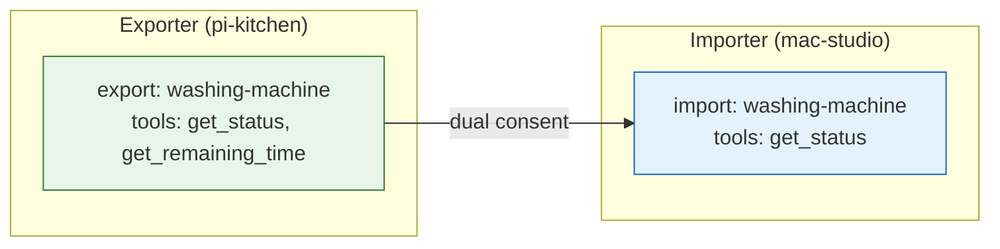
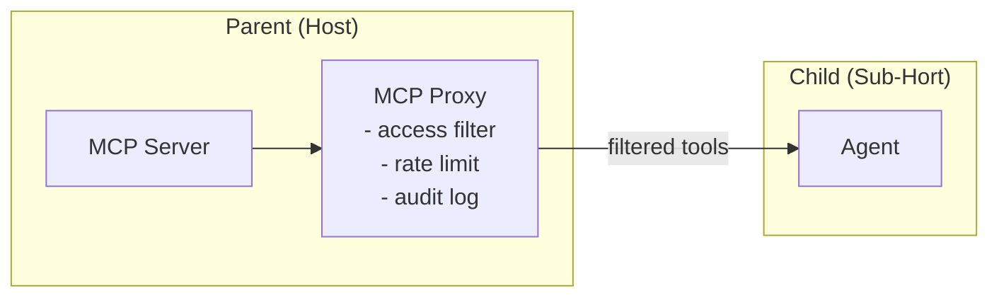
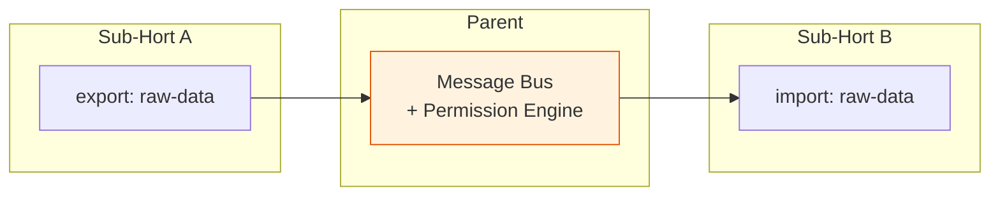
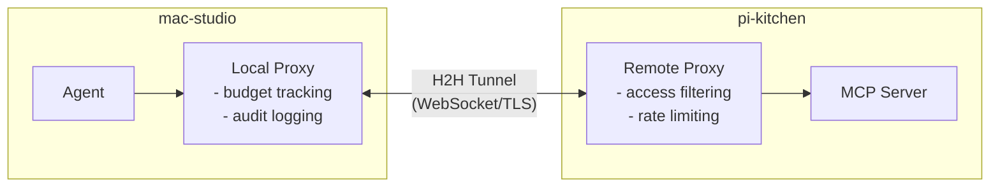
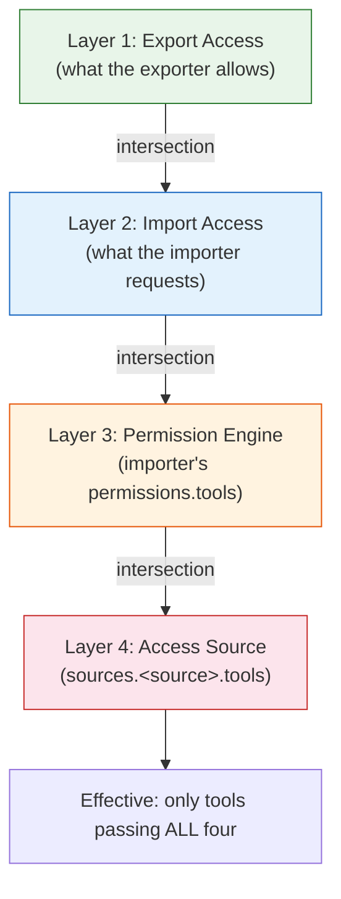
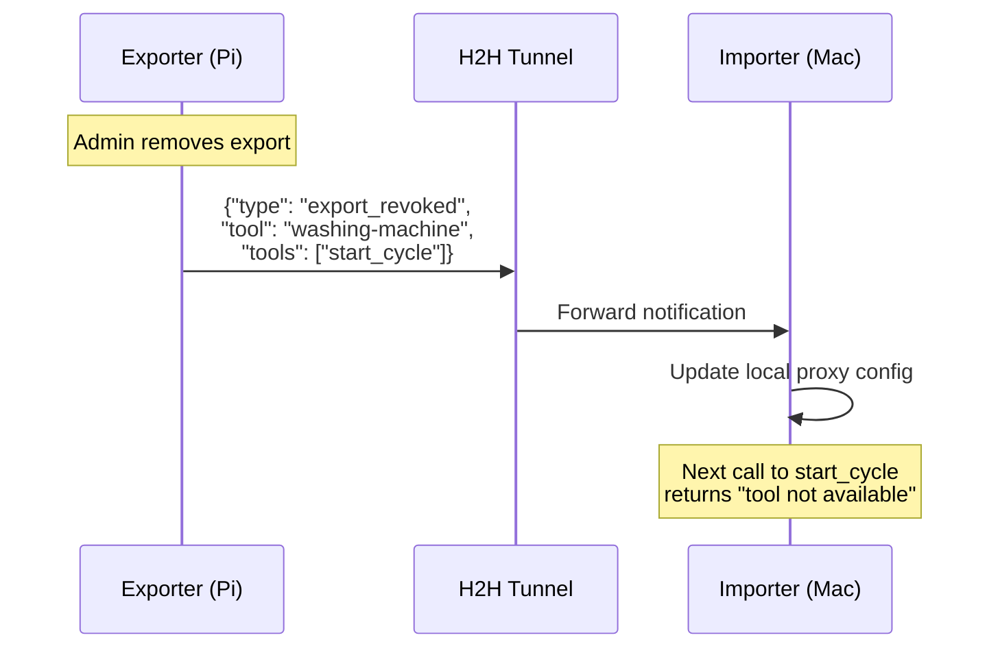
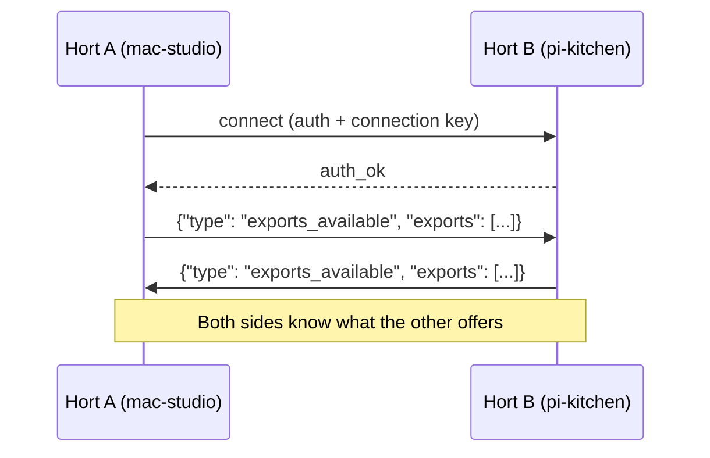

# Export/Import Reference

How tools cross Hort boundaries. By default, **nothing** crosses a
Hort boundary -- no tool, resource, or capability leaks between Horts
unless both sides explicitly opt in.

To share tools between Horts (parent/child, sibling/sibling,
machine/machine), you declare **exports** on the provider side and
**imports** on the consumer side.

## The Export/Import Model

Three rules govern all cross-Hort tool sharing:

1. **Dual consent** -- the exporter must export AND the importer must
   import. Neither side alone is sufficient.
2. **Per-tool granularity** -- exports name individual MCP tools, not
   entire servers or Horts.
3. **Reduction only** -- every layer can further restrict permissions,
   but no layer can escalate beyond what the layer above allows.



---

## Export Declaration

Declared in the Hort's configuration. Each entry names an MCP server,
specifies who may import it, and lists exactly which tools and
resources are shared.

```yaml
exports:
  - tool: system-monitor
    to: ["*"]                       # any Hort may import
    access:
      tools: [get_cpu, get_memory, get_disk]
      resources: [system://metrics]

  - tool: washing-machine
    to: ["mac-studio"]              # only this specific Hort
    access:
      tools: [get_status, get_remaining_time]
      deny_tools: [start_cycle, stop_cycle]
```

| Field | Type | Required | Description |
|-------|------|----------|-------------|
| `tool` | string | yes | Name of the MCP server to export |
| `to` | list | yes | Hort IDs allowed to import. `"*"` = any |
| `access.tools` | list | no | Allow-list of MCP tools to share |
| `access.resources` | list | no | Allow-list of MCP resources to share |
| `access.deny_tools` | list | no | Block these even if `"*"` is used |
| `access.read_only` | bool | no | Only export tools with `readOnlyHint` |

!!! warning "Wildcard `to` does not bypass import"
    Setting `to: ["*"]` makes the export *available* to any Hort, but
    each Hort must still explicitly import it.

---

## Import Declaration

Declared in the consuming Hort's configuration. Each entry names the
tool, identifies the source Hort, and optionally applies further
restrictions.

```yaml
imports:
  - tool: washing-machine
    from: pi-kitchen                # source Hort ID
    alias: kitchen-washer           # optional local name
    access:
      tools: [get_status]           # further restriction (reduction only)
```

| Field | Type | Required | Description |
|-------|------|----------|-------------|
| `tool` | string | yes | Name of the exported MCP server |
| `from` | string | yes | Hort ID of the exporter |
| `alias` | string | no | Local name (avoids naming conflicts) |
| `access.tools` | list | no | Subset of exported tools to import |
| `access.resources` | list | no | Subset of exported resources to import |

The importer's `access` can only **reduce** what the exporter offers.
If the exporter allows `[get_status, get_remaining_time]` and the
importer requests `[get_status, start_cycle]`, the effective set is
`[get_status]` -- `start_cycle` is silently dropped because the
exporter never offered it.

---

## Direction Rules

### Parent to Child (Machine Hort to Sub-Hort)

The most common direction. A Machine Hort grants a child Sub-Hort
access to specific tools running on the host.



- Parent generates the child's MCP config at container creation,
  including only exported tools.
- Proxy intercepts `tools/list` and `tools/call` to enforce access
  (same mechanism as [MCP Server filtering](../develop/mcp-servers.md#tool-filtering)).
- Child cannot discover unexported tools -- calls return JSON-RPC error.
- Docker networking prevents direct access; all traffic flows through
  the proxy via `host.docker.internal`.

### Child to Parent (Sub-Hort to Machine Hort)

Less common. A child creates a tool the parent wants to consume --
for example, a research agent producing results for the orchestrator.

```yaml
# Child (researcher):
exports:
  - tool: research-results
    to: ["mac-studio"]
    access:
      tools: [get_findings, get_summary]

# Parent (mac-studio):
imports:
  - tool: research-results
    from: researcher
```

- Child hosts an MCP server inside its container.
- Parent connects via reverse MCP proxy (parent as client, child as
  server).
- Deny-by-default: the parent must explicitly import AND the child
  must explicitly export. A compromised child cannot inject tools
  into the parent's environment.

### Sibling to Sibling (Sub-Hort A to Sub-Hort B)

Siblings never communicate directly. All tool sharing routes through
the parent's message bus.



**All three must be met:**

1. Sub-Hort A exports the tool (with B or `"*"` in `to`)
2. Sub-Hort B imports the tool from A
3. Parent's permission engine allows the routing

No direct container networking between siblings -- the parent checks
both the export ACL and its own policies before forwarding.

### Machine to Machine (H2H, Cross-Network)

Uses the H2H protocol (Hort-to-Hort tunnel) over WebSocket. Both
machines must be in the same cluster or connected via the access
server.



Two proxy layers, one on each machine:

| Proxy | Enforces |
|-------|----------|
| **Local** (importer side) | Budget tracking, audit logging, local rate limits |
| **Remote** (exporter side) | Access filtering, exporter rate limits, exporter audit |

Both must approve the call. If either rejects, the call fails. Tool
calls are serialized as JSON-RPC over the tunnel.

---

## Access Level Semantics

| Level | What is shared | Use case |
|-------|----------------|----------|
| `tools: [list]` | Only listed MCP tools | Fine-grained sharing |
| `tools: ["*"]` | All tools from the MCP server | Full tool access |
| `resources: [list]` | Only listed MCP resources | Data sharing |
| `deny_tools: [list]` | Block these (even if `"*"` used) | Safety rails |
| `read_only: true` | Only tools with `readOnlyHint` | Safe observation |

!!! info "`deny_tools` takes priority over `tools`"
    If `tools: ["*"]` and `deny_tools: [start_cycle]` are both set,
    every tool except `start_cycle` is exported. Deny always wins.

---

## The Intersection Rule

Effective permissions are the **intersection** of four layers. Each
can only reduce -- none can grant what a higher layer denied.



### Worked example

A washing machine MCP on `pi-kitchen` with tools: `get_status`,
`get_remaining_time`, `start_cycle`, `stop_cycle`, `set_temperature`.

| Layer | Configuration | Tools remaining |
|-------|--------------|-----------------|
| **1. Export** | `tools: ["*"], deny_tools: [set_temperature]` | `get_status`, `get_remaining_time`, `start_cycle`, `stop_cycle` |
| **2. Import** | `tools: [get_status, get_remaining_time, start_cycle]` | `get_status`, `get_remaining_time`, `start_cycle` |
| **3. Permissions** | `permissions.tools.allow: [get_status, get_remaining_time]` | `get_status`, `get_remaining_time` |
| **4. Source** | `sources.telegram.tools.allow: [get_status]` | `get_status` |

Via Telegram: only `get_status`. Via local terminal (with
`sources.local.inherit: all`): `get_status` and `get_remaining_time`.

!!! warning "Reduction is permanent per layer"
    Layer 2 cannot re-add `set_temperature` (removed by Layer 1).
    Layer 3 cannot re-add `start_cycle` (removed by Layer 2). Each
    layer's decision is final.

---

## Revocation

Exports can be revoked at any time by updating config. Revocation
applies to the next tool call -- in-flight calls are not cancelled.

| Direction | Mechanism | Timing |
|-----------|-----------|--------|
| Parent to child | Proxy config regenerated | Next `tools/list` or `tools/call` |
| Child to parent | Reverse proxy disconnected | Next `tools/call` |
| Sibling to sibling | Parent stops routing | Next `tools/call` |
| H2H | Revocation notification over tunnel | Next `tools/call` |



Every revocation is logged with a before/after diff:

```json
{
  "ts": "2026-03-27T14:30:00Z",
  "event": "export_revoked",
  "hort": "pi-kitchen",
  "tool": "washing-machine",
  "revoked_by": "admin@local",
  "before": {"tools": ["get_status", "start_cycle"]},
  "after": {"tools": ["get_status"]}
}
```

---

## Discovery

### Parent to child

The parent generates the child's MCP config at creation time. The
child sees only exported tools -- there is no discovery mechanism to
query what else might exist.

### H2H (cross-machine)

Both sides exchange export manifests during the tunnel handshake:



When exports change after the handshake, a notification is sent:

```json
{"type": "exports_changed", "added": [...], "removed": [...]}
```

New imports still require a config update -- they are not
automatically activated.

---

## Security Considerations

### Attack vectors and mitigations

| Attack | Mitigation |
|--------|------------|
| Export over-permission | Per-tool explicit listing; `deny_tools` for safety rails |
| Import escalation | Proxy enforces export ACL; unlisted tools return JSON-RPC error |
| Proxy bypass | Container networking has no direct route to MCP servers |
| Man-in-the-middle (H2H) | TLS encryption, per-node connection keys |
| Stale permissions | Proxy re-checks rules on every `tools/call` (no caching) |
| Injected export from child | Child-to-parent is deny-by-default; parent must import |
| Cross-sibling sniffing | No direct sibling networking; parent mediates all routing |

### Hardcoded rules

These are enforced by the framework and cannot be overridden:

1. **No secrets in exports.** API keys, connection secrets, and raw
   filesystem mounts cannot be exported. Only MCP-mediated access.
2. **Cross-machine uses H2H only.** No direct container-to-container
   networking across machines.
3. **Export changes are audited.** Every creation, modification, and
   revocation is logged with before/after diff and actor identity.
4. **Child-to-parent is deny-by-default.** Children cannot export to
   parents unless the parent explicitly imports.
5. **Sibling routing requires parent approval.** The parent's
   permission engine must authorize every sibling-to-sibling call.

!!! danger "Exports are not transitive"
    If Hort A exports to B, and B exports to C, C does NOT gain
    access to A's tools. Each export/import pair is independent. To
    give C access to A's tools, A must export directly to C (or
    `"*"`), and C must import from A.

---

## Quick Reference

=== "Parent to Child"

    ```yaml
    # Parent (mac-studio):
    exports:
      - tool: system-monitor
        to: ["researcher"]
        access:
          tools: [get_cpu, get_memory]

    # Child (researcher):
    imports:
      - tool: system-monitor
        from: mac-studio
    ```

=== "H2H (Cross-Machine)"

    ```yaml
    # On pi-kitchen:
    exports:
      - tool: washing-machine
        to: ["mac-studio"]
        access:
          tools: [get_status, get_remaining_time]

    # On mac-studio:
    imports:
      - tool: washing-machine
        from: pi-kitchen
        alias: kitchen-washer
    ```

=== "Sibling to Sibling"

    ```yaml
    # Sub-Hort A (data-collector):
    exports:
      - tool: raw-data
        to: ["analyzer"]
        access:
          tools: [get_latest, get_history]

    # Sub-Hort B (analyzer):
    imports:
      - tool: raw-data
        from: data-collector

    # Parent must allow routing:
    messaging:
      allow_routing:
        - from: data-collector
          to: analyzer
          tools: [raw-data]
    ```

---

## See Also

- [Permissions](permissions.md) -- tool allow/deny resolution order
- [Access Source Policies](source-policies.md) -- per-source permission scoping
- [MCP Servers](../develop/mcp-servers.md) -- MCP proxy architecture and tool filtering
- [Wire Protocol](protocols/wire-protocol.md) -- tunnel message format for H2H
- [Security](security/threat-model.md) -- threat model and mitigations
- [Running Across Machines](../guide/multi-node.md) -- cluster setup and node roles
