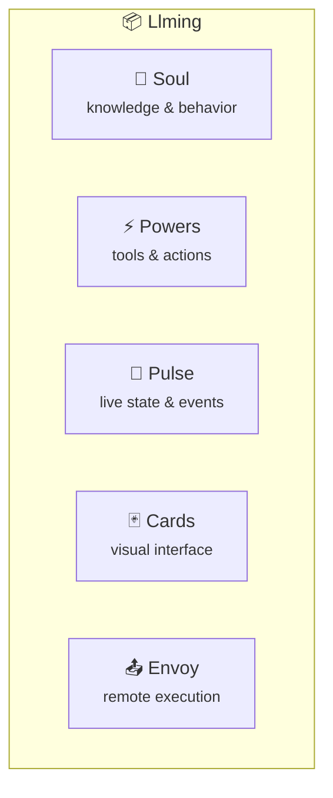
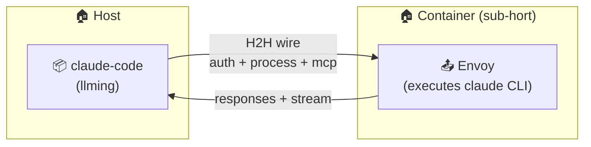
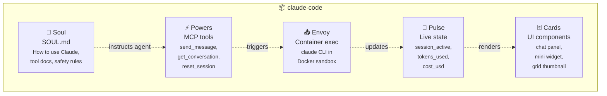

# Llming Anatomy

A **llming** is the universal building block of OpenHORT. Everything that does something is a llming. Every llming is composed of up to five parts — all optional except the manifest.

## The Five Parts



| Part | What it is | Required | Example |
|---|---|---|---|
| **Soul** | What the llming knows and how it behaves | No | SOUL.md with feature-gated sections |
| **Powers** | What the llming can do (MCP tools) | No | `screenshot`, `list_windows`, `send_email` |
| **Pulse** | What the llming radiates (live data + events) | No | CPU metrics, clipboard changes, connection status |
| **Cards** | How the llming looks (UI components) | No | Grid card thumbnail, detail panel, widgets |
| **Envoy** | Where the llming executes remotely | No | Claude CLI running inside a Docker container |

A minimal llming needs only a manifest. A full llming uses all five parts.

---

## Soul

The Soul defines what the llming knows and how it should behave when an agent interacts with it. It's a Markdown file (`SOUL.md`) with feature-gated sections.

```markdown
# System Monitor

You have access to real-time system metrics for this machine.
Always report CPU, memory, and disk in a single concise line.

## Chapter: Process Management

Feature: process_control
Tool: kill_process
Tool: list_processes

When asked to kill a process, always confirm the process name first.
Never kill system-critical processes (PID < 100).
```

- **Preamble** (before first `##`) — always included in the agent prompt
- **Chapters** — conditionally included based on `Feature:` toggles
- **Tool declarations** — chapters declare which Powers they document

The Soul is NOT code. It's instructions for the agent. A llming without a Soul still works — the agent just won't know how to use it beyond the tool descriptions.

---

## Powers

Powers are MCP tools the llming exposes. They are callable actions — the agent (or another llming via direct wiring) invokes them.

```python
class SystemMonitor(PluginBase, MCPMixin):
    def get_mcp_tools(self) -> list[dict]:
        return [
            {
                "name": "get_cpu",
                "description": "Get current CPU usage percentage",
                "inputSchema": {"type": "object", "properties": {}}
            },
            {
                "name": "kill_process",
                "description": "Kill a process by PID",
                "inputSchema": {
                    "type": "object",
                    "properties": {"pid": {"type": "integer"}},
                    "required": ["pid"]
                }
            }
        ]
```

Powers are subject to the `WireRuleset` on whatever wire they cross:

- `allow: [get_cpu]` — only this tool is visible
- `deny: [kill_*]` — all destructive tools hidden
- `allow_groups: [read]` — auto-detected group (get_*, list_*, read_*)

Powers are **synchronous call-response**. For live data, use Pulse.

---

## Pulse

Pulse is the llming's live state — data it holds and radiates without being asked. Unlike Powers (which require a call), Pulse data is always available and can be subscribed to.

### Two Modes

#### Static Read

Any connected client can read the current pulse at any time:

```python
class SystemMonitor(PluginBase):
    def get_pulse(self) -> dict:
        """Return current live state."""
        return {
            "cpu_percent": self._latest.get("cpu", 0),
            "memory_percent": self._latest.get("mem", 0),
            "disk_percent": self._latest.get("disk", 0),
            "uptime_seconds": self._uptime,
        }
```

Clients read via: `GET /api/plugins/{id}/pulse` or H2H `{"channel": "pulse", "method": "read"}`.

#### Subscribe (Push)

Clients subscribe to pulse changes. The llming pushes updates when state changes — like Redis pub/sub:

```python
class ClipboardHistory(PluginBase):
    def get_pulse_channels(self) -> list[str]:
        """Declare subscribable pulse channels."""
        return ["clipboard_changed", "clipboard_cleared"]

    async def _on_clipboard_change(self, content: str):
        """Called when clipboard changes — pushes to all subscribers."""
        await self.emit_pulse("clipboard_changed", {
            "content": content,
            "timestamp": time.time(),
        })
```

Clients subscribe via: H2H `{"channel": "pulse", "method": "subscribe", "params": {"events": ["clipboard_changed"]}}`.

### Pulse vs Powers vs Soul

| | Soul | Powers | Pulse |
|---|---|---|---|
| **Nature** | Instructions | Actions | Data |
| **Direction** | Agent reads once | Agent calls on demand | Llming pushes continuously |
| **Trigger** | Prompt construction | Explicit tool call | State change / timer |
| **Example** | "Never kill PID < 100" | `kill_process(pid=42)` | `cpu_percent: 95.2` |

### Pulse and Permissions

Pulse data crosses wires just like Powers. The same `WireRuleset` applies:

```yaml
wire:
  allow_pulse: [cpu_percent, memory_percent]    # only these pulse fields visible
  deny_pulse: [process_list]                    # this field hidden
  taint: source:monitoring                      # pulse data gets tainted
  block_taint: [source:sensitive]               # sensitive-tainted pulse blocked
```

Filters also apply to pulse data:

```yaml
filters:
  - type: regex
    channel: pulse
    pattern: "password|secret|token"
    action: redact
    replacement: "[REDACTED]"
```

### Pulse Broadcasts

Pulse events can trigger circuit wiring (direct llming-to-llming connections):

```yaml
direct:
  - between: [openhort/system-monitor, openhort/telegram]
    allow: [cpu_spike, disk_full]
    # When system-monitor emits cpu_spike pulse, Telegram receives it
```

---

## Cards

Cards are how the llming presents itself visually. A llming can have multiple cards:

- **Grid card** — the thumbnail in the main grid (always present if UI enabled)
- **Detail panel** — opened when the card is tapped/clicked
- **Widgets** — embeddable components other llmings can host
- **Float window** — detachable panel on desktop layouts

```javascript
class SystemMonitorCard extends LlmingExtension {
    static id = 'system-monitor';
    static name = 'System Monitor';
    static llmingIcon = 'ph ph-cpu';
    static llmingWidgets = ['system-monitor-panel'];

    // Grid card: paint live thumbnail
    renderThumbnail(ctx, width, height) {
        const data = this._statusData;
        // Draw CPU/MEM/DISK gauges on canvas
    }

    // Detail panel: Vue component
    setup(app) {
        app.component('system-monitor-panel', {
            template: `<div>{{ cpu }}% CPU</div>`,
            setup() { /* ... */ }
        });
    }
}
```

Cards consume Pulse data for live rendering. The data flow:

```
Python get_pulse() → HTTP → JS _feedStore() → renderThumbnail() → canvas → grid card
                                             → detail panel (Vue reactive)
                                             → widget (embedded in other llmings)
```

---

## Envoy

The Envoy is the llming's remote execution component. When a llming needs to run code in an isolated environment (container, VM, remote machine), it sends work to its Envoy.

The Envoy runs inside a sub-hort. The llming itself stays on the host.



### Envoy vs Sub-Hort

The Envoy is NOT the sub-hort itself. The sub-hort is the isolation boundary (container/VM). The Envoy is the llming's **agent inside** that boundary — the process that receives work, executes it, and returns results.

```
Sub-hort (container) = isolation boundary
  └─ Envoy = the llming's execution agent inside that boundary
       └─ Runs processes, manages files, holds credentials (in-memory)
```

### Envoy Communication

The Envoy speaks H2H protocol over whatever transport the sub-hort provides (stdio, HTTP, socket):

```json
// Host → Envoy: provision credential
{"id":"a1","type":"request","channel":"auth","method":"set_credential",
 "params":{"name":"anthropic","value":"sk-ant-..."}}

// Host → Envoy: start process
{"id":"a2","type":"request","channel":"process","method":"start",
 "params":{"cmd":"claude","args":["-p","--bare","hello"]}}

// Envoy → Host: streaming output
{"id":"a2","type":"stream","data":{"text":"Hello! How can I help?"}}

// Envoy → Host: process complete
{"id":"a2","type":"response","status":"ok",
 "result":{"exit_code":0,"session_id":"abc123"}}
```

### Envoy Permissions

The Envoy's capabilities are defined by the wire between the llming and its sub-hort. The llming cannot grant the Envoy more than the wire allows:

```yaml
sub_horts:
  claude-sandbox:
    container: { image: openhort-claude-code, memory: 2g }
    wire:
      direction: parent_only
      allow_channels: [auth, process, mcp]
      deny_channels: [fs]           # Envoy cannot read/write host files
      allow_cli: true
      allow_admin: false
```

### Not Every Llming Needs an Envoy

Most llmings run entirely on the host:

| Llming | Envoy? | Why |
|---|---|---|
| system-monitor | No | Reads local metrics directly |
| telegram | No | Talks to Telegram API from host |
| clipboard | No | Reads local clipboard |
| claude-code | **Yes** | Runs Claude CLI in sandboxed container |
| code-runner | **Yes** | Executes untrusted code in container |
| hosted-app | **Yes** | Runs web app (workflow engine, IDE) in container |

---

## Manifest

Every llming has an `extension.json` manifest that declares its parts:

```json
{
  "name": "system-monitor",
  "version": "0.1.0",
  "description": "Real-time CPU, memory, and disk monitoring",
  "capabilities": ["mcp", "scheduler", "ui"],

  "soul": "SOUL.md",

  "powers": {
    "tools": ["get_cpu", "get_memory", "get_disk", "kill_process"],
    "groups": {
      "read": ["get_cpu", "get_memory", "get_disk"],
      "destroy": ["kill_process"]
    }
  },

  "pulse": {
    "static": ["cpu_percent", "memory_percent", "disk_percent", "uptime_seconds"],
    "events": ["cpu_spike", "disk_full", "memory_warning"]
  },

  "cards": {
    "grid": true,
    "detail": "system-monitor-panel",
    "widgets": ["system-monitor-mini"]
  },

  "envoy": null
}
```

A manifest for a llming WITH an Envoy:

```json
{
  "name": "claude-code",
  "version": "0.1.0",
  "description": "Claude Code — AI coding assistant",
  "capabilities": ["mcp", "ui"],

  "soul": "SOUL.md",

  "powers": {
    "tools": ["send_message", "get_conversation", "reset_session"],
    "groups": {
      "read": ["get_conversation"],
      "write": ["send_message"],
      "destroy": ["reset_session"]
    }
  },

  "pulse": {
    "static": ["session_active", "tokens_used", "cost_usd"],
    "events": ["response_complete", "tool_used", "error"]
  },

  "cards": {
    "grid": true,
    "detail": "claude-chat-panel",
    "widgets": ["claude-mini-chat"]
  },

  "envoy": {
    "container": {
      "image": "openhort-claude-code",
      "memory": "2g",
      "cpus": 2
    },
    "wire": {
      "direction": "parent_only",
      "allow_channels": ["auth", "process", "mcp"],
      "allow_cli": true
    },
    "credentials": ["anthropic"]
  }
}
```

---

## Composition Example

A complete llming using all five parts:



---

## Permission Unification

All five parts are subject to the same `WireRuleset` when crossing any boundary:

| Part | Wire field | Effect |
|---|---|---|
| **Soul** | (always visible to agents with access) | Cannot be filtered per-section yet |
| **Powers** | `allow`, `deny`, `allow_groups`, `deny_groups` | Tools filtered per wire |
| **Pulse** | `allow_pulse`, `deny_pulse` | Pulse fields filtered per wire |
| **Cards** | (UI is client-side, not filtered by wire) | Client renders what it has access to |
| **Envoy** | `allow_channels`, `direction`, `allow_cli`, `allow_admin` | Full H2H wire rules |

Taint labels apply uniformly:

```yaml
wire:
  taint: source:monitoring
  # ALL data from this llming — Powers responses, Pulse values,
  # Envoy output — gets tagged with source:monitoring
```

Filters apply to all channels:

```yaml
filters:
  - type: regex
    channel: [mcp, pulse]              # filter both Powers and Pulse
    pattern: "password|secret|token"
    action: redact
```
