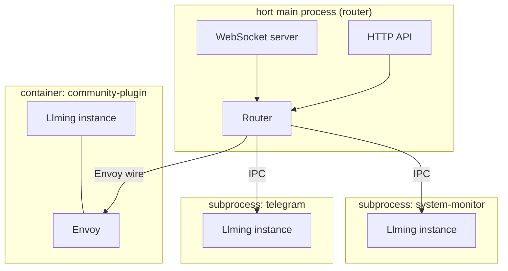

# Llming Isolation

Every llming runs in its own subprocess. No exceptions. A community
llming CANNOT access another llming's memory, credentials, or imports.
The main hort process is a pure router — it never loads llming code.

## Why

In-process llmings share Python memory. Any llming can:
- `import` other llmings' modules
- Read globals, singletons, registries
- Access credentials from the OS keychain
- Monkey-patch framework internals

Subprocess isolation eliminates all of this. Each llming runs in its
own Python process with its own memory space. The only way to interact
with the outside world is through the defined protocol.

## Architecture



The main process NEVER imports llming code. It only knows:
- The llming's manifest (JSON)
- The IPC protocol
- What powers and pulses the llming declares

## What Crosses the Boundary

Everything between the main process and a llming goes through IPC.
Nothing else. No shared memory, no shared imports, no shared globals.

### Main → Llming

| Message | Purpose |
|---------|---------|
| `activate` | Start the llming with config |
| `deactivate` | Clean shutdown |
| `execute_power` | Call a power (MCP tool, command, action) |
| `viewer_connect` | A browser viewer connected |
| `viewer_disconnect` | A browser viewer disconnected |
| `set_credential` | Provision an in-memory credential |

### Llming → Main

| Message | Purpose |
|---------|---------|
| `register_powers` | Declare available powers |
| `register_pulses` | Declare available pulses (with access levels) |
| `pulse_update` | Push new pulse state |
| `pulse_emit` | Emit a pulse event |
| `storage_read` | Read from another llming's shared vault |
| `card_update` | Push UI card data to connected viewers |
| `log` | Log message (routed to hort log) |

### Llming → Llming (via router)

Llmings never talk directly. All cross-llming communication goes
through the router, which enforces access levels:

```
Llming A → pulse_emit("cpu", {value: 42}, access="public")
  → Router checks: public → broadcast to all subscribers
  → Llming B receives pulse (if subscribed)

Llming A → storage_read("llming-b", "metrics", {key: "cpu"})
  → Router checks: vault group = "shared", wire allows A → B
  → Router reads from B's storage, returns to A
```

## The Five Parts Over IPC

Each of the five llming parts works over the IPC boundary:

### Soul
- Main reads `SOUL.md` from the llming's directory
- Injected into AI system prompts by the main process
- The llming subprocess never touches the Soul directly

### Powers
- Llming declares powers at startup via `register_powers`
- Main exposes them as MCP tools, WS commands, or REST endpoints
- When called, main sends `execute_power` over IPC
- Llming executes, returns result over IPC
- The main never runs power code — it only routes

### Pulse
- Llming declares pulse fields with access levels via `register_pulses`
- Llming pushes state updates via `pulse_update`
- Main stores latest state, broadcasts to subscribers
- Other llmings subscribe via the router (access levels enforced)
- Pulse routing into storage happens in the main process

### Cards
- Llming serves static JS/CSS from its directory (main mounts as /ext/)
- Card data (for thumbnails, live updates) sent via `card_update` over IPC
- The JS (`LlmingClient`) runs in the browser, not in the subprocess
- Card code has NO access to the llming's Python — only to data pushed via IPC

### Envoy
- For container-tier llmings, the Envoy replaces IPC with H2H wire
- Same protocol, different transport (TCP instead of Unix socket)
- The llming code is identical — it doesn't know which tier it runs in

## Storage Access

Each llming subprocess gets its own isolated storage directory.
The subprocess has direct filesystem access to its OWN storage only.

Cross-llming storage access goes through the router:

```
Llming A subprocess
  ├── direct access: ~/.hort/instances/xxx/storage/llming-a/
  └── via router:    read llming-b's shared vault → IPC → router → read → IPC → result
```

The router enforces:
- Private vaults: blocked
- Shared vaults: check wire permissions
- Public vaults: allowed
- All access logged

## Credential Isolation

Credentials are NEVER stored on disk in the llming's storage.
They're provisioned in-memory by the main process:

```
Main → IPC → set_credential("anthropic", "sk-ant-...")
Llming stores in Python dict (memory only)
Process dies → credential gone
```

The llming cannot read other llmings' credentials. The main process
decides which credentials each llming gets based on the config.

## Tier Configuration

```yaml
llmings:
  system-monitor:
    tier: subprocess        # default for all llmings
  
  telegram-connector:
    tier: subprocess        # same default
  
  community-weather:
    tier: container         # untrusted, full sandbox
    container:
      image: weather-llming:latest
      memory: 256m
      network: restricted   # can only reach weather API
```

There is no `in-process` tier. ALL llmings run in subprocesses.
The only difference is subprocess (trusted, local filesystem) vs
container (untrusted, Docker sandbox).

## Startup Sequence

```
1. Main process starts
2. Reads manifests from all llming directories
3. Spawns one subprocess per llming
4. Each subprocess:
   a. Imports and instantiates the Llming class
   b. Connects to main via IPC
   c. Sends register_powers + register_pulses
   d. Main sends activate with config
   e. Llming runs activate(), starts background tasks
5. Main is ready — all powers/pulses registered, router active
```

## Hot Reload

```
1. File change detected in llming's directory
2. Main sends deactivate to THAT llming's subprocess
3. Wait for clean shutdown (5s)
4. Kill subprocess
5. Spawn new subprocess with updated code
6. Re-register powers/pulses
7. Other llmings unaffected
```

Only the changed llming restarts. The main process never restarts
for llming code changes.

## What This Prevents

| Attack | In-process | Subprocess |
|--------|-----------|------------|
| Read other llming's credentials | Trivial (`import`) | Impossible |
| Monkey-patch framework | Trivial | Impossible |
| Crash the entire server | One exception kills all | Only the llming dies |
| Memory leak affects others | Shared heap | Separate heap, killable |
| Steal OAuth tokens from keychain | Direct access | Main controls provisioning |
| Read another llming's storage | Direct filesystem | Router enforces access |
| Infinite loop blocks everything | Blocks event loop | Main keeps running |
