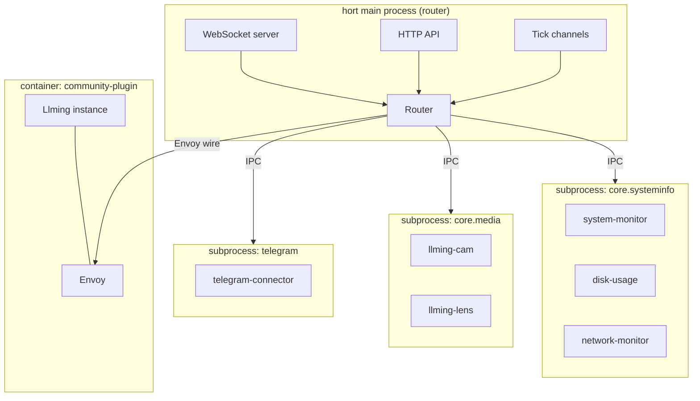

# Llming Isolation

Llmings run in subprocesses, grouped by `group` field in the manifest.
Llmings in the same group share a process. Llmings without a group get
their own process. The main hort process is a pure router — it never
loads llming code.

## Why

In-process llmings share Python memory. Any llming can:
- `import` other llmings' modules
- Read globals, singletons, registries
- Access credentials from the OS keychain
- Monkey-patch framework internals
- Block the entire server with a synchronous call

Subprocess isolation eliminates all of this. Each group runs in its
own Python process with its own memory space. The only way to interact
with the outside world is through IPC.

## Process Groups

Llmings declare a `group` in their manifest. Llmings in the same group
share a subprocess. Llmings without a group get their own process.

```json
// system-monitor/manifest.json
{"name": "system-monitor", "group": "core.systeminfo", ...}

// disk-usage/manifest.json
{"name": "disk-usage", "group": "core.systeminfo", ...}

// network-monitor/manifest.json
{"name": "network-monitor", "group": "core.systeminfo", ...}

// telegram-connector/manifest.json (no group = own process)
{"name": "telegram-connector", ...}
```

Result:

| Process | Llmings |
|---------|---------|
| `core.systeminfo` | system-monitor, disk-usage, network-monitor, process-manager |
| `core.media` | llming-cam, llming-lens, screenshot-capture |
| `core.comms` | telegram-connector, llming-wire |
| (own process) | hue-bridge |
| (own process) | peer2peer |
| (container) | community-plugin |

**Within a group**: llmings share memory, can call each other directly.
**Across groups**: all communication goes through IPC to the main process.

## Architecture



The main process NEVER imports llming code. It only knows:
- The llming's manifest (JSON)
- The IPC protocol
- What powers and pulses the llming declares

## What Crosses the Boundary

Everything between the main process and a llming goes through IPC.
Nothing else. No shared memory, no shared imports, no shared globals.

### Main → Llming

| Message | Purpose |
|---------|---------|
| `activate` | Start the llming with config |
| `deactivate` | Clean shutdown |
| `execute_power` | Call a power (MCP tool, command, action) |
| `viewer_connect` | A browser viewer connected |
| `viewer_disconnect` | A browser viewer disconnected |
| `set_credential` | Provision an in-memory credential |

### Llming → Main

| Message | Purpose |
|---------|---------|
| `register_powers` | Declare available powers |
| `register_pulses` | Declare available pulses (with access levels) |
| `pulse_update` | Push new pulse state |
| `pulse_emit` | Emit a pulse event |
| `storage_read` | Read from another llming's shared vault |
| `card_update` | Push UI card data to connected viewers |
| `log` | Log message (routed to hort log) |

### Llming → Llming (via router)

Cross-group communication goes through the router:

```python
# In Python (same group = direct, cross-group = IPC)
result = await self.llmings["hue-bridge"].call("set_light", {"id": "1", "on": True})
data = await self.vaults["system-monitor"].read("latest")

# In JS (card API, always through server WS)
const result = await this.call("set_light", {id: "1", on: true}, "hue-bridge");
const data = await this.vaultRead("latest", "system-monitor");
```

## Powers, Pulses, Storage Over IPC

### Powers
- Defined with `@power` decorator — framework auto-discovers and routes
- Main registers them as MCP tools + WS commands
- Calls routed: WS → main → IPC → subprocess → execute → IPC → main → WS

### Pulses
- Push-only named channels. `await self.emit("channel", data)`
- **Global**: every pulse reaches every subscriber, regardless of where it runs
- Main process is the router — all pulses flow through it
- Delivery to ALL subscriber locations:
    - Other subprocesses → via IPC
    - In-process llmings → direct call
    - Browser cards → via WS push
    - Container llmings → via envoy wire (future)
    - Remote VMs → via H2H protocol (future)
- Python llmings subscribe with `@pulse("channel")` decorator
- JS cards subscribe with `this.subscribe("channel", handler)`
- **Pulses can NEVER be read** — subscribe or miss them
- Built-in tick pulses (`tick:10hz`, `tick:1hz`, `tick:5s`) are just regular pulses emitted by the main process — they reach all subscribers like any other pulse

### Vaults / Storage
- Each llming has own vault (scrolls + crates)
- `self.vault.set("key", data)` / `self.vault.get("key")` for own vault
- `self.vaults["other"].read("key")` for cross-llming reads
- JS: `this.vaultRead("key")` / `this.vaultWrite("key", data)`
- Cross-group reads go through IPC, permissions from manifest

### Cards
- Static JS/CSS served from llming directory (main mounts as `/ext/`)
- Cards subscribe to pulses and read vaults via the card API
- Card API goes through the control WebSocket (WS → main → response)
- See [Card API](../develop/card-api.md)
- Card code has NO access to the llming's Python — only to data pushed via IPC

### Envoy
- For container-tier llmings, the Envoy replaces IPC with H2H wire
- Same protocol, different transport (TCP instead of Unix socket)
- The llming code is identical — it doesn't know which tier it runs in

## Storage Access

Each llming subprocess gets its own isolated storage directory.
The subprocess has direct filesystem access to its OWN storage only.

Cross-llming storage access goes through the router:

```
Llming A subprocess
  ├── direct access: ~/.hort/instances/xxx/storage/llming-a/
  └── via router:    read llming-b's shared vault → IPC → router → read → IPC → result
```

The router enforces:
- Private vaults: blocked
- Shared vaults: check wire permissions
- Public vaults: allowed
- All access logged

## Credential Isolation

Credentials are NEVER stored on disk in the llming's storage.
They're provisioned in-memory by the main process:

```
Main → IPC → set_credential("anthropic", "sk-ant-...")
Llming stores in Python dict (memory only)
Process dies → credential gone
```

The llming cannot read other llmings' credentials. The main process
decides which credentials each llming gets based on the config.

## Tier Configuration

```yaml
llmings:
  system-monitor:
    tier: subprocess        # default for all llmings
    group: core.systeminfo  # optional — share process with other llmings
  
  community-weather:
    tier: container         # untrusted, full sandbox
    container:
      image: weather-llming:latest
      memory: 256m
      network: restricted
```

Three tiers:

| Tier | Isolation | Use case |
|------|-----------|----------|
| **subprocess** (default) | Own process, IPC only | All llmings by default |
| **container** | Docker sandbox | Untrusted / community llmings |
| **in_process** | None — shares main process memory | Platform providers, hort-chief |

Group is optional — llmings in the same group share a subprocess.
Ungrouped llmings each get their own subprocess.

!!! danger "in_process is a security risk"
    An `in_process` llming runs inside the main server process. It has
    full access to:

    - All other in-process llmings' memory and credentials
    - The OS keychain (OAuth tokens, API keys)
    - The framework internals (session manager, registries)
    - The event loop (can block the entire server)
    - All Docker containers on the host

    **Only core platform providers and hort-chief should ever be in_process.**
    Third-party or community llmings must NEVER run in-process.

    Future: installing a llming with `in_process: true` must show a
    prominent security warning with explicit user acceptance before
    loading. The UI should display a red badge on in-process llmings
    and log a WARNING on every startup.

## Startup Sequence

```
1. Main process starts, opens port immediately (<3s)
2. Reads manifests from llmings/ directory
3. Groups llmings by manifest `group` field
4. Spawns one subprocess per group (+ one per ungrouped llming)
5. Each subprocess:
   a. Loads all llmings in its group
   b. Connects to main via IPC
   c. Sends register_powers for all llmings
   d. Main sends activate with config for each
   e. Llmings run activate()
6. Main wires @on subscriptions and fires initial tick channels
7. llming:started events emitted for each llming
8. @on_ready handlers fire when all dependencies are ready
```

## Hot Reload

```
1. File change detected in llming's directory
2. Main sends deactivate to THAT group's subprocess
3. Wait for clean shutdown (5s)
4. Kill subprocess
5. Spawn new subprocess with updated code for entire group
6. Re-register powers
7. Other groups unaffected
```

Only the changed llming restarts. The main process never restarts
for llming code changes.

## What This Prevents

| Attack | In-process | Subprocess |
|--------|-----------|------------|
| Read other llming's credentials | Trivial (`import`) | Impossible |
| Monkey-patch framework | Trivial | Impossible |
| Crash the entire server | One exception kills all | Only the llming dies |
| Memory leak affects others | Shared heap | Separate heap, killable |
| Steal OAuth tokens from keychain | Direct access | Main controls provisioning |
| Read another llming's storage | Direct filesystem | Router enforces access |
| Infinite loop blocks everything | Blocks event loop | Main keeps running |
