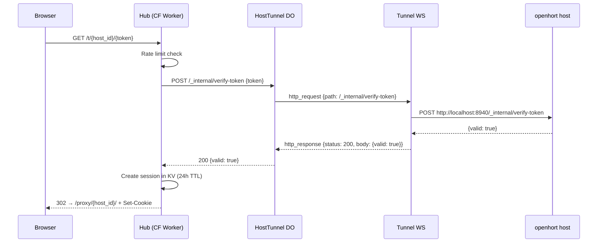

# n8n Hosted App Internals

This document records the work needed to make `n8n` run as an openhort hosted app through:

- direct local/LAN access
- P2P access through the hosted viewer and DataChannel transport
- cloud proxy access through `/proxy/{host_id}/...`

The key requirement is that the same `n8n` container instance must work under multiple outer URL shapes without being reconfigured for each mode.

## URL Model

The canonical openhort hosted-app entrypoint is now:

```text
/app/{instance}/ui/
```

Examples:

- local/LAN: `http://localhost:8940/app/workflows/ui/`
- local HTTPS dev proxy: `https://localhost:8950/app/workflows/ui/`
- cloud proxy: `https://hub.openhort.ai/proxy/{host_id}/app/workflows/ui/`

The older `~` segment still existed during development, but it is now treated as a legacy alias that should redirect to `/ui/...` rather than serving content directly.

The important distinction is:

- the container should behave as if it lives at `/`
- openhort is responsible for adapting browser-visible URLs to the correct hosted-app prefix

This avoids binding `n8n` to one specific external base URL.

## Why n8n Broke Initially

`n8n` assumes it is effectively mounted at root. Its HTML, JS bootstrap, router base-path handling, dynamic imports, CSS preloads, API calls, and some JSON bootstrap data all contain rooted URLs such as:

```text
/static/base-path.js
/static/prefers-color-scheme.css
/assets/index-....js
/rest/login
```

That works when `n8n` is served directly at `/`, but fails when the app is actually visible at:

```text
/app/workflows/ui/
```

or:

```text
/proxy/{host_id}/app/workflows/ui/
```

The browser resolves those rooted URLs against the site root and escapes the hosted-app prefix. The immediate symptoms were:

- large numbers of `404` errors for `/assets/...` and `/static/...`
- SPA routes such as `/signin` showing n8n's own 404 page
- frontend crashes because some JSON bootstrap fields were missing in public-mode responses
- URL behavior differing between direct access and proxy access

## Design Decision

The chosen model is:

1. Keep the container configured as root-based.
2. Do not make the container own the outer prefix.
3. Make the openhort hosted-app proxy adapt responses to the browser-visible prefix.

This is the only approach that scales cleanly across:

- LAN access
- P2P transport
- cloud proxy transport

If the container had to know whether it was being viewed at `/app/...` or `/proxy/{host_id}/app/...`, the configuration would become transport-specific and fragile.

## Main Changes in `hort/app.py`

Most of the implementation currently lives in `hort/app.py`.

### 1. Hosted-App Route Shape

Dedicated routes were added for:

```text
/app/{instance}/ui/
/app/{instance}/ui
/app/{instance}/ui/{path:path}
```

`/app/{instance}` now redirects to `/app/{instance}/ui/`.

This established one canonical app root and prevented ambiguous behavior around missing trailing segments.

Legacy compatibility routes still exist for:

```text
/app/{instance}/~/
/app/{instance}/~
/app/{instance}/~/{path:path}
```

but those routes should redirect to `/ui/...` and should not be treated as the canonical browser-visible path anymore.

### 2. HTML Bootstrap Injection

The hosted-app proxy injects a bootstrap shim into HTML responses. Its job is to keep browser-side navigation and network calls inside the hosted-app prefix.

The shim patches browser APIs such as:

- `fetch`
- `XMLHttpRequest`
- `WebSocket`
- `EventSource`
- `history.pushState`
- `history.replaceState`

This is needed because some URLs are generated at runtime by the frontend, not only in static HTML markup.

### 3. HTML, JS, and CSS Rewriting

For content types that drive browser loading behavior, openhort rewrites rooted self-references into hosted-app-root-relative ones.

Examples:

- `"/assets/..."`
- `"/static/..."`
- `"/rest/..."`
- `"/favicon.ico"`
- `"/login"`
- `"/logout"`

This rewriting is applied to:

- HTML
- JavaScript
- CSS
- selected JSON payloads

To make rewriting reliable, the proxy requests upstream content with identity encoding and also supports decompression when needed.

### 4. `Location` Header Rewriting

Upstream redirects that point at root paths are rewritten back into the current hosted-app root.

Without this, redirects would escape from `/app/{instance}/ui/...` or from `/proxy/{host_id}/app/{instance}/ui/...`.

### 5. WebSocket Forwarding Improvements

The hosted-app WebSocket bridge was extended to preserve more of the original request shape, including query-string handling.

This is important for apps like `n8n`, which can depend on WebSocket endpoints or runtime channels that are not simple path-only sockets.

### 6. Root Asset Fallback

Even after HTML rewriting, some runtime code paths in `n8n` still attempted to request assets from root:

```text
/assets/...
```

To tolerate this, openhort added a root-level asset fallback:

```text
/assets/{path:path}
/favicon.ico
```

The fallback determines the hosted-app instance from:

1. the `Referer`
2. the `ohapp_instance` cookie

and then proxies the request to the correct hosted-app container.

This made dynamic imports and late asset loads much more robust.

### 7. Hosted-App Cookie

HTML responses for hosted apps now set:

```text
ohapp_instance={instance}
```

with a root path.

This cookie supports the root asset fallback described above. It is especially useful when late browser requests no longer preserve enough route context on their own.

### 8. SPA Route Fallback

For GET and HEAD requests that look like frontend routes rather than upstream server endpoints, the hosted-app proxy serves the upstream app shell instead of forwarding the literal route to `n8n`.

This was required for routes such as:

```text
/app/workflows/ui/signin
```

Before this fallback, the request was proxied upstream as a literal `/signin` server path and n8n rendered its own in-app 404 screen.

After the fix, SPA routes resolve through the frontend router as intended.

### 9. `window.BASE_PATH` Fix

`n8n` uses `window.BASE_PATH` for router setup in production builds. A critical bug was that the app still saw a relative or root base instead of the actual hosted-app path.

The hosted-app proxy now rewrites `static/base-path.js` so it returns the real browser-visible base:

```javascript
window.BASE_PATH = "/app/workflows/ui/";
```

This is one of the most important fixes in the whole integration. Without it:

- router navigation can escape the hosted-app root
- SPA routes resolve incorrectly
- assets and lazy-loaded chunks can break again after initial page load

## JSON Normalization for n8n

One class of failures had nothing to do with subpaths. The `n8n` frontend assumed that some public bootstrap/settings responses always contained fields that were actually absent.

This surfaced as frontend crashes such as:

- reading `license.planName`
- reading `security.blockFileAccessToN8nFiles`
- reading `enterprise.projects.team.limit`

To stabilize startup, the hosted-app proxy now normalizes selected JSON responses, most importantly `/rest/settings`.

Defaults currently injected include:

```json
{
  "license": {
    "planName": "Community",
    "consumerId": null,
    "environment": "production"
  },
  "security": {
    "blockFileAccessToN8nFiles": false
  },
  "concurrency": -1,
  "pruning": {
    "isEnabled": false
  },
  "versionNotifications": {
    "enabled": false
  },
  "banners": {
    "dismissed": []
  },
  "versionCli": "",
  "enterprise": {
    "projects": {
      "team": {
        "limit": 0
      }
    }
  }
}
```

This normalization is intentionally pragmatic. It keeps the n8n UI from crashing in hosted-app mode while still reflecting a non-enterprise, non-configured environment.

## JSON Self-URL Rewriting

Some n8n JSON responses also leaked internal absolute URLs such as:

```text
http://localhost:5678/rest/...
```

Those are rewritten by the hosted-app proxy to the visible hosted-app path, for example:

```text
/app/workflows/ui/rest/...
```

Without this, the frontend could recover from the initial asset load only to break again when later bootstrap data pointed it back at the raw container origin.

## Why `N8N_PATH` Was Not the Right Fix

An earlier direction used `N8N_PATH` or similar settings to try to mount the app under a path.

That approach is too rigid for openhort because the same app instance must survive both:

- direct hosted-app access at `/app/{instance}/ui/...`
- cloud access at `/proxy/{host_id}/app/{instance}/ui/...`

Those are different external paths. Baking one of them into the container only solves one transport and breaks the other.

The correct architecture is:

- container owns app logic
- openhort owns path adaptation

## Debugging Lessons

### Stale Server Processes Caused Major Confusion

During development, the largest source of false negatives was stale `uvicorn` processes still bound to port `8940`.

This produced a confusing pattern:

- code changes were correct
- container behavior looked fine
- but the browser still received old HTML or old rewrite behavior

The fix was to explicitly identify and kill the stale listener and then restart one clean server process.

When debugging hosted-app behavior, always verify the actual live response from the server that owns port `8940`.

### Verify Browser-Facing Outputs, Not Just Upstream Container Behavior

Useful checks were:

- `GET /app/workflows/ui/`
- `GET /app/workflows/ui/signin`
- `GET /app/workflows/ui/static/base-path.js`
- `GET /app/workflows/ui/rest/settings`
- `HEAD /app/workflows/ui/assets/...`
- `HEAD /assets/...` with hosted-app cookie context

It was not enough to verify that the upstream `n8n` container returned `200`. The critical question was whether the openhort proxy emitted browser-correct responses.

## Current State

At the time of writing, the integration has progressed from total startup failure to a substantially working hosted-app load:

- initial HTML loads through the hosted-app proxy
- static assets and dynamic chunks load
- router base-path handling is corrected
- SPA routes such as `/signin` are handled through the app shell
- public settings payloads are normalized enough to avoid several frontend crashes
- the user can already reach the UI far enough to run app events and see meaningful interface state

The console can still show:

```text
GET /app/workflows/ui/rest/login 401 Unauthorized
```

This is expected for anonymous startup and, by itself, is not a hosted-app bug.

## Later Changes

The initial milestone got the app loading. The later work focused on making the integration robust enough for real reloads, nested routes, and interactive editor behavior.

### Canonical `/ui/` Path

Using `~` as the visible marker worked technically, but it was awkward and made debugging harder. The canonical visible route is now:

```text
/app/{instance}/ui/...
```

This keeps the instance name explicit while replacing the symbol segment with a readable path component.

### Legacy `~` Redirects

Serving both `/ui/...` and `/~/...` as full content paths created subtle reload failures, especially on nested routes such as:

```text
/app/workflows/~/home/workflows
```

The correct behavior is now:

- `/app/workflows/~/home/workflows` returns `301`
- destination: `/app/workflows/ui/home/workflows`

This matters because the browser may still have older bookmarks, in-app navigation history, or mobile restore state pointing at legacy `~` URLs.

### Nested-Route Asset Bug

At one point the hosted-app proxy emitted page-relative asset URLs such as:

```text
./assets/...
./static/...
```

That worked on the app root but failed on nested SPA routes, because the browser resolved them against the current route, for example:

```text
/app/workflows/ui/home/assets/...
/app/workflows/ui/workflow/static/...
```

Those requests then hit the SPA fallback and returned HTML, which caused the browser to report MIME errors like:

- stylesheet served as `text/html`
- module script served as `text/html`

The fix was to stop emitting page-relative asset URLs and instead emit app-root-relative URLs such as:

```text
/app/workflows/ui/assets/...
/app/workflows/ui/static/...
/app/workflows/ui/rest/...
```

This is essential for reload safety on:

- workflow routes
- `/home/...` routes
- mobile reconnects
- tab restore

### `BASE_PATH` and Canonical Route Reloads

The `static/base-path.js` rewrite was updated alongside the canonical path change. The browser-visible base must match the canonical `/ui/` route, otherwise router transitions and reloads drift back toward invalid nested asset paths.

This means reload safety depends on both:

- correct server-side SPA fallback
- correct `window.BASE_PATH`

### Realtime Push Connection

After initial page load was stabilized, the next integration issue was the realtime editor connection.

The n8n frontend opens its push channel on:

```text
/rest/push?pushRef=...
```

In hosted-app mode that becomes:

```text
/app/{instance}/ui/rest/push?pushRef=...
```

The WebSocket bridge needed to preserve:

- path
- query string
- subprotocols
- browser cookies

Forwarding the browser cookie to the upstream WebSocket is important because n8n can otherwise immediately close the connection as unauthenticated, producing repeated reconnect loops with code `1000`.

### Full-Height Layout Fix

Once routing was stable, the app still rendered as if it only used the top part of the viewport. This turned out not to be an iframe issue. The hosted-app proxy is serving n8n HTML directly.

The practical fix was to inject a small layout style into the hosted-app HTML head to guarantee that the top-level app roots receive full viewport height:

```css
html, body {
  height: 100%;
  min-height: 100vh;
  margin: 0;
}

body {
  overflow: hidden;
}

#app {
  height: 100%;
  min-height: 100vh;
}
```

This is a defensive compatibility shim. It makes the hosted app fill the viewport even when the upstream bundle assumes a full-height root chain that is not otherwise guaranteed.

### Version Pinning

Initially the hosted-app catalog used:

```text
n8nio/n8n:latest
```

That is unsafe once the openhort side contains version-sensitive compatibility work.

The catalog is now pinned to the specific version that was validated during this integration effort:

```text
n8nio/n8n:2.14.2
```

This does not patch or fork n8n itself. It only prevents silent drift from `latest` when creating or recreating hosted-app instances.

## Critical: N8N_ENCRYPTION_KEY

n8n generates a random encryption key on first start. This key is used to sign JWT auth tokens. **Without a stable key, all sessions are invalidated on container restart** — users get 401 Unauthorized on every request even after a successful login.

Symptoms without a stable key:
- Login succeeds (200 + Set-Cookie)
- Every subsequent request returns 401
- WebSocket push connection fails with code 1005
- "Init Problem: Unauthorized" toast on page load
- "Problem saving workflow: Autosave failed: Unauthorized"
- Infinite WebSocket reconnect loop in console

The fix:
```
N8N_ENCRYPTION_KEY=openhort-n8n-stable-encryption-key
```

Set in the catalog env vars. This ensures JWTs survive container restarts. The key does NOT need to be secret from the host — it only needs to be stable.

This was the single most time-consuming debugging issue in the entire n8n integration. The symptoms (401 on everything) looked like a proxy problem but were actually an n8n-internal JWT validation failure.

## WebSocket Origin Validation

n8n validates the `Origin` header on WebSocket connections. When proxying WebSocket connections, the browser sends `Origin: http://localhost:8940` but n8n expects its own container origin (e.g., `http://127.0.0.1:55014`).

Without fixing this, the WebSocket opens and immediately closes with:
```
Invalid origin!
```

The fix: the WebSocket proxy sets `origin` to the container's URL when forwarding:
```python
container_origin = container_url  # e.g., "http://127.0.0.1:55014"
remote = ws_lib.connect(ws_url, origin=container_origin, ...)
```

The browser cookie is still forwarded for auth, but the origin is rewritten to match the container.

## Python 3.14 Support

The stock `n8nio/n8n` image uses a hardened Alpine image with the package manager (`apk`) removed. Python is not available — n8n's Python Code node shows:

```
Python runner unavailable: Python 3 is missing from this system
```

The fix: a custom Docker image (`openhort/n8n-python:latest`) built via multi-stage build:

```dockerfile
FROM n8nio/n8n:latest AS base
FROM alpine:edge AS python-builder
RUN apk add --no-cache python3~=3.14
FROM base
COPY --from=python-builder /usr/bin/python3 /usr/bin/python3
COPY --from=python-builder /usr/lib/python3.14/ /usr/lib/python3.14/
COPY --from=python-builder /usr/lib/libpython3* /usr/lib/
USER root
RUN ln -sf /usr/bin/python3 /usr/bin/python
USER node
```

Source: `hort/extensions/core/hosted_apps/dockerfiles/n8n-python.Dockerfile`

!!! warning "Python Task Runner"
    n8n 2.14.2's built-in Python task runner requires a virtual environment that our multi-stage copy doesn't provide. The Python binary works for Code nodes via the internal runner fallback, but production deployments should use n8n's external task runner mode.

## Container Resource Requirements

n8n uses ~270MB RAM at idle. With the initial `--memory 512m` limit, executions could OOM. The current settings:

| Resource | Value |
|----------|-------|
| Memory | 1 GB |
| CPUs | 2 |
| PIDs limit | 256 |
| Capabilities | CHOWN, NET_BIND_SERVICE, SETUID, SETGID, KILL |

`CAP_KILL` is required for stopping workflow executions (n8n signals child processes).

## Execution Stop 500 Errors

n8n's frontend sends `POST /rest/executions/{id}/stop` after every manual execution. For fast-completing workflows, the execution finishes before the stop request arrives. n8n returns:

```json
{"code": 0, "message": "Only running or waiting executions can be stopped and 7 is currently success"}
```

This is an n8n design issue (race condition in the frontend), not a proxy problem. It produces noisy 500 errors in the console but does not affect functionality. The execution results ARE delivered correctly via the push WebSocket.

## "Could not resolve undefined" Error

```
Error: Could not resolve undefined
    at n (injectStrict.ts:7:13)
    at r (useInjectWorkflowId.ts:5:9)
```

This is an n8n Vue Router context error that occurs when navigating to a workflow. It happens on **direct n8n access** too (not proxy-related). It's a known n8n issue with their dependency injection during route transitions. It doesn't prevent the editor from working.

## Cloudflare Hub Proxy (hub.openhort.ai)

The hosted app proxy chain extends to the Cloudflare hub:

```
Browser → hub.openhort.ai (CF Worker) → HostTunnel DO → tunnel WS → host → openhort → container
```

### Stale WebSocket Bug in Durable Objects

**Root cause of the most confusing proxy failure.**

Cloudflare Durable Objects keep hibernated WebSockets in `state.getWebSockets()` even after the remote end disconnects. When the openhort host restarts, the tunnel_client opens a new WebSocket to the DO. But the DO still has the OLD dead WebSocket tagged `'tunnel'` in its state. When a browser request arrives:

1. DO calls `getWebSockets('tunnel')` → returns the stale dead socket
2. DO sends `http_request` JSON to the dead socket
3. Message silently drops (no error, no exception)
4. 30s timeout fires → `500 Request timeout`

**Symptoms:**
- `hosts` API shows `online: true` (the new WS is accepted)
- But all proxy requests return 500 timeout
- No exceptions in Worker logs — just silent timeout
- Manual tunnel test connection works fine (proves the DO accepts new connections)

**Fix:** When a new tunnel connects, explicitly close all existing tunnel WebSockets before accepting the new one:

```javascript
_handleTunnelConnect(request) {
  // Close stale tunnel sockets from previous client connections
  const existing = this.state.getWebSockets('tunnel');
  for (const old of existing) {
    try { old.close(1000, 'replaced'); } catch (e) {}
  }
  // Accept the new tunnel
  const [client, server] = Object.values(new WebSocketPair());
  this.state.acceptWebSocket(server, ['tunnel']);
  // ...
}
```

This only affects the `'tunnel'` tag (one per host). Browser proxy WebSockets use `'browser:{id}'` tags and are never touched — 50,000 parallel users are safe.

**Lesson:** Never assume `getWebSockets()` returns only live sockets. Hibernated DOs preserve WebSocket state across evictions, and the DO has no built-in mechanism to detect that the remote end disconnected while hibernated.

### Token Login Flow Through Hub



### Hub Landing Page Security

The hub landing page at `hub.openhort.ai` shows a login form. After authentication (session cookie in KV), users see their host list. Without the cookie, only the login form is visible. Session cookies use:
- `HttpOnly` — not accessible to JavaScript
- `SameSite=None; Secure` — required for cross-origin (HTTPS)
- `Max-Age=86400` — 24-hour expiry
- Stored in Workers KV with TTL — auto-cleanup

### Multiple Host Entries

During development, multiple hosts may be registered from testing. The host list shows all registered hosts with online/offline status. Old hosts with gray dots are offline remnants that can be cleaned up via the admin API.

## Known Risks and Follow-Up Work

The current implementation is intentionally targeted and pragmatic. It is good enough to prove and run the integration, but it should eventually be refactored out of `hort/app.py` into a more explicit hosted-app adaptation layer.

Areas to watch:

- more `n8n` JSON responses may require normalization or self-URL rewriting
- more hosted apps may need app-specific rules beyond generic path adaptation
- WebSocket behavior should continue to be verified in real interactive flows, not only during page bootstrap
- cloud proxy behavior must continue to be checked alongside direct `/app/{instance}/ui/...` access
- the root asset fallback is useful, but the long-term preference is still for the app to stay inside explicit hosted-app URLs whenever possible
- once the n8n integration stabilizes further, the app-specific compatibility code should be factored out of `hort/app.py`

## Core Principle

The most important conclusion from this work is:

> hosted apps must be transport-agnostic

That means:

- the app container should not know whether the user arrived via LAN, P2P, or cloud proxy
- openhort must present a stable app environment and rewrite browser-facing details to match the current outer URL

That principle is what made `n8n` viable across both proxy and P2P paths.
