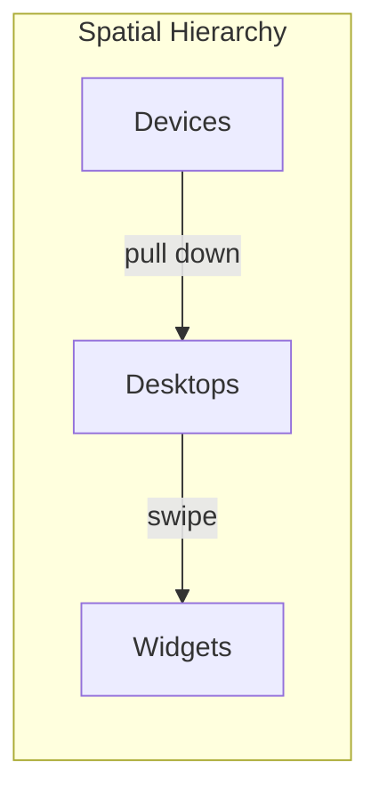
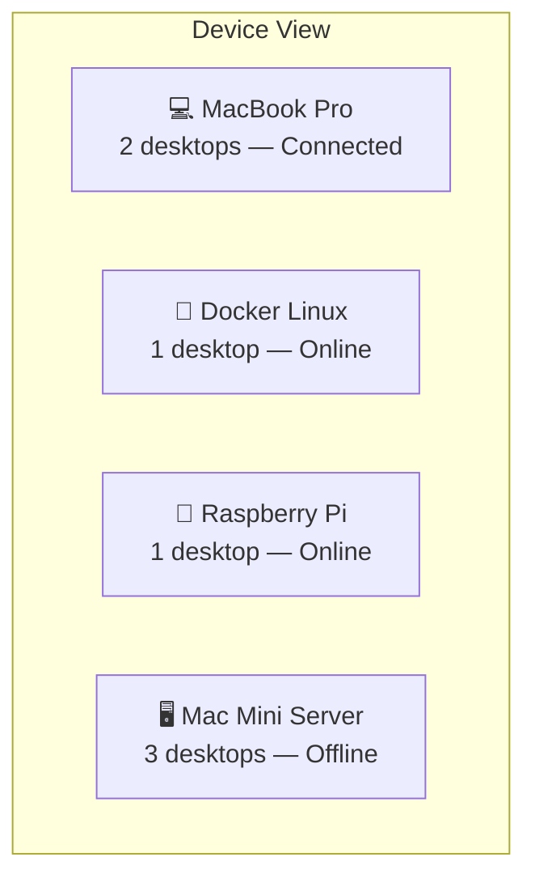
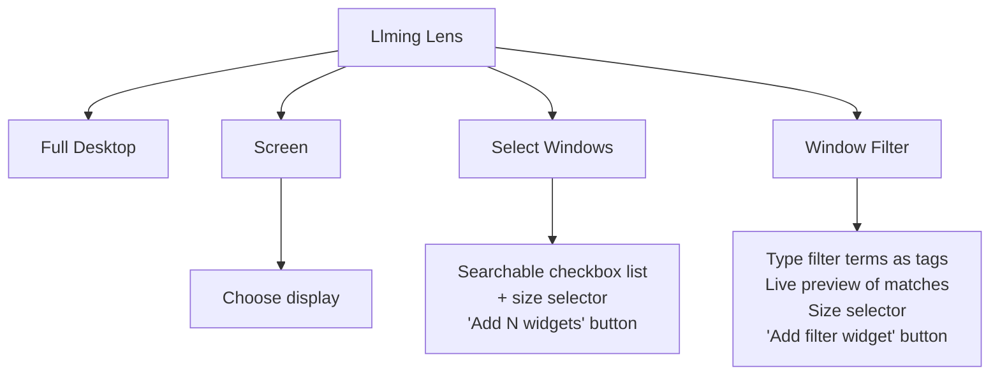
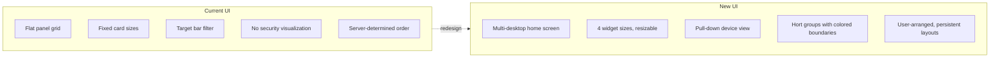
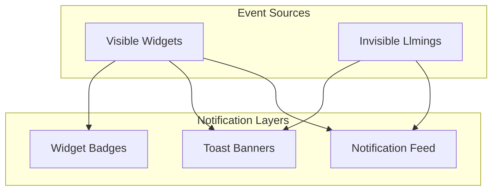

# New UI Concept — Widget Home Screen

!!! note "Status: Design Phase"
    This document describes the target UI architecture for the openhort redesign. The [interactive mockup](../../../mockup-ui-rebuild.html) demonstrates all concepts described here. The current production UI (`index.html`) still uses the old flat-grid panel model.

## Why Rebuild the UI

The driving force behind the redesign is **data flow visibility**. When AI agents, terminals, and tools share a screen — some handling confidential data, some sandboxed, some public — users need to see at a glance which components can exchange data and which are isolated. The old UI provides no visual indication of security boundaries; the new UI encodes them into every layer of the interface through color.

Beyond security, the current UI is a **flat panel grid** — windows, terminals, and plugins all appear as equal cards in one scrollable list. This worked for a single machine with a handful of panels, but breaks down as openhort grows:

| Problem | Old UI | New UI |
|---------|--------|--------|
| **No spatial organization** | All panels in one flat list | Multiple desktops, each with a purpose |
| **No security visibility** | No indication which data zone a panel belongs to | Colored hort groups with visible boundaries |
| **No widget flexibility** | Every card is the same fixed size | 4 size options (1×1, 2×1, 1×2, 2×2), resizable |
| **Single device only** | One target's panels at a time, target bar at top | Multi-device hierarchy (pull-down device view) |
| **No customization** | Grid order determined by server | User arranges widgets freely across desktops |
| **Static thumbnails** | Screenshot + title, all identical | Live canvas rendering, sparklines, inline chat |

The new UI reimagines openhort as a **smartphone-style widget home screen** — think iOS/Android home screen meets security dashboard.

---

## Core Metaphor: Desktops, Not Lists



Three zoom levels, each with a natural gesture:

| Level | What you see | Enter | Exit |
|-------|-------------|-------|------|
| **Widgets** | One desktop's widget grid | Default view | — |
| **Desktops** | All desktops as miniature cards | Long-press page dots | Click desktop / Escape |
| **Devices** | All connected targets | Pull down from top | Click device / back |

---

## Multiple Desktops

The central organizing concept. Instead of one flat list, widgets live on **named desktops** that the user swipes between horizontally.

### Home Desktop (Desktop 0)

Always exists. Cannot be deleted or renamed. Its widgets are **auto-populated** from live state:

- Active terminals (Claude sessions, shells)
- Extensions with `autoShow` enabled
- Pinned llmings

Sorted by favorites first, then last interaction time. Home desktop widgets are **not persisted** — they're computed fresh on every load.

### User Desktops

Created by the user for specific purposes. Examples from the mockup:

- **SAP Finance** — widgets scoped to the SAP security zone (red hort group)
- **HR Dashboard** — widgets for HR systems (purple hort group)
- **DevOps** — terminals and monitors for infrastructure

User desktops persist their widget list in localStorage, keyed by device class:

```
hort-layouts-phone
hort-layouts-tablet
hort-layouts-desktop
```

Each device class gets its own layout because a 2-column phone grid looks different from a 4-column desktop grid.

### Desktop Colors (Tints)

Every desktop has a **color tint** that subtly shifts the entire background palette. 16 colors available:

| Tint | RGB Base | Use Case |
|------|----------|----------|
| Blue (default) | `20, 40, 70` | General purpose |
| Crimson | `50, 16, 20` | High-security zones (SAP, finance) |
| Green | `16, 42, 24` | Public/open data |
| Purple | `35, 18, 50` | HR, PII-sensitive |
| Amber | `45, 35, 16` | Sandboxed environments |
| Teal | `16, 42, 42` | Monitoring dashboards |
| ... | ... | 10 more tints available |

The tint affects three things:

1. **Background plasma blobs** — the animated gradient blobs shift to match the desktop color
2. **Color field canvas** — a per-pixel blended background behind the grid, computed from widget positions and their hort group colors
3. **Widget border defaults** — ungrouped widgets inherit the desktop's tint for their subtle breathing border animation

Set via right-click on empty grid area → "Desktop Color" swatch picker.

### Desktop Navigation

- **Horizontal swipe** — content follows finger in real-time, rubber-band at edges, snaps on release (20% threshold)
- **Arrow keys** Left/Right
- **Trackpad horizontal scroll** (with cooldown to prevent over-scrolling)
- **Page dots** at bottom — click snaps to nearest desktop (44px invisible tap targets)
- **Desktop overview** — long-press the dot bar for full overview

### Page Dots

Always visible at the bottom inside a frosted pill (`backdrop-filter: blur(8px)`). Home desktop's dot is slightly squared (3px border-radius vs round). Active dot is blue and scaled up.

Long-press the dot bar → radial circle animation at touch point → opens desktop overview after 400ms.

---

## Desktop Overview

Full-screen overlay showing all desktops side-by-side as miniature cards.

```
┌─────────┐  ┌─────────┐  ┌─────────┐  ┌ ─ ─ ─ ─ ┐
│  Home   │  │   SAP   │  │   HR    │  │    +    │
│ ░░░░░░░ │  │ ░░░░░░░ │  │         │  │  New    │
│ ░░░░░░░ │  │ ░░░░░░░ │  │ (empty) │  │ Desktop │
└─────────┘  └─────────┘  └─────────┘  └ ─ ─ ─ ─ ┘
   Home        SAP Finance   HR Dash       + New
```

Each card shows **real shrunken content** — rendered at viewport size and CSS-scaled down with `transform: scale()`. Active desktop highlighted with blue border. Widget animations are disabled inside overview cards for performance.

The "New Desktop" card has a dashed border and `+` icon. Click to create, or drag a widget onto it to create and move in one action.

---

## Device View

Triggered by **pulling down** when already at the top of the page, or by scrolling up past the top.

Shows all connected targets (MacBook, Docker Linux, Raspberry Pi, NAS, etc.) as full-sized cards with:

- Device icon (laptop, server, CPU, etc.)
- Device name
- Connection status (green dot = connected, grey = offline)
- Desktop count per device

Offline devices are greyed out (45% opacity) and not clickable.



---

## Widget System

### Sizes

Widgets span CSS grid cells in 4 combinations:

| Size | Columns × Rows | Use Case |
|------|----------------|----------|
| `1×1` | 1 col, 1 row | Compact: clock, stats, single window |
| `2×1` | 2 cols, 1 row | Wide: desktop preview, chat, filters |
| `1×2` | 1 col, 2 rows | Tall: Claude terminal, code sessions |
| `2×2` | 2 cols, 2 rows | Large: full dashboards |

### Responsive Grid

Columns are computed dynamically based on viewport width:

```
cols = max(2, floor((viewportWidth - 2×padding + gap) / (cellWidth + gap)))
```

With `cellWidth = 280px`, `gap = 14px`, `padding = 20px`:

| Screen | Columns | Row Height |
|--------|---------|------------|
| Phone portrait | 2 | 180px |
| Phone landscape / small tablet (≥640px) | 3 | 190px |
| Desktop (≥1024px) | 4 | 190px |
| Large desktop | 5+ | 190px |

Grid is centered with `max-width: 1200px` and `justify-content: center`.

### Widget Types

| Type | Default Size | Content |
|------|-------------|---------|
| `terminal` | 1×1 (1×2 for Claude) | Monospace output, state indicator (thinking/idle), idle timer |
| `extension` | 1×1 | Canvas thumbnail with live data (sparklines, gauges, counters) |
| `extension-sub` | 1×1 | Sub-element of a llming: individual window, sensor, room |
| `quick-chat` | 2×1 | Inline chat with message bubbles + input field |
| `clock` | 1×1 | Time display + uptime counter |

### Widget Visual Design

Every widget card has:

- **Background:** `#111827` (surface color)
- **Border:** 1px solid, with a **6-second breathing animation** — the border subtly brightens and fades
- **Border radius:** 14px
- **Hover:** animation pauses, outer glow appears (`box-shadow: 0 0 25px`), border brightens
- **Label bar** at bottom with icon + title
- **Press feedback:** `transform: scale(0.97)` on click/tap

The border color and glow color change based on the widget's **hort group assignment** (see below).

### Centered Coordinate System

Widget positions use a **centered coordinate system** where column 0 is the center of the screen. This means widgets maintain their relative position to the center regardless of how many columns the screen can display. On a 2-column phone, the grid contracts around center; on a 4-column desktop, it expands — but widgets stay spatially consistent.

The `colOffset` (half the column count) maps between centered coordinates and CSS grid column numbers.

---

## Hort Groups — The Reason for the Redesign

The entire color system exists for one purpose: **making data flow boundaries visible so users can verify isolation at a glance**.

When multiple AI agents, terminals, and tools share a screen — some with access to confidential SAP data, some sandboxed, some on the public internet — the critical question is always: *which of these can talk to each other, and where is my data allowed to flow?*

In the old UI, this is invisible. The MCP bridge enforces isolation in the backend, but the user has no way to see it. You have to trust the configuration. The new UI solves this by encoding security zones into color — every pixel of the interface tells you what zone you're looking at.

### What Are Hort Groups?

Each hort group represents a **data flow boundary** — a set of permissions, network restrictions, and information flow policies. Defined in `hort-config.yaml`, enforced by the MCP bridge (see [Wiring Model](../security/wiring-model.md)). The new UI makes these boundaries **visible** through color so you can answer "can this widget see that widget's data?" without reading config files.

### The Five Default Groups

| Group | Color | Tint | Icon | Description |
|-------|-------|------|------|-------------|
| **Local** | Blue `#3b82f6` | Blue | `ph-house` | Local machine, no restrictions |
| **Sandboxed** | Amber `#f59e0b` | Amber | `ph-shield-warning` | Container-isolated, limited network |
| **SAP Finance** | Red `#ef4444` | Crimson | `ph-lock` | Confidential — no network out, no email |
| **Public** | Green `#22c55e` | Green | `ph-globe` | Public data only, unrestricted output |
| **HR Systems** | Purple `#a855f7` | Purple | `ph-users` | PII — no logging, no external sharing |

### How Groups Appear in the UI

Hort groups manifest in three visual layers:

#### 1. Widget Border Color

Widgets assigned to a hort group get that group's color as their border. The breathing animation uses the group's tint RGB values for the glow. Ungrouped widgets use the desktop's default tint.

```css
/* Grouped widget: amber border with amber glow */
border-color: #f59e0b99;
--rest-glow: 0 0 30px rgba(180, 140, 64, 0.45);
--hover-glow: #f59e0b;

/* Ungrouped widget: inherits desktop tint */
border-color: #1a3050;
--rest-glow: 0 0 30px rgba(80, 160, 280, 0.4);
```

#### 2. Color Field Background

Behind the widget grid, a `<canvas>` renders a per-pixel distance-weighted color field. Each widget's position projects its hort group's color onto a low-resolution canvas (160px wide), with soft rounded-rect gradients and glow layers. The result is a subtle, organic background that shifts color based on what security zones are present on the desktop.

The canvas is re-rendered whenever:

- Widget hort assignments change
- Desktop tint changes
- Active desktop switches
- Window resizes

Screen edges blend to near-black (`rgb(4, 6, 12)`) for a natural vignette effect.

#### 3. Connection Dots in Widget Labels

Widgets that bridge multiple hort groups (e.g., a chat widget connected to both Sandboxed and SAP) show small colored dots in their label bar — one per connected group. This makes cross-zone data flows visible.

```
┌──────────────────────────┐
│  [chat messages]         │
│  ...                     │
│  💬 Chat    🟡 🔴        │  ← dots show Sandboxed (amber) + SAP (red)
└──────────────────────────┘
```

### Assigning Hort Groups

Right-click a widget → the context menu shows a "Hort" section listing all available groups. Select one to assign, or "None" to clear.

Desktops can also have a **default hort group** — all widgets on that desktop inherit it unless individually overridden. The SAP Finance desktop, for example, defaults all its widgets to the `sap` group.

### Reading the Screen — A Worked Example

Consider the Home desktop in the mockup. Without opening any settings or reading any config:

1. **The Claude terminal glows amber** — it's running in the Sandboxed zone. It can access local files but can't reach the internet or SAP systems.
2. **The System Monitor also glows amber** — it shares data with Claude (same zone). Claude can read CPU metrics.
3. **The Desktop preview has no colored border** — it's ungrouped, inheriting the desktop's default blue. It's local-only.
4. **The Chat widget has two dots: amber + red** — it bridges the Sandboxed and SAP zones. This is a deliberate cross-zone connection. Data typed here could reach both zones. This is the kind of thing that deserves visual attention.
5. **The Network and Clipboard widgets glow green** — Public zone. Their data can flow anywhere, which is fine because it's not sensitive.
6. **The entire background subtly shifts** from amber (where the sandboxed widgets are) to green (where the public widgets are), with blue in between. The color field makes zone clusters visible even at a distance.

Now swipe to the SAP Finance desktop:

- **Everything is red.** Every widget — terminal, chat, metrics — is in the SAP zone. The background is crimson. You can see in an instant that this is a sealed environment. No data leaves.
- **If someone accidentally added a Public widget here**, it would glow green against the red background — an immediate visual anomaly that says "this doesn't belong."

This is the core value proposition: **security boundaries you can see, not just trust.**

---

## Adding Widgets

Two entry points:

### 1. FAB Button (Floating Action Button)

A 48px circle fixed to the bottom-right corner of the screen. Dark gradient background (`#162236` → `#1e3a5f`), solid border (`#3a5a80`), inner highlight bevel. Opens the Widget Catalog on tap.

- **Position:** fixed, `bottom: 12px; right: 12px`, z-index 20 (above bottom bar gradient)
- **Always visible** except in edit mode
- **No collision:** the widget grid has a 60px spacer at the end, so when scrolled to the bottom the FAB sits in clear empty space below all widgets
- **On hover:** border brightens, subtle blue glow

### 2. Right-Click / Long-Press Empty Area

Context menu at cursor position with:

- **Widget Catalog** (top item, bold, blue)
- Spawn Claude, New Terminal, Add Screen
- **Recent** — last 4 widget types added (builds up with use)
- **Desktop Color** — 16 tint swatches
- **Edit layout** — enters edit mode

### Widget Catalog (Full Picker)

Bottom-sheet modal (phone) or centered modal (desktop) with search bar. Three categories:

- **Quick Actions** — Spawn Claude, New Terminal
- **Llmings** — each with drill-down for sub-widgets (caret `>` indicator). E.g., System Monitor → CPU Chart, Memory, Disk, Temperature
- **Built-in** — Quick Chat, Clock

### Llming Lens Flow

Special multi-step flow for adding screen capture widgets:



The **Window Filter** is particularly powerful: type multiple terms as tags (e.g., "Teams" + "Slack"), see a live preview of matching windows, and create a dynamic widget that auto-shows matching windows as they appear.

---

## Edit Mode

### Entering Edit Mode

- Long-press any widget (500ms, cancels if moved >8px)
- Right-click empty area → "Edit layout"

### Visual Feedback

All widgets wiggle (`animation: wiggle 0.25s infinite alternate`). Delete badges (×) appear top-left. Size labels appear bottom-right (e.g., "1×2").

### Resize

Drag handles appear on the right and bottom edges of each widget:

- **Right edge** → widen/narrow (toggles between 1 and 2 columns)
- **Bottom edge** → heighten/shorten (toggles between 1 and 2 rows)

30px drag threshold to commit the resize.

### Drag-and-Drop

Widgets are draggable in edit mode. A **grid-aligned ghost** (dashed blue border) shows where the widget will land. The ghost uses CSS grid placement for pixel-perfect alignment. Red ghost = overlap detected, drop rejected.

### Bottom Bar in Edit Mode

The bottom bar splits into two zones:

```
┌─────────────────────────────────┬──────────┐
│  🔵 Move to desktop (80%)       │  🔴 🗑  │
│  (drag here → desktop overview)  │  (20%)  │
└─────────────────────────────────┴──────────┘
```

- **Blue zone (left 80%)** — drag a widget here to open the desktop overview and drop onto any desktop
- **Red zone (right 20%)** — drag here to delete

---

## Background Visual Effects

### Plasma Blobs

Three independent CSS gradient blobs behind the grid, animated with different speeds:

| Blob | Size | Speed | Motion |
|------|------|-------|--------|
| `::before` | 70% | 12s | Drift + scale (1.0–1.1) |
| `::after` | 60% | 16s | Counter-drift + scale (0.95–1.08) |
| `.plasma-blob::before` | 50% | 20s | Drift + scale + rotate (±5°) |

All blobs use `filter: blur(50-60px)` for a soft, ambient effect. Colors come from the desktop tint's CSS custom properties (`--plasma1`, `--plasma2`, `--plasma3`).

### Color Field Canvas

A `<canvas>` element positioned behind the grid on each desktop page. Renders at 160px wide (low resolution) and stretched to fill, creating a naturally blurred effect. Algorithm:

1. Fill with near-black border color
2. For each widget, project a soft rounded rect at the widget's position using its hort group's RGB values
3. Apply multiple glow layers (5 levels, exponential falloff) for soft edges
4. Solid core in the center

The canvas re-renders on widget changes, desktop switches, and window resizes.

---

## Navbar

Minimal: `[☰] [OpenHORT] [Desktop name]`

| Element | Behavior |
|---------|----------|
| **Hamburger** | Opens nav drawer |
| **OpenHORT** | Logo, gold `#e8b930`, 17px italic bold |
| **Desktop name** | Click to rename (user desktops only) |

The navbar is deliberately stripped to essentials. No action buttons, no status indicators, no viewer counts — those belong in the drawer or as widgets. The navbar's job is navigation, nothing else. Adding widgets is handled by the FAB button (bottom-right) and the context menu (right-click / long-press).

**Border:** 2px solid `var(--border)` at the bottom. No box-shadow — shadows don't respect widget rounded corners and create artifacts. The hard border line is the separator.

## Nav Drawer

Deliberately minimal — only things that don't belong on the desktop itself:

- **Horts** — bold, navigates to Home desktop
- **Search** — universal search across llmings, windows, and actions (with type labels in results)
- **Settings** — opens settings (includes logout)
- **Help** — documentation links

No llming list (use Widget Catalog), no desktop list (use dots), no connector list, no quick actions (use `+` button).

---

## Widget Data Model

```javascript
{
  id: 'w_abc123',           // unique widget ID
  type: 'terminal',         // terminal | extension | extension-sub | quick-chat | clock
  extId: 'system-monitor',  // extension ID (null for terminals)
  subId: 'tmux:claude',     // sub-element ID
  size: '1x1',              // grid span: 1x1, 2x1, 1x2, 2x2
  order: 0,                 // sort position (for auto-flow)
  pos: {c: -1, r: 0, w: 1, h: 2},  // centered grid position (optional)
  hpiort: 'sandboxed',      // hort group assignment (null = inherit desktop default)
  hortConnections: ['sandboxed', 'sap'],  // cross-zone bridges (shown as dots)
  config: {},               // widget-specific configuration
  c: {                      // display config
    title: 'System',
    iconClass: 'ph ph-chart-line-up',
    iconColor: 'var(--purple)',
    state: 'thinking',      // terminal state
    idle: 12,               // idle seconds
    output: '$ ...'         // terminal output preview
  }
}
```

---

## Gesture Reference

| Gesture | Context | Effect |
|---------|---------|--------|
| **Swipe left/right** | Viewport | Switch desktop (12px lock threshold, 20% commit threshold) |
| **Pull down** | At top of page | Open device view (80px threshold, 40% damping) |
| **Scroll wheel up** | At top | Instant device view trigger (`deltaY < -30`) |
| **Horizontal scroll wheel** | Viewport | Switch desktop (20px threshold, 300ms cooldown) |
| **Tap widget** | Widget | Select (first tap), open (second tap) |
| **Long-press widget** | Widget (500ms) | Enter edit mode |
| **Long-press empty area** | Grid (500ms) | Open context menu |
| **Long-press page dots** | Dot bar (400ms) | Open desktop overview (with radial circle animation) |
| **Right-click widget** | Widget | Hort group assignment + remove |
| **Right-click empty area** | Grid | Widget catalog + desktop color + edit layout |
| **Drag widget** | Edit mode | Reorder / move to desktop / trash |
| **Drag right edge** | Edit mode | Resize width (1↔2 columns) |
| **Drag bottom edge** | Edit mode | Resize height (1↔2 rows) |

---

## Comparison: Old vs New



| Aspect | Current UI | New UI |
|--------|-----------|--------|
| **Layout** | Single scrollable grid | Multiple swipeable desktops |
| **Card sizes** | Fixed (all same) | 1×1, 2×1, 1×2, 2×2, user-resizable |
| **Device switching** | Target bar at top | Full-screen device view (pull-down) |
| **Security** | Invisible | Colored hort groups, border glow, connection dots, color field background |
| **Organization** | Server order, group filter | User-arranged, per-desktop, drag-and-drop |
| **Adding panels** | `+` button → dialog | 3 entry points: navbar `+`, context menu, ghost card, widget catalog with drill-down |
| **Background** | Flat dark | Animated plasma blobs + per-desktop color tint + per-widget color field |
| **Edit mode** | None | Wiggle, resize handles, drag-to-reorder, desktop overview drop zones |
| **Persistence** | None (server state) | localStorage per device class (phone/tablet/desktop) |
| **Widget content** | Screenshot thumbnail | Live sparklines, inline chat, state indicators, canvas rendering |

---

## Notifications & Invisible Llmings

Not every llming has a widget on a desktop. Background services — a backup monitor, a security scanner, an update checker, a price watcher — run silently until they have something to say. The notification system makes both visible widgets and invisible llmings capable of surfacing events.

### Three Notification Layers



#### Layer 1: Widget Badges

Visible widgets show a **notification dot or count badge** directly on the card — like an iOS app badge. The badge appears in the **top-left corner** (opposite the icon badge in top-right) to avoid collision.

| Severity | Badge Style | Example |
|----------|------------|---------|
| **Urgent** | Red pulsing dot (8px) | Motion detected, workflow failed |
| **Attention** | Amber dot with count | 3 unread emails, Claude needs input |
| **Info** | Blue dot | Backup complete, update available |

**Rules:**
- Badge clears when the detail card is opened (mark-as-read on view)
- Count badges show numbers 1-99, then "99+" 
- The badge inherits `--widget-accent` for its color when in a hort group, otherwise uses severity color
- On smartphones: badges must be at least 20px diameter to be tappable as a quick-dismiss target

#### Layer 2: Toast Banners

Temporary notifications that slide in from the top, auto-dismiss after 4 seconds. Used for real-time events that need immediate awareness without requiring action.

```
┌──────────────────────────────────┐
│ 🔴 Front Door  Motion detected  │  ← slides in from top
│         3 seconds ago            │
└──────────────────────────────────┘
```

**Design:**
- Full-width banner, max-width 400px, centered on phone
- Dark surface background with left color stripe matching the source widget's identity color
- Source icon (20px) + title + message on one line
- Auto-dismiss: 4s for info, 8s for attention, sticky for urgent (requires manual dismiss)
- Tapping the toast opens the source widget's detail card
- Max 2 toasts stacked — older ones compress to a count badge ("2 more")
- Toasts respect Do Not Disturb: when DND is active, only urgent toasts appear

**Smartphone behavior:**
- When the app is in the foreground: toast banner inside the app
- When backgrounded: native push notification via the connector (Telegram bot, native app, or PWA push)
- Lock screen: shows as a grouped notification per hort group (security zone separation even in notifications)

#### Layer 3: Notification Feed

A scrollable list of all recent notifications, accessible from the nav drawer → "Notifications" item, or by pulling down on the Home desktop.

**Design:**
- Each notification is a card: source icon + title + message + timestamp + severity dot
- Grouped by time: "Now", "Earlier", "Yesterday"
- Swipe-to-dismiss on mobile
- "Clear all" button at the top
- Unread count badge on the drawer's Notifications item

### Invisible Llmings

Llmings without a widget on any desktop. They run as background services and communicate exclusively through notifications.

**How they surface:**

1. **Toast banners** — their primary channel. An invisible llming can push toasts at any time.

2. **Phantom widgets** — when an invisible llming has a persistent state worth showing (not just a one-time event), it can temporarily inject a **phantom widget** into the Home desktop. This appears with a subtle fade-in animation and a dashed border (distinguishing it from user-placed widgets). The phantom disappears when the state clears or the user dismisses it.

    Example: A backup llming normally runs invisibly. When a backup fails, it injects a phantom 1×1 widget showing the failure status. When the user retries and it succeeds, the phantom fades out.

3. **Notification feed** — all events from invisible llmings appear here, tagged with the llming's icon and name.

4. **Drawer indicator** — the nav drawer shows a section "Background" listing all invisible llmings with status dots (green = healthy, amber = needs attention, red = error).

### Notification Data Model

```javascript
{
  id: 'notif_abc123',
  source: 'cameras',           // llming ID (widget extId or invisible llming ID)
  sourceIcon: 'ph-fill ph-security-camera',
  sourceColor: '#ef4444',
  severity: 'urgent',          // 'info' | 'attention' | 'urgent'
  title: 'Motion detected',
  message: 'Front Door camera',
  timestamp: 1712700000000,
  read: false,
  hpiort: 'default',           // hort group — notifications inherit the source's zone
  action: {                    // optional — what happens when tapped
    type: 'open-detail',
    widgetExtId: 'cameras'
  }
}
```

### Smartphone-Specific Considerations

| Concern | Solution |
|---------|----------|
| **App backgrounded** | Push via Telegram bot, native app bridge, or PWA service worker |
| **Lock screen** | Grouped by hort group — SAP notifications never mixed with Home notifications |
| **Battery** | Notification polling uses the existing WebSocket connection, no additional network |
| **Haptics** | Urgent: strong vibration. Attention: gentle tap. Info: silent |
| **Sound** | Per-llming configurable. Default: system notification sound for urgent only |
| **DND / Focus modes** | Respect OS-level DND. Allow per-hort-group DND (mute Home but keep SAP) |
| **Glanceable** | Badge counts visible on app icon (PWA badge API / native bridge) |
| **Rich notifications** | Camera motion: include a snapshot frame. Email: show sender + subject. Claude: show last output line |

### Cross-Zone Notification Rules

Notifications respect hort group boundaries:

- A notification from the SAP zone **never** shows content preview when the device is in a public context (lock screen, shared screen)
- Notifications from isolated zones show only the source name and severity, not the message content, unless the device is authenticated to that zone
- The notification feed can be filtered by hort group — "show only Home notifications" or "show only SAP"
- Phantom widgets inherit their source llming's hort group and get the corresponding border color

---

## Design Rules

Mandatory constraints for all widget UI development. These rules ensure the UI feels alive, readable, and consistent across devices. Every widget should look like a premium product — as if this were our main business.

### Typography

- **Minimum font size on widgets:** 14px for primary text, 12px for secondary. Timestamps may use 10px.
- **Minimum font size in detail cards:** 14px for body text, 12px for labels and secondary info.
- **Terminal state text:** at least 16px for state labels like "THINKING" or "IDLE", with gradient background.
- **Hero numbers:** key metrics (CPU %, unread count, temperature) should be 24–36px, bold, instantly readable at arm's length.
- **Monospace text** (terminal output, code snippets): 10px minimum, always in a dark rounded container with padding.

### Touch & Interaction

- **Touch targets:** minimum 44×44px for all interactive elements (buttons, toggles, tappable cards). Use invisible padding (`::before` pseudo-elements) if the visual element is smaller.
- **Icons over text:** prefer Phosphor Fill variants (`ph-fill`) for more visual weight. Use text labels only when the icon's meaning would be ambiguous.
- **Tap to open:** single tap on any widget opens its detail card (smartphone-sized modal with full controls).
- **No JavaScript dialogs:** never use `alert()`, `confirm()`, or `prompt()`. Use in-UI modals or toast notifications.
- **Big toggles:** light switches, feature toggles etc. must be at least 48px wide. Use the `.detail-tgl` class pattern (48×28px pill with sliding dot).

### Widget Icon Badge

Every widget has a **solid icon badge** in the top-right corner that serves as identity marker and settings handle.

**Specifications:**

- **Size:** 31×31px rounded rect
- **Position:** `top: -2px; right: -2px` (overlaps widget border, flush with corner)
- **Corner radius:** top-right matches widget (14px), bottom-left 10px, others 0
- **Background:** solid `#0e1525` (no transparency — must fully occlude content behind it)
- **Border:** 1px solid `var(--border)` on left and bottom edges only (inner edges)
- **Icon size:** 22px, Phosphor icon or inline SVG
- **Opacity:** 65% at rest, 90% on hover
- **Color:** always `--widget-icon-color` (the widget's own identity color, never the hort group color)

**Collision avoidance:** no widget content may overlap the icon badge area (top-right 31×31px). Elements near the top-right (badges, pills, labels) must have `margin-right: 28px` or be repositioned.

### Two-Color System: Identity vs Security

Every widget has two independent color channels:

| Channel | CSS Variable | Controls | Source |
|---------|-------------|----------|--------|
| **Identity** | `--widget-icon-color` | Icon badge color | Always the widget type's own color (never changes) |
| **Security** | `--widget-accent` | Border, pills, badges, highlights | Hort group color when assigned; widget default otherwise |

This means:
- The **icon badge** always tells you *what* the widget is (cyan = system monitor, purple = music, amber = OpenClaw)
- The **border and highlights** tell you *which security zone* it belongs to (amber border = sandboxed, red = SAP)
- A system monitor widget (cyan icon) in the SAP zone has a cyan icon but red border and red-tinted "in 23m" pills

**Widget identity colors** (`--widget-icon-color`):

| Widget | Color | Hex |
|--------|-------|-----|
| System Monitor | Cyan | `#06b6d4` |
| Network Monitor | Green | `#22c55e` |
| Clipboard | Blue | `#3b82f6` |
| LLming Lens | Light blue | `#60a5fa` |
| Now Playing | Purple | `#a855f7` |
| Calendar | Blue | `#3b82f6` |
| Email | Cyan | `#06b6d4` |
| n8n | Orange | `#ff6d00` |
| Cameras | Red | `#ef4444` |
| Energy | Green | `#22c55e` |
| Weather | Amber | `#f59e0b` |
| Code Watch | Purple | `#a855f7` |
| OpenClaw | Amber | `#f59e0b` |

**Using accent colors in widget templates:** internal highlights (pills, badges, active states, unread indicators) should use `var(--widget-accent)` so they automatically follow the security zone. Use `color-mix(in srgb, var(--widget-accent) 15%, transparent)` for tinted backgrounds.

### Widget Borders — A Core Brand Element

!!! warning "Design Principle: HORT means hard borders"
    Borders are not decoration — they are the visual identity of openhort. Every widget has a visible, deliberate border that communicates containment, zone membership, and structure. This is a control panel for machines and AI agents, not a lifestyle app. **Never remove or soften borders.**

Hard borders serve three purposes:

1. **Security communication** — the border color tells you which data zone a widget belongs to
2. **Spatial structure** — clear edges define where one widget ends and another begins, even at a glance across the room
3. **Brand identity** — the bordered grid IS the openhort look. It says "you're in control, you can see every boundary"

**Border specifications:**

| State | Border Color | Width | Hover |
|-------|-------------|-------|-------|
| **No hort group** | `#2a4a6e` (structured blue-grey) | 1.5px | Brightens to `#3d6a9a` |
| **Hort group assigned** | Hort group color, fully opaque | 2px | Brightens |
| **Desktop default group** | Hort group color at 60% opacity | 1.5px | Brightens |

**Rules:**

- Borders are always `solid` — never dashed, dotted, or gradient
- Border radius is always `14px` — consistent on every widget
- No `box-shadow` glow on widgets — borders alone provide visual definition. Glow artifacts at corners look cheap; clean hard edges look professional
- Hover only changes border color, never adds shadow
- The border must always be clearly visible against the background

### Interaction Feel

- **No wobble on tap.** Widgets must not scale down on `:active`. The press feedback comes from the detail card opening, not from the widget shrinking.
- **No box-shadow glow on widgets.** Box-shadow creates blurry artifacts at rounded corners that look cheap. Widget definition comes from borders alone.
- **No pulsing/breathing border animations** on widgets at rest. The border is static and deliberate. Only the Claude terminal "thinking" state gets a special border animation.
- **Hover:** border color brightens subtly (`#2a4a6e` → `#3d6a9a`). That's it.
- **Color field canvas** behind the grid uses radial gradients (`createRadialGradient` with `screen` compositing) for smooth organic glow. Never rectangular or banded.

### Liveness

**Every widget must have animation or live data.** Nothing static. If a widget shows data, that data must update in real-time:

| Widget | Live Element |
|--------|-------------|
| Music | Progress bar ticks every second, seekable, play/pause toggle |
| System Monitor | CPU sparkline updates every 1s (20-point history), dual sparklines (CPU + RAM) |
| Network | Download sparkline updates every 1s |
| Energy | Usage/production react to state changes (washing machine, sun), animated flow bar |
| Cameras | Looping video feeds with CSS surveillance filter, REC indicator, MOTION badge |
| Weather | Reacts to day/night state, rain warning with animated pill |
| Email | Unread count computed live, real face avatars |
| n8n | Workflow counts react to events, micro sparklines in status cards, red glow on failures |
| Code Watch | Active session shows live output, spinning purple ring, token progress bar |
| Terminal | Gradient "THINKING" label with progress bar and completion percentage |
| Calendar | Countdown pills ("in 23m"), video camera icons on meetings |
| Clipboard | Tappable cards with type icons (code/link/text) |

**All data is reactive:** state changes cascade. Washing machine ON → energy usage increases. Sunset → solar production drops and weather changes. New email → unread count increments.

### Detail Cards

Tapping any widget opens a **detail card** — a smartphone-sized modal (max-width 400px) with full interactive controls.

**Design rules for detail cards:**

- **Header:** 40px icon container + title + close button
- **Body:** scrollable, 16px padding, 12px gap between sections
- **Row items:** `.detail-row` — 52px min-height, 12px padding, rounded corners, dark background
- **Toggles:** 48×28px pill switches (`.detail-tgl`)
- **Sliders:** native range inputs styled with `.detail-slider`
- **Action buttons:** full-width, 14px font, 14px padding, rounded 12px
- **Sections:** uppercase 11px labels with letter-spacing
- **Gauges:** conic-gradient rings (`.detail-gauge`) for percentage displays

**Each widget type has its own detail card with real interactions:**

- OpenClaw: room-by-room toggles + brightness sliders + camera preview
- Now Playing: large album art, full transport controls, speaker selector
- Calendar: full event list with join-meeting buttons
- Email: inbox with real photo avatars, unread indicators
- n8n: status summary cards + workflow list with retry buttons
- Cameras: large video panels with motion badges
- Energy: solar/consumption gauges, battery ring, export earnings
- Weather: large icon, hourly forecast with condition icons, detail rows
- Code Watch: session details with output, token counts, file context
- System Monitor: CPU/RAM/SSD gauge rings + process list

### Widget Content Guidelines

**Less text, more visual.** Each widget type should follow these content rules:

- **1×1 widget:** one hero metric (big number or icon) + one supporting detail. Max 3 visual elements.
- **2×1 widget:** can show 2-3 items side by side, or one item with supporting sparkline/graph.
- **1×2 widget:** vertical layout, hero element at top, supporting details below. Good for terminals and session lists.
- **2×2 widget:** full dashboard — can combine multiple visualizations.

**Specific widget patterns:**

- **Metrics** (System Monitor, Network, Energy): big number + sparkline. No prose text.
- **Lists** (Calendar, Email, Code Watch): max 2-3 items visible. Each item is a tappable card with icon + title. Truncate aggressively.
- **Controls** (OpenClaw): 2×2 grid of room cards with large toggle switches. Warm amber glow on active rooms.
- **Media** (Now Playing): album art gradient fills the widget background. Transport controls at bottom.
- **Status** (n8n, Code Watch): colored status indicators (dots, rings, badges) at minimum 10px diameter. Failed/error states use pulsing red glow.
- **Feeds** (Cameras): video loops with CSS filter (`saturate(.4) brightness(.7) contrast(1.1)`), REC indicator, monospace labels.
- **Data** (Clipboard): stacked tappable cards filling the full widget height, each with type icon + truncated content.

### Demo Assets

Demo videos, images, and sample data live in a **separate repository** (`openhort/demo-assets`) to keep the main repo lean. The mockup references them via relative paths when available, with canvas/CSS fallbacks when files are missing.

**Current demo assets:**

| Asset | Source | License |
|-------|--------|---------|
| Camera videos (3×) | Pexels | Pexels License (free, no attribution required) |
| Face avatars (4×) | llming-docs | Project-internal |
| Phosphor Icons | phosphor-icons/web | MIT |

All third-party assets are documented in `THIRD_PARTY_LICENSES.md` with full license text.

### Layout & Spacing

- **No Quasar standard components in desktop widgets.** Quasar components (`q-btn`, `q-card`, etc.) are acceptable in detail cards and modals, but widget thumbnails must use custom lightweight markup for performance.
- **Readability:** all widget content must be readable on a smartphone held at arm's length in bright sunlight with 2 diopters correction. Test with reduced contrast and small screens.
- **Apple-style minimalism:** less is more. Whitespace is a feature, not waste. Prefer fewer, larger, more impactful elements over dense information.
- **Color field backgrounds:** the per-pixel blended canvas behind widgets should be subtle enough to enhance readability, not compete with widget content.
- **Widget padding:** 12px default padding in `.widget-thumb`. Content must not extend behind the icon badge (top-right 31×31px exclusion zone).
- **Unified experience:** desktop and smartphone must look and behave identically. No hover-only features, no desktop-only controls.

### Security Visualization

- **Hort group colors are sacred.** The five default group colors (blue, amber, red, green, purple) must never be changed or repurposed for non-security use.
- **Connection dots:** widgets bridging multiple hort groups show colored dots (8px diameter) below the icon badge — one per connected group.
- **Desktop tint:** each desktop's background plasma blobs shift color to match the desktop's default hort group, providing ambient zone awareness.
- **Color field canvas:** per-pixel distance-weighted blending behind widgets creates organic zone boundaries — widgets in the same hort group share a color region.
- **Visual anomaly detection:** a widget with a different hort group color than its neighbors should be immediately noticeable as "something different here."

### Simulation System

The mockup includes a **simulation toolbar** (collapsible, top of page) with event buttons that demonstrate reactive data cascading:

| Button | Effect |
|--------|--------|
| Claude finishes | Thinking → done, output updates |
| Motion detected | Camera motion badge, auto-clears after 8s |
| Washing ON/OFF | Energy usage 2.1 → 3.8 kW |
| Sunrise/Sunset | Solar 3.2 → 0.1 kW, weather icon/temp changes |
| New email | Adds unread email, count increments |
| Workflow fails | n8n failed count increments, red glow activates |

All state changes cascade through reactive computed properties — no manual wiring needed.
