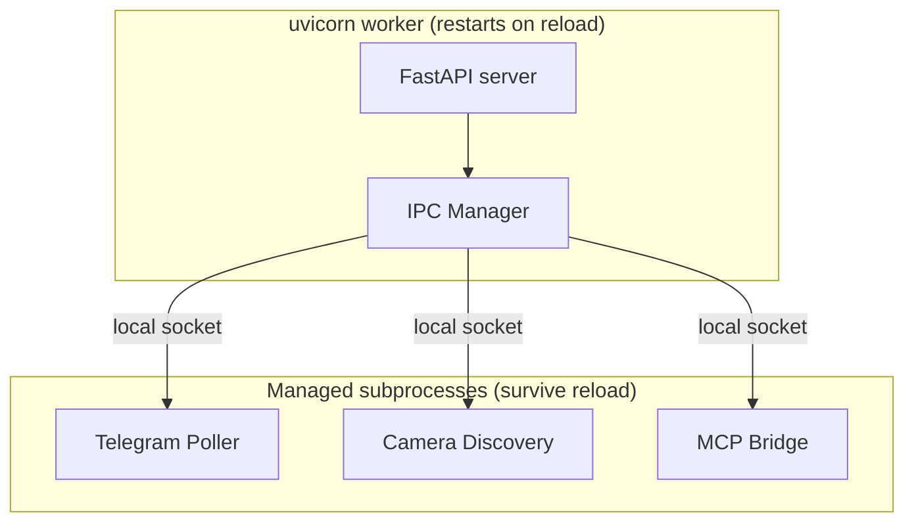
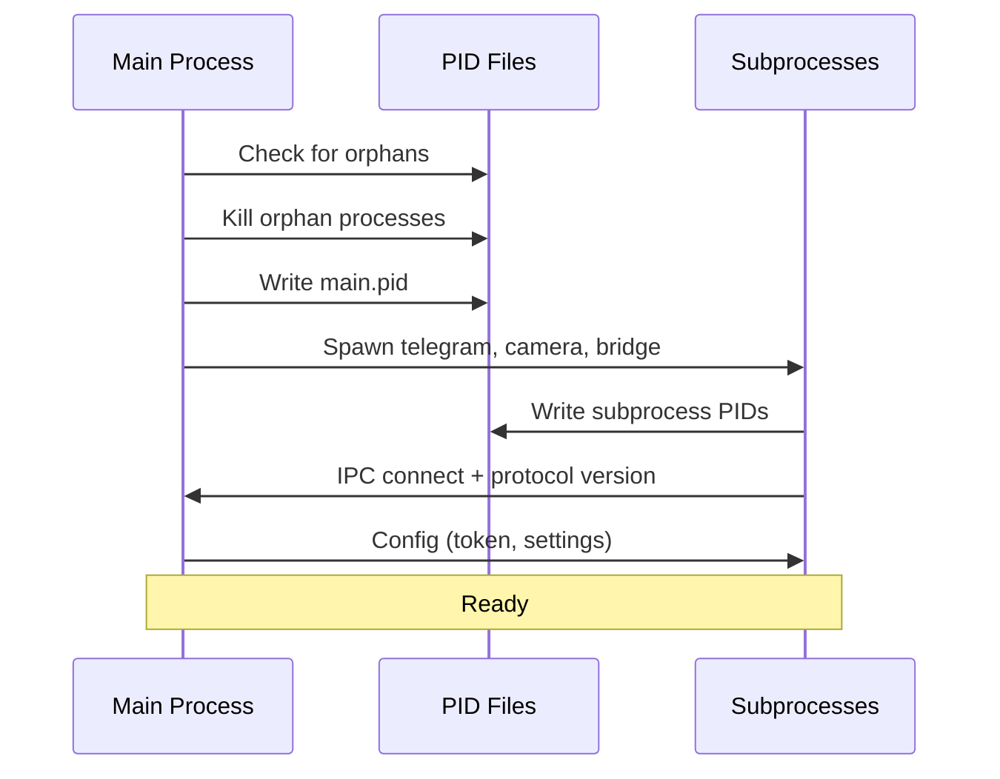
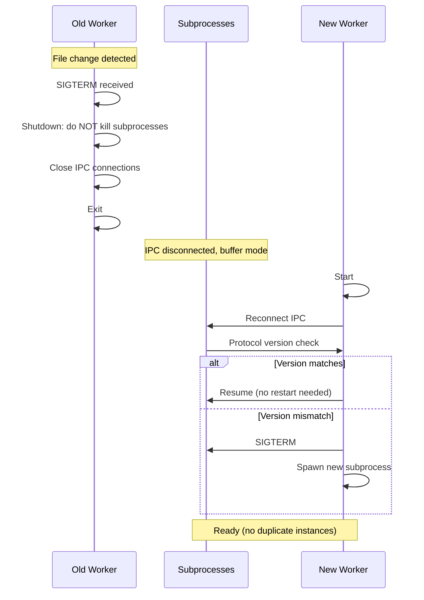
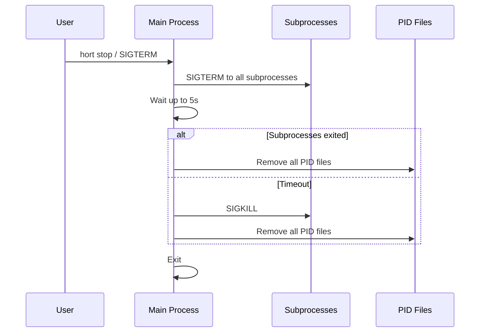
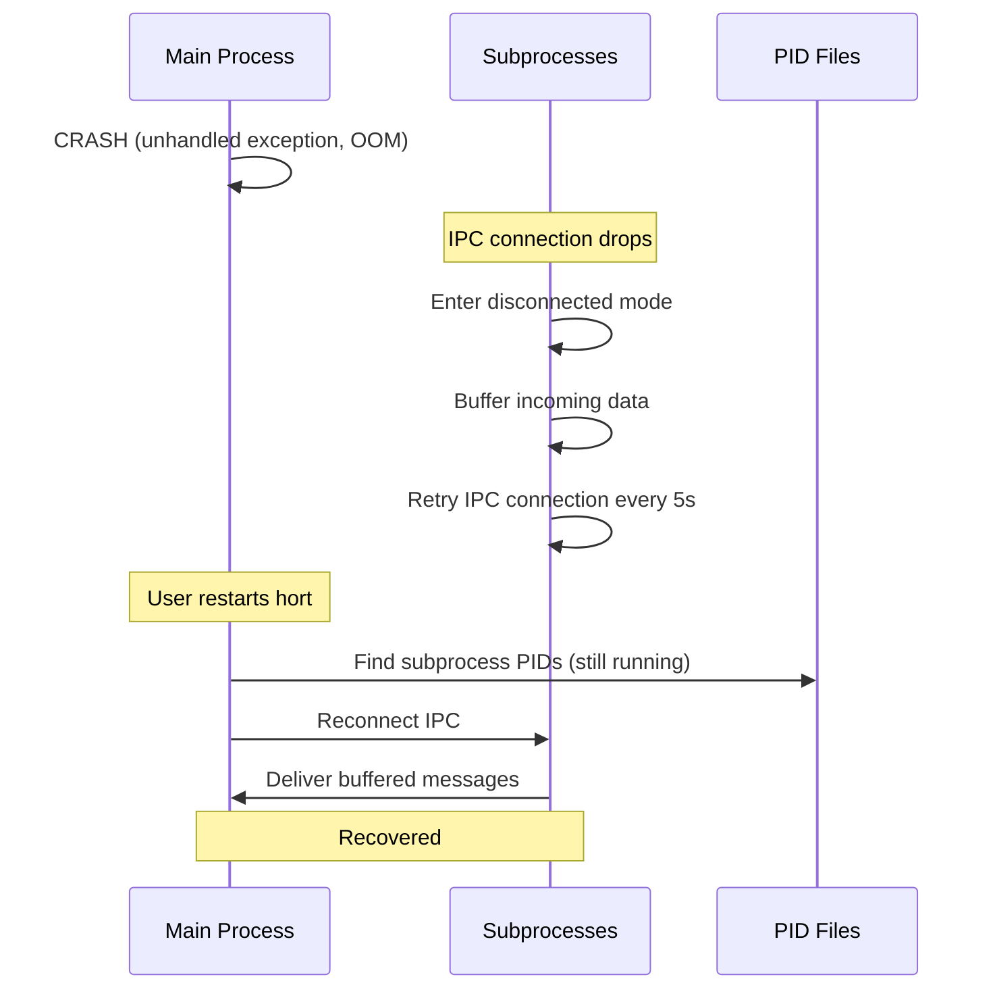
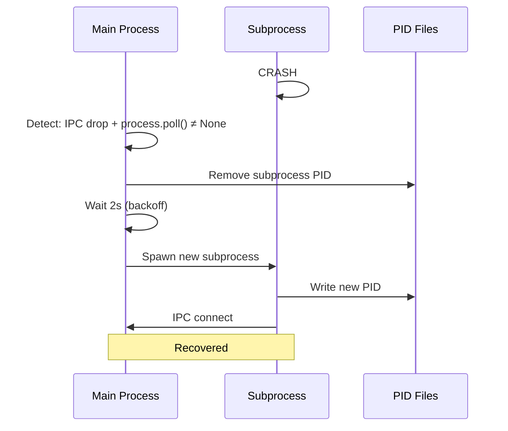

# Process Lifecycle

Llmings with background tasks (Telegram polling, camera discovery, MCP
bridge) run as **managed subprocesses** separate from the uvicorn worker.
This prevents duplication during hot reloads and ensures clean shutdown.

## Architecture



## Core Principle: Thin Subprocess, Fat Main

Subprocesses do **transport only** — they connect to external services
and forward raw data. All business logic lives in the main process.

| Subprocess | Does | Does NOT |
|-----------|------|----------|
| Telegram Poller | Connect to Telegram API, receive updates, forward to main | Handle commands, ACL, chat routing, AI calls |
| Camera Discovery | Enumerate cameras, report additions/removals | Start/stop capture, manage policies |
| MCP Bridge | Serve MCP SSE, forward tool calls to main | Execute tools, manage llming state |

**Why:** When code changes during hot reload, only the main process
restarts. Subprocesses keep running with the same transport code. Since
they don't contain business logic, they rarely need updates.

## Situations

### 1. Normal Startup



1. Main process starts
2. Checks `~/.hort/pids/` for orphan subprocesses → kills them
3. Writes `main.pid`
4. Spawns subprocesses
5. Subprocesses connect back to main via local socket
6. Version handshake on IPC connect
7. Main sends configuration (API tokens, settings)
8. System is ready

### 2. Hot Reload (code change)



1. uvicorn detects file change, sends SIGTERM to old worker
2. Old worker's shutdown handler closes IPC but does **NOT** kill subprocesses
3. Old worker exits
4. Subprocesses detect IPC disconnect → enter buffer mode
5. New worker starts
6. New worker finds existing subprocesses via PID files
7. Reconnects to their IPC sockets
8. Protocol version check:
    - **Match** → reuse, no restart, zero downtime
    - **Mismatch** → kill old, spawn new (subprocess code changed)
9. Buffered data (e.g., Telegram messages received during reload) is delivered
10. No overlap, no duplicates

### 3. Intentional Shutdown (hort stop)



1. User runs `hort stop` or sends SIGTERM
2. Main sends SIGTERM to ALL managed subprocesses
3. Waits up to 5 seconds for graceful shutdown
4. SIGKILL any that didn't exit
5. Removes all PID files
6. Main exits

**Key difference from hot reload:** intentional shutdown kills
subprocesses. Hot reload does not.

### 4. Main Process Crash



1. Main crashes (unhandled exception, OOM, SIGKILL)
2. PID file for main remains (stale)
3. Subprocesses detect IPC connection drop
4. Enter **disconnected mode**: buffer incoming data, retry connection
5. If main doesn't reconnect within 60 seconds, subprocesses exit
6. When main restarts, it finds subprocesses via PID files
7. Reconnects IPC, receives buffered data
8. No data loss for the buffer window

### 5. Subprocess Crash



1. Subprocess crashes
2. Main detects via IPC connection drop + `process.poll()` returning exit code
3. Main logs the crash
4. Waits 2 seconds (backoff)
5. Spawns a new subprocess
6. New subprocess connects via IPC
7. No manual intervention needed

### 6. Multiple hort Instances

```
$ hort start            ← starts normally
$ hort start            ← refuses: "Already running (PID 12345)"
```

1. On startup, check `~/.hort/pids/main.pid`
2. If PID file exists and process is alive → refuse to start
3. If PID file exists but process is dead → clean up, start normally
4. Same check for each subprocess

### 7. Code Compatibility After Update

```
$ git pull              ← code changes
$ hort start --dev      ← hot reload triggers
```

Each subprocess declares a protocol version. On IPC reconnect:

```json
{"type": "hello", "protocol_version": 3, "subprocess": "telegram"}
```

| Situation | Action |
|-----------|--------|
| Version matches | Reuse subprocess, zero downtime |
| Version mismatch | Kill subprocess, spawn new with updated code |
| No version (old code) | Kill subprocess, spawn new |

Protocol versions only bump when the IPC message format changes.
Transport-only subprocesses rarely need version bumps because their
IPC protocol is simple (forward raw messages).

### 8. Orphan Cleanup on Startup

```python
def cleanup_orphans():
    """Kill subprocesses from previous crashed runs."""
    pid_dir = Path("~/.hort/pids").expanduser()
    main_pid = pid_dir / "main.pid"

    # If main is alive, don't touch anything
    if main_pid.exists():
        pid = int(main_pid.read_text())
        if process_alive(pid):
            raise RuntimeError(f"Already running (PID {pid})")
        # Main is dead — clean up its subprocesses
        main_pid.unlink()

    for pid_file in pid_dir.glob("*.pid"):
        pid = int(pid_file.read_text())
        if process_alive(pid):
            os.kill(pid, signal.SIGTERM)
            time.sleep(1)
            if process_alive(pid):
                os.kill(pid, signal.SIGKILL)
        pid_file.unlink()
```

## PID File Layout

```
~/.hort/pids/
    main.pid              # uvicorn worker PID
    telegram.pid          # Telegram poller subprocess
    camera.pid            # Camera discovery subprocess
    mcp-bridge.pid        # MCP bridge subprocess
```

Each file contains the PID as plain text. Created on subprocess start,
removed on clean shutdown. Stale files are cleaned up on next startup.

## IPC Protocol

Subprocesses communicate with the main process via Unix domain sockets
at `~/.hort/ipc/{name}.sock`:

```
~/.hort/ipc/
    telegram.sock
    camera.sock
    mcp-bridge.sock
```

Messages are newline-delimited JSON:

```json
// Subprocess → Main: forward a Telegram update
{"type": "update", "data": {"message": {"text": "hello", "from": {...}}}}

// Main → Subprocess: send a response
{"type": "send", "chat_id": "12345", "text": "Hello!"}

// Handshake
{"type": "hello", "protocol_version": 1, "subprocess": "telegram"}
{"type": "hello_ack", "protocol_version": 1, "status": "ok"}
```

## Shutdown Hierarchy

```
hort stop / SIGTERM
  └─ Main process
       ├─ Close HTTP server (stop accepting requests)
       ├─ Stop all llming schedulers
       ├─ SIGTERM all managed subprocesses
       ├─ Wait 5s for graceful exit
       ├─ SIGKILL remaining subprocesses
       ├─ Stop all Docker containers (ohsb-*)
       ├─ Remove PID files
       └─ Exit

hot reload (file change)
  └─ Old worker
       ├─ Close HTTP server
       ├─ Close IPC connections (do NOT kill subprocesses)
       ├─ Do NOT stop Docker containers
       └─ Exit
  └─ New worker
       ├─ Reconnect to existing subprocesses
       ├─ Version check → reuse or restart
       └─ Ready
```

## What Changes vs Current Architecture

| Current | New |
|---------|-----|
| Telegram polling via `asyncio.create_task` in main | Separate subprocess, IPC |
| Camera discovery thread in main | Separate subprocess, IPC |
| MCP bridge as subprocess (already done) | Same, but with PID file + version check |
| Hot reload kills everything | Hot reload preserves subprocesses |
| Orphans accumulate on crash | Startup cleanup kills orphans |
| No PID files | PID files for all managed processes |
| Duplicates possible during reload | Impossible — PID file + version check |

## File Layout

```
hort/lifecycle/
    __init__.py
    manager.py          # Subprocess manager (spawn, kill, reconnect)
    ipc.py              # Unix socket IPC client/server
    pid.py              # PID file management
    protocol.py         # IPC message types + version
```
