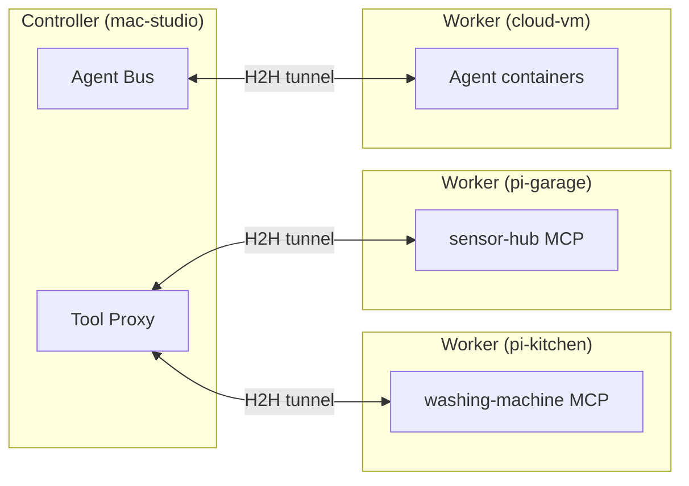
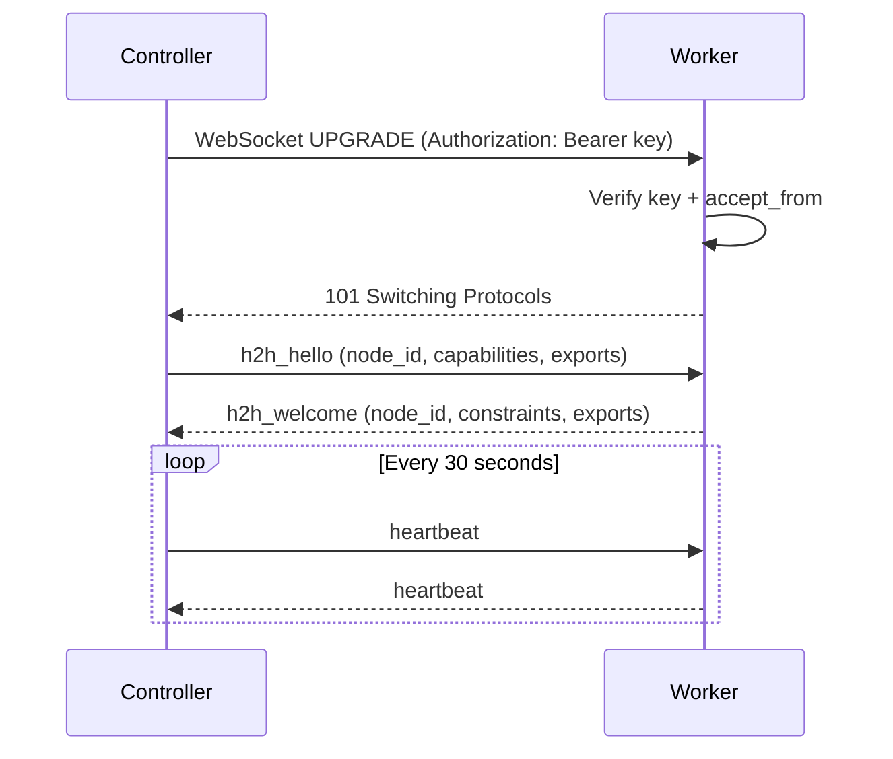
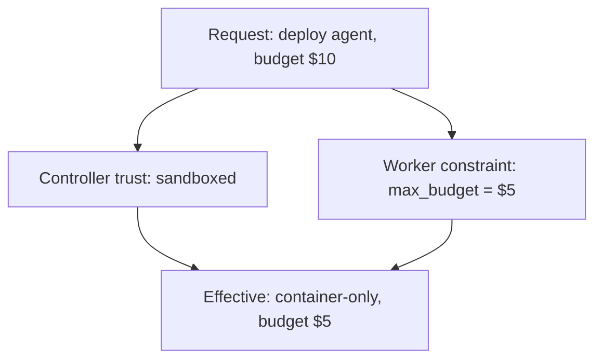
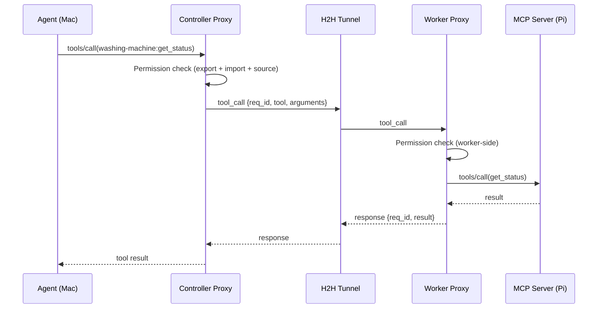
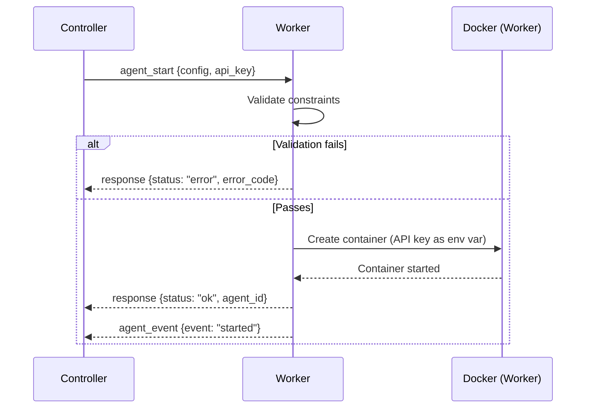
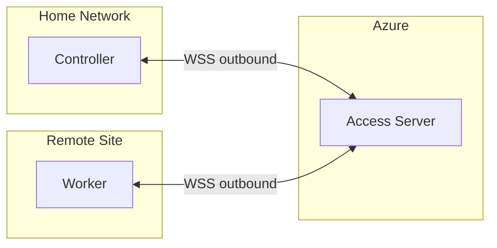
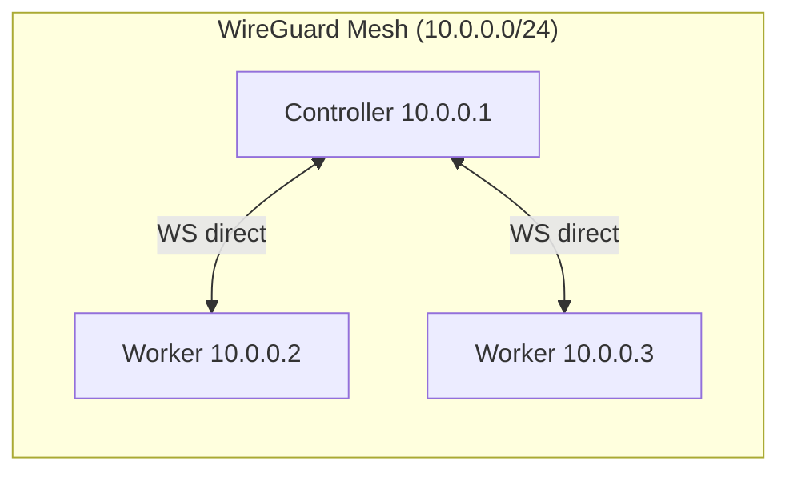
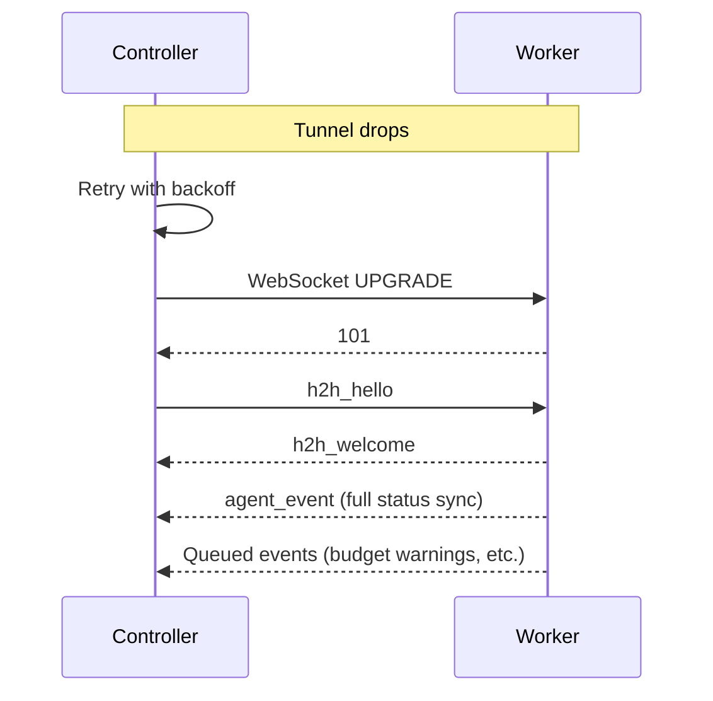

# Hort-to-Hort (H2H) Protocol

The H2H protocol defines how OpenHORT instances on different physical
machines communicate. It extends the existing
[tunnel protocol](../../guide/multi-node.md) with tool export/import
semantics, agent coordination, and a trust hierarchy.

## Overview

H2H enables multi-machine Hort clusters. A Mac Studio in your office
can invoke tools running on a Raspberry Pi in the kitchen, deploy
agents to a cloud VM, and aggregate audit logs from every node --
all through a single protocol layer.

- **Built on the existing tunnel protocol.** Reuses the WebSocket +
  JSON transport from the [access server](../../develop/access-server.md).
  No new transport -- just new message types on the same wire.
- **Tool locality is transparent.** An agent calls
  `washing-machine:get_status` the same way whether the tool is
  local or on a remote node.
- **Trust is bilateral.** Controller sets a trust level per worker.
  Worker sets local constraints. Effective permission = intersection.
- **Workers cannot control their controller.** Five independent
  layers enforce this (see [Preventing Upward Control](#preventing-upward-control)).



---

## Connection Establishment

1. Controller reads `~/.hort/cluster.yaml` to discover worker nodes
2. Controller opens a WebSocket: `ws://{worker}:{port}/api/hort/tunnel`
3. Auth header: `Authorization: Bearer <connection_key>`
4. Worker verifies key AND checks `accept_from` list for the `node_id`
5. Handshake exchange (below)
6. Both sides record each other's exports and constraints
7. Persistent bidirectional WebSocket kept alive with 30-second heartbeats

**Controller sends `h2h_hello`:**
```json
{
  "type": "h2h_hello",
  "node_id": "mac-studio",
  "hort_id": "550e8400-e29b-41d4-a716-446655440000",
  "protocol_version": "1.0",
  "capabilities": ["tool_export", "agent_management", "audit_stream"],
  "exports": [
    {"tool": "calendar", "access": {"tools": ["get_events"]}}
  ]
}
```

**Worker responds with `h2h_welcome`:**
```json
{
  "type": "h2h_welcome",
  "node_id": "pi-kitchen",
  "hort_id": "7c9e6679-7425-40de-944b-e07fc1f90ae7",
  "protocol_version": "1.0",
  "capabilities": ["tool_export"],
  "exports": [
    {"tool": "washing-machine", "access": {"tools": ["get_status", "get_remaining_time"]}}
  ],
  "constraints": {
    "max_concurrent_agents": 2,
    "max_budget_usd_per_session": 5.00
  }
}
```



!!! info "Protocol version negotiation"
    Both sides include `protocol_version`. Incompatible versions
    trigger `{"type": "error", "code": "version_mismatch"}` and
    close the WebSocket. Minor differences are tolerated using the
    lower version's feature set.

---

## Trust Hierarchy

### Controller-side trust levels

Set per worker in `cluster.yaml` under `trust_level`:

| Level | Description | What controller can do |
|-------|-------------|------------------------|
| `trusted` | Same physical LAN, under your control | Full tool export, agent deployment, file mounts, audit stream |
| `sandboxed` | Home network, less trusted device | Container-only agents, no file mounts, scoped tool access |
| `untrusted` | Cloud/remote, potentially hostile network | Container-only, no file mounts, scoped API keys, TLS required |

### Worker-side constraints

Set locally in `node.yaml`. Cannot be overridden by any controller.

| Constraint | Purpose |
|------------|---------|
| `max_concurrent_agents` | Hard limit on simultaneous agents |
| `max_budget_usd_per_session` | Spending cap per agent session |
| `accept_from` | Allowlist of permitted controller node_ids |
| `role: worker` | Prevents acting as a controller |
| `allowed_exports` | Tools this worker will export |

**Effective trust = intersection of controller's trust level AND worker's local constraints.** Controller sets `trusted` (allows file mounts) but worker has no file mount capability? Result: no file mounts.



---

## Message Types

### Controller to Worker

| Type | Purpose |
|------|---------|
| `h2h_hello` | Connection handshake |
| `agent_start` | Deploy and start an agent (includes `agent_config`, `api_key`) |
| `agent_stop` | Stop a running agent |
| `agent_status` | Query agent state (specific or all) |
| `agent_message` | Deliver a message to an agent (A2A routing) |
| `tool_call` | Invoke an exported tool (`tool`, `method`, `arguments`) |
| `tool_list` | Discover available tools |
| `export_update` | Add or revoke export declarations at runtime |
| `budget_update` | Adjust an agent's budget (can only reduce, never exceed worker cap) |
| `audit_tail` | Request recent audit log entries |
| `heartbeat` | Keepalive (every 30s) |

### Worker to Controller

| Type | Purpose |
|------|---------|
| `h2h_welcome` | Handshake response (includes constraints) |
| `response` | Response to any request (keyed by `req_id`) |
| `agent_event` | Lifecycle events: `started`, `stopped`, `budget_warning`, `budget_exceeded`, `error` |
| `agent_output` | Streamed agent output (text chunks) |
| `export_update` | Add or revoke export declarations |
| `heartbeat` | Keepalive response (includes agent status summary) |

---

## Tool Call Proxying

When an agent on Mac calls a tool hosted on Pi, the call is proxied
transparently. Both sides check permissions independently.



**Controller-side checks** (before sending): tool in worker's
declared exports, method in export's `access.tools`, agent's
[permission set](../permissions.md) allows the tool, agent's
[source policy](../source-policies.md) permits remote calls.

**Worker-side checks** (before executing): requesting `node_id`
in `accept_from`, tool in local `allowed_exports`, method in
export's `access.tools`.

!!! warning "Dual enforcement"
    A compromised controller cannot force a worker to execute
    unexported tools. A compromised worker cannot make the controller
    believe it has tools it does not have.

Either side can update exports at runtime via `export_update`
without reconnecting. Changes take effect immediately.

---

## Agent Deployment

1. Controller reads agent YAML with `node: pi-kitchen`
2. Controller resolves API key (keychain, env var, or file)
3. Controller sends `agent_start` over H2H:

```json
{
  "type": "agent_start",
  "req_id": "r1",
  "agent_config": {
    "name": "data-collector",
    "model": {"provider": "claude-code", "name": "haiku"},
    "runtime": {"memory": "512m", "cpus": 2},
    "budget": {"max_cost_usd": 2.00},
    "permissions": {"tools": {"allow": ["Bash", "Read"]}}
  },
  "api_key": "sk-ant-oat01-..."
}
```

4. Worker validates against local constraints:

| Check | Condition | Error code |
|-------|-----------|------------|
| Budget cap | `budget <= max_budget_usd_per_session` | `budget_exceeded` |
| Concurrency | `running_agents < max_concurrent_agents` | `concurrency_limit` |
| Trust level | Config compatible with trust level | `trust_violation` |
| Accept list | Controller `node_id` in `accept_from` | `unauthorized` |

5. Worker creates a Container Hort, starts the agent
6. Worker responds with `agent_id`, then emits `agent_event: started`



!!! danger "API key handling"
    The API key is passed as an environment variable to the container.
    It is **never** written to disk on the worker and **never**
    logged, even in audit logs.

---

## Preventing Upward Control

Workers cannot control their controller. Five independent layers
enforce this -- compromising one is not sufficient.

1. **Role enforcement** -- `node.yaml` sets `role: worker`, disabling
   all controller endpoints. No cluster management APIs exposed.
2. **Connection direction** -- controller connects TO worker, never
   the reverse. Workers only have a WebSocket server, no client.
3. **Accept list** -- `accept_from` enumerates exact permitted
   `node_id` values. Rogue nodes are rejected even with valid keys.
4. **Worker-side limits** -- budget caps, concurrency limits, and
   export restrictions are local. `budget_update` can only reduce,
   never exceed the worker's cap.
5. **No file access** -- workers never mount the controller's
   filesystem, even at `trusted` level.

### Blast radius of a compromised worker

| Asset | Exposure | Mitigation |
|-------|----------|------------|
| API keys in containers | Extractable from env vars | Scoped keys with spending limits, rotate regularly |
| Tool call results | Readable in transit (memory only) | No persistent storage of results on worker |
| Other workers | None | Workers have no knowledge of each other |
| Controller filesystem | None | Never mounted on workers |
| Controller API keys | None | Only per-agent scoped keys sent |
| Cluster topology | Controller `node_id` and IP visible | Rotate connection keys, remove from `cluster.yaml` |

!!! tip "Response to compromise"
    Remove from `cluster.yaml`, rotate API keys sent to that worker,
    revoke the connection key, review audit logs. The tunnel closes
    after the 90-second heartbeat timeout.

---

## NAT Traversal

### Option A: Access Server Relay

Both nodes connect outbound to the
[access server](../../develop/access-server.md). The relay routes
H2H messages by `node_id` without inspecting content.



No firewall changes needed. TLS between each node and relay. Adds
latency. Subject to Azure's 64KB message limit (chunking handled).

### Option B: WireGuard VPN

All nodes join a WireGuard mesh with stable private IPs. Controller
connects directly to workers. Lower latency, no relay dependency,
but requires WireGuard setup on each node.



---

## Reconnection and Resilience

If the tunnel drops, the controller retries with exponential backoff:
1s, 2s, 4s, 8s, then 60s max. Running agents **continue executing**
on the worker during disconnection -- worker-side budget limits
enforce caps independently.

Agent events are queued for delivery when the tunnel is restored
(up to 1000 messages or 1 MB; oldest dropped on overflow).



!!! info "Idempotent agent_start"
    If `agent_start` targets an already-running agent (e.g., after
    reconnect), the worker responds `{"already_running": true}`
    instead of starting a duplicate.

---

## Security

### Wire-level security

| Context | Encryption | Policy |
|---------|------------|--------|
| LAN (trusted) | None by default | Recommend TLS or WireGuard |
| LAN (sandboxed) | None by default | Strongly recommend TLS |
| Cloud / untrusted | **TLS required** | Enforced in code |
| Via Access Server | TLS to relay | Relay cannot decrypt H2H payload |

!!! warning "LAN without TLS"
    Unencrypted H2H on a LAN means any device on the network can
    sniff tool arguments, API keys, and agent output. Acceptable
    only on isolated, physically secured networks.

### Protocol-level security

| Mechanism | Detail |
|-----------|--------|
| Request correlation | Every request has `req_id`. Responses reference it. Duplicate `req_id` rejected. |
| Heartbeat timeout | 90s without heartbeat = node offline, connection closed |
| Rate limiting | 100 messages/second per tunnel, excess dropped |
| Message size limit | 64 KB per message (Azure compat), chunking for larger payloads |
| Budget enforcement | Worker-side caps are authoritative, cannot be exceeded remotely |
| Connection keys | 32-byte URL-safe tokens, per node, never logged |

For high-security deployments, mutual TLS (mTLS) adds certificate
validation on top of connection keys.

### Attack vectors

| Attack | Mitigation |
|--------|------------|
| Key interception on LAN | TLS or WireGuard |
| Compromised worker steals API key | Scoped keys with spending limits, never on disk |
| Rogue node joins cluster | Per-node connection keys, manual out-of-band exchange |
| Man-in-the-middle on relay | TLS to access server (enforced for untrusted) |
| Worker spoofs another worker | Per-node keys bound to node_id |
| DDoS from compromised worker | Rate limit: 100 msg/s per tunnel |
| Replay attack | `req_id` uniqueness within session |
| Budget override attempt | Worker-side cap is authoritative, update clamped to local max |

---

## Configuration Reference

### cluster.yaml (Controller)

```yaml
cluster:
  name: home-lab
  controller:
    node_id: mac-studio
    host: 192.168.1.100
    port: 8940

  nodes:
    - node_id: pi-kitchen
      host: 192.168.1.201
      port: 8940
      connection_key: "k_abc123..."
      role: worker
      trust_level: sandboxed
      capabilities:
        cpus: 4
        memory_gb: 8

    - node_id: cloud-vm
      host: relay
      relay_node_id: cloud-vm
      connection_key: "k_ghi789..."
      role: worker
      trust_level: untrusted
```

### node.yaml (Worker)

```yaml
node:
  node_id: pi-kitchen
  role: worker
  accept_from: [mac-studio]
  max_concurrent_agents: 2
  max_budget_usd_per_session: 5.00
  allowed_exports:
    - tool: washing-machine
      access:
        tools: [get_status, get_remaining_time]
  controller:
    host: 192.168.1.100
    port: 8940
    connection_key: "k_abc123..."
```

---

## Relationship to Existing Protocols

| Protocol | Purpose | H2H relationship |
|----------|---------|------------------|
| [Access Server Tunnel](../../develop/access-server.md) | Remote browser access via cloud relay | H2H reuses the same WebSocket transport and chunking. Adds new message types. |
| [Wire Protocol](wire-protocol.md) | Agent-to-controller streaming | H2H extends `agent_start/stop/message` with tool export/import semantics. |

Both protocols can coexist on the same WebSocket if a node serves
dual roles (browser access AND cluster participation).
