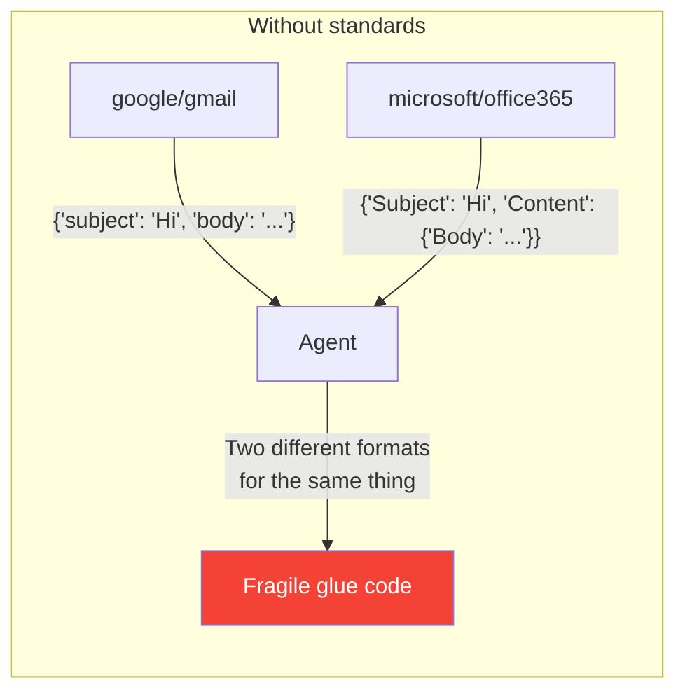
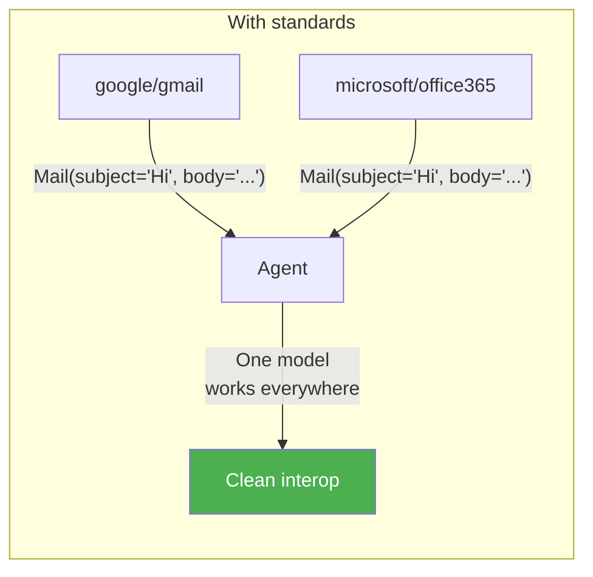
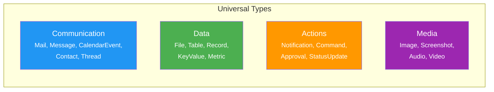
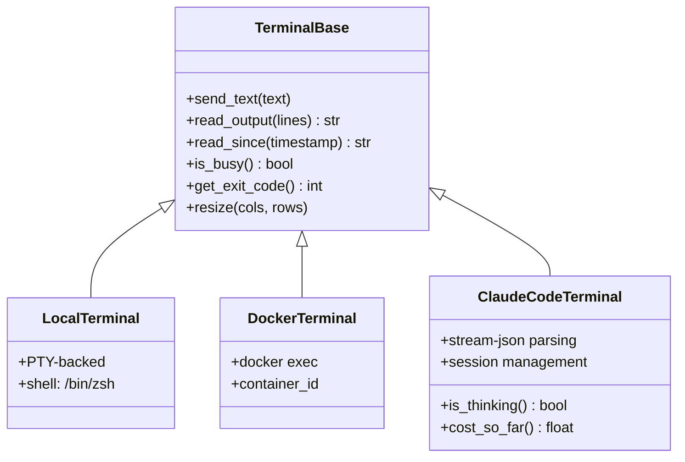
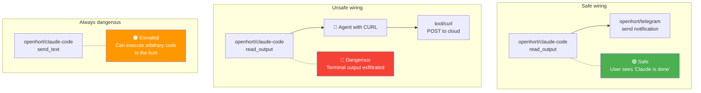
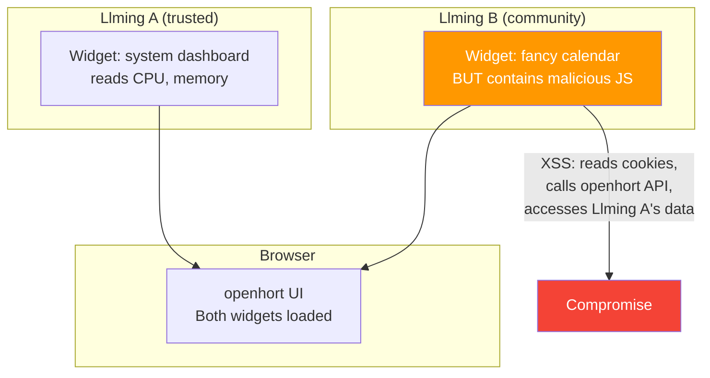

# Llming Data Types & Communication Standards

Llmings from different authors must interoperate seamlessly. A mail from Gmail should feel the same as a mail from Microsoft Graph. A calendar event from Google Calendar should be interchangeable with one from Office 365. This requires **universal data types** — Pydantic-based models that all llmings use when exchanging data.

## The Problem

Without universal types, every llming invents its own models:





## Design Principles

1. **Pydantic v2 models** — frozen, versioned, validated. Consistent with the existing codebase.
2. **Versioned schemas** — every type has a `version: int` field. New fields get defaults. Old consumers ignore unknown fields (`extra="allow"`).
3. **Llming authors implement adapters** — the universal type is the contract. Each llming maps its API's format to/from the universal type.
4. **Capabilities declared in manifest** — a llming declares which universal types it produces and consumes.
5. **Broadcasts use universal types** — when a llming emits "email arrived", the event payload IS the universal `Mail` model.

## Type Categories



| Category | Purpose | Used by |
|----------|---------|---------|
| **Communication** | Messages between people | Gmail, Office 365, Slack, Telegram, Discord |
| **Data** | Structured information | Databases, SAP, spreadsheets, APIs |
| **Actions** | Things that happen | Notifications, approvals, commands, status |
| **Media** | Binary content | Screenshots, images, audio, video, files |

## Communication Types

### Mail

The universal mail model. Gmail, Office 365, Fastmail, IMAP — all map to this:

```python
class MailAddress(BaseModel, frozen=True):
    version: int = 1
    email: str                          # "john@example.com"
    name: str = ""                      # "John Doe"

class MailAttachment(BaseModel, frozen=True):
    version: int = 1
    filename: str
    mime_type: str = "application/octet-stream"
    size_bytes: int = 0
    content_uri: str = ""               # "llming://microsoft/office365/attachment/abc123"

class Mail(BaseModel, frozen=True):
    version: int = 1
    model_config = {"extra": "allow"}

    id: str                             # provider-specific ID
    thread_id: str = ""                 # conversation thread
    subject: str = ""
    body_text: str = ""                 # plain text
    body_html: str = ""                 # HTML (optional)
    sender: MailAddress
    to: list[MailAddress] = []
    cc: list[MailAddress] = []
    bcc: list[MailAddress] = []
    reply_to: MailAddress | None = None
    date: datetime
    is_read: bool = False
    is_draft: bool = False
    labels: list[str] = []             # "inbox", "important", "spam"
    attachments: list[MailAttachment] = []
    headers: dict[str, str] = {}       # raw headers for advanced use

    # Provider metadata (ignored by consumers who don't need it)
    provider: str = ""                  # "google/gmail", "microsoft/office365"
    raw_id: str = ""                    # provider's native ID
```

A Gmail llming returns `Mail(sender=MailAddress(email="..."), ...)`. An Office 365 llming returns the same `Mail` model. Any consumer — the agent, a circuit trigger, another llming — works with the same fields.

### CalendarEvent

```python
class CalendarEvent(BaseModel, frozen=True):
    version: int = 1
    model_config = {"extra": "allow"}

    id: str
    calendar_id: str = ""
    title: str
    description: str = ""
    location: str = ""
    start: datetime
    end: datetime
    all_day: bool = False
    recurrence: str = ""                # RRULE string
    organizer: MailAddress | None = None
    attendees: list[MailAddress] = []
    status: str = "confirmed"           # "confirmed", "tentative", "cancelled"
    reminder_minutes: int | None = None
    provider: str = ""
```

### Message (Chat/IM)

For Slack, Teams, Discord, Telegram — instant messages:

```python
class ChatMessage(BaseModel, frozen=True):
    version: int = 1
    model_config = {"extra": "allow"}

    id: str
    channel_id: str = ""
    thread_id: str = ""
    sender: str                         # username or user ID
    text: str = ""
    html: str = ""
    timestamp: datetime
    edited: bool = False
    reactions: list[str] = []           # emoji reactions
    attachments: list[MailAttachment] = []  # reuses MailAttachment
    provider: str = ""
```

### Contact

```python
class Contact(BaseModel, frozen=True):
    version: int = 1
    model_config = {"extra": "allow"}

    id: str
    name: str
    email: str = ""
    phone: str = ""
    organization: str = ""
    title: str = ""                     # job title
    notes: str = ""
    addresses: list[dict[str, str]] = []
    provider: str = ""
```

## Data Types

### Metric

For system monitoring, IoT sensors, dashboards:

```python
class Metric(BaseModel, frozen=True):
    version: int = 1
    model_config = {"extra": "allow"}

    name: str                           # "cpu_percent", "temperature", "humidity"
    value: float
    unit: str = ""                      # "%", "C", "MB", "req/s"
    timestamp: datetime
    tags: dict[str, str] = {}           # {"host": "mac-studio", "sensor": "living-room"}
    source: str = ""                    # llming that produced this
```

### Record

For database rows, SAP entries, API responses — structured data:

```python
class Record(BaseModel, frozen=True):
    version: int = 1
    model_config = {"extra": "allow"}

    id: str = ""
    type: str = ""                      # "employee", "invoice", "order"
    fields: dict[str, Any] = {}         # the actual data
    source: str = ""                    # "sap/connector", "openhort/postgres"
    timestamp: datetime | None = None
```

### Table

For query results, spreadsheets, CSV data:

```python
class Table(BaseModel, frozen=True):
    version: int = 1
    model_config = {"extra": "allow"}

    columns: list[str]                  # column names
    rows: list[list[Any]]              # row data
    total_rows: int | None = None       # for paginated results
    source: str = ""
```

## Action Types

### Notification

```python
class Notification(BaseModel, frozen=True):
    version: int = 1
    model_config = {"extra": "allow"}

    title: str
    body: str = ""
    severity: str = "info"              # "info", "warning", "error", "critical"
    source: str = ""
    timestamp: datetime
    actions: list[str] = []             # "dismiss", "acknowledge", "open"
    url: str = ""                       # deep link
```

### Approval

For workflows that need human confirmation:

```python
class Approval(BaseModel, frozen=True):
    version: int = 1
    model_config = {"extra": "allow"}

    id: str
    title: str
    description: str = ""
    requester: str = ""                 # who's asking
    options: list[str] = ["approve", "reject"]
    deadline: datetime | None = None
    context: dict[str, Any] = {}        # extra data for decision
    source: str = ""
```

## Media Types

### Screenshot

```python
class Screenshot(BaseModel, frozen=True):
    version: int = 1
    model_config = {"extra": "allow"}

    window_id: int = -1
    window_name: str = ""
    app_name: str = ""
    width: int
    height: int
    format: str = "jpeg"                # "jpeg", "png", "webp"
    data: bytes                         # raw image bytes
    timestamp: datetime
    source: str = ""
```

## Capability Declaration

Llmings declare which universal types they **produce** and **consume** in their manifest:

```json
{
  "name": "office365",
  "author": "microsoft",
  "version": "1.0.0",

  "produces": {
    "mail": { "version": ">=1", "operations": ["read", "search", "list"] },
    "calendar_event": { "version": ">=1", "operations": ["read", "list", "create"] },
    "contact": { "version": ">=1", "operations": ["read", "search"] }
  },
  "consumes": {
    "mail": { "version": ">=1", "operations": ["send", "reply", "forward", "delete"] },
    "calendar_event": { "version": ">=1", "operations": ["create", "update", "delete"] }
  },

  "broadcasts": {
    "email_arrived": { "type": "mail", "description": "New email received" },
    "calendar_reminder": { "type": "calendar_event", "description": "Event starting soon" }
  },

  "groups": {
    "read-only": {
      "tools": ["read_email", "search_email", "list_calendars", "get_contact"],
      "color": "green"
    },
    "compose": {
      "tools": ["create_draft", "create_event"],
      "color": "yellow"
    },
    "deliver": {
      "tools": ["send_email", "forward_email"],
      "color": "orange"
    },
    "admin": {
      "tools": ["delete_email", "purge_folder"],
      "color": "red"
    }
  },

  "risk_level": "standard"
}
```

A different llming providing the same capability:

```json
{
  "name": "gmail",
  "author": "google",

  "produces": {
    "mail": { "version": ">=1", "operations": ["read", "search", "list"] },
    "contact": { "version": ">=1", "operations": ["read", "search"] }
  },
  "consumes": {
    "mail": { "version": ">=1", "operations": ["send", "reply", "delete"] }
  },

  "broadcasts": {
    "email_arrived": { "type": "mail" }
  },

  "risk_level": "standard"
}
```

Both produce `Mail` objects. A circuit trigger that listens for `email_arrived` works with either llming — the payload is the same `Mail` model.

## Broadcasts & Events

When a llming emits a broadcast event, the payload is a universal type:

```python
# microsoft/office365 emits:
signal = Signal(
    signal_type="microsoft/office365::email_arrived",
    source="microsoft/office365",
    data={
        "_type": "mail",                # universal type name
        "_version": 1,
        "id": "msg-abc123",
        "subject": "Quarterly Report",
        "sender": {"email": "cfo@company.com", "name": "Jane CFO"},
        "date": "2026-04-03T10:00:00Z",
        "body_text": "Please review the attached...",
        "labels": ["inbox", "important"],
    },
)

# google/gmail emits the exact same structure:
signal = Signal(
    signal_type="google/gmail::email_arrived",
    source="google/gmail",
    data={
        "_type": "mail",
        "_version": 1,
        "id": "gmail-xyz789",
        "subject": "Quarterly Report",
        "sender": {"email": "cfo@company.com", "name": "Jane CFO"},
        # ... same fields, same model
    },
)
```

A circuit trigger that reacts to "any new email" can subscribe to `*::email_arrived` and the `data` is always a `Mail` — regardless of which llming produced it.

### Subscribing to Broadcasts

```yaml
circuits:
  # Works with ANY mail llming
  - on: "*::email_arrived"
    filter:
      sender.email: "*@mycompany.com"
      labels: ["important"]
    do: openhort/telegram::send
    message: "Important email from {{sender.name}}: {{subject}}"

  # Works with ANY calendar llming
  - on: "*::calendar_reminder"
    filter:
      reminder_minutes: 5
    do: openhort/telegram::send
    message: "Meeting in 5 min: {{title}} at {{location}}"
```

The `*::` wildcard means "any llming that produces this event type". The consumer doesn't know or care whether it's Gmail, Office 365, or Fastmail.

## Risk Levels & Permission Hints

Llmings declare their risk level in the manifest. This drives the visual editor's behavior when wiring:

```json
{
  "risk_level": "standard"
}
```

| Risk level | What it means | Visual editor behavior |
|-----------|--------------|----------------------|
| `safe` | Read-only, no side effects, no credentials | Green border. No warnings. Auto-allow. |
| `standard` | Normal operations, some writes, needs credentials | Yellow border. Shows group picker on wire. |
| `elevated` | Can send data externally, modify remote systems | Orange border. Shows taint warning. Suggests hull. |
| `dangerous` | Raw API access, destructive operations possible | Red border. Permission popup. Requires hull. Auto-deny destructive groups. |

### Permission Popup for Dangerous Llmings

When a user drops a `dangerous` llming (like a raw MS Graph connector) onto the canvas:

```
┌──────────────────────────────────────────────────────────────┐
│  ⚠️  Elevated Risk: community/ms-graph-raw                   │
│                                                              │
│  This llming provides raw access to the Microsoft Graph API. │
│  It can read and modify ANY data in your Microsoft account:  │
│  emails, files, calendar, contacts, Teams messages.          │
│                                                              │
│  Recommended:                                                │
│  [x] Place in isolated hull (own container + network)        │
│  [x] Restrict to read-only group by default                  │
│  [x] Tag all data as source:ms-graph, sensitivity:elevated   │
│                                                              │
│  The author "community" is not verified.                     │
│  Verified authors: openhort, microsoft, google, sap          │
│                                                              │
│  [ Cancel ]  [ Add with restrictions ]  [ Add unrestricted ] │
└──────────────────────────────────────────────────────────────┘
```

The popup is generated from the manifest's `risk_level`, the author's verification status, and the declared `produces`/`consumes` capabilities.

### Author Verification

| Author status | Badge | Meaning |
|--------------|-------|---------|
| **Verified** | Checkmark | Author identity confirmed, code reviewed |
| **Community** | No badge | Published by community, not reviewed |
| **Local** | Lock icon | Installed locally, not from registry |

Llmings from verified authors (`openhort`, `microsoft`, `google`, `sap`) get softer warnings. Community llmings with `dangerous` risk level get the full permission popup.

## Version Compatibility

Universal types evolve over time. Version rules:

1. **Adding fields** — always safe. New fields get defaults. Old consumers ignore them via `extra="allow"`.
2. **Removing fields** — breaking. Bump major version. Old producers still send them (harmless). New consumers don't rely on them.
3. **Changing field types** — breaking. Bump major version.

```python
# Version 1: original
class Mail(BaseModel, frozen=True):
    version: int = 1
    subject: str
    body_text: str
    sender: MailAddress

# Version 2: adds priority (non-breaking)
class Mail(BaseModel, frozen=True):
    version: int = 2
    subject: str
    body_text: str
    sender: MailAddress
    priority: str = "normal"           # NEW — defaults to "normal"
    # v1 producers don't send this field → consumer gets "normal"
    # v2 producers send it → consumer gets the actual value
```

Manifest compatibility:

```json
{
  "produces": {
    "mail": { "version": ">=1" }
  },
  "consumes": {
    "mail": { "version": ">=1, <3" }
  }
}
```

## How Llming Authors Map Native APIs

Each llming contains an adapter layer that maps the provider's native format to universal types:

```python
# Inside microsoft/office365 llming:

class Office365Adapter:
    def to_mail(self, graph_message: dict) -> Mail:
        """Map MS Graph API message to universal Mail type."""
        return Mail(
            id=graph_message["id"],
            subject=graph_message.get("subject", ""),
            body_text=graph_message.get("body", {}).get("content", ""),
            sender=MailAddress(
                email=graph_message["from"]["emailAddress"]["address"],
                name=graph_message["from"]["emailAddress"]["name"],
            ),
            to=[
                MailAddress(email=r["emailAddress"]["address"],
                            name=r["emailAddress"]["name"])
                for r in graph_message.get("toRecipients", [])
            ],
            date=datetime.fromisoformat(graph_message["receivedDateTime"]),
            is_read=graph_message.get("isRead", False),
            provider="microsoft/office365",
            raw_id=graph_message["id"],
        )

# Inside google/gmail llming:

class GmailAdapter:
    def to_mail(self, gmail_message: dict) -> Mail:
        """Map Gmail API message to universal Mail type."""
        headers = {h["name"]: h["value"] for h in gmail_message["payload"]["headers"]}
        return Mail(
            id=gmail_message["id"],
            thread_id=gmail_message["threadId"],
            subject=headers.get("Subject", ""),
            body_text=self._decode_body(gmail_message),
            sender=MailAddress.parse(headers.get("From", "")),
            date=datetime.fromtimestamp(int(gmail_message["internalDate"]) / 1000),
            labels=gmail_message.get("labelIds", []),
            provider="google/gmail",
            raw_id=gmail_message["id"],
        )
```

The adapter is internal to the llming. Consumers never see the native format.

## Llming Extensibility

Llmings are composable and derivable. A base llming defines the universal interface; specialized llmings extend it with provider-specific capabilities.

### Base Classes



Any llming author can derive from `TerminalBase` and get:

- Universal MCP tools (`send_text`, `read_output`, `is_busy`)
- Universal broadcasts (`output_received`, `process_exited`, `command_completed`)
- Universal data types (`TerminalOutput`, `TerminalSession`)
- Automatic group assignment (the base class declares the groups)

```python
# Base class defines the contract
class TerminalBase(LlmingBase):
    """Base for all terminal-type llmings."""

    # Universal types this base produces
    produces = ["terminal_output", "terminal_session"]

    # Groups declared once, inherited by all derivatives
    groups = {
        "read-only": {
            "tools": ["read_output", "read_since", "is_busy", "get_exit_code"],
            "color": "green",
        },
        "interactive": {
            "tools": ["send_text", "resize"],
            "color": "orange",
        },
    }

    # Risk annotations per tool
    tool_risk = {
        "read_output": "safe",
        "is_busy": "safe",
        "send_text": "elevated",        # can execute arbitrary commands
    }
```

A Claude Code llming extends this:

```python
class ClaudeCodeTerminal(TerminalBase):
    """Claude Code CLI as a terminal llming."""

    # Additional tools beyond the base
    extra_groups = {
        "read-only": {
            "add": ["is_thinking", "cost_so_far", "get_session_id"],
        },
        "management": {
            "tools": ["new_session", "resume_session", "set_model"],
            "color": "yellow",
        },
    }

    # Additional broadcasts
    broadcasts = {
        "thinking_started": {"type": "terminal_output"},
        "task_completed": {"type": "terminal_output"},
        "budget_warning": {"type": "metric"},
    }
```

### Extension Pattern

Any community author can build on top:

```json
{
  "name": "claude-code-monitor",
  "author": "community/alice",
  "extends": "openhort/claude-code",
  "description": "Monitors Claude Code sessions and notifies on completion",

  "produces": {
    "notification": { "version": ">=1" }
  },
  "consumes": {
    "terminal_output": { "version": ">=1" }
  },

  "risk_level": "safe",
  "groups": {
    "monitor": {
      "tools": ["watch_session", "get_summary"],
      "color": "green"
    }
  }
}
```

This extension consumes `terminal_output` from the Claude Code llming and produces `Notification` objects. It's `safe` because it only reads and notifies — never executes.

### Same Capability, Different Risk by Wiring

The risk of a tool depends entirely on **what it's wired to**:



| Tool | By itself | Wired to notification | Wired to agent+CURL | Wired to agent with execute |
|------|-----------|----------------------|---------------------|---------------------------|
| `read_output` | 🟢 safe | 🟢 safe | 🔴 exfiltration risk | 🟠 data feeding risk |
| `is_busy` | 🟢 safe | 🟢 safe | 🟢 safe | 🟢 safe |
| `send_text` | 🟠 elevated | 🟠 elevated | 🔴 remote code execution | 🔴 code execution chain |

The wiring model handles this automatically:

- The `read_output` tool is in the `read-only` group (green)
- When wired to a notification llming → taint stays `safe` → no policy triggers
- When wired to an agent that also has CURL → taint from terminal output flows to agent → flow policy blocks `terminal_output` taint from reaching `capability:network-out`
- `send_text` is in the `interactive` group (orange) → the wire shows orange, the visual editor warns

### Tool Risk Annotations

Each tool in a llming carries a **risk annotation** that describes its inherent risk independent of wiring:

```python
class ToolRisk(str, Enum):
    SAFE = "safe"              # No side effects, read-only
    STANDARD = "standard"      # Side effects within the hort
    ELEVATED = "elevated"      # Can affect external systems or execute code
    DANGEROUS = "dangerous"    # Raw API access, destructive potential
```

The visual editor uses these to color-code individual tools in the group picker:

```
┌──────────────────────────────────────────────────────────┐
│  openhort/claude-code tools:                             │
│                                                          │
│  🟢 read-only:                                          │
│    🟢 read_output         🟢 is_busy                    │
│    🟢 get_exit_code       🟢 cost_so_far                │
│    🟢 is_thinking         🟢 get_session_id             │
│                                                          │
│  🟠 interactive:                                        │
│    🟠 send_text           🟢 resize                     │
│                                                          │
│  🟡 management:                                         │
│    🟡 new_session         🟡 resume_session             │
│    🟡 set_model                                         │
└──────────────────────────────────────────────────────────┘
```

Even within a group, individual tools can have different risk colors. `resize` is safe (just changes terminal dimensions). `send_text` is elevated (executes arbitrary commands).

## Web Content & Widget Security

Every llming can serve a full website — custom panels, dashboards, interactive editors. This is powerful but introduces **XSS and cross-origin risks** that must be sandboxed.

### The Threat



A malicious widget from a community llming could:

- Read session cookies and exfiltrate auth tokens
- Call openhort API endpoints with the user's session
- Access DOM elements from other llmings' widgets
- Inject scripts that persist across page loads
- Keylog user input intended for other widgets

### Sandboxing Layers

#### Layer 1: iframe Isolation

Every llming widget runs in a **sandboxed iframe** with restricted permissions:

```html
<iframe
  src="/ext/community-calendar/static/panel.html"
  sandbox="allow-scripts allow-forms"
  csp="default-src 'self'; script-src 'self'; connect-src 'none'"
  referrerpolicy="no-referrer"
></iframe>
```

| Sandbox attribute | What it blocks |
|------------------|----------------|
| No `allow-same-origin` | Cannot access parent page DOM or cookies |
| No `allow-top-navigation` | Cannot redirect the main page |
| No `allow-popups` | Cannot open new windows |
| `allow-scripts` | Can run JS (within CSP restrictions) |
| `allow-forms` | Can submit forms (within iframe) |

#### Layer 2: Content Security Policy

Each llming widget gets a strict CSP header:

```
Content-Security-Policy:
  default-src 'self';
  script-src 'self';
  style-src 'self' 'unsafe-inline';
  connect-src /api/ext/{llming-id}/*;
  img-src 'self' data:;
  frame-src 'none';
```

| CSP directive | Effect |
|--------------|--------|
| `script-src 'self'` | No inline scripts, no external JS |
| `connect-src /api/ext/{id}/*` | Can only call its OWN API endpoints |
| `frame-src 'none'` | Cannot embed further iframes |

#### Layer 3: API Scoping

Each llming gets its own API namespace. Widget JS can only call:

- `/api/ext/{llming-id}/...` — its own endpoints
- `/api/ext/{llming-id}/broadcast` — emit events to its own llming

It **cannot** call:

- `/api/session` — session management
- `/api/ext/{other-llming}/...` — other llmings' endpoints
- `/ws/control/...` — WebSocket control channel
- `/api/flow/...` — flow control audit

#### Layer 4: Message Channel

Widgets communicate with the parent UI through `postMessage` only, with origin verification:

```javascript
// Widget → Parent (request)
window.parent.postMessage({
    type: "llming:request",
    llming: "community/fancy-calendar",
    action: "get_events",
    params: { date: "2026-04-03" }
}, "*");

// Parent → Widget (response, origin-checked)
window.addEventListener("message", (event) => {
    if (event.origin !== expectedOrigin) return;
    if (event.data.type !== "llming:response") return;
    // handle response
});
```

The parent UI validates every message:

- `llming` field must match the iframe's llming ID
- `action` must be in the llming's declared MCP tools
- Parameters are validated against the tool's JSON schema
- Rate-limited (max 100 messages/second per widget)

#### Layer 5: Trust-Based Relaxation

Verified llmings from trusted authors can request relaxed sandboxing:

```json
{
  "name": "llming-lens",
  "author": "openhort",
  "ui_sandbox": "trusted",
  "ui_permissions": ["same-origin", "clipboard-read"]
}
```

| Trust level | Sandbox | Use case |
|------------|---------|----------|
| `strict` (default) | Full iframe sandbox + CSP | Community llmings |
| `standard` | Iframe sandbox, relaxed CSP for `connect-src` | Verified llmings needing API access |
| `trusted` | `allow-same-origin`, full API access | First-party llmings (openhort/*) |

!!! danger "Only first-party llmings get `trusted`"
    `allow-same-origin` gives the widget access to the parent page's cookies and DOM. Only `openhort/*` llmings should ever get this level. Community llmings are always `strict`, regardless of their manifest request.

### Widget Risk in the Visual Editor

When a llming has widgets, the visual editor shows a security badge:

```
┌────────────────────────────────────────────────┐
│  📦 community/fancy-calendar                    │
│                                                │
│  Risk: 🟡 standard                             │
│  Author: community (not verified)              │
│  Widgets: 1 panel (sandboxed iframe)           │
│  Network: connect-src restricted to own API    │
│                                                │
│  ⚠️ This llming includes web content that      │
│  runs in your browser. It is sandboxed but     │
│  could still display misleading UI.            │
└────────────────────────────────────────────────┘
```

## Relationship to Wiring & Flow Control

Universal types integrate with the [wiring model](../security/wiring-model.md) and [flow control](../security/flow-control.md):

- **Groups** map to operations on universal types: `read-only` group = tools that return `Mail` objects. `deliver` group = tools that consume `Mail` objects and send them.
- **Taint labels** are applied based on universal type: a `Mail` from Office 365 automatically gets `source:o365`. A `Record` from SAP gets `source:sap, content:financial`.
- **Flow policies** reference universal types: "any `Mail` with taint `source:sap` cannot be passed to a tool that consumes `Mail` for sending."
- **Broadcasts** carry universal type payloads, so circuit triggers work across llmings.
- **Filters** can inspect universal type fields: "redact any `Mail` where `body_text` matches SSN pattern."
