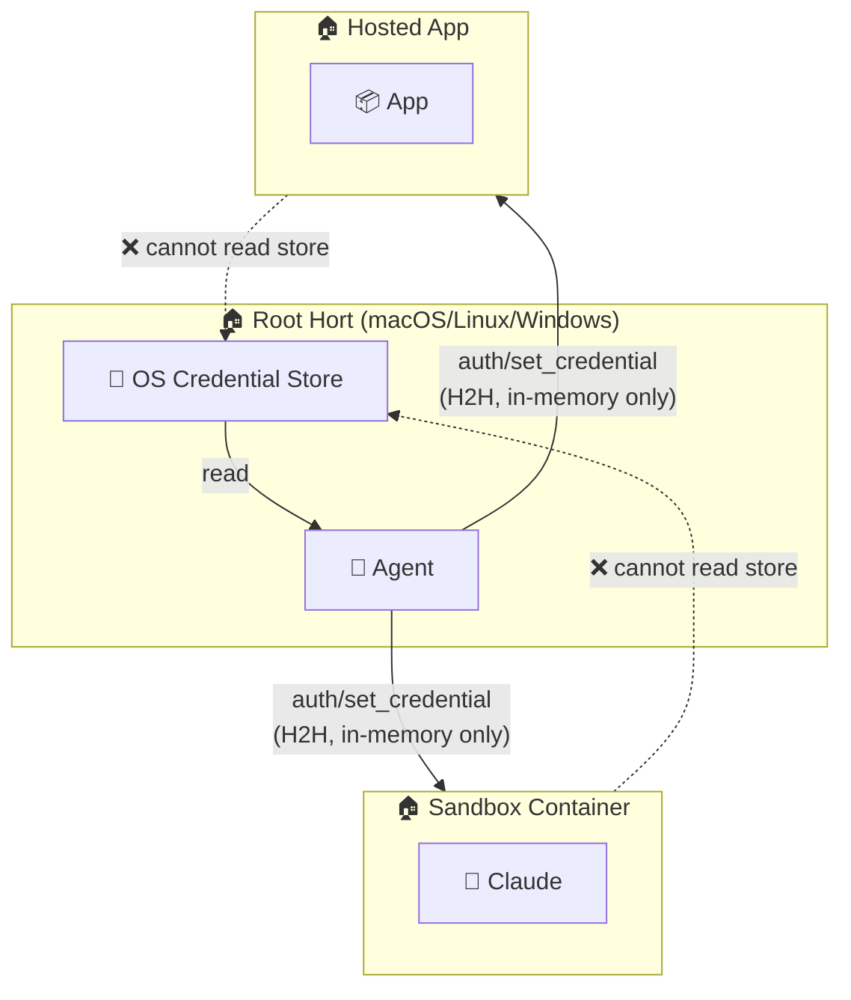
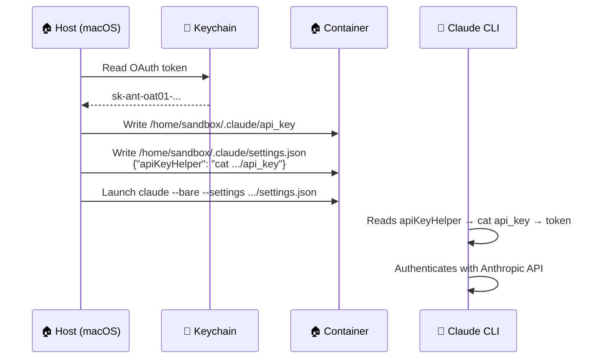
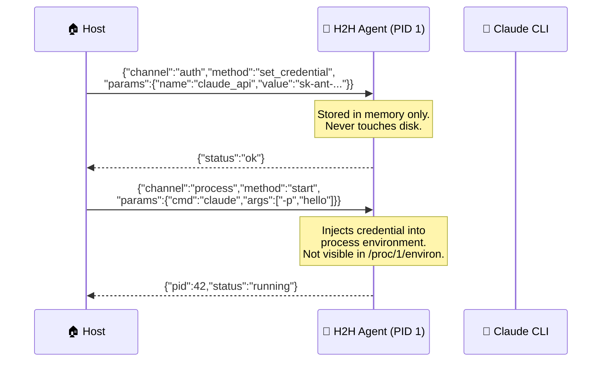
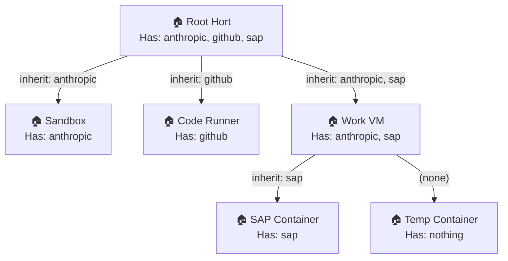
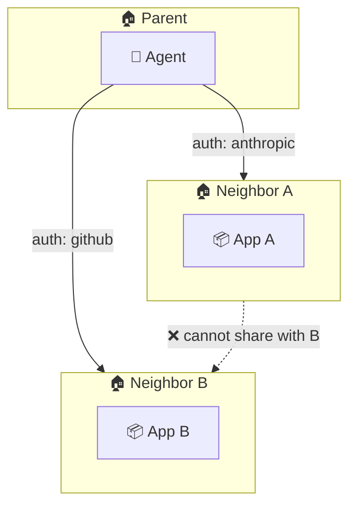
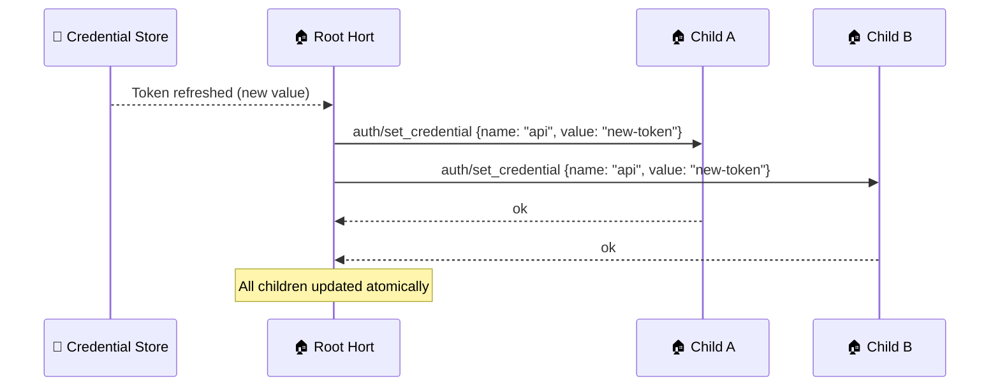
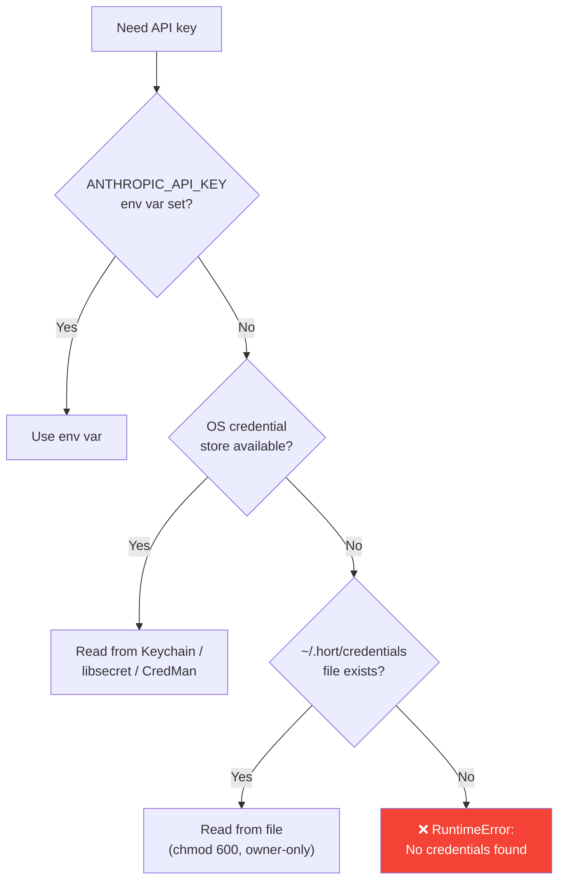

# Credential Provisioning

How credentials (API keys, OAuth tokens, secrets) flow between horts — from the host OS credential store down to sandboxed containers and remote machines.

## Principle: Credentials Flow Downward

Credentials are owned by the root hort and provisioned **downward** to children via the H2H `auth` channel. A child hort never has credentials of its own — it receives what the parent grants.



### Security Properties

- Credentials are **never persisted to disk** inside containers
- Credentials are **never in container environment variables** (`docker inspect` shows nothing)
- Credentials are **never in process arguments** (`ps aux` shows nothing)
- Credentials are provisioned **per-session** — container restart = credentials gone
- The parent decides **which** credentials each child receives
- Children cannot request credentials — only the parent pushes them

## OS Credential Store (Cross-Platform)

The root hort reads credentials from the host OS native credential store:

| OS | Store | CLI Tool | Service Name |
|---|---|---|---|
| **macOS** | Keychain | `security find-generic-password` | `Claude Code-credentials` |
| **Linux** | libsecret (GNOME Keyring / KDE Wallet) | `secret-tool lookup` | `Claude Code-credentials` |
| **Windows** | Credential Manager | PowerShell `Get-StoredCredential` | `Claude Code-credentials` |

### Credential Structure

The store contains a JSON blob with all auth methods:

```json
{
  "claudeAiOauth": {
    "accessToken": "sk-ant-oat01-...",
    "refreshToken": "sk-ant-ort01-...",
    "expiresAt": 1775656655494,
    "scopes": ["user:inference", "user:sessions:claude_code"],
    "subscriptionType": "max"
  }
}
```

### Extraction

```python
def get_api_key() -> str:
    """Try (in order):
    1. ANTHROPIC_API_KEY environment variable
    2. OAuth token from OS credential store
    """
    api_key = os.environ.get("ANTHROPIC_API_KEY", "")
    if api_key:
        return api_key
    creds = _read_credential_store()  # OS-specific
    return creds["claudeAiOauth"]["accessToken"]
```

## Container Credential Injection

### Current: apiKeyHelper Pattern

Claude Code CLI in `--bare` mode accepts credentials via a `settings.json` file with an `apiKeyHelper` command:

```json
{"apiKeyHelper": "cat /home/sandbox/.claude/api_key"}
```

The parent writes the key file and settings into the container before launching Claude:



### Target: H2H Auth Channel

With the H2H agent, credential injection becomes a protocol message:



No files on disk. No env vars in the container. The H2H agent holds credentials in memory and injects them per-process.

## Credential Sharing Between Horts

### Parent → Child (Default)

The parent explicitly provisions credentials to each child. Different children can receive different credentials:

```yaml
hort:
  name: "Root"
  credentials:
    anthropic: { source: keychain, service: "Claude Code-credentials" }
    github: { source: env, var: GITHUB_TOKEN }
    
  sub_horts:
    sandbox:
      credentials:
        anthropic: inherit     # receives the same Anthropic key
        # github: NOT listed → sandbox never gets GitHub token
    
    code-runner:
      credentials:
        github: inherit        # receives GitHub token
        # anthropic: NOT listed → code-runner never gets Anthropic key
```

### Credential Scoping Rules



- A child **never** inherits credentials automatically — the parent must explicitly list each one
- A child **cannot** request credentials it wasn't granted
- A child **can** pass inherited credentials further down (if its wire rules allow the `auth` channel)
- Credential inheritance is **transitive but explicit** at each hop

### Neighbor Horts

Neighbor horts (same level) **never** share credentials directly. Credentials always flow through the parent:



If both neighbors need the same credential, the parent provisions it to each independently.

### Credential Rotation

When a credential is rotated (e.g., OAuth token refresh), the parent re-provisions all children that hold it:



### Credential Types

| Type | Example | Lifetime | Rotation |
|---|---|---|---|
| **OAuth token** | Claude Code access token | Hours (auto-refresh) | Parent refreshes, re-provisions |
| **API key** | `ANTHROPIC_API_KEY` | Permanent until revoked | Manual rotation |
| **Session token** | Hosted app login cookie | Session-scoped | Re-created on container restart |
| **Certificate** | TLS client cert | Months | Parent re-provisions on renewal |
| **Vault secret** | Database password | TTL-based | Parent leases from vault, provisions to children |

## Platform-Specific Implementation

### macOS Host

```python
# Read from Keychain
raw = subprocess.check_output(
    ["security", "find-generic-password",
     "-s", "Claude Code-credentials", "-w"],
    stderr=subprocess.DEVNULL, text=True,
).strip()
creds = json.loads(raw)
token = creds["claudeAiOauth"]["accessToken"]
```

### Linux Host

```python
# Read from libsecret (GNOME Keyring / KDE Wallet)
raw = subprocess.check_output(
    ["secret-tool", "lookup", "service", "Claude Code-credentials"],
    stderr=subprocess.DEVNULL, text=True,
).strip()
creds = json.loads(raw)
token = creds["claudeAiOauth"]["accessToken"]
```

!!! note "Linux prerequisites"
    Requires `libsecret-tools` package and a running secret service (GNOME Keyring or KDE Wallet). Headless servers use `gnome-keyring-daemon` with `--unlock` from a PAM module or systemd service.

### Windows Host

```python
# Read from Credential Manager via PowerShell
ps_script = (
    '[System.Runtime.InteropServices.Marshal]::'
    'PtrToStringAuto([System.Runtime.InteropServices.Marshal]::'
    'SecureStringToBSTR((Get-StoredCredential -Target '
    '"Claude Code-credentials").Password))'
)
raw = subprocess.check_output(
    ["powershell", "-NoProfile", "-Command", ps_script],
    stderr=subprocess.DEVNULL, text=True,
).strip()
creds = json.loads(raw)
token = creds["claudeAiOauth"]["accessToken"]
```

!!! note "Windows prerequisites"
    Requires the `CredentialManager` PowerShell module. Credentials are stored per-user in the Windows Credential Vault.

### Fallback Chain

If the OS credential store is unavailable (headless server, CI, Docker host):



## Threat Mitigations

| Threat | Mitigation |
|---|---|
| Container reads host Keychain | Not mounted. No `security` binary in container. |
| Container reads /proc/1/environ | Credentials not in PID 1 env. Injected per-process. |
| Container reads credential file on disk | H2H agent stores in memory only. apiKeyHelper file is tmpfs. |
| `docker inspect` shows secrets | `secret_env` excluded from serialization (`exclude=True`). |
| `ps aux` on host shows key in args | H2H agent receives key via stdin, not command args. |
| Child provisions credentials upward | H2H direction: `parent_only`. Auth channel is parent→child only. |
| Sibling steals neighbor's credentials | Neighbors have no direct connection. All credentials via parent. |
| Credential persists after container stop | In-memory only. Container restart = clean slate. |
| OAuth token expires in long-running container | Parent monitors expiry, re-provisions via `auth/set_credential`. |
