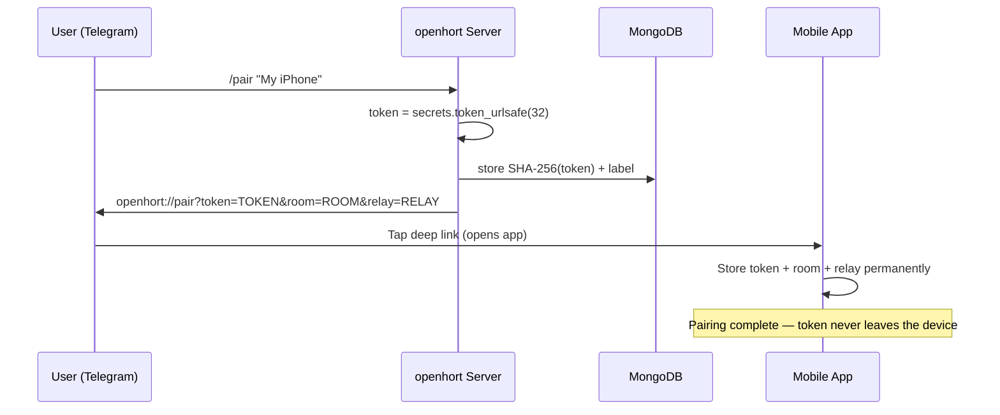
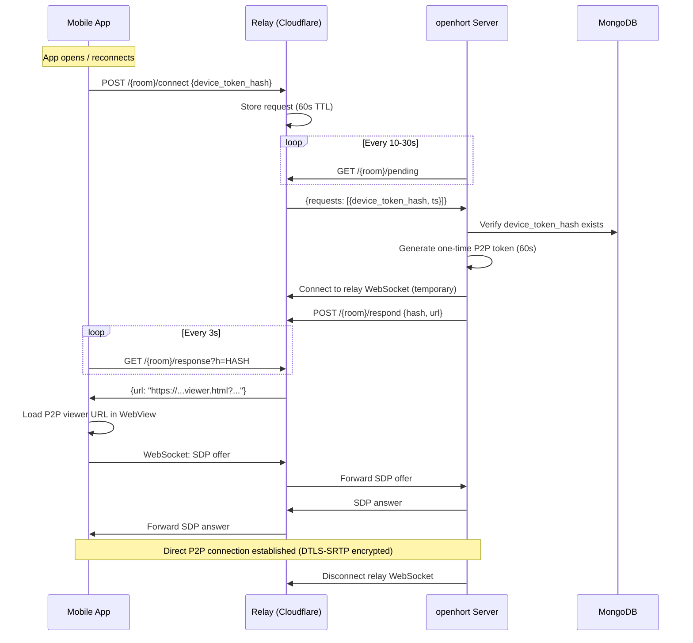

# Device Tokens

Device tokens authenticate paired mobile devices for P2P relay connections.
Each paired device holds a 256-bit secret that proves its identity without
requiring a persistent WebSocket connection.

## Token Properties

| Property | Value |
|----------|-------|
| **Entropy** | 256 bits (`secrets.token_urlsafe(32)`) |
| **Format** | URL-safe base64, 43 characters |
| **Storage (server)** | SHA-256 hash in MongoDB (`openhort.device_tokens`) |
| **Storage (device)** | Plaintext in app preferences (iOS Keychain / Android SharedPreferences) |
| **Storage (relay)** | Never stored — relay only sees hash in transit |
| **Lifetime** | Permanent until explicitly revoked |
| **Verification** | Timing-safe comparison (`hmac.compare_digest`) |

The token is shown **once** during pairing (via Telegram deep link or QR code).
The server never stores the plaintext — only the SHA-256 hash. Even a database
compromise does not reveal device tokens.

## Pairing Flow



## Connection Flow (Polling)



## Why 256-bit Tokens are Unguessable

With 256 bits of entropy from `secrets.token_urlsafe(32)`:

- **Keyspace**: 2^256 = 1.16 x 10^77 possible tokens
- **Brute force at 1 billion attempts/second**: 3.67 x 10^60 years
- **Comparison**: The universe is ~1.4 x 10^10 years old

The relay also enforces rate limiting with exponential backoff after 3 failed
attempts (2s, 4s, 8s... up to 60s), making online brute force infeasible
even at much lower entropy.

## Threat Analysis

| Threat | Mitigation |
|--------|-----------|
| **Token interception during pairing** | Deep link (`openhort://`) is local to the device. Telegram message is end-to-end encrypted in secret chats. QR code requires physical proximity. |
| **Relay sees token hash** | SHA-256 hash only — relay cannot derive the plaintext. Hash is one-way. |
| **Database compromise** | SHA-256 hashes stored, not plaintext. Attacker cannot forge valid tokens. |
| **Timing attack on verification** | `hmac.compare_digest` provides constant-time comparison. |
| **Replay of token hash** | The hash is the device identity, not a session credential. Connection requests expire in 60s. The P2P session uses a separate one-time token (also 256-bit). |
| **Room ID discovery** | Room ID is SHA-256(bot_token) — 256 bits. Without knowing the bot token, the room is undiscoverable. |
| **Denial of service** | Fake requests to a room are ignored by the host (unrecognized hash). Requests expire in 60s. Relay is stateless Cloudflare Durable Objects with auto-cleanup. |

## Device Revocation

Tokens are revoked via the `/devices` Telegram command:

```
/devices                           # List all paired devices
/devices revoke abc123             # Revoke by hash prefix
/devices revoke-all                # Revoke all devices
```

Revocation is immediate — the hash is deleted from MongoDB. The device's
next connection attempt will fail at the host's `verify_hash()` check.
Existing P2P sessions are not terminated (they use independent WebRTC
credentials), but no new sessions can be established.

## Implementation Files

| File | Purpose |
|------|---------|
| `hort/peer2peer/device_tokens.py` | `DeviceTokenStore` — MongoDB-backed CRUD + verification |
| `hort/peer2peer/relay_poller.py` | `RelayPoller` — HTTP polling + temporary WebSocket for SDP |
| `hort/extensions/core/peer2peer/provider.py` | `/pair` and `/devices` Telegram commands |
| `www_openhort_ai/workers/relay/index.js` | Cloudflare Worker — HTTP mailbox endpoints |
