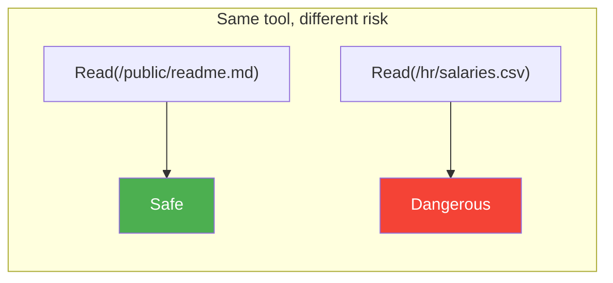
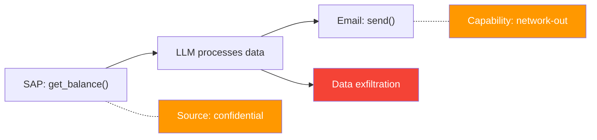
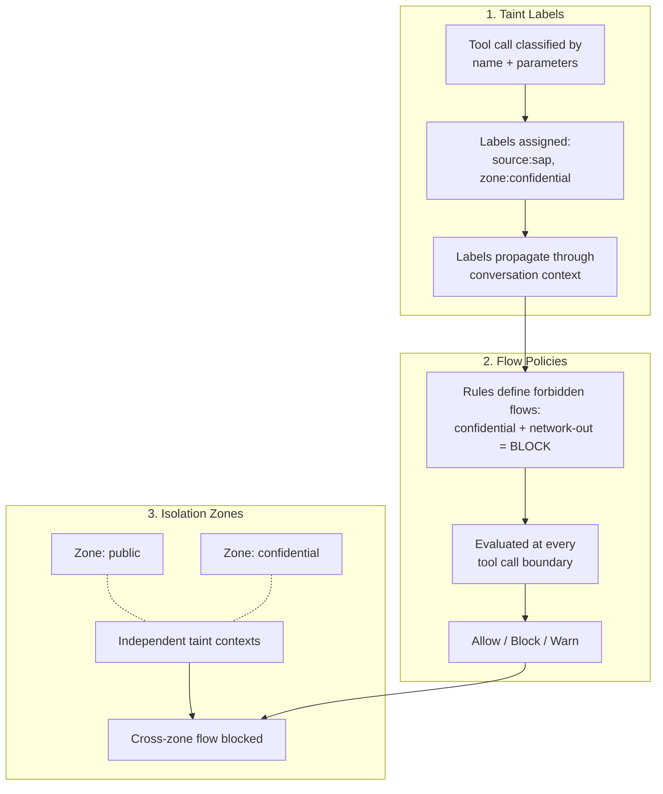
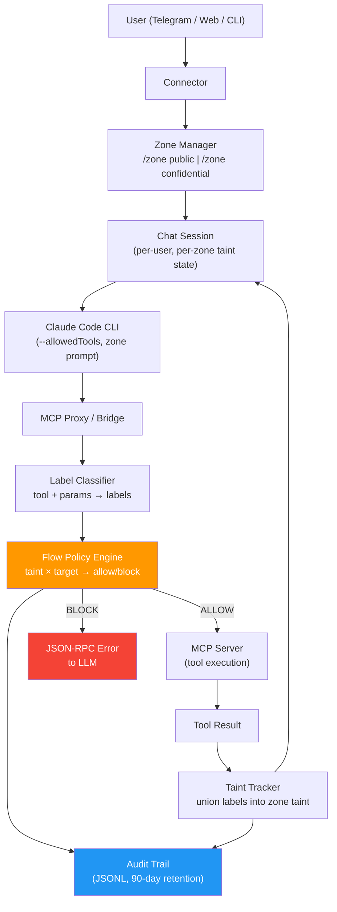
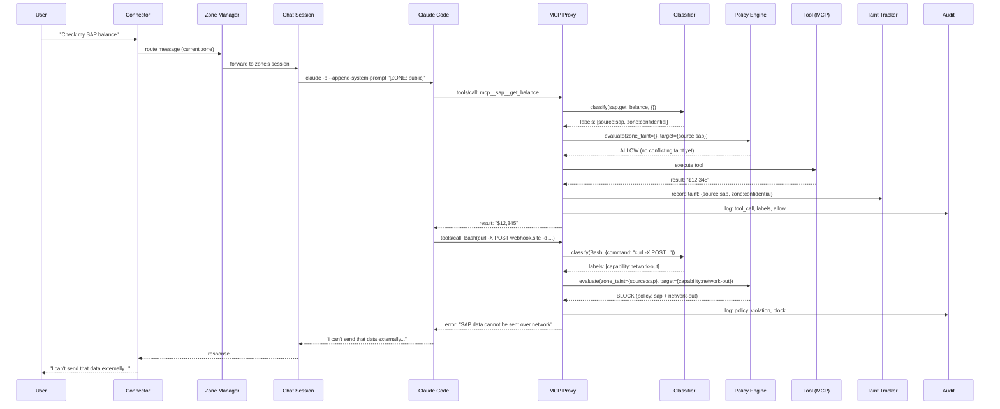
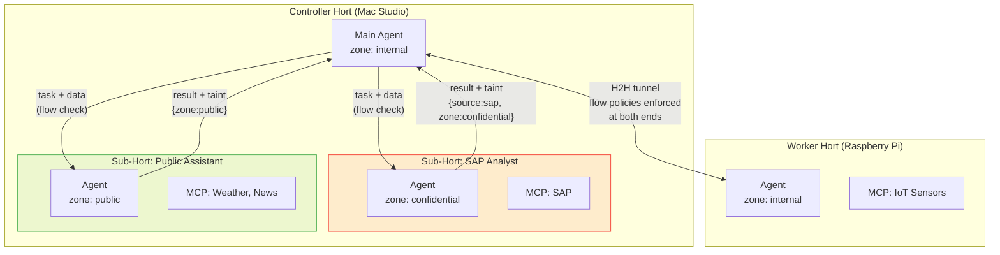
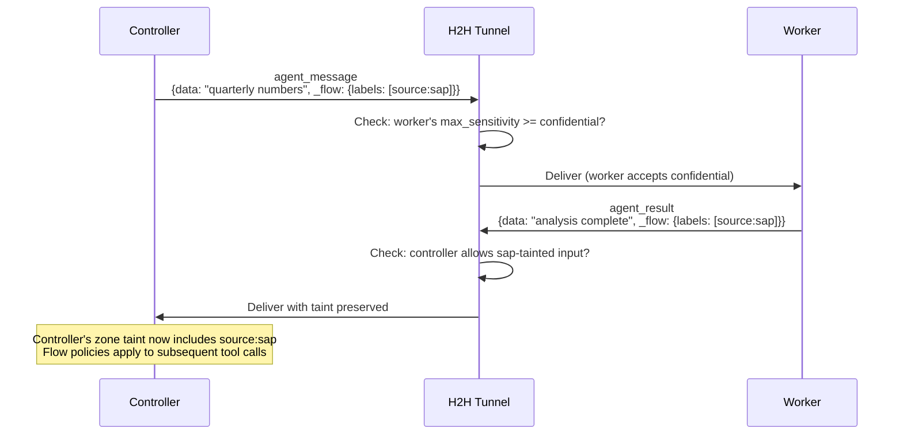

# Information Flow Control

OpenHORT agents use MCP tools that connect to sensitive data sources (SAP, Office 365, HR databases, private files) and dangerous output sinks (email send, network POST, file write to shared storage). The existing permission system controls **which tools** an agent can use, but cannot prevent dangerous **combinations** of tools or distinguish safe from dangerous uses of the same tool based on its parameters.

Information Flow Control (IFC) adds a second security layer that tracks **what data an agent has seen** and **where that data is allowed to go**.

## The Problem

Traditional tool-level permissions are insufficient:



Dangerous combinations emerge from individually safe tools:



| Scenario | Individual tool risk | Combined risk |
|----------|---------------------|---------------|
| Read SAP balance | Low (viewing own data) | -- |
| Send email | Low (writing to a colleague) | -- |
| Read SAP balance **then** send email | -- | **Critical** (data exfiltration) |
| Read public weather API | None | -- |
| POST to webhook | Medium (outbound data) | -- |
| Read HR salaries **then** POST to webhook | -- | **Critical** (PII breach) |
| Read private chat + CURL POST | -- | **Critical** (chat data leak) |

## Three Interlocking Mechanisms

IFC addresses this with three mechanisms that work together:



### 1. Taint Labels

Every tool call gets **labeled** based on its name and parameters. Labels describe:

- **Source** -- where data came from (`source:sap`, `source:o365`, `source:private-chat`)
- **Sensitivity** -- how sensitive (`zone:public`, `zone:confidential`)
- **Content type** -- what the data contains (`content:pii`, `content:financial`, `content:credentials`)
- **Capability** -- what a tool can do (`capability:network-out`, `capability:email-send`, `capability:file-write`)

Labels propagate: when the LLM consumes labeled data, all subsequent output inherits those labels. See [Taint Tracking](taint-tracking.md).

### 2. Flow Policies

Rules that define forbidden data flows. **Simple policies** match source × target label pairs. **Combination policies** match on multiple taint labels simultaneously — because two individually-safe items can be dangerous together:

```yaml
# Simple: SAP data cannot reach network
- name: "No SAP financial to network"
  source_labels: [{dimension: content, value: financial}]
  target_labels: [{dimension: capability, value: network-out}]
  action: block

# Combination: employee directory + email = phishing risk
- name: "No directory-based mass email"
  requires_all: [{dimension: content, value: employee-directory}]
  requires_any: [{dimension: capability, value: email-send}]
  action: block
```

Policies are evaluated at every tool call boundary -- before the tool executes. The danger matrix is non-linear: low-sensitivity + low-sensitivity can equal critical risk. See [Flow Policies](flow-policies.md).

### 3. Isolation Zones

Within a single chat (e.g., one Telegram conversation), the user can operate in different security zones. Each zone has its own taint context:

```
/zone public         ← Weather check, email to colleague
/zone confidential   ← SAP queries, HR data review
/zone public         ← Back to safe operations (SAP taint stays in confidential zone)
```

Data from a higher-sensitivity zone cannot flow to a lower-sensitivity zone. See [Flow Policies: Zones](flow-policies.md#isolation-zones).

## Architecture



### Component Responsibilities

| Component | File | Role |
|-----------|------|------|
| **Label Classifier** | `hort/flow/classifier.py` | Assigns labels to tool calls based on name + parameter patterns |
| **Flow Policy Engine** | `hort/flow/policy.py` | Evaluates taint set against target labels; returns allow/block/warn |
| **Taint Tracker** | `hort/flow/tracker.py` | Per-conversation, per-zone state; unions labels on each tool result |
| **Zone Manager** | `hort/flow/zones.py` | Manages isolation contexts; handles auto-escalation |
| **Flow Audit** | `hort/flow/audit.py` | Structured JSONL audit trail; query API |
| **Flow Config** | `hort/flow/config.py` | Loads `flow_control:` from hort-config.yaml |
| **Zone Prompts** | `hort/flow/prompts.py` | Generates zone-aware system prompt fragments |
| **Flow-Aware Bus** | `hort/flow/bus.py` | Wraps SignalBus with channel sensitivity checks |

### Integration Points

The flow control system hooks into the existing architecture at well-defined boundaries:



## Default Posture

!!! info "Fail-open with audit"
    When no flow policies are configured, the system is **fail-open** -- all tool calls proceed as before. However, every tool call is classified and logged to the audit trail regardless. This gives operators full visibility before they write blocking policies.

!!! danger "Production deployments"
    Set `flow_control.fail_closed: true` for any deployment handling sensitive data. This blocks tool calls involving tainted data unless a policy explicitly allows the flow.

## Module Structure

```
hort/flow/
    __init__.py       FlowController (single entry point)
    models.py         SecurityLabel, TaintSet, FlowPolicy, Zone, PolicyDecision
    classifier.py     LabelClassifier (pattern matching on tool + params)
    policy.py         FlowPolicyEngine (taint x target -> allow/block/warn)
    tracker.py        ConversationTaintTracker (per-conversation, per-zone)
    zones.py          ZoneManager (isolation contexts, auto-escalation)
    bus.py            FlowAwareSignalBus (wraps existing SignalBus)
    audit.py          FlowAuditStore (JSONL storage + query API)
    config.py         Load flow_control from hort-config.yaml
    prompts.py        Zone-aware system prompt generation
```

## Nested Horts & Multi-Node Flow

The Hort-in-Hort architecture is a natural fit for flow control. Each Hort (whether a container session, a remote worker, or a sub-agent) is an **independent flow boundary**. Data crossing a Hort boundary must pass flow policy checks in both directions.

### Hort Hierarchy as Zone Hierarchy



### Flow Rules Across Hort Boundaries

When data crosses a Hort boundary (via H2H protocol or A2A messaging), flow policies are enforced **bilaterally** — both the sender's and receiver's policies must allow the flow:

| Flow | Sender check | Receiver check |
|------|-------------|----------------|
| Controller → Worker | Controller's export policies | Worker's `accept_from` + flow policies |
| Worker → Controller | Worker's output policies | Controller's import policies |
| Sub-Hort → Parent | Sub-Hort's output taint | Parent's zone taint compatibility |
| Agent A → Agent B (A2A) | A's `can_send_to` + flow labels | B's `can_receive_from` + max sensitivity |

### Sub-Hort Taint Inheritance

When a parent Hort creates a sub-Hort (container session), it can specify which data the sub-Hort is allowed to access:

```yaml
# Sub-Hort for SAP analysis — can receive SAP data, cannot output to network
sub_hort:
  name: sap-analyst
  input_clearance: [source:sap, zone:confidential]
  output_restrictions:
    denied_capabilities: [network-out, email-send-external]
```

The sub-Hort's outputs inherit both:

1. The **sub-Hort's own taint** (from tools it used)
2. The **input taint** (from data the parent sent it)

This prevents a sub-Hort from laundering sensitive data — even if the sub-Hort itself doesn't directly access SAP, if it was given SAP data by its parent, its outputs carry the SAP taint.

### Multi-Node Flow Enforcement

For H2H (Hort-to-Hort) connections, flow policies are enforced at the tunnel boundary:



The existing H2H trust levels (`trusted`, `sandboxed`, `untrusted`) map to flow clearance levels:

| H2H trust | Flow clearance | Can receive |
|-----------|---------------|-------------|
| `trusted` | `restricted` | All data |
| `sandboxed` | `internal` | Internal + public data |
| `untrusted` | `public` | Public data only |

### Worker-Side Budget + Flow

Worker-side constraints (from `node.yaml`) are complemented by flow policies:

- **Budget caps**: limit how much an agent can spend (existing)
- **Flow caps**: limit what data an agent can access or output (new)
- Both are enforced **locally on the worker** — the controller cannot override them

This means a compromised controller cannot force a worker to exfiltrate data, because:

1. The worker's `accept_from` list must include the controller (existing B3)
2. The worker's flow policies must allow the data sensitivity (new B6)
3. The worker's output flow policies must allow the destination (new B6)

## Next

- [Taint Tracking](taint-tracking.md) -- data model, label classification, propagation rules
- [Flow Policies](flow-policies.md) -- policy engine, zones, configuration, broadcast channels
- [Boundary Filters](boundary-filters.md) -- content inspection, network egress, MCP filter chains, AI classifiers
