# Flow Policies, Zones & Channels

Flow policies define which data flows are permitted, which are blocked, and which require review. Isolation zones provide independent taint contexts within a single conversation. Channel policies control what data can be broadcast to shared subscribers.

## Flow Policy Engine

### Policy Structure

A flow policy matches a combination of **source labels** (on the accumulated taint) and **target labels** (on the tool being called):

```python
class FlowPolicy(BaseModel):
    name: str
    source_labels: list[SecurityLabel]   # match if taint has ANY of these
    target_labels: list[SecurityLabel]   # match if target has ANY of these
    action: Literal["block", "warn", "audit"]
    message: str = ""
    priority: int = 0                    # higher priority evaluated first
```

### Evaluation Logic

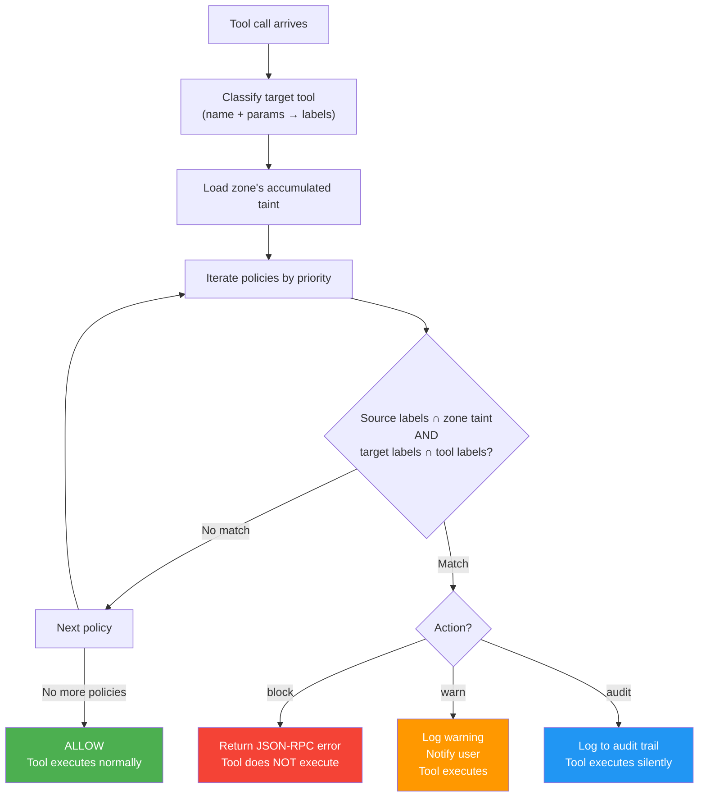

**Resolution order**: block > warn > audit > allow. If multiple policies match, the most restrictive action wins.

### Example Policies

```yaml
flow_policies:
  # Critical: prevent data exfiltration
  - name: no-confidential-to-network
    source_labels:
      - {dimension: zone, value: confidential}
    target_labels:
      - {dimension: capability, value: network-out}
    action: block
    message: "Confidential data cannot be sent over network"

  # Critical: prevent PII in automated emails
  - name: no-pii-in-email
    source_labels:
      - {dimension: content, value: pii}
    target_labels:
      - {dimension: capability, value: email-send}
    action: block
    message: "PII data cannot be included in automated emails"

  # Warning: financial data in email needs review
  - name: financial-email-review
    source_labels:
      - {dimension: content, value: financial}
    target_labels:
      - {dimension: capability, value: email-send-internal}
    action: warn
    message: "Email contains financial data — review before sending"

  # Audit: track all cross-system data flows
  - name: cross-system-audit
    source_labels:
      - {dimension: source, value: sap}
    target_labels:
      - {dimension: capability, value: file-write}
    action: audit
```

## Combination Policies — Non-Linear Danger

Simple source × target policies handle the common case, but real-world danger is often **combinatorial**: two individually-safe data sources become dangerous when combined with a specific output, even if each source alone would be fine.

### The Problem with Flat Taint

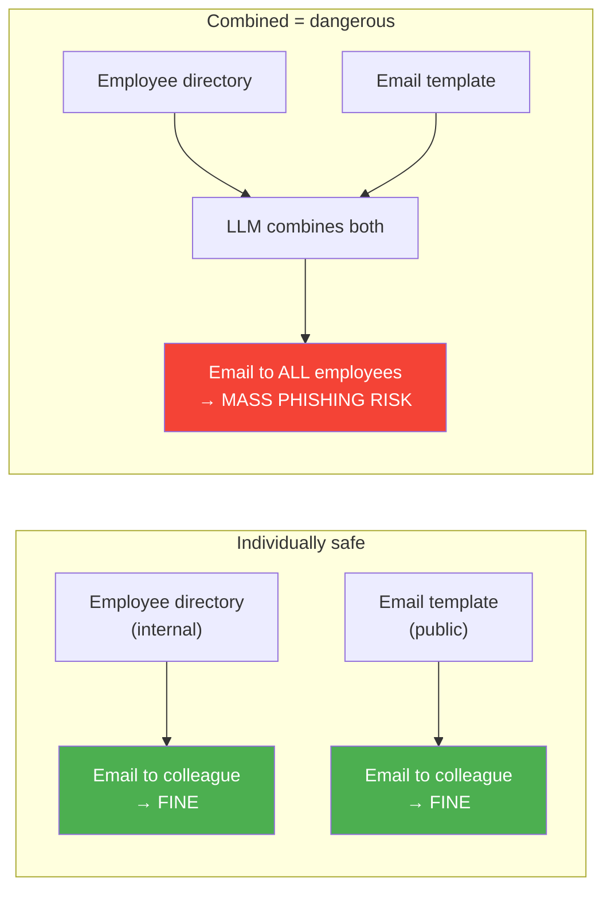

Another example — same source system, different data, completely different risk:

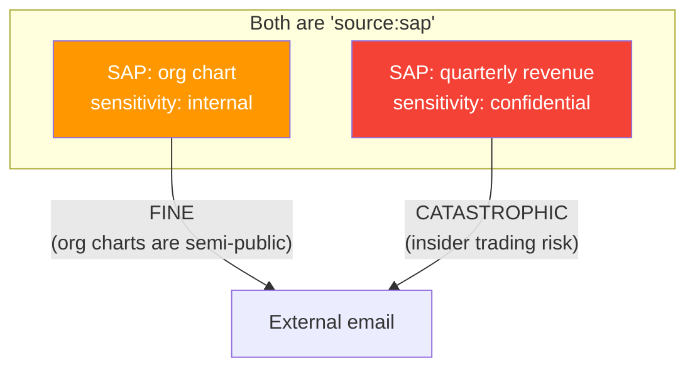

A flat `source:sap` label can't distinguish these. The taint needs to be **multi-colored** — capturing not just where data came from, but what *kind* of data it is within that source.

### Fine-Grained Sub-Labels

Classification rules should produce specific labels, not just source-level tags:

```yaml
classification_rules:
  # SAP org chart — internal but shareable
  - tool_pattern: "mcp__sap__get_org_chart"
    labels:
      - {dimension: source, value: sap}
      - {dimension: content, value: org-structure}
      - {dimension: sensitivity, value: internal}

  # SAP financial data — confidential, never external
  - tool_pattern: "mcp__sap__get_balance"
    labels:
      - {dimension: source, value: sap}
      - {dimension: content, value: financial}
      - {dimension: sensitivity, value: confidential}

  # SAP employee data — PII, restricted
  - tool_pattern: "mcp__sap__get_employee_*"
    labels:
      - {dimension: source, value: sap}
      - {dimension: content, value: pii}
      - {dimension: sensitivity, value: confidential}
```

Now policies can target `content:financial` specifically without blocking `content:org-structure`:

```yaml
policies:
  # Financial data never goes external
  - name: no-financial-external
    source_labels: [{dimension: content, value: financial}]
    target_labels: [{dimension: capability, value: email-send-external}]
    action: block

  # Org structure is fine to share externally
  # (no policy blocking it — allowed by default)
```

### Combination Policy Rules

For dangers that only emerge from **specific combinations** of taint labels, use `requires_all` and `requires_any`:

```yaml
combination_policies:
  # Two individually-safe things that are dangerous together
  - name: no-directory-plus-mass-email
    description: "Employee directory + email = mass phishing vector"
    requires_all:                    # ALL must be present in taint
      - {dimension: content, value: employee-directory}
    requires_any:                    # AND any of these on the target
      - {dimension: capability, value: email-send}
      - {dimension: capability, value: network-out}
    action: block
    message: "Cannot combine employee directory data with outbound communication"

  # Private chat + any external output = review required
  - name: chat-data-external-review
    requires_all:
      - {dimension: source, value: private-chat}
    requires_any:
      - {dimension: capability, value: email-send-external}
      - {dimension: capability, value: network-out}
      - {dimension: capability, value: file-write-shared}
    action: block
    message: "Private chat data cannot be sent externally"

  # Credentials from vault + network = exfiltration
  - name: no-credentials-exfiltration
    requires_all:
      - {dimension: content, value: credentials}
    requires_any:
      - {dimension: capability, value: network-out}
      - {dimension: capability, value: email-send}
    action: block

  # Two data sources that shouldn't be mixed
  - name: no-hr-plus-finance-in-email
    description: "Combining HR and finance data in one email is a segregation-of-duties violation"
    requires_all:
      - {dimension: content, value: pii}
      - {dimension: content, value: financial}
    requires_any:
      - {dimension: capability, value: email-send}
    action: block
    message: "Cannot combine PII and financial data in a single email"
```

### Evaluation: Combination Policies

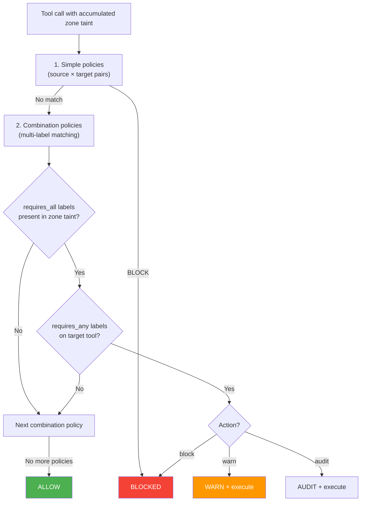

### Non-Linear Danger Matrix

The key insight: danger is a **matrix**, not a spectrum. Two low-sensitivity items can be more dangerous together than two high-sensitivity items:

| Source taint | Target | Individual risk | Combined risk |
|-------------|--------|----------------|---------------|
| `employee-directory` (internal) | `email-send` | Low | **Critical** (phishing) |
| `weather` (public) | `email-send` | None | None |
| `sap-org-chart` (internal) | `email-external` | Low | Low (semi-public) |
| `sap-financial` (confidential) | `email-external` | High | **Critical** (insider trading) |
| `pii` + `financial` (both confidential) | `email-internal` | Medium each | **Critical** (SoD violation) |
| `system-metrics` (public) | `network-out` | None | None |
| `private-chat` (internal) | `network-out` | Medium | **Critical** (privacy breach) |

This is why the policy engine evaluates **combination policies** after simple policies — the danger from combinations cannot be inferred from individual label risk levels.

### Default Policies

The system ships with these default policies when `mode: simple`:

| Policy | Source | Target | Action |
|--------|--------|--------|--------|
| `no-confidential-to-network` | `zone:confidential` | `capability:network-out` | block |
| `no-restricted-anywhere` | `zone:restricted` | `capability:*` | block |
| `no-pii-in-email` | `content:pii` | `capability:email-send` | block |
| `no-credentials-to-file` | `content:credentials` | `capability:file-write` | block |
| `sensitive-email-review` | `zone:internal` | `capability:email-send-external` | warn |

## Isolation Zones

### The Problem

A single Telegram conversation might involve both public and confidential operations:

```
User: "What's the weather in Berlin?"       ← public
User: "Show me my SAP balance"              ← confidential
User: "Email the weather to john@ext.com"   ← should be ALLOWED
User: "Email the SAP balance to john"       ← should be BLOCKED
```

Without zones, the SAP balance taints the entire conversation. The weather email gets blocked because the conversation is already tainted with `source:sap`.

### Zone Model

```python
class Zone(BaseModel):
    id: str                                    # "public", "confidential", custom
    name: str                                  # human-readable
    sensitivity: Literal["public", "internal", "confidential", "restricted"]
    allowed_tools: list[str] | None = None     # tool whitelist (None = inherit)
    denied_tools: list[str] | None = None      # tool blacklist
    max_sensitivity: str | None = None         # auto-escalation ceiling
```

### Zone Lifecycle

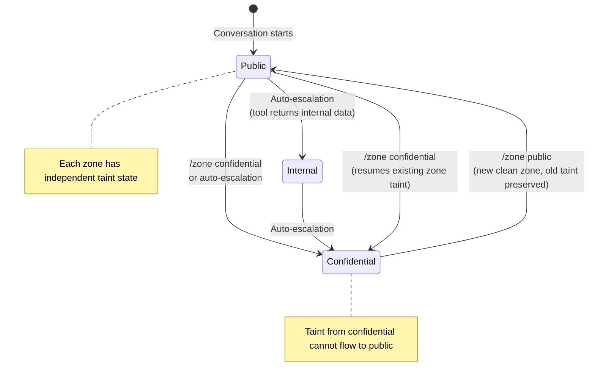

### Zone Switching

The user switches zones via a connector command:

```
/zone public           Switch to (or create) a public zone
/zone confidential     Switch to (or create) a confidential zone
/zone new clinical     Create a custom zone named "clinical"
/zone status           Show current zone, taint set, active policies
```

**What happens on zone switch:**

1. Current zone's taint state is preserved (not cleared)
2. Target zone is activated (created with empty taint if new)
3. System prompt is updated with zone context and restrictions
4. Tool whitelist/blacklist from zone config is applied
5. User is notified of the switch

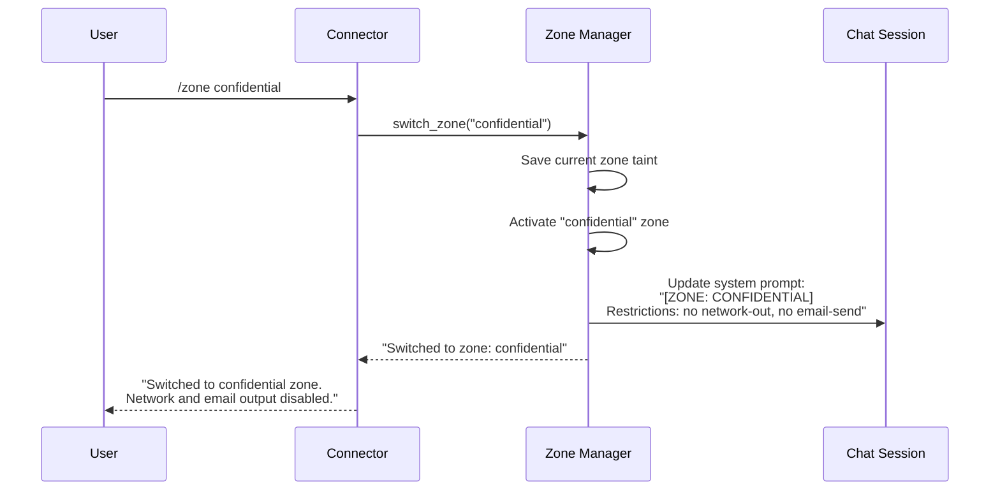

### Auto-Escalation

When `auto_classify: true` (default in simple mode), the zone manager detects when a tool call's sensitivity exceeds the current zone:

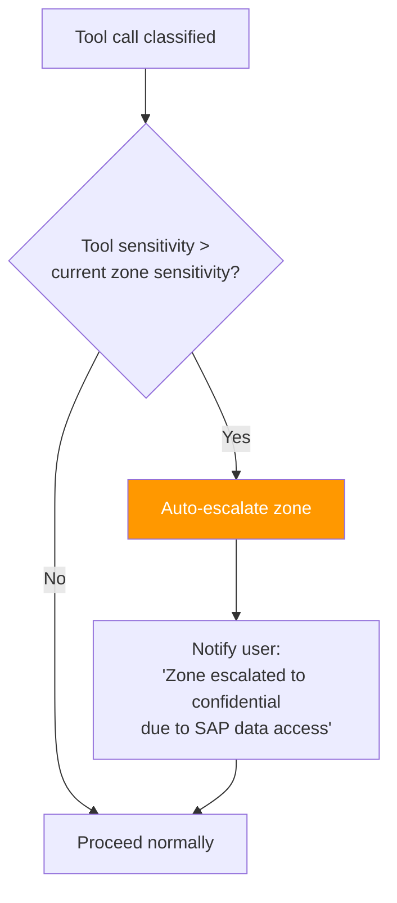

**Example:**
```
[Zone: public]
User: "Check my SAP balance"
→ LLM calls mcp__sap__get_balance
→ Classifier: labels include zone:confidential
→ Zone manager: current zone is "public", tool requires "confidential"
→ AUTO-ESCALATE: zone switches to "confidential"
→ User sees: "Zone auto-escalated to CONFIDENTIAL (SAP data accessed)"
→ Tool executes normally in the new zone
```

### Cross-Zone Flow Prevention

The fundamental invariant: **data from a higher-sensitivity zone cannot flow to a lower-sensitivity zone**.

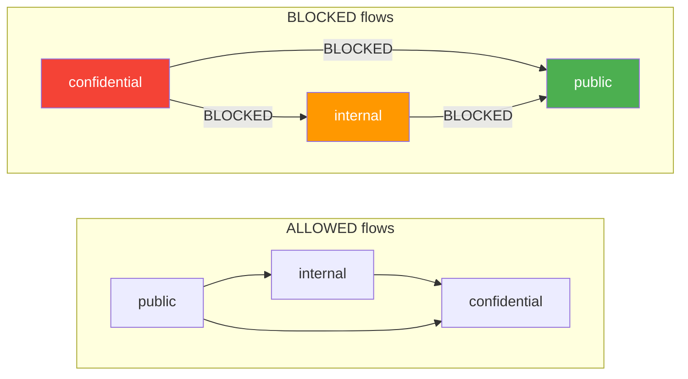

When the user switches from a higher zone back to a lower zone:

- A **new, clean** lower zone is created (or the existing one resumes with its own taint)
- The higher zone's taint does NOT carry over
- The LLM gets a fresh context (new Claude session) to prevent data leakage through the model's memory

!!! danger "Zone isolation requires session separation"
    For true isolation, each zone uses a separate Claude Code session (`--resume` with different session IDs). This ensures the LLM's context window doesn't carry sensitive data across zones. Without session separation, the LLM could encode confidential data in a "public" zone response.

## Configuration

### Simple Mode

For most deployments, declare sensitive sources and dangerous sinks. The system auto-generates classification rules and flow policies:

```yaml
flow_control:
  enabled: true
  mode: simple
  fail_closed: false              # true for production

  # What's sensitive? (generates classification rules)
  sensitive_sources:
    - tool: "mcp__sap__*"
      sensitivity: confidential
      content: financial

    - tool: "mcp__o365__*"
      sensitivity: internal

    - tool: Read
      params: {file_path: "/hr/**"}
      sensitivity: confidential
      content: pii

    - tool: Read
      params: {file_path: "/finance/**"}
      sensitivity: confidential
      content: financial

    - tool: "mcp__ehr__*"
      sensitivity: restricted
      content: health

  # What's dangerous? (generates classification rules)
  dangerous_sinks:
    - tool: Bash
      params: {command: "curl.*(-X POST|-d )"}
      capability: network-out

    - tool: "mcp__o365__send_email"
      capability: email-send

    - tool: "mcp__slack__post_message"
      capability: network-out

  # Where are my zones?
  default_zone: public
```

**What simple mode auto-generates:**

1. Classification rules from `sensitive_sources` (tool + params → labels)
2. Classification rules from `dangerous_sinks` (tool + params → capability labels)
3. Default flow policies: every `confidential`/`restricted` source × every `capability:*` sink → block
4. Default zones: `public`, `internal`, `confidential`, `restricted`
5. Auto-escalation enabled

### Advanced Mode

Full control over every aspect:

```yaml
flow_control:
  enabled: true
  mode: advanced
  fail_closed: true

  # Custom label definitions
  labels:
    - {dimension: source, value: patient-records}
    - {dimension: content, value: hipaa}
    - {dimension: capability, value: cloud-upload}

  # Explicit classification rules
  classification_rules:
    - tool_pattern: "mcp__ehr__*"
      labels:
        - {dimension: source, value: patient-records}
        - {dimension: content, value: hipaa}
        - {dimension: sensitivity, value: restricted}

    - tool_pattern: "Bash"
      param_patterns:
        command: "^aws s3.*cp"
      labels:
        - {dimension: capability, value: cloud-upload}

    # Domain-based email classification
    - tool_pattern: "mcp__email__send"
      param_patterns:
        to: "@mycompany\\.com$"
      labels:
        - {dimension: capability, value: email-send-internal}
      priority: 10

    - tool_pattern: "mcp__email__send"
      labels:
        - {dimension: capability, value: email-send-external}
      priority: 0

    # Path-based file classification
    - tool_pattern: "Write"
      param_patterns:
        file_path: "^/shared/public/"
      labels:
        - {dimension: capability, value: file-write-public}
      priority: 10

    - tool_pattern: "Write"
      param_patterns:
        file_path: "^/shared/confidential/"
      labels:
        - {dimension: capability, value: file-write-confidential}
        - {dimension: zone, value: confidential}
      priority: 10

  # Explicit flow policies
  policies:
    - name: hipaa-no-external
      source_labels:
        - {dimension: content, value: hipaa}
      target_labels:
        - {dimension: capability, value: email-send-external}
        - {dimension: capability, value: network-out}
        - {dimension: capability, value: cloud-upload}
      action: block
      message: "HIPAA data cannot leave the organization"

    - name: hipaa-internal-email-warn
      source_labels:
        - {dimension: content, value: hipaa}
      target_labels:
        - {dimension: capability, value: email-send-internal}
      action: warn
      message: "Internal email contains HIPAA data — verify recipient"

    - name: patient-to-file-audit
      source_labels:
        - {dimension: source, value: patient-records}
      target_labels:
        - {dimension: capability, value: file-write-confidential}
      action: audit

  # Custom zones
  zones:
    public:
      sensitivity: public
      max_sensitivity: internal

    clinical:
      sensitivity: restricted
      allowed_tools:
        - "mcp__ehr__*"
        - Read
        - Glob
        - Grep
      denied_tools:
        - Bash
        - Write
        - "mcp__email__*"
        - "mcp__slack__*"

    admin:
      sensitivity: confidential
      # No tool restrictions -- admin can use everything
      # But flow policies still apply

  # Channel policies (for broadcast/bus)
  channels:
    - pattern: "agent.*.output"
      max_sensitivity: internal
    - pattern: "system.*"
      max_sensitivity: public
    - pattern: "audit.*"
      max_sensitivity: restricted
      required_clearance: [admin]
```

## Broadcast Channels & Message Bus

### Channel Security

The existing `SignalBus` routes events between agents and components. The flow control system adds sensitivity-aware filtering:

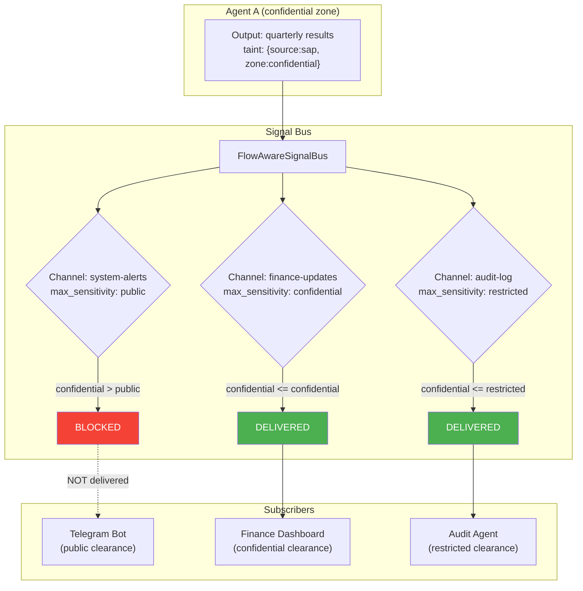

### Channel Policy Model

```python
class ChannelPolicy(BaseModel):
    pattern: str                      # signal type pattern (glob)
    max_sensitivity: str              # highest sensitivity allowed
    required_clearance: list[str]     # subscriber must have these clearances
```

### Taint in Signals

The existing `Signal` model uses `extra = "allow"`, so taint metadata is added to `Signal.data` without breaking backward compatibility:

```python
signal.data["_flow"] = {
    "labels": [
        {"dimension": "source", "value": "sap"},
        {"dimension": "zone", "value": "confidential"},
    ],
    "source_zone": "confidential",
    "conversation_id": "conv-abc123",
}
```

### Emission Guards

The `FlowAwareSignalBus` wraps the existing `SignalBus`:

1. On `emit()`: check if the signal carries taint via `data.get("_flow")`
2. Compare taint sensitivity against the channel's `max_sensitivity`
3. Block emission if taint exceeds channel policy
4. For each subscriber: check if subscriber has sufficient clearance
5. Deliver only to cleared subscribers

## Visualization

### Zone Status Display

Connectors show the current zone using appropriate formatting:

=== "Telegram"

    ```
    [CONFIDENTIAL] Your SAP balance is $12,345.
    
    [PUBLIC] The weather in Berlin is 18C and sunny.
    ```

=== "Web UI"

    Color-coded badge in the chat header:
    
    - Green badge: PUBLIC
    - Yellow badge: INTERNAL
    - Orange badge: CONFIDENTIAL  
    - Red badge: RESTRICTED
    
    Taint chips in a collapsible sidebar showing active labels.

=== "CLI"

    ```
    [zone:confidential] SAP balance: $12,345
    [zone:public] Weather: 18C, sunny
    ```

### Flow Diagram (Circuits Integration)

The Circuits visual editor (`/hortmap`) can render the flow control topology:

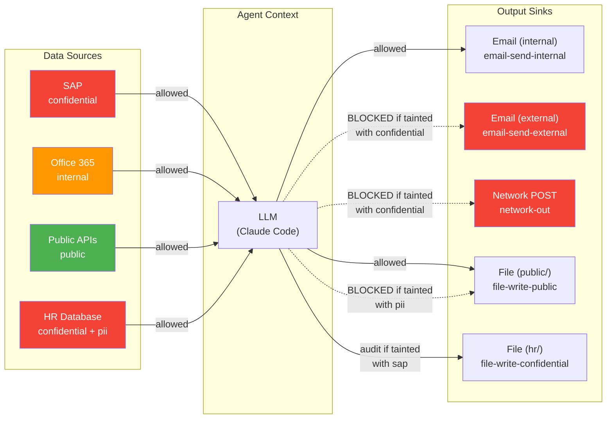

### Policy Violation Alerts

When a policy blocks a tool call, the user sees a clear explanation:

```
BLOCKED: Cannot send data externally.

Policy: no-confidential-to-network
Reason: Your current session contains data from SAP (confidential).
        Sending data over the network is not permitted.
        
To proceed:
  - Use /zone public to start a clean context
  - Or ask your administrator to approve this data flow
```

## Relationship to Existing Security

Flow control is the **sixth boundary** in the OpenHORT security model, complementing the existing five:

| Boundary | What it controls | Layer |
|----------|-----------------|-------|
| B1: Container → Host | Process isolation | Infrastructure |
| B2: Agent → Tools | Tool access control | Permission |
| B3: Hort → Hort | Inter-node trust | Network |
| B4: Agent → Agent | Message bus permissions | Communication |
| B5: User → System | Access source policies | Authentication |
| **B6: Data → Sink** | **Information flow control** | **Data** |

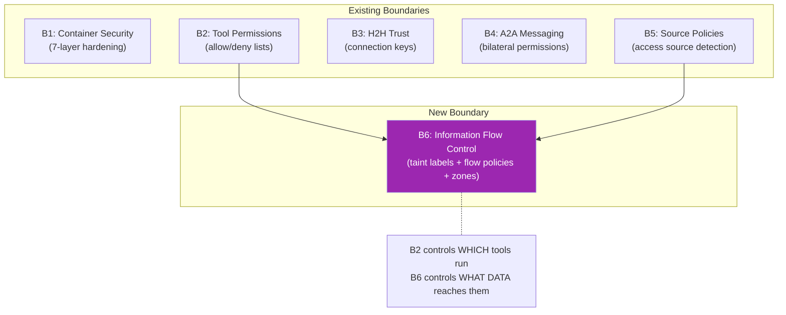

**B2 (tool permissions)** controls which tools an agent can use at all. **B6 (flow control)** controls what data those tools can access based on what the agent has already seen. Both are needed:

- B2 without B6: Agent can use email + SAP, but nothing prevents sending SAP data via email
- B6 without B2: Data flows are tracked, but a compromised agent could use any tool
- B2 + B6: Agent can only use approved tools, AND those tools cannot be used to exfiltrate sensitive data
